# SOLAR CELLS

# Bimolecularly passivated interface enables efficient and stable inverted perovskite solar cells

Cheng Liu $^{1}$ , Yi Yang $^{1}$ , Hao Chen $^{1,2}$ , Jian Xu $^{2}$ , Ao Liu $^{1}$ , Abdulaziz S. R. Bati $^{1}$ , Huihui Zhu $^{1}$ , Luke Grater $^{2}$ , Shreyash Sudhakar Hadke $^{3}$ , Chuying Huang $^{1}$ , Vinod K. Sangwan $^{3}$ , Tong Cai $^{1,4}$ , Donghoon Shin $^{3,4}$ , Lin X. Chen $^{1}$ , Mark C. Hersam $^{1,3,5}$ , Chad A. Mirkin $^{1,3,4}$ , Bin Chen $^{1*}$ , Mercouri G. Kanatzidis $^{1*}$ , Edward H. Sargent $^{1,2,5*}$

Compared with the n-i-p structure, inverted (p-i-n) perovskite solar cells (PSCs) promise increased operating stability, but these photovoltaic cells often exhibit lower power conversion efficiencies (PCEs) because of nonradiative recombination losses, particularly at the perovskite/ $\mathsf{C}_{60}$ interface. We passivated surface defects and enabled reflection of minority carriers from the interface into the bulk using two types of functional molecules. We used sulfur-modified methylthio molecules to passivate surface defects and suppress recombination through strong coordination and hydrogen bonding, along with diammonium molecules to repel minority carriers and reduce contact-induced interface recombination achieved through field-effect passivation. This approach led to a fivefold longer carrier lifetime and one-third the photoluminescence quantum yield loss and enabled a certified quasi-steady-state PCE of $25.1\%$ for inverted PSCs with stable operation at $65^{\circ}\mathrm{C}$ for $>2000$ hours in ambient air. We also fabricated monolithic all-perovskite tandem solar cells with $28.1\%$ PCE.

certified power conversion efficiencies $(\mathrm{PCEs}) > 25\%$ have been widely reported for perovskite solar cells (PSCs) in the regular (n-i-p) structure (1-3). Although inverted (p-i-n) PSCs have potential advantages because of their stability, low-temperature processing, and compatibility with integration into tandem solar cells (4-8), their reported PCEs rarely surpass $24\%$ under the stringent quasi-steady-state (QSS) protocol (9-11). This efficiency gap is primarily attributed to higher recombination rates at the interface between the perovskite and the charge transport materials (12). The detrimental impact of buried perovskite/hole transport layer interface losses has been addressed through the development of self-assembled monolayers (13-15). However, the top interface between the perovskite and the electron transport layer (ETL), typically made from $\mathrm{C}_{60}$ and its derivatives, suffers from interfacial recombination that results from minority carriers in the vicinity of the interface as well as the effect of incompletely passivated trap states (16).

Surface passivation can suppress interface charge recombination and has been accomplished with organohalides (4, 17-19), Lewis bases (20, 21), and dipolar compounds (22, 23).

$^{1}$ Department of Chemistry, Northwestern University, Evanston, IL 60208, USA. $^{2}$ Department of Electrical and Computer Engineering, University of Toronto, Toronto, ON M5S 1A4, Canada. $^{3}$ Department of Materials Science and Engineering, Northwestern University, Evanston, IL 60208, USA. $^{4}$ International Institute for Nanotechnology, Northwestern University, Evanston, IL 60208, USA. $^{5}$ Department of Electrical and Computer Engineering, Northwestern University, Evanston, IL 60208, USA. *Corresponding author. Email: bin.chen@northwestern.edu (B.C.); m-kanatzidis@northwestern.edu (M.G.K.); ted.sargent@northwestern.edu (E.H.S.)

We noted that reliance on a single species of molecule may fail to address simultaneously both surface and interface recombination processes (Fig. 1A) (24, 25). Specifically, the existence of near-interface minority carriers (holes in the perovskite layer) leads to direct interface recombination with majority carriers (electrons in the ETL), a process that can occur even at nondefect sites (26). In addition, defects at the perovskite surface induce surface recombination through trapping of carriers. The most common defect, the halide vacancy, has a low formation energy (27, 28).

# Exploring class 1 and 2 molecule combinations

We sought to address complex interface carrier recombination issues using a combination of different molecules, each with distinct functionalities. The first class of molecule we incorporated repelled hole carriers to reduce interface recombination through field-effect passivation (Fig. 1B). The second class of molecule interacted with defect sites to form chemical bonds to reduce surface recombination through chemical passivation.

Diammonium ligands, in which one $\mathrm{-NH_3^+}$ group anchors to the perovskite surface and the other extends away from it, can induce a surface dipole and n-type doping (29, 30) and provide effective field-effect passivation for both narrow bandgap (NBG) ( $\sim1.2\mathrm{eV}$ ) and wide bandgap (WBG) ( $\sim1.8\mathrm{eV}$ ) PSCs (26). We explored the passivation effect of different diammonium ligands on normal bandgap ( $\sim1.5\mathrm{eV}$ ) PSC devices. The device architecture consisted of fluorine-doped tin oxide (FTO)/ $\mathrm{NiO}_x / [4-(3,6\text{-dimethyl-9H-carbazol-9-yl})\text{butyl}]$ phosphonic acid (Me-4PACz)/perovskite/ passivation layer/ $\mathrm{C}_{60}$ /bathocuproine (BCP)/Ag (fig. S1). Optical constants of materials

are shown in fig. S2. The current-voltage characteristics showed that ethane-1,2-diammonium $\mathrm{(EDAI_2)}$ and propane-1,3-diammonium iodide $\mathrm{(PDAI_2)}$ , with high binding energy with the perovskite surface (fig. S3), enabled a device performance improvement compared with the control devices (without passivation), from PCEs of $\sim 22.8\%$ to $\sim 23.9\%$ with active areas of $0.05~\mathrm{cm}^2$ (Fig. 1, C and D). Thus, diammonium ligands work well in normal bandgap PSCs, and the PCE improvement could be explained by field-effect passivation that repels minority carriers (26).

We then sought a second molecule to add a chemical passivation function. We first examined $n$ -butylammonium iodide (BAI), which is widely used as a chemical passivating agent (31, 32), in combination with $\mathrm{PDAI}_2$ . Its addition increased PCE to $\sim 24.3\%$ compared with $\mathrm{PDAI}_2$ alone. Extending the chain length to amylamine hydroiodide (AAI) further improved the average efficiency to $\sim 24.5\%$ , thus providing a baseline roughly at parity with efficient previously reported inverted PSCs (12, 17).

We then tuned the electrical dipole moment by incorporating sulfur as a donor atom in the alkyl chain by synthesizing methylthio-based ammonium ligands, namely 2-(methylthio) ethylamine hydroiodide (2MTEAI) and 3-(methylthio)propylamine hydroiodide (3MTPAI). The use of both diammonium and methylthio molecules led to improved PCE across several combinations, namely $\mathrm{EDAI}_2 / 2\mathrm{MTEAI}$ , $\mathrm{PDAI}_2 / 2\mathrm{MTEAI}$ , $\mathrm{EDAI}_2 / 3\mathrm{MTPAI}$ , and $\mathrm{PDAI}_2 / 3\mathrm{MTPAI}$ , in comparison to both the control device and single-molecule passivated devices. The highest average PCE ( $>25.5\%$ ) was achieved with $\mathrm{PDAI}_2 / 3\mathrm{MTPAI}$ (Fig. 1D). We thus focused on the $\mathrm{PDAI}_2 / 3\mathrm{MTPAI}$ combination for further investigation.

# $\mathsf{PDAI}_2 / 3\mathsf{MTPA}$ characteristics

We used density function theory (DFT) to compare $3\mathrm{MTPA}^+$ versus $\mathrm{AA^{+}}$ by modeling ligand orientations of 3MTPA and AA on the perovskite surface (fig. S4). The binding energy difference $(\Delta E_{\mathrm{clean}})$ between the parallel $(E_{\mathrm{clean - parallel}})$ and vertical configurations $(E_{\mathrm{clean - vertical}})$ was used as a measure of ligand orientation. A larger $\Delta E_{\mathrm{clean}}$ value of $-0.22\mathrm{eV}$ for 3MTPA indicated a stronger preference for the parallel orientation compared with $-0.13\mathrm{eV}$ for AA (Fig. 2A). This difference corresponded to greater occupation on the vacancy defect position. Electrostatic potentials in the ligands (Fig. 2B) showed that 3MTPA, when compared with AA, had a lower minimum electrostatic potential $(\varphi_{\mathrm{min}})$ because of its electron-rich center surrounding the S atom that facilitated binding with the positively charged iodide vacancy. The higher maximum electrostatic potential $(\varphi_{\mathrm{max}})$ at the $-\mathrm{NH}_3^+$ side also added increased binding strength between the ligand and the surface cation vacancy site of the perovskite.

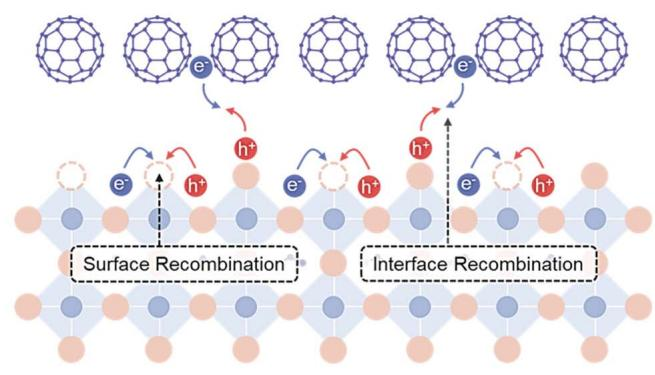  
A

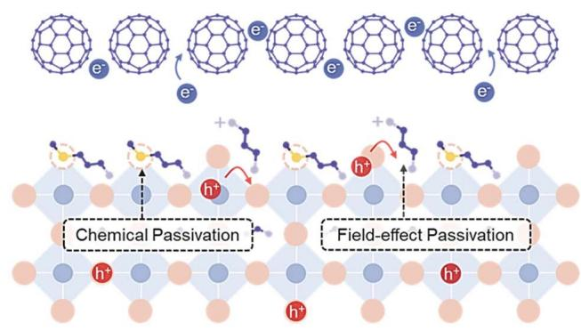  
B

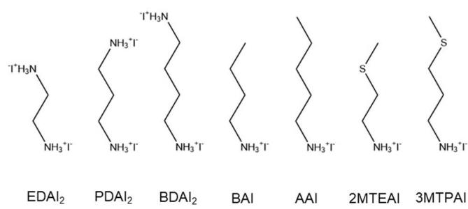  
C

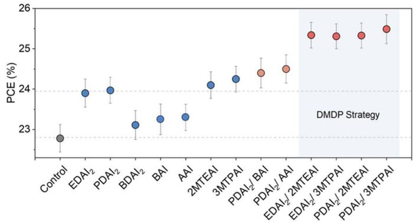  
D   
Fig. 1. Passivation at the perovskite/ETL interface. (A and B) Schematic of the perovskite surface without passivation (A) and with both chemical and field-effect passivation (B). (C) Chemical structures of the diammonium and ammonium ligands investigated in this study. (D) PCEs of control versus passivated PSCs using different passivation ligands.

The passivation effect of the ligands was further evaluated by considering the presence of iodide vacancies, which are the predominant defects on the perovskite surface (fig. S5) (33). We assessed the binding energy difference $(\Delta E_{\mathrm{relative}})$ between that of the defective surface $(E_{\mathrm{VI - parallel}})$ and the clean surface $(E_{\mathrm{clean - parallel}})$ . $\Delta E_{\mathrm{relative}}$ of AA with the perovskite remains nearly unchanged, regardless of the presence or absence of iodide vacancy. In contrast, $\Delta E_{\mathrm{relative}} = -0.38\mathrm{eV}$ was obtained for 3MTPA, indicating a favorable interaction with the defective sites. 3MTPA induced a notable charge redistribution that accumulated charges at iodide vacancy, assigned to S-Pb coordination bonding (Fig. 2C).

Charge transfer between 3MTPA and formamidinium (FA) was also observed (Fig. 2D), accompanied by a shorter distance of $2.72\AA$ between the sulfur atom in 3MTPA and the hydrogen atom in FA that indicated the formation of a hydrogen bond. In contrast, the distance between the carbon atom at the corresponding site in AA and the hydrogen atom in FA was $3.33\AA$ . Thus, the formation energy of the FA vacancy increased from $-0.79\mathrm{eV}$ to $-0.71\mathrm{eV}$ (fig. S6). Proton nuclear magnetic resonance $\left(^{1}\mathrm{H}\right.$ NMR) spectra showed that the amino proton peak of FAI at $\delta = 8.82$ parts per

million (ppm) exhibited increased broadening and shifted to a lower field after mixing with 3MTPAI compared with AAI (Fig. 2E). These changes again indicated stronger hydrogen bonding interactions between 3MTPA and FA than between AA and FA (34). Computation work suggested that the methylthio group provided stronger binding—viewed in some studies as a proxy for stronger passivation—compared with ligands that relied on ammonium functional groups alone.

We assessed diammonium-methylthio dual passivation (DMDP) using x-ray photoelectron spectroscopy (XPS). The $\mathrm{Pb}4f$ peaks of the passivated perovskite film shifted toward a lower binding energy of $0.23\mathrm{eV}$ compared with the control film (Fig. 2F), which we attributed to an increased electron density at $\mathrm{Pb}^{2+}$ (35). Time-of-flight secondary ion mass spectrometry (ToF-SIMS) was used to analyze the surface ligand distribution. Comparing signal ratios of PDA:3MTPA and PDA:AA under identical conditions on perovskite films with $\mathrm{PDAI}_2 / 3\mathrm{MTPAI}$ and $\mathrm{PDAI}_2 / \mathrm{AAI}$ bimolecular passivation, we found that the signal ratio of 1:2.7 for PDA:3MTPA was lower than the ratio of 1:1.1 for PDA:AA (Fig. 2G). This suggests that 3MTPA has a stronger binding affinity to the perovskite surface and a better passivation effect

on defects, consistent with its higher binding energy (fig. S7).

Figure 2H illustrates the centimeter-scale photoluminescence (PL) intensity distribution of a perovskite film with Gaussian-distributed passivators on the surface (fig. S8) (36). The region surrounding the $\mathrm{PDAI}_2 / 3\mathrm{MTPAI}$ center exhibited higher PL emission than the corresponding region for $\mathrm{PDAI}_2 / \mathrm{AAI}$ ; and the contour region with the lowest PL intensity was skewed toward the $\mathrm{PDAI}_2 / \mathrm{AAI}$ center.

Scanning electron microscopy (SEM) images revealed dense polygonal grains with sizes of $\sim 500\mathrm{nm}$ for the control perovskite film; the morphologies were unchanged after DMDP passivation (fig. S9). Grazing-incidence wide-angle x-ray scattering (GIWAXS) did not reveal any peaks at low scattering vectors $\mathbf{q}$ in the DMDP-based film, which indicated that no low-dimensional perovskite formed (Fig. 3A). We ascribed the peak at $\sim 0.84\AA^{-1}$ in the control sample to the presence of $\delta \text{-FAPbI}_3$ formed in the ambient humid air during the measurement. The suppression of $\delta \text{-FAPbI}_3$ in the DMDP-based film indicates improved ambient stability. The unchanged surface dimensionality was further corroborated by transient absorption (TA) spectra where the passivated film displayed a single bleach spectral

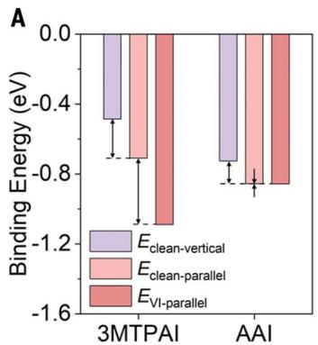

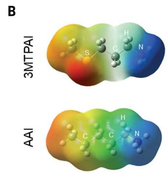

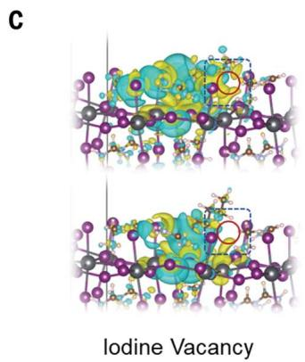

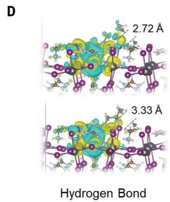

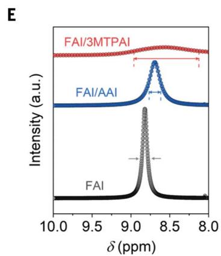

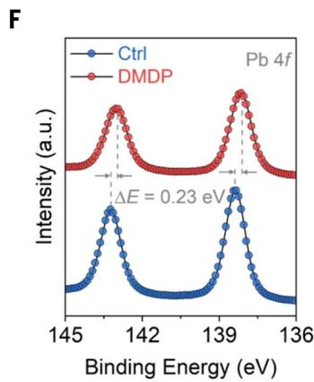

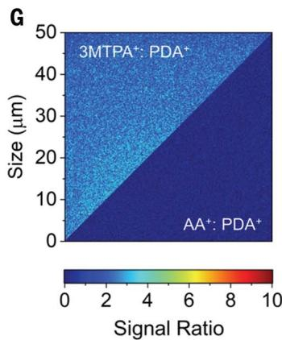

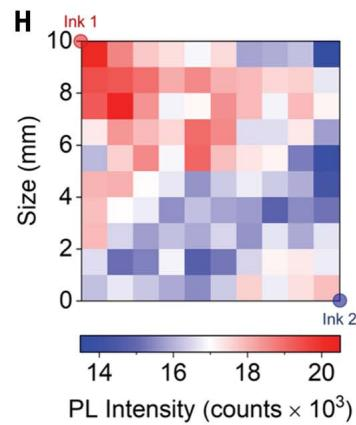  
Fig. 2. The process of passivation through the methylthio group on perovskite surfaces. (A) Binding energies of ammonium ligands with a clean or defective perovskite surface with the typical iodide vacancy. (B) Electrostatic potential $(\varphi)$ of 3MTPA and AA ligands $(\varphi_{\mathrm{max}}$ , blue color; $\varphi_{\mathrm{min}}$ , red color). (C) Calculated charge density difference (blue, depletion; yellow, accumulation) of anchoring ammonium ligands onto the perovskite surface with I vacancies. The red open circles indicate the positions of I vacancies. The atoms in the structures are differentiated by different colors: S is represented by grass green, C by brown, Pb by gray,   
and I by purple. (D) Calculated charge density difference showing the hydrogen bond formation between 3MTPA and FA. (E) The proton NMR spectra of FAI, FAI with AAI, and FAI with 3MTPA. (F) High-resolution Pb 4f XPS peaks of the perovskite films. (G) SIMS mapping of signal ratios of 3MTPA:PDA and AA:PDA for perovskite samples with $\mathrm{PDAI}_2 / 3\mathrm{MTPA}$ (1:2 molar ratio) and $\mathrm{PDAI}_2 / \mathrm{AAI}$ (1:2 molar ratio) bimolecular passivation. (H) PL intensity distribution of the $1\mathrm{cm}$ by $1\mathrm{cm}$ perovskite film postsynthetic treated by spray coating with ink 1 of $\mathrm{PDAI}_2 / 3\mathrm{MTPA}$ and ink 2 of $\mathrm{PDAI}_2 / \mathrm{AAI}$ solution centered around the diagonal corners.

feature from the three-dimensional perovskite (fig. S10).

To examine the chemical passivation effect of the DMDP strategy on film optoelectronic properties, we conducted time-resolved photoluminescence (TRPL) measurements (Fig. 3B and table S1). Control perovskite films showed a sharp decrease in emission characteristic of high levels of nonradiative carrier recombination on the bare perovskite surface. Treatment with $\mathrm{PDAI}_2$ showed little improvement in lifetime, reflecting its limited suppression of defect-induced surface recombination. In contrast, the perovskite film treated with 3MTPAI displayed a sustained plateau in the decay curve, reflecting increased carrier lifetime. This might be due to a combined effect of reduced nonradiative traps and enhanced photon recycling (37). The reemission of photons from the WBG subcell might serve to augment photon absorption of the adjacent NBG subcell when it is integrated in the tandem configuration.

We used ultraviolet photoelectron spectroscopy (UPS) to characterize band edge energies

(Fig. 3C and fig. S11). PDAI $_2$ treatment reduced the energy level difference between the conduction band minimum $(E_{\mathrm{CBM}})$ and the Fermi level $(E_{\mathrm{F}})$ of the perovskite surface to $0.10\mathrm{eV}$ , compared with 0.20 and $0.17\mathrm{eV}$ for the control and 3MTPAI treatments, respectively. The stronger n-type doping effect of PDAI $_2$ was attributed to the additional $-\mathrm{NH}_3^+$ group extending away from the perovskite matrix that induced a surface dipole that repelled the minority carrier at the interface (26, 38). This treatment enabled field-effect passivation and reduced interface recombination (fig. S12). We expect this passivation effect to be retained upon incorporation of 3MTPAI because n-type doping was also observed.

# Photovoltaic performance

$\mathrm{PDAI}_2$ did not enhance the PL quantum yield (PLQY) (Fig. 3D) of the perovskite film before $\mathbf{C}_{60}$ deposition, and there was little PLQY loss after coating with $\mathbf{C}_{60}$ , consistent with its field-effect passivation role. Increased $\mathrm{PDAI}_2$ concentration led to a decrease in both PLQY and PCE,

which we attributed to increased surface recombination. For 3MTPAI, in the absence of $C_{60}$ , PLQY increased as 3MTPAI processing solution concentration increased from $3\mathrm{mM}$ to $15\mathrm{mM}$ . On contact with $C_{60}$ , noticeable PLQY and PCE losses were seen, and these losses became more pronounced at higher concentrations, indicating increased interface recombination. The DMDP strategy improved PLQY of the perovskite/ $C_{60}$ samples and increased the PCE to $>26\%$ even at $12\mathrm{mM}$ concentration of 3MTPAI. In sum, 3MTPAI and $\mathrm{PDAI}_2$ could increase passivation and decrease carrier recombination without interfering with one another (Fig. 3E).

The photovoltaic parameters of devices with different treatments at the optimized concentration are summarized in fig. S13. The DMDP-based devices showed an improved PCE from $22.8 \pm 0.4$ to $25.5 \pm 0.3\%$ compared with the control device, accompanied by enhancements in open-circuit voltage $(V_{\mathrm{OC}})$ from $1.12 \pm 0.01$ to $1.16 \pm 0.01\mathrm{~V}$ and fill factor (FF) from $78.5 \pm 1.3$ to $83.8 \pm 1.3\%$ . The

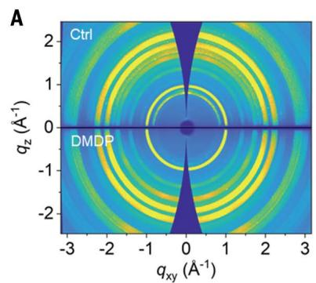

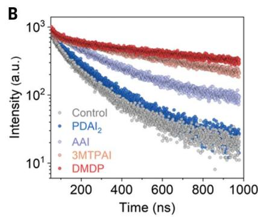

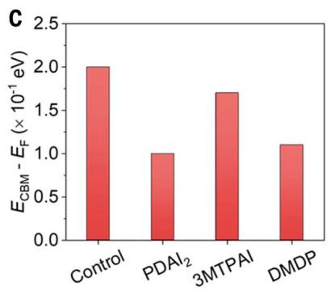

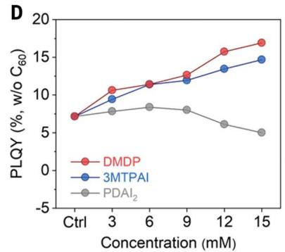

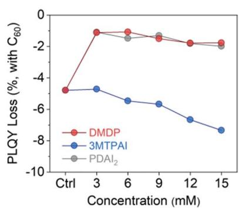

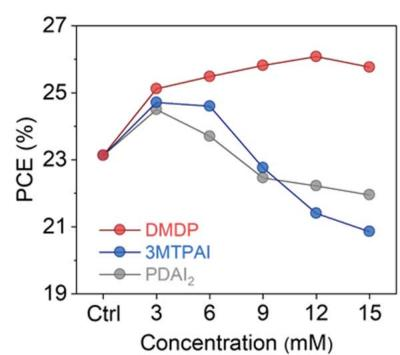

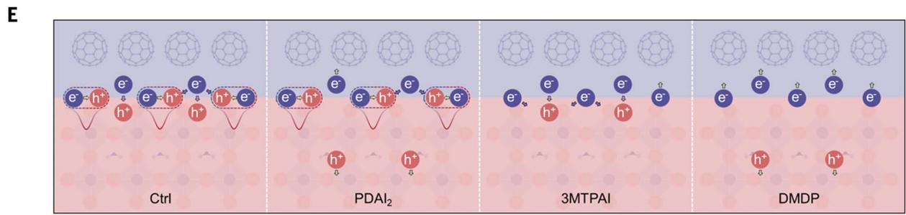  
Fig. 3. DMDP strategy working principle. (A) GIWAXS patterns of the control and DMDP-based perovskite films. (B) TRPL of the perovskite films treated with different ligands. (C) The energy level difference between the conduction band maximum and Fermi level for the perovskite films treated with different ligands. (D) Ligand concentration-dependent PLQY of the perovskite films, PLQY loss of   
the perovskite films after $C_{60}$ deposition, and PCEs of devices. For DMDP, the concentration of 3MTPAI was varied, while the $\mathrm{PDAl_2}$ concentration was optimized and maintained at $6\mathrm{mM}$ . (E) Schematic diagram showing the inhibition of interface recombination by $\mathrm{PDAl_2}$ and the suppression of defect-induced recombination by 3MTPAI.

diode characteristics of the devices in the absence of light showed that the devices in which we used the DMDP strategy presented an average dark saturation current $(J_0)$ reduction by two orders of magnitude compared with the control devices, demonstrating effective inhibition of carrier recombination (fig. S14) (39). Figure 4A shows the current density-voltage $(J - V)$ curves for the champion DMDP device, which exhibited a PCE of $26.4\%$ with a short-circuit current $(J_{\mathrm{SC}})$ of $26.2\mathrm{mAcm}^{-2}$ , $V_{\mathrm{OC}}$ of $1.17\mathrm{V}$ , and FF of $85.8\%$ .

We focused on QSS measurement in certification. Here, the highest performance based on maximum power point tracking (MPPT) was a PCE of $25.5\%$ for 100 s (fig. S15). A National Renewable Energy Laboratory (NREL) certification that used the asymptotic maximum power scan protocol (Fig. 4B and fig. S16) reported a QSS PCE of $25.1\%$ for an illuminated area of

$0.05\mathrm{cm}^2$ along with a fast-scan PCE of $25.9\%$ compared with other reported certified QSS PCEs that did not exceed $25\%$ (Fig. 4C and table S2) (9, 10, 40, 41). We also fabricated $1.5\mathrm{cm}^2$ devices using the DMDP treatment that delivered a PCE of $24.0\%$ (fig. S17), consistent with increased film homogeneity and reduced localized nonradiative recombination (fig. S18).

# Longevity studies

In our studies of the thermal stability of encapsulated devices, we found that after 1600 hours of thermal aging at $85^{\circ}\mathrm{C}$ in nitrogen (ISOS-D-2 protocol, where ISOS is the International Summit on Organic PV Stability), the DMDP-based devices retained $95\%$ of initial PCE, surpassing the retention of $84\%$ for the control device (Fig. 4D and fig. S19). We investigated the operating stability under MPPT under 1 sun of an encapsulated device operating in ambient air. After

2000 hours of continuous operation under 1 sun illumination at $65^{\circ}\mathrm{C}$ (ISOS-L-3 protocol), the DMDP-based device maintained $96\%$ of original PCE, whereas the control device was reduced to $70\%$ of initial PCE (Fig. 4E and fig. S20). A comparison with other PSCs tested using the ISOS-L-3 protocol is provided in table S3.

# Discussion

To investigate the applicability of the DMDP strategy on other perovskite compositions, we fabricated PSCs with both WBG and NBG perovskite materials. Notably, the average PCE was improved by 14 and $13\%$ when the DMDP strategy was used for NBG and WBG PSCs, respectively (Fig. 4F). We applied the DMDP strategy to monolithic all-perovskite tandem solar cells with the structure of FTO/ $\mathrm{NiO}_x/$ Me-4PACz/WBG perovskite/C60/SnOxAu/ poly(3,4-ethylenedioxythiophene) polystyrene sulfonate (PEDOT:PSS)/NBG perovskite/C60/

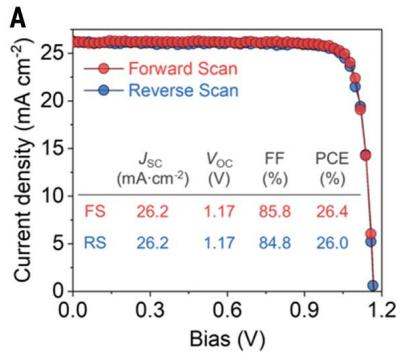

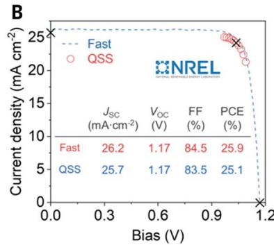

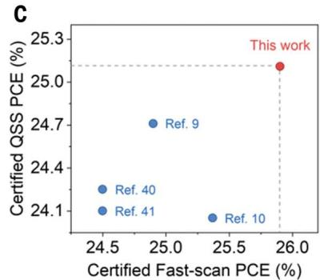

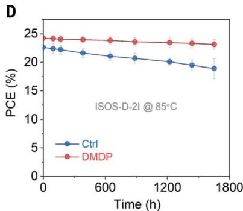

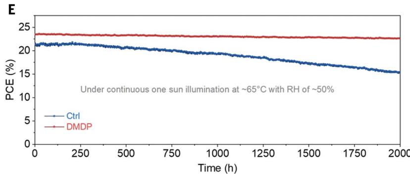

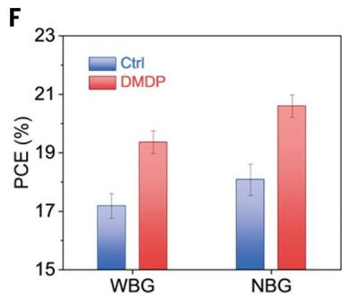

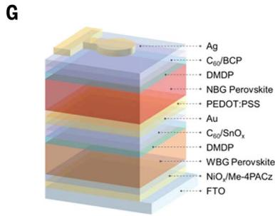

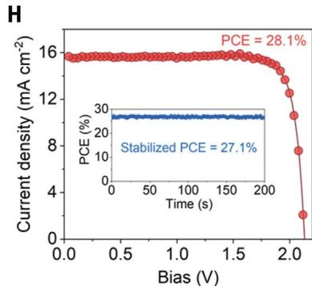  
Fig. 4. Device performance and stability. (A) $J-V$ characteristics of the best-performing DMDP-based device. (B) QSS $J-V$ curve of one representative DMDP-based device certified at NREL. (C) Certified QSS and fast-scan PCE statistics of inverted PSCs. (D) Thermal stability of encapsulated PSCs annealed at $85^{\circ}\mathrm{C}$ in nitrogen. (E) Operational stability of encapsulated PSCs   
under constant 1-sun illumination at $65^{\circ}\mathrm{C}$ in air with $50\%$ relative humidity. (F) PCEs of the WBG and NBG PSCs showing the universality of the DMDP strategy. (G) Architecture of the tandem device. (H) $J-V$ characteristics of the best-performing tandem device based on the DMDP strategy. The inset shows the stabilized PCE under MPPT.

$\mathrm{SnO}_x / \mathrm{Ag}$ (Fig. 4G). The $J - V$ characteristics of the champion tandem device (Fig. 4H) with an illuminated area of $0.05~\mathrm{cm}^2$ exhibited a PCE of $28.1\%$ with a $V_{\mathrm{OC}}$ of $2.14\mathrm{V},J_{\mathrm{SC}}$ of $15.6\mathrm{mAcm}^{-2}$ and FF of $84.0\%$ and a stabilized PCE of $27.1\%$ under MPPT. A well-matched current response is seen in the external quantum efficiency (EQE) spectra (fig. S21).

Realizing both chemical and field-effect passivation by the combined use of methylthio and diammonium molecules has mitigated complex carrier recombination issues at the perovskite/ETL interface. We consider the multimolecule passivation approach, along with diverse functionalities, as a promising direction for exploring next-generation passivation strategies to achieve improved performance and stability in perovskite optoelectronics.

# REFERENCES AND NOTES

1. M. Kim et al., Science 375, 302-306 (2022).   
2. Y. Zhao et al., Science 377, 531-534 (2022).   
3. Y. Ding et al., Nat. Nanotechnol. 17, 598-605 (2022).   
4. T. Li et al., Nat. Energy 8, 610-620 (2023).   
5. X. Zheng et al., Nat. Energy 8, 462-472 (2023).   
6. R. Lin et al., Nature 620, 994-1000 (2023).   
7. J. Tong et al., Nat. Energy 7, 642-651 (2022).   
8. J. Xu et al., Science 367, 1097-1104 (2020)   
9. W. Peng et al., Science 379, 683-690 (2023).   
10. Q. Jiang et al., Nature 611, 278-283 (2022).   
11. Q. Cao et al., Sci. Adv. 7, eabg0633 (2021).   
12. S. Liu, V. P. Biju, Y. Qi, W. Chen, Z. Liu, NPG Asia Mater. 15, 27 (2023).   
13. F. Ali, C. Roldán-Carmona, M. Sohail, M. K. Nazeeruddin, Adv. Energy Mater. 10, 2002989 (2020).   
14. K. Almasabi et al., ACS Energy Lett. 8, 950-956 (2023).   
15. Q. Tan et al., Nature 620, 545-551 (2023).   
16. F. Ye et al., Nat. Commun. 13, 7454 (2022).   
17. H. Chen et al., Nat. Photonics 16, 352-358 (2022).   
18. R. Lin et al., Nature 603, 73-78 (2022)   
19. D. H. Kim et al., Joule 3, 1734-1745 (2019).   
20. Z. Li et al., Science 376, 416-420 (2022)

21. X. Li et al., Science 375, 434-437 (2022).   
22. P. Caprioglio et al., Energy Environ. Sci. 14, 4508-4522 (2021).   
23. Z. Zhu et al., Joule 6, 2849-2868 (2022).   
24. W. Yang et al., Research Square [Preprint] (2022); https://doi.org/10.21203/rs.3.rs-2147188/v1.   
25. Z. Zhang et al., Chem. Soc. Rev. 52, 163-195 (2023).   
26. H. Chen et al., Nature 613, 676-681 (2023).   
27. D. Meggiolaro, F. De Angelis, ACS Energy Lett. 3, 2206-2222 (2018).   
28. A. Walsh, S. D. Stranks, ACS Energy Lett. 3, 1983-1990 (2018).   
29. S. Hu et al., Energy Environ. Sci. 15, 2096-2107 (2022).   
30. C. Quarti, F. De Angelis, D. Beljonne, Chem. Mater. 29, 958-968 (2017).   
31. S. Sidhik et al., Science 377, 1425-1430 (2022).   
32. A. R. Mohd Yusoff et al., Energy Environ. Sci. 14, 2906-2953 (2021).   
33. J. Jeong et al., Nature 592, 381-385 (2021).   
34. L. Zhu et al., Nat. Commun. 12, 5081 (2021).   
35. Z. Wang et al., Nano Energy 59, 258-267 (2019).   
36. E. J. Kluender et al., Proc. Natl. Acad. Sci. U.S.A. 116, 40-45 (2019).

37. D. W. deQuilettes et al., Chem. Rev. 119, 11007-11019 (2019).   
38. A. Liu et al., InfoMat 5, e12386 (2023).   
39. A. Cuevas, Energy Procedia 55, 53-62 (2014).   
40. X. Wu et al., Adv. Mater. 35, e2208431 (2023).   
41. F. Li et al., Nat. Photonics 17, 478-484 (2023).

# ACKNOWLEDGMENTS

Part of the research described in this paper was performed at the Canadian Light Source, a national research facility of the University of Saskatchewan, which is supported by the Canada Foundation for Innovation (CFI), the Natural Sciences and Engineering Research Council (NSERC), the National Research Council (NRC), the Canadian Institutes of Health Research (CIHR), the Government of Saskatchewan, and the University of Saskatchewan. A.S.R.B. acknowledges support from King Abdullah University of Science and Technology (KAUST) through the Ibn Rushd Postdoctoral Fellowship Award. Funding: This work was supported under award number OSR-CRG2020-4350.2. E.H.S. acknowledges support from

the Office of Naval Research (ONR) grant N00014-20-1-2572). M.G.K. was supported by ONR grant N00014-20-1-2725. C.A.M. was supported by the Army Research Office under grants W911NF23-1-0141 and W911NF-23-1-0285 and by the Sherman Fairchild Foundation, Inc. This work made use of the SPID, EPIC, and Keck-II facilities of Northwestern University's NUANCE Center, which has received support from the SHyNE Resource (NSF ECCS2025633); the International Institute of Nanotechnology, Northwestern University; and Northwestern's MRSEC program (NSF DMR-1720139). Charge transport characterization was supported by the National Science Foundation (NSF) Materials Research Science and Engineering Center (MRSEC) at Northwestern University under award number DMR-1720319. This work was partially supported by award 70ANB19H005 from the US Department of Commerce, National Institute of Standards and Technology, as part of the Center for Hierarchical Materials Design (ChiMaD). Author contributions: Conceptualization: C.L. and Y.Y. DFT calculation: J.X. Device fabrication: C.L., Y.Y., and H.C. Writing - original draft: C.L. and Y.Y. Writing - review & editing: A.L. and H.Z. XPS and UPS characterization: A.S.R.B. GIWAXS characterization: L.G. Electrical

characterization: S.S.H., V.K.S., and M.C.H. TA measurement: C.H. and L.X.C. Ink spray coating: T.C. and D.S. Supervision on ink spray coating: C.A.M. Supervision: B.C., M.G.K., and E.H.S.   
Competing interests: The authors declare that they have no competing interests. Data and materials availability: All data are available in the main text or the supplementary materials. License information: Copyright © 2023 the authors, some rights reserved; exclusive licensee American Association for the Advancement of Science. No claim to original US government works. https://www.science.org/about/science-licenses-journal-article-reuse

# SUPPLEMENTARY MATERIALS

science.org/doi/10.1126/science.adk1633

Materials and Methods

Figs. S1 to S21

Tables S1 to S3

References (42-50)

Submitted 7 August 2023; accepted 6 October 2023

10.1126/science.adk1633

# Bimolecularly passivated interface enables efficient and stable inverted perovskite solar cells

Cheng Liu, Yi Yang, Hao Chen, Jian Xu, Ao Liu, Abdulaziz S. R. Bati, Huihui Zhu, Luke Grater, Shreyash Sudhakar Hadke, Chuying Huang, Vinod K. Sangwan, Tong Cai, Donghoon Shin, Lin X. Chen, Mark C. Hersam, Chad A. Mirkin, Bin Chen, Mercouri G. Kanatzidis, and Edward H. Sargent

Science 382 (6672), . DOI: 10.1126/science.adk1633

# Editor's summary

Although inverted perovskite solar cells minimize losses at hole-transport layers, recombination-induced losses occur at top electron-transport layers. Liu et al. used two different passivation molecules to tackle this problem. A sulfur-modified methylthio molecule provided chemical passivation, and a diammonium molecule repelled minority charge carriers and reduced contact-induced recombination. These cells had a certified quasi-steady-state power conversion efficiency and operated stably at $65^{\circ}\mathrm{C}$ for more than 2000 hours in ambient air. —Phil Szuromi

# View the article online

https://www.science.org/doi/10.1126/science.adk1633

# Permissions

https://www.science.org/help/reprints-and-permissions

Use of this article is subject to the Terms of service