# PVSK Synthesis: Cross-Paper Evidence Assessment

> **Original works:**
> - Kojima, A.; Teshima, K.; Shirai, Y.; Miyasaka, T. "Organometal Halide Perovskites as Visible-Light Sensitizers for Photovoltaic Cells." *J. Am. Chem. Soc.* **2009**, 131, 6050–6051. DOI: 10.1021/ja8094279
> - Kim, H.; Lee, C.-R.; Im, J.-H.; et al. "Lead Iodide Perovskite Sensitized All-Solid-State Submicron Thin Film Mesoscopic Solar Cell with Efficiency Exceeding 9%." *Sci. Rep.* **2012**, 2, 591. DOI: 10.1038/srep00591

<!-- badges:start -->
<!-- badges:end -->

## Overview

This package synthesizes evidence from two foundational studies on organometal halide perovskite-sensitized photovoltaic cells. Kojima et al. (2009) reported the first demonstration of perovskite sensitization in liquid electrolyte cells, achieving 3.81% power conversion efficiency with CH3NH3PbI3 and 0.96 V open-circuit voltage with CH3NH3PbBr3. Kim et al. (2012) replaced the liquid electrolyte with solid-state spiro-MeOTAD hole transporter, achieving 9.7% PCE and demonstrating stable operation for over 500 hours. The reasoning graph combines equivalence reasoning between the two independent studies, resolves an apparent contradiction on device durability, derives induced laws from repeated observations, and produces eight synthesis conclusions about perovskite sensitization validity, efficiency progression, band alignment, halide tradeoff, and future directions. The overall synthesis conclusion (perovskite sensitization validated across independent studies) attains belief 0.98.

> [!TIP]
> **Reasoning graph information gain: `9.6 bits`**
>
> Total mutual information between leaf premises and exported conclusions — measures how much the reasoning structure reduces uncertainty about the results.

```mermaid
---
config:
  flowchart:
    rankSpacing: 80
    nodeSpacing: 30
---
graph TB
    agreement_perovskite_sensitization_valid["★ agreement_perovskite_sensitization_valid\n(0.92 → 1.00)"]:::exported
    agreement_charge_separation_mechanism["★ agreement_charge_separation_mechanism\n(0.92 → 1.00)"]:::exported
    agreement_bromide_enables_high_voc["★ agreement_bromide_enables_high_voc\n(0.85 → 1.00)"]:::exported
    agreement_iodide_extends_spectral_range["★ agreement_iodide_extends_spectral_range\n(0.88 → 1.00)"]:::exported
    agreement_absorption_strength["★ agreement_absorption_strength\n(0.85 → 1.00)"]:::exported
    agreement_tio2_conduction_band_injection["★ agreement_tio2_conduction_band_injection\n(0.90 → 1.00)"]:::exported
    contradiction_durability_stability["★ contradiction_durability_stability\n(0.50 → 1.00)"]:::exported
    resolution_durability_stability["★ resolution_durability_stability\n(0.82 → 1.00)"]:::exported
    law_perovskite_sensitization_effective["★ Perovskite sensitization is effective\n(0.90 → 0.94)"]:::exported
    obs1_efficiency_2009["2009 PCE observation\n(0.50 → 0.90)"]:::premise
    obs2_efficiency_2012["2012 PCE observation\n(0.50 → 0.90)"]:::premise
    law_solid_state_stability["★ Solid-state improves stability\n(0.85 → 0.90)"]:::exported
    obs_solid_state_stable["Solid-state stability observation\n(0.50 → 0.88)"]:::premise
    law_panchromatic_absorption["★ Panchromatic absorption enables high JSC\n(0.88 → 0.88)"]:::exported
    obs1_panchromatic_2009["2009 IPCE spectral range\n(0.50 → 0.87)"]:::premise
    obs2_panchromatic_2012["2012 IPCE and JSC\n(0.50 → 0.87)"]:::premise
    synthesis_perovskite_sensitization_valid["★ Perovskite sensitization validated across independent studies\n(0.90 → 0.98)"]:::exported
    conclusion_perovskite_sensitization["Perovskite efficiently sensitizes TiO2 for visible-light conversion\n(0.50 → 0.99)"]:::premise
    panchromatic_absorption_leads_to_high_jsc["Panchromatic absorption enables high JSC\n(0.50 → 0.99)"]:::premise
    charge_separation_mechanism["Charge separation mechanism elucidated\n(0.50 → 0.98)"]:::premise
    charge_separation_well_aligned["Band alignment favorable for charge separation\n(0.50 → 0.98)"]:::premise
    bromide_conduction_band_higher["Higher bromide conduction band explains higher Voc\n(0.50 → 0.98)"]:::premise
    iodide_ipce_spectrum["CH3NH3PbI3 IPCE 45% with extended spectral range to 800 nm\n(0.50 → 0.99)"]:::premise
    absorption_coefficient["High absorption coefficient\n(0.50 → 0.99)"]:::premise
    conduction_band_levels["Perovskite conduction band levels enabling electron injection to TiO2\n(0.50 → 0.98)"]:::premise
    durability_observation["Photocurrent decay observed under continuous irradiation\n(0.50 → 0.19)"]:::premise
    stability_improvement["Excellent long-term stability demonstrated\n(0.50 → 0.81)"]:::premise
    strat_0(["infer\n0.99 bits"]):::weak
    bromide_conduction_band_higher --> strat_0
    charge_separation_well_aligned --> strat_0
    strat_0 --> agreement_bromide_enables_high_voc
    strat_1(["infer\n0.99 bits"]):::weak
    conclusion_perovskite_sensitization --> strat_1
    panchromatic_absorption_leads_to_high_jsc --> strat_1
    strat_1 --> agreement_perovskite_sensitization_valid
    strat_2(["infer\n0.99 bits"]):::weak
    conduction_band_levels --> strat_2
    charge_separation_well_aligned --> strat_2
    strat_2 --> agreement_tio2_conduction_band_injection
    strat_3(["infer\n0.80 bits"]):::weak
    durability_observation --> strat_3
    stability_improvement --> strat_3
    strat_3 --> contradiction_durability_stability
    strat_4(["infer\n0.99 bits"]):::weak
    durability_observation --> strat_4
    stability_improvement --> strat_4
    strat_4 --> resolution_durability_stability
    strat_5(["infer\n0.99 bits"]):::weak
    iodide_ipce_spectrum --> strat_5
    panchromatic_absorption_leads_to_high_jsc --> strat_5
    strat_5 --> agreement_iodide_extends_spectral_range
    strat_6(["infer\n0.99 bits"]):::weak
    absorption_coefficient --> strat_6
    panchromatic_absorption_leads_to_high_jsc --> strat_6
    strat_6 --> agreement_absorption_strength
    strat_7(["infer\n0.99 bits"]):::weak
    charge_separation_mechanism --> strat_7
    charge_separation_well_aligned --> strat_7
    strat_7 --> agreement_charge_separation_mechanism
    strat_8(["infer\n0.31 bits"]):::weak
    agreement_charge_separation_mechanism --> strat_8
    agreement_perovskite_sensitization_valid --> strat_8
    law_perovskite_sensitization_effective --> strat_8
    law_solid_state_stability --> strat_8
    resolution_durability_stability --> strat_8
    strat_8 --> synthesis_perovskite_sensitization_valid
    strat_9(["infer\n0.57 bits"]):::weak
    obs1_efficiency_2009 --> strat_9
    obs2_efficiency_2012 --> strat_9
    strat_9 --> law_perovskite_sensitization_effective
    strat_10(["infer\n0.52 bits"]):::weak
    obs1_panchromatic_2009 --> strat_10
    obs2_panchromatic_2012 --> strat_10
    strat_10 --> law_panchromatic_absorption
    strat_11(["infer\n0.53 bits"]):::weak
    obs_solid_state_stable --> strat_11
    strat_11 --> law_solid_state_stability
    oper_0{{"≡"}}
    conclusion_perovskite_sensitization --- oper_0
    panchromatic_absorption_leads_to_high_jsc --- oper_0
    oper_0 --- agreement_perovskite_sensitization_valid
    oper_1{{"≡"}}
    charge_separation_mechanism --- oper_1
    charge_separation_well_aligned --- oper_1
    oper_1 --- agreement_charge_separation_mechanism
    oper_2{{"≡"}}
    bromide_conduction_band_higher --- oper_2
    charge_separation_well_aligned --- oper_2
    oper_2 --- agreement_bromide_enables_high_voc
    oper_3{{"≡"}}
    iodide_ipce_spectrum --- oper_3
    panchromatic_absorption_leads_to_high_jsc --- oper_3
    oper_3 --- agreement_iodide_extends_spectral_range
    oper_4{{"≡"}}
    absorption_coefficient --- oper_4
    panchromatic_absorption_leads_to_high_jsc --- oper_4
    oper_4 --- agreement_absorption_strength
    oper_5{{"≡"}}
    conduction_band_levels --- oper_5
    charge_separation_well_aligned --- oper_5
    oper_5 --- agreement_tio2_conduction_band_injection
    oper_6{{"⊗"}}:::contra
    durability_observation --- oper_6
    stability_improvement --- oper_6
    oper_6 --- contradiction_durability_stability
    oper_7{{"⊕"}}
    durability_observation --- oper_7
    stability_improvement --- oper_7
    oper_7 --- resolution_durability_stability

    classDef premise fill:#ddeeff,stroke:#4488bb,color:#333
    classDef exported fill:#d4edda,stroke:#28a745,stroke-width:2px,color:#333
    classDef weak fill:#fff9c4,stroke:#f9a825,stroke-dasharray: 5 5,color:#333
    classDef contra fill:#ffebee,stroke:#c62828,color:#333
```

> [!NOTE]
> **[Per-module reasoning graphs with full claim details →](docs/detailed-reasoning.md)**
>
> 6 Mermaid diagrams (one per section) with every claim, strategy, and belief value.

## Conclusions

| Label | Content | Prior | Belief |
|-------|---------|-------|--------|
| agreement_absorption_strength | CH3NH3PbI3 has high absorption coefficient and panchromatic absorption, both supporting strong visible-light harvesting | 0.85 | 1.00 |
| agreement_bromide_enables_high_voc | CH3NH3PbBr3 achieves higher Voc due to higher conduction band; Kim 2012 band alignment confirms this mechanism | 0.85 | 1.00 |
| agreement_charge_separation_mechanism | Kim 2012 describes electron transfer to TiO2 and hole transfer to spiro-MeOTAD; well-aligned bands confirm this | 0.92 | 1.00 |
| agreement_iodide_extends_spectral_range | Both papers confirm CH3NH3PbI3 extends spectral response to ~800 nm | 0.88 | 1.00 |
| agreement_perovskite_sensitization_valid | Both papers independently confirm that CH3NH3PbI3 effectively sensitizes TiO2 | 0.92 | 1.00 |
| agreement_tio2_conduction_band_injection | 2009 calculates perovskite ECB allows injection to TiO2; 2012 confirms aligned bands enable this | 0.90 | 1.00 |
| contradiction_durability_stability | Kojima 2009 photocurrent decay in liquid electrolyte vs Kim 2012 500+ hr stability in solid state | 0.50 | 1.00 |
| law_panchromatic_absorption | CH3NH3PbI3 perovskite exhibits panchromatic absorption across the visible spectrum | 0.88 | 0.88 |
| law_perovskite_sensitization_effective | Organometal halide perovskites function as effective visible-light sensitizers for photovoltaic cells | 0.90 | 0.94 |
| law_solid_state_stability | Solid-state hole-transporting configuration improves device stability compared to liquid electrolyte | 0.85 | 0.90 |
| resolution_durability_stability | Liquid electrolyte configuration leads to durability problems; solid-state leads to stable performance | 0.82 | 1.00 |
| synthesis_band_alignment_critical_for_charge_separation | Perovskite ECB ~-3.93 eV above TiO2 ~-4.0 eV enables electron injection; EVB ~-5.43 eV allows hole transfer to spiro-MeOTAD | 0.88 | 0.88 |
| synthesis_efficiency_progress_3p81_to_9p7 | PCE improved from 3.81% (2009, liquid electrolyte) to 9.7% (2012, solid-state) | 0.88 | 0.88 |
| synthesis_high_ipce_confirmed_independent | IPCE 65% (bromide) and 45% (iodide) in 2009; >50% from 450-750 nm in 2012 | 0.87 | 0.87 |
| synthesis_iodide_bromide_tradeoff | CH3NH3PbI3 (1.5 eV) extends to ~800 nm with higher JSC; CH3NH3PbBr3 (~2.3 eV) gives Voc up to 0.96 V | 0.85 | 0.85 |
| synthesis_perovskite_sensitization_valid | Perovskites (CH3NH3PbX3, X=I, Br) validated as effective visible-light sensitizers in two independent studies | 0.90 | 0.98 |
| synthesis_promising_future_directions | Demonstrated efficiency milestones (3.81% to 9.7%), solid-state stability, and tunable bandgaps make perovskites promising | 0.80 | 0.80 |
| synthesis_solid_state_eliminates_electrolyte_degradation | Replacing liquid electrolyte with solid spiro-MeOTAD eliminates perovskite dissolution and improves stability from rapid decay to 500+ hr | 0.85 | 0.85 |
| synthesis_voc_determined_by_conduction_band_offset | Voc is determined by the conduction band offset between perovskite and TiO2; higher perovskite ECB gives higher Voc | 0.82 | 0.82 |

<!-- content:start -->

## Reasoning Structure

### Perovskite sensitization is validated across independent studies (belief: 0.98)

The central conclusion of this synthesis is that organometal halide perovskites (CH3NH3PbX3, X = I, Br) function as effective visible-light sensitizers for TiO2-based photovoltaic cells. This is supported by two independent demonstrations — 3.81% PCE in Kojima 2009 and 9.7% PCE in Kim 2012 — that independently confirm the same physical mechanism: panchromatic absorption across the visible spectrum, favorable band alignment for charge separation, and efficient electron injection to TiO2.

The equivalence reasoning chains connect specific claims from each paper to shared conclusions. The 2009 paper demonstrates perovskite sensitization of TiO2 and iodide IPCE extending to 800 nm; the 2012 paper shows panchromatic absorption leading to high photocurrent. Both independently confirm that CH3NH3PbI3 effectively sensitizes TiO2 for visible-light conversion. The final synthesis strategy combines five independent lines of evidence — cross-paper agreement on sensitization, agreement on charge separation mechanism, resolution of the durability/stability tension, induction over independent PCE demonstrations, and the solid-state stability law — producing a robust, cross-validated conclusion.

**Evidence support:**
- **Perovskite sensitization confirmed** (weakest link in equivalence chain, belief 0.99): The 2009 paper's conclusion that perovskite efficiently sensitizes TiO2 and the 2012 paper's panchromatic absorption claim independently confirm the same phenomenon. Both are highly credible claims from established research groups.
- **Charge separation equivalence** (belief 1.00): The 2012 paper describes the full mechanism — electron transfer to TiO2 and hole transfer to spiro-MeOTAD — and the well-aligned band positions corroborate this. The equivalence links this to the 2009 paper's calculation of perovskite conduction band levels enabling electron injection.
- **Durability/stability resolution** (belief 1.00): The complement strategy resolves the apparent tension: 2009's liquid electrolyte cells showed photocurrent decay under continuous irradiation, while 2012's solid-state cells demonstrated 500+ hour stability. These are exhaustive alternatives — different device configurations lead to different outcomes.

*Crystal structure of CH3NH3PbX3 perovskites and SEM image of nanocrystalline perovskite deposited on TiO2 surface. From Kojima 2009.*

> This is the most strongly supported conclusion in the graph. It rests on five independent lines of evidence and achieves near-maximum belief (0.98), reflecting robust cross-validation between two independent studies.

---

### Panchromatic absorption enables high photocurrent density (belief: 0.88)

CH3NH3PbI3 perovskite exhibits panchromatic absorption across the visible spectrum, enabling high photocurrent generation. This law is induced from two independent IPCE observations: Kojima 2009 measured IPCE extending to 800 nm with 45% peak for iodide, while Kim 2012 measured IPCE >50% from 450-750 nm and JSC of 17.6 mA/cm2 under AM 1.5 illumination. The 2012 paper additionally quantifies the absorption coefficient as 1.5 x 10^4 cm^-1 at 550 nm, establishing the physical basis for strong light harvesting in thin films.

**Evidence support:**
- **2009 IPCE observation** (weakest link, belief 0.87): The 45% IPCE at ~800 nm spectral edge is a direct measurement but in liquid electrolyte configuration, which limits photocurrent. Still credible for establishing spectral range.
- **2012 IPCE and JSC observation** (belief 0.87): IPCE >50% across 450-750 nm with JSC 17.6 mA/cm2 independently confirms strong photocurrent generation. The solid-state configuration enables higher IPCE than the 2009 liquid-electrolyte result.
- **Absorption coefficient** (belief 0.99): Kim 2012's measurement of 1.5 x 10^4 cm^-1 at 550 nm is a direct physical characterization that quantitatively explains why thin perovskite films absorb strongly.

*IPCE action spectra for CH3NH3PbBr3/TiO2 (solid) and CH3NH3PbI3/TiO2 (dashed). The iodide extends to ~800 nm while bromide peaks higher at 65%. From Kojima 2009.*

> The induction from two independent observations (2009 and 2012) with consistent results makes this a well-supported law. The belief of 0.88 reflects the modest information gain from the induction strategy (0.52 bits) rather than weak evidence.

---

### Favorable band alignment enables efficient charge separation (belief: 0.88)

Three equivalence chains converge on the same mechanistic picture of charge separation in perovskite-sensitized solar cells. The energy band diagram is: perovskite conduction band minimum (ECB) approximately -3.93 eV, TiO2 ECB approximately -4.0 eV, perovskite valence band maximum (EVB) approximately -5.43 eV, with spiro-MeOTAD positioned to accept holes. This alignment is critical: perovskite ECB above TiO2 ECB enables thermodynamically favorable electron injection, while perovskite EVB below spiro-MeOTAD enables hole transfer.

**Evidence support:**
- **TiO2 conduction band injection equivalence** (belief 1.00): Kojima 2009 calculates that perovskite conduction band levels (~-3.36 eV for bromide, ~-4.0 eV for iodide vs. vacuum) allow electron injection to TiO2 (~-4.0 eV). Kim 2012 confirms well-aligned band positions enable this pathway.
- **Bromide enables high Voc equivalence** (belief 1.00): Kojima 2009 demonstrates CH3NH3PbBr3 achieves 0.96 V Voc — the highest ever reported for a perovskite solar cell at that time — due to its higher conduction band relative to iodide. Kim 2012's band alignment measurements confirm the physical basis.
- **Charge separation mechanism equivalence** (belief 1.00): The 2012 paper describes the complete mechanism: electron transfer to TiO2 and hole transfer to spiro-MeOTAD. The well-aligned band positions confirm this mechanism operates as described.

*Energy band diagram showing perovskite, TiO2, and spiro-MeOTAD levels. Electron injection to TiO2 and hole transfer to spiro-MeOTAD are thermodynamically favorable. From Kim 2012.*

> The band alignment is not merely a supporting claim — it is the physical mechanism that makes perovskite sensitization work. All three equivalence chains converge on the same energy level picture with very high confidence.

---

### Efficiency improved from 3.81% to 9.7% PCE (belief: 0.88)

Perovskite-sensitized solar cells progressed from 3.81% PCE in Kojima 2009 to 9.7% PCE in Kim 2012 — a 2.5x improvement driven primarily by replacing the liquid electrolyte with solid-state spiro-MeOTAD hole transporter. Kojima 2009's best iodide cell achieved JSC = 11.0 mA/cm2, Voc = 0.61 V, fill factor = 0.57, yielding 3.81% efficiency. Kim 2012's optimized solid-state cell achieved JSC = 17.6 mA/cm2, Voc = 0.888 V, fill factor = 0.62, yielding 9.7% efficiency.

**Evidence support:**
- **2009 PCE observation** (belief 0.90): Direct measurement of 3.81% PCE under standard AM 1.5 conditions. The liquid electrolyte configuration limited Voc due to the I-/I3- redox potential.
- **2012 PCE observation** (belief 0.90): Direct measurement of 9.7% PCE under the same conditions. The solid-state configuration freed the Voc from the redox couple constraint, enabling higher voltage.
- **Induction** (0.57 bits): Two independent demonstrations from different research groups, different configurations, and different efficiency levels converge on the same conclusion: perovskite sensitization is effective.

> The 2.5x efficiency gain is not merely an incremental improvement — it represents a qualitative shift from a promising laboratory demonstration to a seriously competitive photovoltaic technology. The efficiency is close to commercial dye-sensitized solar cells (typically 10-11%).

---

### The durability/stability contradiction is resolved by device configuration (belief: 1.00)

Kojima 2009 reports photocurrent decay under continuous irradiation in liquid electrolyte cells, while Kim 2012 reports stable performance for over 500 hours in solid-state cells. These appear contradictory but are resolved by recognizing they apply to different device configurations. Under liquid electrolyte conditions (2009), the perovskite dissolves into the electrolyte and the I-/I3- redox couple causes degradation; under solid-state conditions (2012), this failure mode is entirely eliminated.

The complement strategy captures this as an exhaustive binary: exactly one of the two conditions dominates in any given device. The resolution achieves very high belief (1.00) because it provides a physically grounded mechanistic explanation — the absence of liquid electrolyte removes the dissolution and degradation pathways.

**Evidence support:**
- **Durability observation from 2009** (weakest link, belief 0.19): The low belief reflects contextualization rather than dismissal — the photocurrent decay is real, but it is specific to liquid electrolyte operation. Once the complement resolution is applied, the durability observation no longer threatens the general validity of perovskite sensitization.
- **Stability improvement from 2012** (belief 0.81): Direct observation of 500+ hour stable operation under continuous illumination. The relatively modest belief (0.81) reflects the single-study confirmation and the difference between accelerated testing and real-world deployment conditions.

> This resolution is one of the most consequential findings in the synthesis: it identified that the dominant failure mode of the 2009 technology (liquid electrolyte) could be eliminated by configuration change, which directly guided subsequent research toward solid-state architectures.

---

### CH3NH3PbI3 vs. CH3NH3PbBr3: the fundamental halide tradeoff (belief: 0.85)

CH3NH3PbI3 (bandgap 1.5 eV) and CH3NH3PbBr3 (bandgap ~2.3 eV) represent a well-characterized tradeoff in halide perovskite optimization. The iodide's narrower bandgap extends the spectral response to approximately 800 nm, generating higher photocurrent density (JSC = 11.0 mA/cm2 in 2009, 17.6 mA/cm2 in 2012) but limiting open-circuit voltage to 0.61-0.888 V. The bromide's wider bandgap restricts absorption to below ~550 nm but enables higher open-circuit voltage up to 0.96 V, though with lower photocurrent (JSC = 5.57 mA/cm2) and lower overall efficiency (3.13%).

**Evidence support:**
- **Bandgap and Voc data from 2009** (belief 0.98): Direct measurements showing 0.61 V for iodide and 0.96 V for bromide, with conduction band calculations explaining the difference.
- **Tradeoff explicitly characterized in both papers**: The 2009 paper notes that "the highest PCE of 3.81% was obtained with the iodide backed by the high IPCE and JSC," while the bromide "is especially promising for realizing high photovoltages close to 1.0 V."

| Property | CH3NH3PbI3 | CH3NH3PbBr3 |
|----------|------------|-------------|
| Bandgap | 1.5 eV | ~2.3 eV |
| Spectral response | Extends to ~800 nm | Limited to ~550 nm |
| Voc | 0.61-0.888 V | 0.96 V |
| JSC | 11.0-17.6 mA/cm2 | 5.57 mA/cm2 |
| Best PCE | 9.7% (solid-state) | 3.13% |

> This iodide-bromide tradeoff remains a central design challenge in perovskite photovoltaics. Mixed-halide compositions (e.g., CH3NH3PbI3-xBrx) are commonly used to tune the bandgap for specific applications, balancing photocurrent and voltage requirements.

---

### Open-circuit voltage is determined by the perovskite-TiO2 conduction band offset (belief: 0.82)

The open-circuit voltage in perovskite-sensitized cells is thermodynamically limited by the energy difference between the perovskite conduction band and the TiO2 conduction band. Higher perovskite ECB (further above TiO2 ECB) provides a larger driving force for charge separation, resulting in higher Voc. This explains why CH3NH3PbBr3 (ECB ~-3.36 eV, TiO2 ECB ~-4.0 eV, offset ~0.64 eV) achieves 0.96 V while CH3NH3PbI3 (ECB ~-4.0 eV, offset ~0 eV) is limited to 0.61-0.888 V.

**Evidence support:**
- **Band calculations from 2009** (belief 0.98): Photoelectron spectroscopy and optical absorption edge measurements provide quantitative ECB levels for both halides.
- **Voc trend confirmed in 2012** (belief 0.82): The 2012 paper achieves Voc = 0.888 V with solid-state iodide cells, but this is still lower than bromide's 0.96 V, consistent with the band offset interpretation.

> The 0.82 belief reflects some uncertainty in whether Voc is determined solely by the conduction band offset or whether other factors (interface recombination, hole transporter energy level) also play significant roles. The 2012 paper does not systematically vary halide composition to isolate the band offset effect.

---

## Weak Points

Weak Points Analysis

### Photocurrent decay under continuous illumination has low credibility (belief: 0.19)

The durability_observation from Kojima 2009 — that continuous irradiation causes photocurrent decay in open cells exposed to air — has the lowest belief in the graph (0.19). This is not because the observation is doubted, but because the complement resolution effectively contextualizes it: the decay is characteristic of the *liquid electrolyte* configuration, not of perovskite materials in general. The low belief marks it as a condition-specific observation rather than a general materials limitation.

However, this creates a gap: the 2012 stability claim (500+ hour operation) is measured under controlled laboratory conditions with solid-state cells, but there is no long-term stability data for perovskite devices under real-world conditions (humidity, temperature cycling, UV exposure). The belief in synthesis_promising_future_directions (0.80) partially reflects this gap.

### Single-study observation for solid-state stability law

The law_solid_state_stability induction uses only a single observation (2012's 500+ hour stability test) rather than two independent confirmations. The strategy structure includes a placeholder for a second observation but it is not populated. Additional independent laboratories reporting solid-state stability under equivalent conditions would strengthen this law from induced (single-source) to replicated (multi-source).

This affects synthesis_solid_state_eliminates_electrolyte_degradation (belief 0.85) — the mechanism is physically plausible (no liquid electrolyte means no dissolution), but the quantitative stability claims rest on one study.

### Long information chain dilutes confidence in the main synthesis conclusion

The synthesis_perovskite_sensitization_valid conclusion (belief 0.98) is supported by a strategy combining five premises with only 0.31 bits of mutual information. While each individual line of evidence is strong, the long composite chain means uncertainty from any one branch propagates to the conclusion. The high final belief is maintained because all five branches converge consistently, but a single contradictory finding in any branch would reduce confidence.

### Band position uncertainty propagates to Voc predictions

Band positions (ECB -3.93 eV, EVB -5.43 eV for CH3NH3PbI3 from the 2012 paper) derive from UPS measurements and optical spectroscopy with typical uncertainty of +/-0.1 eV. This propagates to the Voc prediction for cells with different perovskite compositions. The 2012 paper does not report error bars on these measurements, making it difficult to quantify the confidence interval on synthesis_voc_determined_by_conduction_band_offset (belief 0.82).

### PCE prediction vs. measurement discrepancy in 2012

The 2012 paper predicts PCE of approximately 10% from individual parameter composition but measures 9.7%. The match is reasonable (3% relative error), but the prediction relies on estimated trends for fill factor and recombination resistance as a function of TiO2 thickness, rather than direct measurements. This introduces model-dependence into the efficiency conclusion.

---

## Evidence Gaps & Future Work

Evidence Gaps & Future Work

### Experimental gaps

**Long-term stability under real-world conditions:** The 2012 paper's 500+ hour stability result was measured under continuous simulated sunlight in a controlled laboratory environment. Outdoor stability data under diurnal cycles, temperature fluctuations (including freeze-thaw), humidity, and UV exposure would provide more relevant reliability estimates for practical deployment. This would directly strengthen law_solid_state_stability.

**Independent replication of 9.7% efficiency:** While the 2009 (3.81%) and 2012 (9.7%) results come from different research groups, they are from the same era and similar geographic region (Japan/Korea). Independent replication by a geographically distant laboratory would eliminate any concern about lab-specific optimization artifacts.

**Systematic halide composition mapping:** A systematic study of I/Br/Cl mixed-halide compositions measuring bandgap, Voc, JSC, fill factor, and stability would provide the data needed to optimize the iodide-bromide tradeoff for specific applications. The current data points (pure iodide, pure bromide) define the endpoints but not the optimal working point.

### Computational gaps

**Time-resolved recombination kinetics:** The charge separation mechanism is well-described qualitatively, but time-resolved microwave conductivity or transient absorption spectroscopy measurements would quantify electron and hole lifetimes as a function of perovskite composition and device configuration. This would enable predictive device modeling rather than empirical optimization.

**Interface recombination velocity:** The role of interface recombination (perovskite/TiO2 and perovskite/spiro-MeOTAD) in limiting Voc is acknowledged but not quantitatively characterized. Numerical simulations with experimentally constrained interface parameters would clarify whether Voc is truly limited by the conduction band offset or by recombination.

### Theoretical gaps

**Origin of the high Voc in bromide cells:** While the 2009 paper attributes the high Voc in bromide cells to the higher conduction band, the paper also notes the bromide uses a Br2/Br- redox couple in the electrolyte, which has a more positive potential than I2/I-. The relative contributions of band offset versus redox potential to the observed Voc are not definitively separated.

**Solid-state stability mechanism:** The 2012 paper demonstrates dramatically improved stability with solid-state spiro-MeOTAD but does not provide a detailed degradation mechanism for the liquid electrolyte case. Understanding the specific failure pathway in liquid electrolyte (perovskite dissolution, iodine attack, or other) would enable rational design of even more stable configurations.

## Detailed Analysis

For structural integrity verification (Pass 5), standalone readability checks (Pass 6),
and complete package statistics, see [ANALYSIS.md](ANALYSIS.md).

<!-- content:end -->

---

*This assessment was generated from the PVSK Gaia reasoning graph. Belief values are computed via belief propagation over equivalence, support, contradiction, complement, and induction strategies connecting claims from Kojima 2009 (pvsk2009) and Kim 2012 (pvsk2012.1). See `.gaia/beliefs.json` for numerical results, `.gaia/starmap.html` for interactive graph visualization, and `docs/detailed-reasoning.md` for per-module reasoning diagrams.*