# PVSK Synthesis: Cross-Paper Reasoning Graph

> **Original corpus:** 22 Gaia knowledge packages formalizing perovskite solar-cell papers from the first organometal-halide sensitizer report through recent tandem, stability, passivation, bifacial-module, and roll-to-roll manufacturing results. Representative source works include Kojima et al., "Organometal Halide Perovskites as Visible-Light Sensitizers for Photovoltaic Cells," *Journal of the American Chemical Society* 131, 6050-6051 (2009), DOI: 10.1021/ja809598r; Kim et al., "Lead Iodide Perovskite Sensitized All-Solid-State Submicron Thin Film Mesoscopic Solar Cell with Efficiency Exceeding 9%," *Scientific Reports* 2, 591 (2012), DOI: 10.1038/srep00591; Lin et al., "All-perovskite tandem solar cells with improved grain surface passivation," *Nature* (2022), DOI: 10.1038/s41586-021-04372-8; Azmi et al., "Damp heat-stable perovskite solar cells with tailored-dimensionality 2D/3D heterojunctions," *Science* (2022), DOI: 10.1126/science.abm5784; Jia et al., "Efficient perovskite/silicon tandem with asymmetric self-assembly molecule," *Nature* (2025), DOI: 10.1038/s41586-025-09333-z; and Lin et al., "All-perovskite tandem solar cells with dipolar passivation," *Nature* (2025), DOI: 10.1038/s41586-025-09773-7.

> [!NOTE]
> This README is an AI-generated analysis based on a [Gaia](https://github.com/SiliconEinstein/Gaia) reasoning graph. Belief values reflect the graph's probabilistic assessment of support after importing the paper packages; they are not the original authors' confidence values.

## Summary

This synthesis package does not re-formalize the original PVSK papers. It imports the public claims exported by 22 paper-level Gaia packages and builds a cross-package reasoning graph over agreement, directed support, mechanism tensions, induction laws, and final synthesis conclusions. The resulting graph supports perovskites as a validated photovoltaic platform across liquid, solid-state, planar, mesoporous, tandem, module, and roll-to-roll settings (belief 0.93). The strongest conclusions concern integrated stability control (0.97), interface-driven efficiency growth (0.96), bifacial module value (0.95), and tandem architectures as the main high-efficiency path (0.94); the most cautious conclusions are low-cost printable-contact deployment (0.79) and three-way industrialization alignment (0.80), where manufacturing and cost evidence is still less mature.

> [!TIP]
> **Reasoning graph scope:** 243 local knowledge claims, 114 local strategies, 12 exported synthesis conclusions.
>
> The full depth-1 inference also loads the 22 dependency graphs, producing 1577 beliefs and converging with exact junction-tree inference.

```mermaid
graph TD
    A[Absorber agreement 0.91] --> P[Validated PV platform 0.93]
    L1[Absorber architecture law 0.91] --> P
    S[Solid-state architecture evidence 0.76] --> P

    C[Composition and phase agreement 0.93] --> E[Interface-driven efficiency growth 0.96]
    R[Passivation reduces recombination 0.94] --> E
    H[HTL201 certified tandem contact evidence] --> E

    R --> D[Passivation as general design rule 0.91]
    L2[Interface passivation law 0.95] --> D
    T1[Passivation mechanism tensions 0.61-0.77] --> D

    L3[Stability phase/interface law 0.98] --> ST[Integrated stability control 0.97]
    I[Dimensional interface stability agreement 0.95] --> ST
    T2[Condition-specific stability routes 0.94] --> ST

    HY[Architecture suppresses hysteresis 0.86] --> HS[Practical hysteresis suppression 0.91]
    T3[Multiple hysteresis sources 0.73] --> HS

    B[Band alignment law 0.97] --> BG[Bandgap-contact trade-off space 0.93]
    M[Halide and composition trade-offs] --> BG

    TA[Tandem agreement 0.97] --> T[Tandems as high-efficiency path 0.94]
    L4[Tandem efficiency law 0.97] --> T
    BT[Buried-interface passivation tension 0.60] --> T

    L5[Scalable deposition law 0.90] --> SC[Scalable manufacturing demonstrated 0.81]
    MR[Multiple scale-up routes 0.72] --> SC
    R2R[Roll-to-roll and large modules] --> SC

    PC[Printable carbon contacts 0.75] --> LC[Low-cost printable-contact path 0.79]
    COST[Cost and throughput evidence 0.61-0.86] --> LC

    BF[Bifacial gain and power density] --> BV[Bifacial module value 0.95]
    BS[Certified module stability] --> BV

    T --> IND[Industrialization needs efficiency-stability-scale alignment 0.80]
    ST --> IND
    SC --> IND
```

> [!NOTE]
> **[Per-module reasoning details ->](docs/detailed-reasoning.md)**
>
> Generated documentation with every local claim, strategy reason, and belief value.

## Source Corpus

The imported package set covers early sensitizer and solid-state demonstrations, solution and vapour deposition, solvent/composition engineering, 2D/3D interface stabilization, pseudo-halide and molecular passivation, all-perovskite and perovskite/silicon tandems, bifacial minimodules, homogeneous large modules, and roll-to-roll manufacturing. The synthesis layer imports each dependency package through its top-level `__all__` boundary and adds only cross-paper reasoning. Intermediate agreement, tension, and induction claims remain public inside the package, while only final synthesis conclusions are exported from `pvsk.__all__`.

## Reasoning Structure

### Perovskites are a validated photovoltaic platform (belief: 0.93)

This conclusion says that perovskite photovoltaics are no longer supported by one narrow cell architecture. The evidence spans the 2009 visible-light sensitizer result, the 2012 solid-state panchromatic device, meso-superstructured and planar devices, certified bilayer cells, later tandem records, and scalable module demonstrations. The key scientific point is that later progress modifies interfaces, contacts, composition, and device stack design while preserving the same absorber-level platform.

**Evidence support:**
- **Cross-architecture absorber agreement** (weakest link, belief 0.91): Early sensitizer, solid-state, meso-superstructured, and certified bilayer packages converge on absorber validity. The residual risk is that the agreement is broad and abstracts away device-specific failure modes.
- **Induced absorber law** (belief 0.91): Independent observations support a law that perovskite absorbers work across liquid, solid-state, mesoporous, planar, and tandem settings when interfaces are controlled.
- **Solid-state architecture evidence** (belief 0.76): This is the weakest supporting route because it compresses several early architecture changes into one claim, so it is less diagnostic about which design element matters most.

**Verdict:** Well supported as a platform-level conclusion. The remaining risk is not absorber validity, but whether each new architecture can satisfy stability and manufacturing constraints at the same time.

### Efficiency progression is driven by interfaces and architecture (belief: 0.96)

The graph reads the historical efficiency increase as a sequence of interface, architecture, composition, and contact-engineering gains rather than a replacement of the basic absorber concept. Key examples include the early move to solid-state hole transport, sequential and vapour deposition for film control, mixed-cation phase stabilization, passivation that reduces non-radiative recombination, and recent selective-contact improvements such as HTL201 certified tandem performance.

**Evidence support:**
- **Composition plus passivation chain** (weakest link, belief 0.93): Composition and phase control repeatedly enable high performance, while passivation reduces recombination. The link is strong, but it combines bulk and interface mechanisms that are experimentally separated only in some packages.
- **HTL201 contact evidence** (belief near 1.00): The certified 34.58% perovskite/silicon tandem result supplies a later contact-engineering check.
- **Architecture agreement** (belief 0.76): Early solid-state and controlled architectures support the trend, but this route is less precise because many design changes happen together.

**Verdict:** Strongly supported. The main scientific risk is over-attributing efficiency progress to a single class of interfaces when high-performing devices often improve film formation, bulk composition, and contacts simultaneously.

### Passivation is a general PVSK design rule (belief: 0.91)

Passivation appears in the graph as a general design rule rather than one specific molecule or surface treatment. Formate, grain-surface CF3-PA, tailored-dimensionality 2D/3D interfaces, bimolecular passivation, and dipolar buried interfaces all support the same practical claim: reducing recombination-active defects improves device performance when charge extraction is not blocked.

**Evidence support:**
- **Passivation-recombination agreement** (belief 0.94): Multiple packages connect passivation to reduced non-radiative recombination or improved device signatures.
- **Interface passivation law** (belief 0.95): Independent observations induce a broader law covering grain surfaces, buried interfaces, and dimensional heterointerfaces.
- **Passivation-transport tension** (weakest link, belief 0.61): This is the vulnerable link because some passivators improve voltage while harming fill factor; the general rule only holds when passivation geometry preserves transport.

**Verdict:** Well supported, but conditional. Passivation is not automatically beneficial; the mechanism must suppress defects without adding an extraction barrier.

### Stability requires integrated phase, interface, and ion-control design (belief: 0.97)

The stability conclusion rejects a single universal stability mechanism. The graph combines mixed-cation and triple-cation phase stabilization, MDA-based alpha-FAPbI3 stabilization, 2D/3D interface protection, damp-heat stable dimensional heterojunctions, and all-inorganic capping that suppresses ion migration. These routes target different stressors: moisture, oxygen, heat, phase segregation, and mobile ions.

**Evidence support:**
- **Stability phase/interface law** (belief 0.98): The strongest route comes from repeated independent observations that durable devices need both phase and interface control.
- **Dimensional interface agreement** (belief 0.95): 2D/3D interfaces and capping layers repeatedly improve moisture, thermal, or operational stability.
- **Condition-specific stability tension** (belief 0.94): Different stability routes do not contradict each other; they are scoped to different degradation drivers.

**Verdict:** One of the strongest synthesis conclusions. The main risk is external validity under long-term outdoor field conditions, where combined stressors may exceed the individual tests captured by the packages.

### Hysteresis is practically suppressible, not fully reduced to one cause (belief: 0.91)

The graph treats current-density hysteresis as practically controllable while leaving its microscopic causes plural. Evidence from bilayer architecture, 2D/3D interface engineering, and buried-interface dipolar passivation supports practical suppression. At the same time, the tension node keeps ion migration, delayed polarization, and interface recombination as coexisting sources.

**Evidence support:**
- **Architecture-level suppression** (belief 0.86): Multiple packages show that design choices can reduce hysteresis to a practical level.
- **Multiple-source tension** (weakest link, belief 0.73): The weaker link is mechanistic specificity: several causal mechanisms can fit the observations, so this supports practical control better than universal explanation.

**Verdict:** Supported for engineering practice. It should not be read as a claim that one microscopic hysteresis mechanism has been settled.

### Bandgap and contact engineering define the PVSK trade-off space (belief: 0.93)

This conclusion links material bandgap tuning to contact selectivity. Iodide extends spectral response and current; bromide can raise voltage; mixed compositions tune the bandgap; and selective contacts control extraction and voltage loss. The graph therefore frames PVSK optimization as a coupled bandgap-contact problem rather than independent maximization of current, voltage, and fill factor.

**Evidence support:**
- **Halide and composition trade-off** (weakest link, belief 0.72): The material-side evidence is convincing but broad, and composition changes can also affect phase stability and transport.
- **Band-alignment law** (belief 0.97): Independent charge-selectivity observations support the contact side of the trade-off space.
- **Early iodide/bromide contrast** (beliefs 0.90 and 0.91): The 2009 halide contrast remains useful because it directly separates spectral range from voltage behavior.

**Verdict:** Strongly supported as a design-space statement. The vulnerable assumption is that bandgap and contact effects can be cleanly decomposed in heavily engineered modern stacks.

### Tandems are the primary high-efficiency path (belief: 0.94)

The graph identifies tandem architectures as the main path to the highest PVSK efficiencies. Evidence includes certified all-perovskite tandem performance, 3D/3D bilayer heterojunctions, perovskite/silicon records, HTL201 contact engineering, and dipolar-passivated tandem devices. The conclusion is not that stacking alone is sufficient; it depends on bandgap tunability and low-loss interfacial charge extraction.

**Evidence support:**
- **Tandem agreement** (belief 0.97): Multiple tandem packages independently raise the efficiency ceiling.
- **Tandem induction law** (belief 0.97): Independent tandem configurations support a general efficiency-ceiling law.
- **Buried-interface passivation tension** (weakest link, belief 0.60): The low belief reflects uncertainty about whether conventional and dipolar passivation evidence fully generalizes across tandem buried-interface conditions.

**Verdict:** Strongly supported for record-efficiency direction. The main risk is deployment relevance: tandem records must still align with stability and manufacturability.

### Mechanistic tensions are conditionally resolved (belief: 0.85)

The synthesis graph deliberately avoids treating most mechanism differences as hard contradictions. Liquid-electrolyte instability and solid-state stability are architecture-dependent; planar and mesoporous results depend on process route; passivation mechanisms can be complementary; and stability routes target different stress conditions. The conclusion is that many apparent conflicts reflect scope conditions rather than mutually exclusive laws.

**Evidence support:**
- **Architecture and stability tensions** (beliefs 0.82 and 0.94): Stability conflicts are resolved by device stack and stress condition.
- **Interface mechanism tensions** (weakest link, belief range 0.61-0.77): These are weaker because multiple mechanisms can reinforce each other, but the exact dominance of each mechanism is context-dependent.
- **No strict contradiction edge**: The graph does not use contradiction or complement for these relationships because the alternatives can coexist under different conditions.

**Verdict:** Moderately strong. The risk is that some local mechanisms may become mutually exclusive under narrower experimental definitions than this synthesis currently encodes.

### Scalable manufacturing is demonstrated across routes (belief: 0.81)

This conclusion aggregates evidence that perovskite device quality can survive several scale-up routes: sequential deposition, vapour deposition, fully roll-to-roll cells, roll-to-roll modules, bifacial minimodules, and homogeneous 2D large modules. The scientific claim is about demonstrated routes, not yet about universal manufacturing maturity.

**Evidence support:**
- **Scalable deposition law** (belief 0.90): Independent film-formation and module-integration observations support quality-preserving scale-up.
- **Multiple-route agreement** (weakest link, belief 0.72): The route diversity is real, but different packages measure different device sizes, certification levels, and stress conditions.
- **Concrete module evidence** (weakest imported link, first fully roll-to-roll modules belief 0.58): Roll-to-roll module evidence is important but still comparatively uncertain inside the imported graph.

**Verdict:** Supported as a demonstration claim, not as a claim of deployment-ready manufacturing.

### Low-cost deployment depends on printable contacts (belief: 0.79)

The low-cost path is tied to printable high-throughput processing and low-cost contacts, especially carbon electrodes that reduce reliance on noble-metal evaporation. Roll-to-roll best-cell performance supports technical feasibility, while cost prediction, production-cost-per-watt, and throughput claims support economic plausibility.

**Evidence support:**
- **Printable contact chain** (weakest link, carbon electrode replacement belief 0.75): Carbon replacement is promising but must maintain performance and stability across larger modules.
- **Cost and throughput chain** (weakest link, production cost per peak watt belief 0.61): Cost models are sensitive to assumptions about yield, encapsulation, lifetime, and throughput.
- **Best roll-to-roll cell performance** (belief 0.91): Device performance supports feasibility but does not by itself prove low cost.

**Verdict:** Plausible but the least certain exported conclusion. The largest risk is economic extrapolation from early manufacturing demonstrations.

### Bifacial modules add system-level value (belief: 0.95)

Bifacial perovskite modules contribute value by collecting rear-side reflected light and improving power generation density, so their value is not captured by front-side efficiency alone. The graph combines bifacial gain, power-density measurements, NREL-certified front efficiency, and long operation with high retained performance.

**Evidence support:**
- **Bifacial gain and power density** (weakest link, bifacial gain belief 0.91): Direct module-level measurements support the value claim.
- **Certification and operation** (beliefs near 1.00): NREL certification and 6000-hour retention support practical relevance.
- **System-value inference**: The inference from measured gain to deployment value depends on albedo and installation context, which are only partly represented in the graph.

**Verdict:** Strongly supported for module-level value under suitable deployment conditions. Site-specific irradiance and albedo remain the main external variables.

### Industrialization requires efficiency, stability, and scale at the same time (belief: 0.80)

This conclusion is intentionally conjunctive: industrialization requires record efficiency, stress-tested stability, and scalable manufacturing to align simultaneously. Evidence comes from tandem efficiency laws and certified records, stability laws and IEC damp-heat evidence, and scalable deposition plus roll-to-roll cell evidence.

**Evidence support:**
- **Efficiency axis** (beliefs 0.97 to near 1.00): Tandem records and certified contact-engineered devices strongly support the performance axis.
- **Stability axis** (beliefs 0.98 and 0.98): Phase/interface stability laws and IEC damp-heat evidence are strong.
- **Scale axis** (weakest link, first fully roll-to-roll cells belief 0.89; scalable manufacturing conclusion 0.81): Scale evidence is meaningful but not yet as mature as efficiency and stability evidence.

**Verdict:** Scientifically conservative and deployment-focused. The belief is lower than the individual efficiency or stability conclusions because all three axes must hold together.

## Key Findings

| Exported label | Belief | Assessment |
|---|---:|---|
| `synthesis_stability_requires_integrated_control` | 0.97 | Strongest conclusion; repeated phase, interface, and ion-control evidence. |
| `synthesis_efficiency_progression_is_interface_driven` | 0.96 | Strong support from composition, passivation, and contact-engineering packages. |
| `synthesis_bifacial_modules_add_system_value` | 0.95 | Strong module evidence, with deployment context still relevant. |
| `synthesis_tandems_are_primary_high_efficiency_path` | 0.94 | Strong for record efficiency; deployment depends on stability and scale. |
| `synthesis_perovskites_are_validated_pv_platform` | 0.93 | Robust across architectures and time. |
| `synthesis_bandgap_and_contact_engineering_define_tradeoff_space` | 0.93 | Strong design-space claim tying materials and contacts. |
| `synthesis_hysteresis_is_practically_suppressed` | 0.91 | Good engineering support; microscopic causality remains plural. |
| `synthesis_passivation_is_general_design_rule` | 0.91 | Strong but conditional on preserving charge extraction. |
| `synthesis_mechanistic_tensions_are_conditionally_resolved` | 0.85 | Good synthesis claim; exact mechanism dominance remains context-dependent. |
| `synthesis_scalable_manufacturing_is_demonstrated` | 0.81 | Demonstrated, but not yet equivalent to manufacturing maturity. |
| `synthesis_industrialization_requires_three_way_alignment` | 0.80 | Conservative because all three axes must be satisfied together. |
| `synthesis_low_cost_path_depends_on_printable_contacts` | 0.79 | Plausible, but cost and throughput assumptions carry the largest uncertainty. |

## Weak Points

Weak Points Analysis

The single weakest internal link is the low-cost manufacturing argument, especially production cost per peak watt (belief 0.61) and first fully roll-to-roll module performance (belief 0.58).

**Roll-to-roll module evidence is still early-stage.** The roll-to-roll cell claim is stronger than the module claim, but industrially relevant deployment depends on modules, yield, encapsulation, and repeatability. This affects scalable manufacturing and the industrialization conclusion. More independently certified large-area roll-to-roll modules with durability testing would most directly strengthen this link.

**Printable-contact cost evidence depends on model assumptions.** Carbon-electrode replacement is promising, but the cost pathway also depends on throughput, yield, lifetime, and avoided evaporation costs. The downstream low-cost conclusion inherits this uncertainty. A side-by-side techno-economic analysis using measured roll-to-roll yield and module lifetime would be more decisive than isolated device cost projections.

**Passivation mechanisms can be complementary but not automatically additive.** The passivation-transport tension remains moderate because voltage gains can come with fill-factor penalties. This affects the general passivation rule and the tandem-interface conclusions. Device studies that vary passivator geometry, dipole strength, and transport resistance independently would clarify when passivation helps rather than blocks extraction.

**Buried-interface passivation in tandems has a narrow evidence base.** The conventional-versus-dipolar buried-interface tension has low belief because it comes from a specialized tandem condition. It supports the claim that tandem records depend on contact design, but the exact boundary between conventional and dipolar approaches needs more independent replication.

**Imported claims without local priors remain a structural limitation.** This synthesis package cannot assign priors to foreign Knowledge objects from dependency packages. Depth-1 inference loads the dependency graphs, but `gaia check --brief` still lists foreign independent claims as holes inside the local package view. This does not invalidate the synthesis, but it makes dependency package prior quality important.

## Evidence Gaps

Evidence Gaps & Future Work

**Experimental gaps:** The largest missing evidence is field-relevant durability for modules and tandems under combined stress: heat, humidity, UV, bias, thermal cycling, and outdoor irradiance. Filling this gap would strengthen the stability, bifacial-value, scalable-manufacturing, and industrialization conclusions.

**Manufacturing gaps:** Roll-to-roll and large-module packages need more evidence on yield, batch-to-batch reproducibility, encapsulation, and certified module lifetime. This would most improve the scalable-manufacturing, low-cost, and industrialization conclusions.

**Economic gaps:** Cost claims depend on production-cost models that are sensitive to throughput, materials utilization, electrode lifetime, and module warranty assumptions. A shared techno-economic benchmark across carbon-electrode, vapour, sequential, and homogeneous-2D routes would reduce uncertainty in the low-cost path.

**Mechanistic gaps:** Passivation and hysteresis mechanisms are represented as conditionally resolved tensions, not settled universal mechanisms. Independent experiments that isolate ion migration, dipolar alignment, defect chemical bonding, and extraction resistance would sharpen the passivation, hysteresis, and tandem-contact conclusions.

**Cross-package consistency gaps:** The dependency packages use different experimental scales, certification bodies, stress tests, and reporting conventions. A normalized evidence layer for area, scan protocol, stabilized output, encapsulation, and stress condition would make future synthesis graphs more quantitative.

## Detailed Graph Artifacts

For generated per-module claim details, strategy reasons, and belief values, see [docs/detailed-reasoning.md](docs/detailed-reasoning.md).
