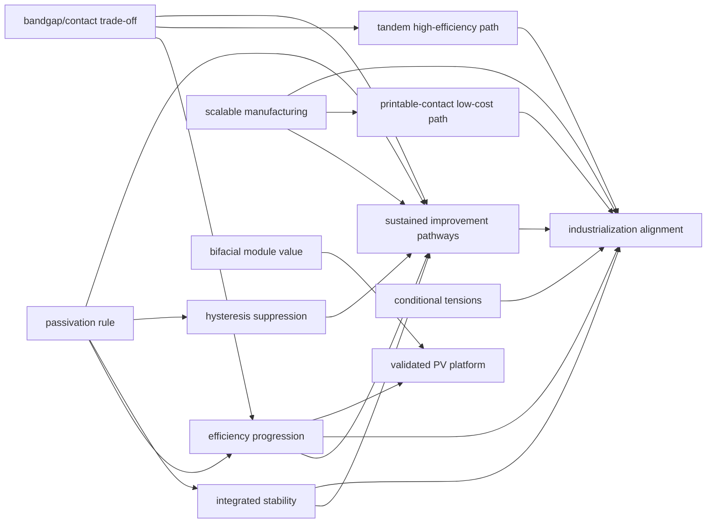

# PVSK Synthesis: Cross-Paper Reasoning Graph

> **Original corpus:** 22 Gaia knowledge packages formalizing perovskite solar-cell papers from the first organometal-halide sensitizer report through recent tandem, stability, passivation, bifacial-module, and roll-to-roll manufacturing results.

> [!NOTE]
> This README describes the synthesis-layer reasoning graph. Belief values come from `gaia infer . --depth 1` and reflect probabilistic support in the Gaia graph, not the source authors' confidence.

## Summary

This package imports public claims from 22 paper-level PVSK Gaia packages and builds a cross-paper synthesis graph. The graph emphasizes reusable mechanisms, conditional tensions, normalized manufacturing evidence, and shared bottlenecks rather than direct paper-to-conclusion aggregation. The core result is that perovskites are a validated PV platform with strong efficiency and bandgap/contact-engineering pathways, a sustained technical-improvement route, and a still-conditional industrialization path.

The added final conclusion is `synthesis_perovskites_have_sustained_improvement_pathways`. It means PVSK performance can keep improving through reusable design axes: composition control, interface passivation, bandgap-contact engineering, dimensional/interface design, and scalable processing. It does not claim environmental lifecycle sustainability.

## Final Conclusions

| Final conclusion | Belief |
|---|---:|
| `synthesis_bandgap_and_contact_engineering_define_tradeoff_space` | 0.858 |
| `synthesis_efficiency_progression_is_interface_driven` | 0.845 |
| `synthesis_bifacial_modules_add_system_value` | 0.822 |
| `synthesis_perovskites_are_validated_pv_platform` | 0.810 |
| `synthesis_perovskites_have_sustained_improvement_pathways` | 0.787 |
| `synthesis_hysteresis_is_practically_suppressed` | 0.774 |
| `synthesis_industrialization_requires_three_way_alignment` | 0.759 |
| `synthesis_passivation_is_general_design_rule` | 0.753 |
| `synthesis_stability_requires_integrated_control` | 0.724 |
| `synthesis_tandems_are_primary_high_efficiency_path` | 0.716 |
| `synthesis_low_cost_path_depends_on_printable_contacts` | 0.701 |
| `synthesis_scalable_manufacturing_is_demonstrated` | 0.694 |
| `synthesis_mechanistic_tensions_are_conditionally_resolved` | 0.601 |

## Synthesis Spine



> [!NOTE]
> **[Per-module reasoning graphs with full claim details →](docs/detailed-reasoning.md)**
>
> 6 Mermaid diagrams (one per section) with every claim, strategy, and belief value.

The complete generated graph and detailed node pages are in [docs/detailed-reasoning.md](docs/detailed-reasoning.md) and `.github-output/`.

## Core Claim Mapping

| Core claim | Final conclusions used by the synthesis |
|---|---|
| Fabrication feasibility | `synthesis_scalable_manufacturing_is_demonstrated`, `synthesis_low_cost_path_depends_on_printable_contacts`, normalized manufacturing evidence nodes |
| High efficiency | `synthesis_efficiency_progression_is_interface_driven`, `synthesis_tandems_are_primary_high_efficiency_path`, `synthesis_bandgap_and_contact_engineering_define_tradeoff_space` |
| Sustained technical improvement | `synthesis_perovskites_have_sustained_improvement_pathways`, supported by efficiency, passivation, stability, hysteresis, bandgap/contact, and manufacturing mechanisms |
| Industrialization | `synthesis_industrialization_requires_three_way_alignment`, constrained by efficiency, stability, scale, deployment value, cost, and lifetime |

## Reasoning Structure

### `synthesis_perovskites_are_validated_pv_platform`

This conclusion says the absorber platform itself is validated across device architectures. It is supported through cross-paper agreement that perovskite absorbers work, solid-state architectures improve performance, and later dimensional/interface designs combine defect passivation with barrier protection. It is not inferred by treating all 22 papers as independent votes; it passes through platform, interface, and deployment-value mechanisms.

Verdict: strong but still scoped to demonstrated PVSK device families, not a claim that all commercial deployment constraints are solved.

### `synthesis_efficiency_progression_is_interface_driven`

This conclusion says long-run efficiency gains are best explained by interface, composition, architecture, and contact engineering rather than by replacing the basic absorber concept. It is supported by `interface_control_reduces_recombination`, `interface_control_improves_charge_selectivity`, `passivation_reduces_nonradiative_loss`, and tandem interface-contact records.

Verdict: one of the strongest synthesis conclusions, with the main caveat that high efficiency does not automatically transfer to large-area modules.

### `synthesis_passivation_is_general_design_rule`

This conclusion says passivation is a reusable PVSK design rule when it reduces defects and preserves extraction. The graph now models both sides of the rule: `passivation_reduces_recombination_and_improves_voltage` and `passivation_may_hurt_ff_if_it_blocks_extraction` combine into `effective_passivation_requires_defect_reduction_without_transport_penalty`.

Verdict: supported as a general rule, not as a single universally positive intervention.

### `synthesis_stability_requires_integrated_control`

This conclusion says stability requires simultaneous control of phase, interfaces, ion migration, humidity/thermal stress, operation, and encapsulated-module behavior. The stability evidence is split into `phase_stability_axis`, `interface_stability_axis`, `ion_migration_axis`, `humidity_thermal_stress_axis`, `operational_stability_axis`, and `encapsulated_module_stability_axis`.

Verdict: moderate support with explicit extrapolation risk; single-stressor stability is not treated as field stability.

### `synthesis_hysteresis_is_practically_suppressed`

This conclusion says hysteresis has become practically suppressible through architecture and interface design. The graph links hysteresis to `ion_migration_contributes_to_hysteresis`, `interface_recombination_amplifies_hysteresis`, delayed-polarization context, and `dimensional_interface_engineering_suppresses_hysteresis_in_practice`.

Verdict: practical suppression is supported, but the graph does not claim one solved microscopic origin.

### `synthesis_bandgap_and_contact_engineering_define_tradeoff_space`

This conclusion says PVSK optimization is governed by coupled bandgap/contact trade-offs across voltage, current, fill factor, and extraction. It is supported by `bandgap_contact_coupling_controls_voc_jsc_ff_tradeoff`, current-matching requirements, low-loss contact requirements, and passivation/extraction conditions.

Verdict: strongest synthesis conclusion because multiple efficiency, tandem, and contact mechanisms converge on the same trade-off space.

### `synthesis_tandems_are_primary_high_efficiency_path`

This conclusion says tandems are the main high-efficiency route, but only when bandgap matching and low-loss contacts are achieved. The required conditions are modeled with `bandgap_tunability_enables_current_matching`, `low_loss_recombination_or_contact_layers_are_required`, `passivation_improves_tandem_voltage_retention`, `tandem_record_efficiency_depends_on_interface_contact_engineering`, and `tandem_deployment_still_depends_on_scalable_stability`.

Verdict: credible high-efficiency path, not a deployment guarantee.

### `synthesis_mechanistic_tensions_are_conditionally_resolved`

This conclusion says the main apparent conflicts across papers are usually conditional: architecture, process route, stress test, interface design, and deployment context change which mechanism dominates. The graph includes process, passivation, scale-up, stability, bifacial, and cost tensions rather than hiding them.

Verdict: deliberately modest belief because conditional resolution is useful but not the same as direct experimental closure of every conflict.

### `synthesis_scalable_manufacturing_is_demonstrated`

This conclusion says scale-up has been demonstrated across routes, including roll-to-roll, module, and bifacial/minimodule evidence. It is routed through normalized evidence nodes: `area_normalized_performance`, `certification_status_normalized`, `stabilized_output_vs_scan_pce`, `module_yield_and_reproducibility`, `encapsulation_and_lifetime_requirements`, and `throughput_and_material_utilization`.

Verdict: cautiously positive; the graph says scalable manufacturing is demonstrated, not deployment-ready manufacturing proven.

### `synthesis_low_cost_path_depends_on_printable_contacts`

This conclusion says the low-cost route depends on printable high-throughput processing and low-cost contacts, especially alternatives to noble-metal evaporation. It is constrained by `printable_contacts_reduce_capex_but_require_lifetime_validation`, `cost_projection_depends_on_yield_lifetime_and_throughput`, yield, encapsulation, and throughput nodes.

Verdict: plausible but intentionally moderate; low cost is not treated as established.

### `synthesis_bifacial_modules_add_system_value`

This conclusion says bifacial PVSK modules can add system value by collecting rear-side/reflected light and improving deployment economics beyond front-side PCE alone. It is connected to certification, encapsulated-module stability, and `deployment_value_requires_efficiency_stability_and_area_scaling`.

Verdict: strong module-value conclusion, with the explicit condition that bifacial gain depends on albedo and installation context.

### `synthesis_perovskites_have_sustained_improvement_pathways`

This conclusion says PVSK performance has sustained technical improvement pathways because efficiency, stability, hysteresis suppression, module value, and manufacturability can be repeatedly improved through reusable design axes. It directly connects to efficiency, passivation, stability, hysteresis, bandgap/contact engineering, and scalable manufacturing.

Verdict: supported as a technical iteration claim. It is not an environmental sustainability or lifecycle proof.

### `synthesis_industrialization_requires_three_way_alignment`

This conclusion says industrialization requires efficiency, stability, and scale to align with cost and deployment value. It depends on the efficiency axis, stability axes, scale/normalization layer, low-cost conditions, tandem deployment conditions, and sustained-improvement mechanism.

Verdict: cautiously positive but conditional. The graph keeps industrialization below the strongest efficiency conclusions because yield, lifetime, throughput, and module-scale validation remain active bottlenecks.

## Shared Mechanism Nodes

| Mechanism node | Cross-conclusion role |
|---|---|
| `interface_control_reduces_recombination` | Links efficiency, passivation, hysteresis, and stability |
| `interface_control_improves_charge_selectivity` | Links efficiency, contact engineering, tandems, and industrialization |
| `passivation_reduces_nonradiative_loss` | Links efficiency, passivation, hysteresis, stability, and tandem voltage retention |
| `passivation_can_introduce_transport_barriers` | Prevents passivation from being modeled as only positive |
| `passivation_benefit_is_conditioned_on_preserved_charge_extraction` | Couples passivation, efficiency, contact trade-offs, and sustained improvement |
| `ion_migration_links_hysteresis_and_stability` | Connects hysteresis suppression with stability control |
| `dimensional_interfaces_combine_defect_passivation_and_barrier_protection` | Links passivation, hysteresis, and long-term stability |
| `bandgap_contact_coupling_controls_voc_jsc_ff_tradeoff` | Links single-junction efficiency, tandem design, and trade-off-space reasoning |
| `tandem_performance_requires_bandgap_matching_and_low_loss_contacts` | Connects tandem efficiency to bandgap/contact engineering |
| `scalable_manufacturing_requires_uniformity_yield_and_encapsulation` | Links manufacturing, low cost, industrialization, and sustained improvement |
| `deployment_value_requires_efficiency_stability_and_area_scaling` | Links bifacial value, platform validity, and industrialization |
| `sustained_improvement_comes_from_reusable_design_axes` | Connects efficiency, stability, hysteresis, manufacturing, and iterative improvement |

## Explicit Tensions And Limitations

| Tension or limitation node | Why it matters |
|---|---|
| `planar_vs_mesoporous_is_process_conditioned` | Architecture comparisons depend on process and stack context |
| `solution_vs_vapor_deposition_is_scale_quality_tradeoff` | Scale and film quality are coupled manufacturing trade-offs |
| `passivation_vs_transport_is_conditional` | Defect reduction can be offset by worse charge extraction |
| `record_efficiency_vs_module_scaling_is_not_automatic` | Champion cells do not prove module manufacturing |
| `stability_under_single_stressor_does_not_guarantee_field_stability` | Thermal, humidity, light, bias, and field stress are not interchangeable |
| `bifacial_gain_depends_on_albedo_and_installation_context` | System value depends on deployment geometry and surface reflectance |
| `cost_projection_depends_on_yield_lifetime_and_throughput` | Cost remains model-dependent without coupled production data |

## Weak Points And Evidence Gaps

The weakest local conditions are concentrated in exactly the places where the scientific and industrial claims should remain cautious: `printable_contacts_reduce_capex_but_require_lifetime_validation` (0.594), `cost_projection_depends_on_yield_lifetime_and_throughput` (0.597), `effective_passivation_requires_defect_reduction_without_transport_penalty` (0.603), and `tandem_deployment_still_depends_on_scalable_stability` (0.621).

Manufacturing and low-cost conclusions are intentionally lower than the efficiency conclusions. The graph requires area-normalized performance, stabilized output rather than scan-only PCE, module yield, reproducibility, encapsulation, and throughput before scale or cost claims can support industrialization.

The main future evidence needs are field-relevant stability under combined stress, larger statistically meaningful module batches, side-by-side process-route comparisons, lifetime-validated printable contacts, and coupled technoeconomic data that report yield, throughput, material utilization, and encapsulation assumptions together.

## Inference And Review Setting

The correct inference command remains:

```bash
gaia infer . --depth 1
```

`--depth 1` is appropriate because this synthesis package imports the direct paper-level dependency graphs and should reason jointly over those packages. Increasing infer depth would add transitive dependency structure, not fix synthesis-layer organization. The information-gain improvement here comes from the synthesis structure itself: agreement clusters, normalized evidence axes, mechanism nodes, limitation nodes, induction laws, and final conclusions.

The review pass keeps `src/pvsk/priors.py` empty. All local synthesis claims are derived by explicit strategies, and the 63 independent holes reported by `gaia check --hole .` are foreign dependency claims whose beliefs are supplied by joint `--depth 1` inference rather than by local priors.

## Reproduce

```bash
gaia check --brief .
gaia infer . --depth 1
gaia render . --target docs
gaia render . --target github
```

Current generated structure:

- 417 knowledge nodes
- 163 strategies
- 13 exported final conclusions
- `gaia check --brief .` passes
- `gaia infer . --depth 1` converges

