# pvsk-gaia

Cross-paper Gaia synthesis of 22 perovskite solar-cell formalizations.

## Overview

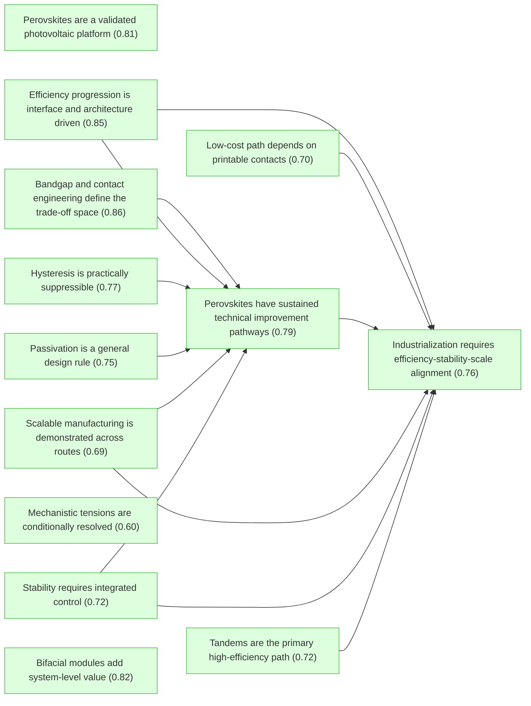

## Introduction

#### Perovskites are a validated photovoltaic platform ★

📌 `synthesis_perovskites_are_validated_pv_platform`   |   Belief: **0.81**

> The 22-package evidence base supports perovskite photovoltaics as a validated photovoltaic platform: the absorber works across architectures, and the later performance gains come from controlling interfaces, composition, and contacts.

🔗 **support**([Solid-state architectures raise efficiency](#agreement_solid_state_architectures_raise_efficiency), [Dimensional interfaces combine passivation and barrier protection](#dimensional_interfaces_combine_defect_passivation_and_barrier_protection))

<details><summary>Reasoning</summary>

Solid-state architecture progress and reusable dimensional-interface control independently support platform validity.

</details>


#### Efficiency progression is interface and architecture driven ★

📌 `synthesis_efficiency_progression_is_interface_driven`   |   Belief: **0.85**

> The long-run efficiency progression is best explained by interface, architecture, composition, and contact engineering rather than by a change in the basic absorber concept.

🔗 **support**([Tandem records depend on interface-contact engineering](#tandem_record_efficiency_depends_on_interface_contact_engineering))

<details><summary>Reasoning</summary>

The tandem-record mechanism supplies a later contact-engineering check on the interface-driven efficiency synthesis.

</details>


#### Passivation is a general design rule ★

📌 `synthesis_passivation_is_general_design_rule`   |   Belief: **0.75**

> Passivation is a general PVSK design rule: chemically bound passivators, field-effect molecules, dimensional barriers, and dipolar interfaces all work when they reduce recombination without blocking extraction.

🔗 **support**([Passivation mechanisms are complementary](#tension_passivation_mechanisms_are_complementary), [Passivation versus transport is conditional](#passivation_vs_transport_is_conditional))

<details><summary>Reasoning</summary>

Mechanistic complementarity and conditional transport penalties define the passivation rule's scope.

</details>


#### Stability requires integrated control ★

📌 `synthesis_stability_requires_integrated_control`   |   Belief: **0.72**

> Durable PVSK devices require integrated control of phase stability, dimensional interface protection, ion migration, and device-stack chemistry; no single stability mechanism explains all successful packages.

🔗 **support**([Stability needs phase and interface control](#law_stability_needs_phase_and_interface_control), [Ion migration links hysteresis and stability](#ion_migration_links_hysteresis_and_stability), [Dimensional interfaces combine passivation and barrier protection](#dimensional_interfaces_combine_defect_passivation_and_barrier_protection), [Single-stressor stability does not guarantee field stability](#stability_under_single_stressor_does_not_guarantee_field_stability))

<details><summary>Reasoning</summary>

The stability law is narrowed by ion-migration, dimensional-interface, and single-stressor limitation nodes.

</details>


#### Hysteresis is practically suppressible ★

📌 `synthesis_hysteresis_is_practically_suppressed`   |   Belief: **0.77**

> Current-density hysteresis is not a single solved microscopic mechanism, but it has become practically suppressible through architecture, dimensional interface design, and buried-interface passivation.

🔗 **support**([Hysteresis suppression does not identify a single cause](#hysteresis_suppression_does_not_identify_single_microscopic_cause), [Architecture can suppress hysteresis](#agreement_hysteresis_can_be_suppressed_by_architecture))

<details><summary>Reasoning</summary>

A multi-source mechanism explains why practical suppression need not solve one universal microscopic cause.

</details>


#### Bandgap and contact engineering define the trade-off space ★

📌 `synthesis_bandgap_and_contact_engineering_define_tradeoff_space`   |   Belief: **0.86**

> PVSK optimization is governed by a bandgap-contact trade-off space: iodide, bromide, mixed cations, and selective contacts tune current, voltage, and extraction rather than optimizing all metrics independently.

🔗 **support**([Band alignment controls charge selectivity](#law_band_alignment_controls_charge_selectivity), [Low-loss recombination or contact layers are required](#low_loss_recombination_or_contact_layers_are_required))

<details><summary>Reasoning</summary>

The band-alignment law supplies the contact-selectivity side of the trade-off space, while tandem low-loss contacts expose the same bottleneck.

</details>


#### Tandems are the primary high-efficiency path ★

📌 `synthesis_tandems_are_primary_high_efficiency_path`   |   Belief: **0.72**

> Tandem architectures are the primary high-efficiency path for PVSK: their advantage depends on bandgap tunability, interfacial selectivity, and low-loss contacts rather than on tandem stacking alone.

🔗 **support**([Tandems raise the efficiency ceiling](#agreement_tandems_raise_efficiency_ceiling), [Tandems raise the perovskite efficiency ceiling](#law_tandems_raise_perovskite_efficiency_ceiling), [Conventional and dipolar buried passivation differ by target mechanism](#tension_conventional_vs_dipolar_buried_passivation), [Tandem deployment still depends on scalable stability](#tandem_deployment_still_depends_on_scalable_stability))

<details><summary>Reasoning</summary>

Tandem records remain a high-efficiency path, but buried-interface and scalable-stability conditions define the path's deployment scope.

</details>


#### Mechanistic tensions are conditionally resolved ★

📌 `synthesis_mechanistic_tensions_are_conditionally_resolved`   |   Belief: **0.60**

> The major apparent conflicts across PVSK papers are conditionally resolved: they usually reflect different architectures, stress tests, interfaces, or optimization targets rather than mutually exclusive physical laws.

🔗 **support**([Liquid and solid-state stability claims are architecture-dependent](#tension_liquid_vs_solid_stability), [Hysteresis has multiple context-dependent sources](#tension_hysteresis_has_multiple_sources), [Passivation mechanisms are complementary](#tension_passivation_mechanisms_are_complementary), [Passivation versus transport is conditional](#passivation_vs_transport_is_conditional), [Bifacial gain depends on albedo and installation context](#bifacial_gain_depends_on_albedo_and_installation_context))

<details><summary>Reasoning</summary>

Interface-related and deployment-context tensions are conditionally resolved by architecture, passivation, stress, and installation context.

</details>


#### Scalable manufacturing is demonstrated across routes ★

📌 `synthesis_scalable_manufacturing_is_demonstrated`   |   Belief: **0.69**

> PVSK scale-up is demonstrated at the synthesis level: roll-to-roll cells and modules, bifacial minimodules, and homogeneous 2D large modules show that device quality can survive multiple manufacturing routes.

🔗 **support**([Scalable deposition can preserve device quality](#law_scalable_deposition_can_preserve_device_quality), [Module yield and reproducibility evidence](#module_yield_and_reproducibility), [Stabilized-output versus scan-PCE evidence](#stabilized_output_vs_scan_pce), [Encapsulation and lifetime requirements](#encapsulation_and_lifetime_requirements), [Record efficiency versus module scaling is not automatic](#record_efficiency_vs_module_scaling_is_not_automatic))

<details><summary>Reasoning</summary>

Concrete scale examples support manufacturability only after normalized yield, stabilized-output, lifetime, and record-to-module limitations are kept explicit.

</details>


#### Low-cost path depends on printable contacts ★

📌 `synthesis_low_cost_path_depends_on_printable_contacts`   |   Belief: **0.70**

> The low-cost PVSK path depends on printable high-throughput processing and low-cost contacts, especially carbon-based electrodes that reduce dependence on noble-metal evaporation.

🔗 **support**([Cost projection depends on yield, lifetime, and throughput](#cost_projection_depends_on_yield_lifetime_and_throughput), [Module yield and reproducibility evidence](#module_yield_and_reproducibility), [Encapsulation and lifetime requirements](#encapsulation_and_lifetime_requirements))

<details><summary>Reasoning</summary>

Cost modeling remains a cautious inference because yield, lifetime, and throughput are explicit conditions rather than established deployment facts.

</details>


#### Bifacial modules add system-level value ★

📌 `synthesis_bifacial_modules_add_system_value`   |   Belief: **0.82**

> Bifacial perovskite modules add system-level value because rear-side collection and reflected-light power density can improve deployment economics beyond front-side cell efficiency alone.

🔗 **support**([NREL certified stabilized front efficiency 19.2%](#nrel_certified_front_efficiency), [97% retention after 6000h light soaking at 60C](#initial_pce_retention_6000h), [Encapsulated-module stability evidence axis](#encapsulated_module_stability_axis))

<details><summary>Reasoning</summary>

Certification and long operation support practical module relevance.

</details>


#### Perovskites have sustained technical improvement pathways ★

📌 `synthesis_perovskites_have_sustained_improvement_pathways`   |   Belief: **0.79**

> PVSK performance has sustained improvement pathways because efficiency, stability, hysteresis suppression, module value, and manufacturability can be repeatedly improved through reusable design axes: composition control, interface passivation, bandgap-contact engineering, dimensional/interface design, and scalable processing. This is a technical-iteration claim, not an environmental lifecycle-sustainability claim.

🔗 **support**([Sustained improvement comes from reusable design axes](#sustained_improvement_comes_from_reusable_design_axes), [Scalable manufacturing is demonstrated across routes](#synthesis_scalable_manufacturing_is_demonstrated), [Scalable manufacturing requires uniformity, yield, and encapsulation](#scalable_manufacturing_requires_uniformity_yield_and_encapsulation))

<details><summary>Reasoning</summary>

The scalable-manufacturing connection keeps sustained improvement tied to process iteration while preserving uniformity, yield, and lifetime conditions.

</details>


#### Industrialization requires efficiency-stability-scale alignment ★

📌 `synthesis_industrialization_requires_three_way_alignment`   |   Belief: **0.76**

> PVSK industrialization requires simultaneous alignment of record efficiency, stress-tested stability, and scalable manufacturing; progress in only one of these axes is insufficient for deployment.

🔗 **support**([Tandem deployment still depends on scalable stability](#tandem_deployment_still_depends_on_scalable_stability), [Record efficiency versus module scaling is not automatic](#record_efficiency_vs_module_scaling_is_not_automatic), [Single-stressor stability does not guarantee field stability](#stability_under_single_stressor_does_not_guarantee_field_stability), [Cost projection depends on yield, lifetime, and throughput](#cost_projection_depends_on_yield_lifetime_and_throughput), [Perovskites have sustained technical improvement pathways](#synthesis_perovskites_have_sustained_improvement_pathways))

<details><summary>Reasoning</summary>

The industrialization conclusion stays cautious because the main limitation nodes remain active: tandem deployment, record-to-module transfer, field stability, and cost-model conditions.

</details>


## S1: Cross-paper agreement claims.

<a id="agreement_perovskite_absorber_validated"></a>

#### Perovskite absorbers are validated across early architectures

📌 `agreement_perovskite_absorber_validated`   |   Belief: **0.88**

> Independent packages agree that organometal halide perovskites are effective photovoltaic absorbers rather than merely experimental dye replacements.

🔗 **support**([Perovskite efficiently sensitizes TiO2 for visible-light conversion](#conclusion_perovskite_sensitization), [Panchromatic absorption enables high JSC](#panchromatic_absorption_leads_to_high_jsc), [Perovskite as semiconductor](#perovskite_semicondo), [Certified PCE of 16.2% under AM 1.5 G full sun](#certified_efficiency_162))

<details><summary>Reasoning</summary>

The 2009 sensitizer result, 2012 solid-state panchromatic response, 2012 meso-superstructured semiconductor behavior, and 2014 certified bilayer efficiency all point to the same absorber-level conclusion.

</details>


<a id="agreement_solid_state_architectures_raise_efficiency"></a>

#### Solid-state architectures raise efficiency

📌 `agreement_solid_state_architectures_raise_efficiency`   |   Belief: **0.73**

> The early efficiency jump is consistently associated with solid-state and architecturally controlled devices, not with liquid-electrolyte sensitization.

🔗 **support**([Solid-state configuration dramatically improves stability](#solid_state_dramatically_improved_stability), [Best Al2O3 MSSC device performance](#al2o3_best_device), [Certified PCE: 14.14%](#certified_efficiency), [Certified PCE of 16.2% under AM 1.5 G full sun](#certified_efficiency_162))

<details><summary>Reasoning</summary>

Kim 2012, Lee 2012, Burschka 2013, and Jeon 2014 all connect solid-state device design or controlled architecture with much higher performance.

</details>


<a id="agreement_phase_and_composition_control_matter"></a>

#### Composition and phase control are repeated enablers

📌 `agreement_phase_and_composition_control_matter`   |   Belief: **0.90**

> Composition and phase control are repeated enabling themes for high-efficiency and stable perovskite devices.

🔗 **support**([Evidence for perovskite phase stabilization](#phase_stabilization_evidence), [Triple cation Cs/MA/FA strategy](#triple_cation_strategy), [Best device achieves 21.1% stabilized PCE](#best_stabilized_pce), [MDACl2 stabilizes alpha-FAPbI3 with high efficiency and stability](#conclusion_alpha_stabilization))

<details><summary>Reasoning</summary>

Mixed-cation stabilization, triple-cation stabilization, and MDA-based alpha-FAPbI3 stabilization independently support a composition-control design principle.

</details>


<a id="agreement_passivation_reduces_recombination"></a>

#### Passivation reduces recombination across interfaces

📌 `agreement_passivation_reduces_recombination`   |   Belief: **0.88**

> Surface, grain-boundary, and buried-interface passivation repeatedly reduce non-radiative recombination or its device-level signatures.

🔗 **support**([Formate treatment reduces non-radiative recombination 5x](#non_radiative_recombination_reduction), [Deep in-gap states eliminated by CF3-PA](#deep_in_gap_states_eliminated), [2D perovskite provides dual-function passivation](#dual_function_passivation), [dipolar_passivation_strategy](#dipolar_passivation_strategy))

<details><summary>Reasoning</summary>

Formate, CF3-PA, tailored-dimensionality 2D/3D, and dipolar strategies all target recombination-active defects at interfaces or grain surfaces.

</details>


<a id="agreement_dimensional_interfaces_improve_stability"></a>

#### Dimensional interfaces improve stability

📌 `agreement_dimensional_interfaces_improve_stability`   |   Belief: **0.93**

> Dimensional interface engineering, including 2D/3D interfaces and capping layers, repeatedly improves moisture, thermal, or operational stability.

🔗 **support**([Record stability enables commercialization pathway](#one_year_stability_record), [2D/3D composite preparation method](#two_d_three_d_composite_preparation), [T95 retention after >1200 hours damp-heat test](#t95_after_1200_hours), [2D capping layer passivates iodine vacancies, frustrates ion migration](#passivation_frustrates_ion_migration))

<details><summary>Reasoning</summary>

The 2017 2D/3D result, 2022 damp-heat-stable 2D/3D devices, and all-inorganic 2D capping all connect dimensional interface control with stability gains.

</details>


<a id="agreement_hysteresis_can_be_suppressed_by_architecture"></a>

#### Architecture can suppress hysteresis

📌 `agreement_hysteresis_can_be_suppressed_by_architecture`   |   Belief: **0.82**

> Device architecture and interface design can suppress current-density hysteresis to a practical level.

🔗 **support**([Bilayer cell exhibits negligible hysteresis](#negligible_hysteresis_bilayer), [2D/3D composite preparation method](#two_d_three_d_composite_preparation), [dipolar_passivation_strategy](#dipolar_passivation_strategy))

<details><summary>Reasoning</summary>

Bilayer engineering, 2D/3D interface engineering, and buried-interface dipolar passivation all address interface-controlled loss pathways linked to hysteresis.

</details>


<a id="agreement_tandems_raise_efficiency_ceiling"></a>

#### Tandems raise the efficiency ceiling

📌 `agreement_tandems_raise_efficiency_ceiling`   |   Belief: **0.96**

> Perovskite-based tandem architectures repeatedly raise the efficiency ceiling beyond single-junction perovskite cells.

🔗 **support**([Certified PCE of 26.4% by JET](#certified_pce_264_percent), [Type II band alignment at PHJ](#type_two_band_alignment), [NREL certified 33.89% PCE](#nrel_certified_pce), [Certified PCE 34.58% by ESTI](#certified_pce_34_58), [jet_certified_pce](#jet_certified_pce))

<details><summary>Reasoning</summary>

All-perovskite tandem, 3D/3D bilayer, perovskite/silicon, HTL201, and dipolar passivation packages independently support tandem-level efficiency growth.

</details>


<a id="agreement_scalability_has_multiple_routes"></a>

#### Scalability has multiple manufacturing routes

📌 `agreement_scalability_has_multiple_routes`   |   Belief: **0.69**

> Scalable perovskite manufacturing is supported by multiple routes rather than a single deposition platform.

🔗 **support**([First fully R2R-fabricated PeSCs with 15.5% PCE](#first_fully_r2r_cells), [First fully R2R-fabricated PeSC modules with 11% PCE](#first_fully_r2r_modules), [NREL certified stabilized front efficiency 19.2%](#nrel_certified_front_efficiency), [Large module efficiencies (18.90% and 17.59%)](#large_module_summary))

<details><summary>Reasoning</summary>

Roll-to-roll cells and modules, bifacial minimodules, and homogeneous 2D large modules show that scale-up can be pursued through distinct process families.

</details>


<a id="phase_stability_axis"></a>

#### Phase-stability evidence axis

📌 `phase_stability_axis`   |   Belief: **0.78**

> Phase-stability evidence forms a distinct synthesis axis: mixed-cation, triple-cation, MDA, and triple-halide controls all suppress phase instability without being interchangeable with interface protection.

🔗 **support**([Evidence for perovskite phase stabilization](#phase_stabilization_evidence), [Triple cation Cs/MA/FA strategy](#triple_cation_strategy), [MDACl2 stabilizes alpha-FAPbI3 with high efficiency and stability](#conclusion_alpha_stabilization), [Triple-halide composition eliminates phase separation](#triple_halide_eliminates_phase_sep))

<details><summary>Reasoning</summary>

Composition-level phase control recurs in 2015 mixed-cation, later triple-cation, MDA-stabilized FAPbI3, and triple-halide module work.

</details>


<a id="interface_stability_axis"></a>

#### Interface-stability evidence axis

📌 `interface_stability_axis`   |   Belief: **0.78**

> Interface-stability evidence is a separate axis because 2D/3D interfaces, formate treatment, tailored-dimensionality passivation, and dipolar buried interfaces protect device stacks through local interfacial chemistry.

🔗 **support**([2D/3D composite preparation method](#two_d_three_d_composite_preparation), [2D perovskite provides dual-function passivation](#dual_function_passivation), [Long-term operational stability (450 hours)](#long_term_operational_stability), [tandem_operational_stability](#tandem_operational_stability))

<details><summary>Reasoning</summary>

The stability gains are reported at interfaces or heterointerfaces rather than only through bulk absorber composition.

</details>


<a id="ion_migration_axis"></a>

#### Ion-migration evidence axis

📌 `ion_migration_axis`   |   Belief: **0.75**

> Ion migration is a shared stability axis: vacancy passivation, higher activation energy, capped-device retention, and hysteresis-linked transport all indicate that mobile ions couple device operation to degradation.

🔗 **support**([2D capping layer passivates iodine vacancies, frustrates ion migration](#passivation_frustrates_ion_migration), [Capped PSCs have nearly 2x higher activation energy for degradation](#activation_energy_capped_higher), [T80 at 35°C extrapolated to 51,000 ± 7000 hours](#t80_extrapolated_35c), [Bilayer cell exhibits negligible hysteresis](#negligible_hysteresis_bilayer))

<details><summary>Reasoning</summary>

All-inorganic capping directly targets ion migration, while hysteresis suppression supplies a device-level symptom of the same transport issue.

</details>


<a id="humidity_thermal_stress_axis"></a>

#### Humidity-thermal stress evidence axis

📌 `humidity_thermal_stress_axis`   |   Belief: **0.81**

> Humidity and thermal stress form a separate evidence axis because damp heat, thermal-photostability, and bifacial-module stress tests probe environmental drivers beyond room-temperature efficiency.

🔗 **support**([T95 retention after >1200 hours damp-heat test](#t95_after_1200_hours), [IEC 61215:2016 damp-heat standard met](#iecs_standard_met), [84% retention after 1000h damp-heat at 85C/85% RH](#damp_heat_retention), [T80 at 35°C extrapolated to 51,000 ± 7000 hours](#t80_extrapolated_35c))

<details><summary>Reasoning</summary>

The damp-heat, IEC, bifacial, and thermal extrapolation claims normalize stability evidence by stress mode rather than treating all retention tests as equivalent.

</details>


<a id="operational_stability_axis"></a>

#### Operational-stability evidence axis

📌 `operational_stability_axis`   |   Belief: **0.77**

> Operational stability is an evidence axis separate from accelerated stress: long operation, operational PCE retention, and tandem stability establish whether design rules survive realistic device bias and illumination.

🔗 **support**([Record stability enables commercialization pathway](#one_year_stability_record), [Long-term operational stability (450 hours)](#long_term_operational_stability), [HTL201 retains 98.0% PCE after 1020h at 25C](#htl201_operational_25c_98_percent), [CF3-PA tandem retains 90% PCE after 600h operation](#operational_stability_600h), [97% retention after 6000h light soaking at 60C](#initial_pce_retention_6000h))

<details><summary>Reasoning</summary>

These claims report operational or long-duration retention, which is not identical to a single accelerated stress result.

</details>


<a id="encapsulated_module_stability_axis"></a>

#### Encapsulated-module stability evidence axis

📌 `encapsulated_module_stability_axis`   |   Belief: **0.73**

> Encapsulated module stability is a scale-relevant evidence axis because it combines packaging, area, interconnection, and environmental retention rather than only small-cell material stability.

🔗 **support**([IEC 61215:2016 damp-heat standard met](#iecs_standard_met), [97% retention after 6000h light soaking at 60C](#initial_pce_retention_6000h), [Excellent operational stability (T80 > 2000 h)](#stability_summary), [tandem_operational_stability](#tandem_operational_stability))

<details><summary>Reasoning</summary>

IEC damp-heat, 6000 h bifacial operation, homogeneous 2D module stability, and tandem operational stability expose package-level reliability demands.

</details>


<a id="passivation_reduces_recombination_and_improves_voltage"></a>

#### Passivation reduces recombination and improves voltage

📌 `passivation_reduces_recombination_and_improves_voltage`   |   Belief: **0.74**

> Passivation often improves voltage by reducing recombination, as shown by formate, all-inorganic capping, and HTL/contact passivation; this positive effect is distinct from the transport penalty modeled in the tension layer.

🔗 **support**([Passivation reduces recombination across interfaces](#agreement_passivation_reduces_recombination), [Target has lower ideality factor (1.18 vs 1.52)](#reduced_ideality_factor), [Capped devices show improved FF and VOC](#capped_improved_ff_and_voc), [HTL201 shows enhanced Voc and FF](#htl201_enhanced_voc_ff))

<details><summary>Reasoning</summary>

Recombination signatures, ideality-factor improvement, capped-device Voc/FF improvement, and HTL201 voltage/fill-factor gains all point to the same beneficial side of passivation.

</details>


<a id="area_normalized_performance"></a>

#### Area-normalized performance evidence

📌 `area_normalized_performance`   |   Belief: **0.68**

> Area-normalized performance evidence distinguishes small record cells from large-area tandems, minimodules, roll-to-roll modules, and homogeneous 2D large devices.

🔗 **support**([Large-area tandem device performance](#large_area_tandem), [11% PCE for fully R2R-printed modules](#module_record), [Minimodule front 20.2%, rear 15.0%, area >20 cm2](#minimodule_front_aperture_efficiency), [24.62% efficiency for 1.04 cm2 large device](#large_device_efficiency))

<details><summary>Reasoning</summary>

These package claims report area- or module-relevant performance rather than relying on single small-area champion cells.

</details>


<a id="certification_status_normalized"></a>

#### Certification-normalized performance evidence

📌 `certification_status_normalized`   |   Belief: **0.73**

> Certification-normalized evidence separates independently certified or externally verified efficiencies from internal champion scans.

🔗 **support**([Certified PCE: 14.14%](#certified_efficiency), [Certified PCE of 16.2% under AM 1.5 G full sun](#certified_efficiency_162), [Certified PCE of 26.4% by JET](#certified_pce_264_percent), [NREL certified 33.89% PCE](#nrel_certified_pce), [Certified PCE 34.58% by ESTI](#certified_pce_34_58), [NREL certified stabilized front efficiency 19.2%](#nrel_certified_front_efficiency))

<details><summary>Reasoning</summary>

The synthesis treats third-party certification as a normalizing layer across early cells, tandem records, and bifacial minimodules.

</details>


<a id="stabilized_output_vs_scan_pce"></a>

#### Stabilized-output versus scan-PCE evidence

📌 `stabilized_output_vs_scan_pce`   |   Belief: **0.83**

> Stabilized output and quasi-steady-state certification are normalized apart from scan-only PCE so that hysteresis-prone or transient records are not treated as identical evidence.

🔗 **support**([Best device achieves 21.1% stabilized PCE](#best_stabilized_pce), [NREL certified QSS PCE 25.1%](#qss_pce_certification), [NREL certified 33.89% PCE](#nrel_certified_pce), [Certified PCE 34.58% by ESTI](#certified_pce_34_58), [NREL certified stabilized front efficiency 19.2%](#nrel_certified_front_efficiency))

<details><summary>Reasoning</summary>

Stabilized PCE, quasi-steady-state certification, and NREL/ESTI-style records reduce the risk of treating scan artifacts as deployment evidence.

</details>


<a id="module_yield_and_reproducibility"></a>

#### Module yield and reproducibility evidence

📌 `module_yield_and_reproducibility`   |   Belief: **0.67**

> Module yield and reproducibility are normalized manufacturing evidence: sequential-film reproducibility, full coverage, roll-to-roll modules, and large homogeneous modules address repeatability rather than isolated peaks.

🔗 **support**([Sequential method improves reproducibility](#reproducibility_improvement), [Full surface coverage achieved with solvent engineering](#full_surface_coverage), [First fully R2R-fabricated PeSC modules with 11% PCE](#first_fully_r2r_modules), [Large module efficiencies (18.90% and 17.59%)](#large_module_summary))

<details><summary>Reasoning</summary>

The evidence layer groups claims about reproducible formation, film coverage, and module-scale output before they support manufacturing conclusions.

</details>


<a id="encapsulation_and_lifetime_requirements"></a>

#### Encapsulation and lifetime requirements

📌 `encapsulation_and_lifetime_requirements`   |   Belief: **0.72**

> Encapsulation and lifetime requirements remain explicit manufacturing constraints because module-scale value depends on retained output under packaging, damp heat, and long-operation tests.

🔗 **support**([Encapsulated-module stability evidence axis](#encapsulated_module_stability_axis), [2D layer acts as moisture/oxygen barrier](#moisture_oxygen_barrier), [97% retention after 6000h light soaking at 60C](#initial_pce_retention_6000h), [CF3-PA tandem retains 90% PCE after 600h operation](#operational_stability_600h))

<details><summary>Reasoning</summary>

Packaging barriers, module retention, and tandem operational tests make lifetime a separate bottleneck from whether coating can make a cell.

</details>


<a id="throughput_and_material_utilization"></a>

#### Throughput and material-utilization evidence

📌 `throughput_and_material_utilization`   |   Belief: **0.63**

> Throughput and material utilization are normalized cost evidence because roll-to-roll coating, printable carbon contacts, and cost-per-watt models speak to capital intensity and material waste, not directly to lifetime.

🔗 **support**([PFSD technique uses sub-stoichiometric organic cations](#pfsd_technique_description), [Carbon ink replaces vacuum electrodes](#carbon_electrode_replacement), [Module production cost per peak watt](#production_cost_power), [High-throughput R2R fabrication and testing](#high_throughput_capability))

<details><summary>Reasoning</summary>

PFSD, printable carbon, production-cost estimates, and high-throughput testing are grouped as process-economics evidence before cost conclusions.

</details>


<a id="printable_contacts_reduce_capex_but_require_lifetime_validation"></a>

#### Printable contacts reduce capex but require lifetime validation

📌 `printable_contacts_reduce_capex_but_require_lifetime_validation`   |   Belief: **0.59**

> Printable carbon contacts plausibly reduce capital and material cost, but the low-cost inference remains conditional until lifetime and yield are validated at module scale.

🔗 **support**([Carbon ink replaces vacuum electrodes](#carbon_electrode_replacement), [R2R PeSC manufacturing cost prediction](#cost_prediction), [Throughput and material-utilization evidence](#throughput_and_material_utilization), [Encapsulation and lifetime requirements](#encapsulation_and_lifetime_requirements))

<details><summary>Reasoning</summary>

The carbon-contact route lowers process burden, but the normalized lifetime layer keeps the cost claim from becoming deployment-ready proof.

</details>


## S3: Mechanistic tensions and their synthesis-level resolutions.

```mermaid
graph TD
    tension_liquid_vs_solid_stability["Liquid and solid-state stability claims are architecture-dependent (0.80)"]:::derived
    tension_hysteresis_has_multiple_sources["Hysteresis has multiple context-dependent sources (0.64)"]:::derived
    tension_planar_vs_meso_is_process_dependent["Planar versus mesoporous preference is process-dependent (0.63)"]:::derived
    tension_solution_vs_vapour_control["Solution and vapour deposition optimize different controls (0.77)"]:::derived
    tension_passivation_mechanisms_are_complementary["Passivation mechanisms are complementary (0.70)"]:::derived
    tension_passivation_transport_tradeoff_is_conditional["Passivation-transport trade-off is conditional (0.53)"]:::derived
    tension_stability_routes_are_condition_specific["Stability routes are condition-specific (0.90)"]:::derived
    tension_conventional_vs_dipolar_buried_passivation["Conventional and dipolar buried passivation differ by target mechanism (0.57)"]:::derived
    planar_vs_mesoporous_is_process_conditioned["Planar versus mesoporous is process-conditioned (0.60)"]:::derived
    solution_vs_vapor_deposition_is_scale_quality_tradeoff["Solution versus vapor deposition is a scale-quality trade-off (0.73)"]:::derived
    passivation_may_hurt_ff_if_it_blocks_extraction["Passivation may hurt FF if it blocks extraction (0.58)"]:::derived
    effective_passivation_requires_defect_reduction_without_transport_penalty["Effective passivation avoids a transport penalty (0.60)"]:::derived
    passivation_vs_transport_is_conditional["Passivation versus transport is conditional (0.61)"]:::derived
    ion_migration_contributes_to_hysteresis["Ion migration contributes to hysteresis (0.68)"]:::derived
    interface_recombination_amplifies_hysteresis["Interface recombination amplifies hysteresis (0.75)"]:::derived
    dimensional_interface_engineering_suppresses_hysteresis_in_practice["Dimensional interfaces suppress hysteresis in practice (0.70)"]:::derived
    hysteresis_suppression_does_not_identify_single_microscopic_cause["Hysteresis suppression does not identify a single cause (0.63)"]:::derived
    record_efficiency_vs_module_scaling_is_not_automatic["Record efficiency versus module scaling is not automatic (0.67)"]:::derived
    stability_under_single_stressor_does_not_guarantee_field_stability["Single-stressor stability does not guarantee field stability (0.70)"]:::derived
    bifacial_gain_depends_on_albedo_and_installation_context["Bifacial gain depends on albedo and installation context (0.83)"]:::derived
    cost_projection_depends_on_yield_lifetime_and_throughput["Cost projection depends on yield, lifetime, and throughput (0.60)"]:::derived
    sequential_deposition_introduced["Sequential deposition method introduced (0.99)"]:::external
    reproducibility_improvement["Sequential method improves reproducibility (0.90)"]:::external
    phase_stabilization_evidence["Evidence for perovskite phase stabilization (0.96)"]:::external
    triple_cation_strategy["Triple cation Cs/MA/FA strategy (1.00)"]:::external
    two_d_three_d_composite_preparation["2D/3D composite preparation method (0.99)"]:::external
    conclusion_alpha_stabilization["MDACl2 stabilizes alpha-FAPbI3 with high efficiency and stability (1.00)"]:::external
    dual_function_passivation["2D perovskite provides dual-function passivation (0.99)"]:::external
    passivation_frustrates_ion_migration["2D capping layer passivates iodine vacancies, frustrates ion migration (0.99)"]:::external
    formate_at_interfaces["Formate local environment at interfaces (0.91)"]:::external
    non_radiative_recombination_reduction["Formate treatment reduces non-radiative recombination 5x (0.99)"]:::external
    nrel_certified_pce["NREL certified 33.89% PCE (1.00)"]:::external
    certified_pce_34_58["Certified PCE 34.58% by ESTI (1.00)"]:::external
    dipolar_passivation_strategy["dipolar_passivation_strategy (0.85)"]:::external
    iecs_standard_met["IEC 61215:2016 damp-heat standard met (0.98)"]:::external
    initial_pce_retention_6000h["97% retention after 6000h light soaking at 60C (1.00)"]:::external
    negligible_hysteresis_bilayer["Bilayer cell exhibits negligible hysteresis (0.86)"]:::external
    first_fully_r2r_cells["First fully R2R-fabricated PeSCs with 15.5% PCE (0.86)"]:::external
    first_fully_r2r_modules["First fully R2R-fabricated PeSC modules with 11% PCE (0.53)"]:::external
    nrel_certified_front_efficiency["NREL certified stabilized front efficiency 19.2% (1.00)"]:::external
    large_module_summary["Large module efficiencies (18.90% and 17.59%) (0.90)"]:::external
    long_term_operational_stability["Long-term operational stability (450 hours) (0.89)"]:::external
    t80_extrapolated_35c["T80 at 35°C extrapolated to 51,000 ± 7000 hours (0.78)"]:::external
    htl201_operational_25c_98_percent["HTL201 retains 98.0% PCE after 1020h at 25C (0.92)"]:::external
    operational_stability_600h["CF3-PA tandem retains 90% PCE after 600h operation (0.82)"]:::external
    large_area_tandem["Large-area tandem device performance (0.86)"]:::external
    production_cost_power["Module production cost per peak watt (0.59)"]:::external
    high_throughput_capability["High-throughput R2R fabrication and testing (0.85)"]:::external
    cost_prediction["R2R PeSC manufacturing cost prediction (0.70)"]:::external
    durability_observation["Photocurrent decay observed under continuous irradiation (0.72)"]:::external
    stability_improvement["Excellent long-term stability demonstrated (0.93)"]:::external
    hysteresis_origin["Hysteresis originates from large diffusion capacitance (0.76)"]:::external
    hysteresis_observation["Hysteresis observed in HTM-free devices (0.51)"]:::external
    planar_junction["Planar junction diode performance (0.50)"]:::external
    high_efficiency_planar_demonstrated["High-efficiency planar heterojunction demonstration (0.91)"]:::external
    uniformity_advantage["Vapour deposition uniformity advantage for performance (0.71)"]:::external
    diammonium_field_effect["Diammonium ligands provide field-effect passivation (0.76)"]:::external
    methylthio_chemical_passivation["Methylthio molecules provide chemical passivation (0.76)"]:::external
    passivation_tradeoff["Passivation-transport tradeoff (0.79)"]:::external
    edai_ff_tradeoff["EDAI passivation-transport trade-off (0.47)"]:::external
    bilayer_no_tradeoff["Bilayer overcomes trade-off (0.38)"]:::external
    single_molecule_insufficient["Single molecule passivation insufficient (0.50)"]:::external
    dual_passivation_concept["Bimolecular dual-passivation strategy concept (0.93)"]:::external
    conventional_passivation_limitation["conventional_passivation_limitation (0.15)"]:::external
    vapour_deposition_enables_uniform_films["Vapour deposition creates uniform films (0.97)"]:::external
    surface_passivation_tradeoff["Trade-off between passivation and conductivity (0.95)"]:::external
    enhanced_charge_extraction["enhanced_charge_extraction (0.72)"]:::external
    buried_interface_recombination["buried_interface_recombination (0.86)"]:::external
    hysteresis_benefit["Mixed system has reduced hysteresis (0.62)"]:::external
    bifacial_gain_percentage["15% bifacial power gain at albedo 0.2 (0.89)"]:::external
    power_generation_density_measurement["PGD of 26.4 mW/cm2 at albedo 0.2 (0.96)"]:::external
    strat_3(["support"]):::weak
    phase_stabilization_evidence --> strat_3
    strat_3 --> triple_cation_strategy
    strat_4(["support"]):::weak
    triple_cation_strategy --> strat_4
    strat_4 --> two_d_three_d_composite_preparation
    strat_6(["support"]):::weak
    conclusion_alpha_stabilization --> strat_6
    strat_6 --> dual_function_passivation
    strat_7(["support"]):::weak
    dual_function_passivation --> strat_7
    strat_7 --> passivation_frustrates_ion_migration
    strat_14(["support"]):::weak
    nrel_certified_pce --> strat_14
    strat_14 --> certified_pce_34_58
    strat_43(["support"]):::weak
    durability_observation --> strat_43
    stability_improvement --> strat_43
    strat_43 --> tension_liquid_vs_solid_stability
    strat_44(["support"]):::weak
    hysteresis_origin --> strat_44
    negligible_hysteresis_bilayer --> strat_44
    hysteresis_observation --> strat_44
    two_d_three_d_composite_preparation --> strat_44
    strat_44 --> tension_hysteresis_has_multiple_sources
    strat_45(["support"]):::weak
    planar_junction --> strat_45
    high_efficiency_planar_demonstrated --> strat_45
    uniformity_advantage --> strat_45
    strat_45 --> tension_planar_vs_meso_is_process_dependent
    strat_46(["support"]):::weak
    sequential_deposition_introduced --> strat_46
    uniformity_advantage --> strat_46
    strat_46 --> tension_solution_vs_vapour_control
    strat_47(["support"]):::weak
    formate_at_interfaces --> strat_47
    non_radiative_recombination_reduction --> strat_47
    diammonium_field_effect --> strat_47
    methylthio_chemical_passivation --> strat_47
    dual_function_passivation --> strat_47
    dipolar_passivation_strategy --> strat_47
    strat_47 --> tension_passivation_mechanisms_are_complementary
    strat_48(["support"]):::weak
    passivation_tradeoff --> strat_48
    edai_ff_tradeoff --> strat_48
    bilayer_no_tradeoff --> strat_48
    single_molecule_insufficient --> strat_48
    dual_passivation_concept --> strat_48
    strat_48 --> tension_passivation_transport_tradeoff_is_conditional
    strat_49(["support"]):::weak
    phase_stabilization_evidence --> strat_49
    triple_cation_strategy --> strat_49
    conclusion_alpha_stabilization --> strat_49
    dual_function_passivation --> strat_49
    passivation_frustrates_ion_migration --> strat_49
    strat_49 --> tension_stability_routes_are_condition_specific
    strat_50(["support"]):::weak
    conventional_passivation_limitation --> strat_50
    dipolar_passivation_strategy --> strat_50
    strat_50 --> tension_conventional_vs_dipolar_buried_passivation
    strat_51(["support"]):::weak
    tension_planar_vs_meso_is_process_dependent --> strat_51
    planar_junction --> strat_51
    uniformity_advantage --> strat_51
    strat_51 --> planar_vs_mesoporous_is_process_conditioned
    strat_52(["support"]):::weak
    tension_solution_vs_vapour_control --> strat_52
    reproducibility_improvement --> strat_52
    vapour_deposition_enables_uniform_films --> strat_52
    first_fully_r2r_cells --> strat_52
    strat_52 --> solution_vs_vapor_deposition_is_scale_quality_tradeoff
    strat_53(["support"]):::weak
    edai_ff_tradeoff --> strat_53
    passivation_tradeoff --> strat_53
    surface_passivation_tradeoff --> strat_53
    single_molecule_insufficient --> strat_53
    strat_53 --> passivation_may_hurt_ff_if_it_blocks_extraction
    strat_54(["support"]):::weak
    passivation_may_hurt_ff_if_it_blocks_extraction --> strat_54
    bilayer_no_tradeoff --> strat_54
    dual_passivation_concept --> strat_54
    enhanced_charge_extraction --> strat_54
    strat_54 --> effective_passivation_requires_defect_reduction_without_transport_penalty
    strat_55(["support"]):::weak
    tension_passivation_transport_tradeoff_is_conditional --> strat_55
    passivation_may_hurt_ff_if_it_blocks_extraction --> strat_55
    effective_passivation_requires_defect_reduction_without_transport_penalty --> strat_55
    strat_55 --> passivation_vs_transport_is_conditional
    strat_56(["support"]):::weak
    hysteresis_origin --> strat_56
    hysteresis_observation --> strat_56
    passivation_frustrates_ion_migration --> strat_56
    strat_56 --> ion_migration_contributes_to_hysteresis
    strat_57(["support"]):::weak
    hysteresis_origin --> strat_57
    non_radiative_recombination_reduction --> strat_57
    buried_interface_recombination --> strat_57
    strat_57 --> interface_recombination_amplifies_hysteresis
    strat_58(["support"]):::weak
    negligible_hysteresis_bilayer --> strat_58
    hysteresis_benefit --> strat_58
    two_d_three_d_composite_preparation --> strat_58
    dipolar_passivation_strategy --> strat_58
    strat_58 --> dimensional_interface_engineering_suppresses_hysteresis_in_practice
    strat_59(["support"]):::weak
    tension_hysteresis_has_multiple_sources --> strat_59
    ion_migration_contributes_to_hysteresis --> strat_59
    interface_recombination_amplifies_hysteresis --> strat_59
    dimensional_interface_engineering_suppresses_hysteresis_in_practice --> strat_59
    strat_59 --> hysteresis_suppression_does_not_identify_single_microscopic_cause
    strat_60(["support"]):::weak
    certified_pce_34_58 --> strat_60
    nrel_certified_pce --> strat_60
    large_area_tandem --> strat_60
    first_fully_r2r_modules --> strat_60
    large_module_summary --> strat_60
    strat_60 --> record_efficiency_vs_module_scaling_is_not_automatic
    strat_61(["support"]):::weak
    tension_stability_routes_are_condition_specific --> strat_61
    iecs_standard_met --> strat_61
    long_term_operational_stability --> strat_61
    htl201_operational_25c_98_percent --> strat_61
    operational_stability_600h --> strat_61
    t80_extrapolated_35c --> strat_61
    strat_61 --> stability_under_single_stressor_does_not_guarantee_field_stability
    strat_62(["support"]):::weak
    bifacial_gain_percentage --> strat_62
    power_generation_density_measurement --> strat_62
    nrel_certified_front_efficiency --> strat_62
    initial_pce_retention_6000h --> strat_62
    strat_62 --> bifacial_gain_depends_on_albedo_and_installation_context
    strat_63(["support"]):::weak
    cost_prediction --> strat_63
    production_cost_power --> strat_63
    high_throughput_capability --> strat_63
    first_fully_r2r_modules --> strat_63
    initial_pce_retention_6000h --> strat_63
    strat_63 --> cost_projection_depends_on_yield_lifetime_and_throughput

    classDef setting fill:#f0f0f0,stroke:#999,color:#333
    classDef premise fill:#ddeeff,stroke:#4488bb,color:#333
    classDef derived fill:#ddffdd,stroke:#44bb44,color:#333
    classDef question fill:#fff3dd,stroke:#cc9944,color:#333
    classDef background fill:#f5f5f5,stroke:#bbb,stroke-dasharray: 5 5,color:#333
    classDef orphan fill:#fff,stroke:#ccc,stroke-dasharray: 5 5,color:#333
    classDef external fill:#fff,stroke:#aaa,stroke-dasharray: 3 3,color:#333
    classDef weak fill:#fff9c4,stroke:#f9a825,stroke-dasharray: 5 5,color:#333
    classDef contra fill:#ffebee,stroke:#c62828,color:#333
```

<a id="tension_liquid_vs_solid_stability"></a>

#### Liquid and solid-state stability claims are architecture-dependent

📌 `tension_liquid_vs_solid_stability`   |   Belief: **0.80**

> Early liquid-electrolyte instability and later solid-state stability are a device-architecture tension rather than a contradiction about the absorber.

🔗 **support**([Photocurrent decay observed under continuous irradiation](#durability_observation), [Excellent long-term stability demonstrated](#stability_improvement))

<details><summary>Reasoning</summary>

The 2009 decay observation and the 2012 stability improvement can both be true because the electrolyte and solid-state device stacks impose different chemical environments.

</details>


<a id="tension_hysteresis_has_multiple_sources"></a>

#### Hysteresis has multiple context-dependent sources

📌 `tension_hysteresis_has_multiple_sources`   |   Belief: **0.64**

> Hysteresis evidence is best read as a multi-source mechanism involving ion migration, delayed polarization, and interface recombination rather than a single universal cause.

🔗 **support**([Hysteresis originates from large diffusion capacitance](#hysteresis_origin), [Bilayer cell exhibits negligible hysteresis](#negligible_hysteresis_bilayer), [Hysteresis observed in HTM-free devices](#hysteresis_observation), [2D/3D composite preparation method](#two_d_three_d_composite_preparation))

<details><summary>Reasoning</summary>

Jeon 2014 and Grancini 2017 emphasize different control levers, but both link hysteresis suppression to architecture and interface conditions.

</details>


<a id="tension_planar_vs_meso_is_process_dependent"></a>

#### Planar versus mesoporous preference is process-dependent

📌 `tension_planar_vs_meso_is_process_dependent`   |   Belief: **0.63**

> Planar and mesoporous architectures are not globally ranked; their relative performance depends on deposition route, film coverage, and transport design.

🔗 **support**([Planar junction diode performance](#planar_junction), [High-efficiency planar heterojunction demonstration](#high_efficiency_planar_demonstrated), [Vapour deposition uniformity advantage for performance](#uniformity_advantage))

<details><summary>Reasoning</summary>

Lee 2012's meso-superstructured result and Liu 2013's planar vapour result can coexist because vapour deposition changes the film-uniformity constraint.

</details>


<a id="tension_solution_vs_vapour_control"></a>

#### Solution and vapour deposition optimize different controls

📌 `tension_solution_vs_vapour_control`   |   Belief: **0.77**

> Sequential solution processing and vapour deposition emphasize different film quality controls: conversion chemistry versus uniform physical deposition.

🔗 **support**([Sequential deposition method introduced](#sequential_deposition_introduced), [Vapour deposition uniformity advantage for performance](#uniformity_advantage))

<details><summary>Reasoning</summary>

Sequential deposition and vapour deposition both improve film quality, but through distinct control variables.

</details>


<a id="tension_passivation_mechanisms_are_complementary"></a>

#### Passivation mechanisms are complementary

📌 `tension_passivation_mechanisms_are_complementary`   |   Belief: **0.70**

> Chemical bonding, field-effect passivation, dimensional barriers, and dipolar alignment are complementary interface mechanisms rather than mutually exclusive explanations.

🔗 **support**([Formate local environment at interfaces](#formate_at_interfaces), [Formate treatment reduces non-radiative recombination 5x](#non_radiative_recombination_reduction), [Diammonium ligands provide field-effect passivation](#diammonium_field_effect), [Methylthio molecules provide chemical passivation](#methylthio_chemical_passivation), [2D perovskite provides dual-function passivation](#dual_function_passivation), [dipolar_passivation_strategy](#dipolar_passivation_strategy))

<details><summary>Reasoning</summary>

Formate, DMDP, tailored-dimensionality, and dipolar packages act on different interface degrees of freedom, so their mechanisms can reinforce rather than exclude each other.

</details>


<a id="tension_passivation_transport_tradeoff_is_conditional"></a>

#### Passivation-transport trade-off is conditional

📌 `tension_passivation_transport_tradeoff_is_conditional`   |   Belief: **0.53**

> The passivation-versus-transport trade-off is conditional: some passivators raise voltage while hurting fill factor, whereas bilayer or dual-function strategies can reduce recombination without the same transport penalty.

🔗 **support**([Passivation-transport tradeoff](#passivation_tradeoff), [EDAI passivation-transport trade-off](#edai_ff_tradeoff), [Bilayer overcomes trade-off](#bilayer_no_tradeoff), [Single molecule passivation insufficient](#single_molecule_insufficient), [Bimolecular dual-passivation strategy concept](#dual_passivation_concept))

<details><summary>Reasoning</summary>

The EDAI-only trade-off and the later no-trade-off or dual-passivation results are compatible when passivator geometry and transport contact are treated as conditions.

</details>


<a id="tension_stability_routes_are_condition_specific"></a>

#### Stability routes are condition-specific

📌 `tension_stability_routes_are_condition_specific`   |   Belief: **0.90**

> Stability strategies are condition-specific: mixed cations, 2D/3D barriers, all-inorganic capping, and MDA stabilization target different degradation drivers.

🔗 **support**([Evidence for perovskite phase stabilization](#phase_stabilization_evidence), [Triple cation Cs/MA/FA strategy](#triple_cation_strategy), [MDACl2 stabilizes alpha-FAPbI3 with high efficiency and stability](#conclusion_alpha_stabilization), [2D perovskite provides dual-function passivation](#dual_function_passivation), [2D capping layer passivates iodine vacancies, frustrates ion migration](#passivation_frustrates_ion_migration))

<details><summary>Reasoning</summary>

The stability packages do not identify one exhaustive route; they target phase instability, moisture/oxygen ingress, and ion migration under different test conditions.

</details>


<a id="tension_conventional_vs_dipolar_buried_passivation"></a>

#### Conventional and dipolar buried passivation differ by target mechanism

📌 `tension_conventional_vs_dipolar_buried_passivation`   |   Belief: **0.57**

> Conventional buried-interface passivation is insufficient for some tandem conditions, while dipolar passivation addresses electrostatic alignment and charge extraction more directly.

🔗 **support**([conventional_passivation_limitation](#conventional_passivation_limitation), [dipolar_passivation_strategy](#dipolar_passivation_strategy))

<details><summary>Reasoning</summary>

The dipolar package frames the conflict as a limitation of conventional passivation under buried-interface tandem constraints, not a universal contradiction between all passivation approaches.

</details>


<a id="planar_vs_mesoporous_is_process_conditioned"></a>

#### Planar versus mesoporous is process-conditioned

📌 `planar_vs_mesoporous_is_process_conditioned`   |   Belief: **0.60**

> Planar and mesoporous device comparisons are process-conditioned: film coverage, vapor uniformity, and transport-layer design determine which architecture performs better in a given package.

🔗 **support**([Planar versus mesoporous preference is process-dependent](#tension_planar_vs_meso_is_process_dependent), [Planar junction diode performance](#planar_junction), [Vapour deposition uniformity advantage for performance](#uniformity_advantage))

<details><summary>Reasoning</summary>

The older architecture tension becomes a mechanism condition once planar success is separated from film uniformity and charge-transport constraints.

</details>


<a id="solution_vs_vapor_deposition_is_scale_quality_tradeoff"></a>

#### Solution versus vapor deposition is a scale-quality trade-off

📌 `solution_vs_vapor_deposition_is_scale_quality_tradeoff`   |   Belief: **0.73**

> Solution and vapor deposition represent a scale-quality trade-off rather than a universal ranking: solution routes emphasize conversion chemistry and throughput, while vapor routes emphasize uniform physical coverage.

🔗 **support**([Solution and vapour deposition optimize different controls](#tension_solution_vs_vapour_control), [Sequential method improves reproducibility](#reproducibility_improvement), [Vapour deposition creates uniform films](#vapour_deposition_enables_uniform_films), [First fully R2R-fabricated PeSCs with 15.5% PCE](#first_fully_r2r_cells))

<details><summary>Reasoning</summary>

Sequential solution deposition, vapor uniformity, and later roll-to-roll processing expose different process bottlenecks rather than one dominant deposition method.

</details>


<a id="passivation_may_hurt_ff_if_it_blocks_extraction"></a>

#### Passivation may hurt FF if it blocks extraction

📌 `passivation_may_hurt_ff_if_it_blocks_extraction`   |   Belief: **0.58**

> Passivation can hurt fill factor when the passivating layer or molecule blocks extraction, thickens the tunneling barrier, or disrupts contact selectivity.

🔗 **support**([EDAI passivation-transport trade-off](#edai_ff_tradeoff), [Passivation-transport tradeoff](#passivation_tradeoff), [Trade-off between passivation and conductivity](#surface_passivation_tradeoff), [Single molecule passivation insufficient](#single_molecule_insufficient))

<details><summary>Reasoning</summary>

Multiple packages report that passivation chemistry alone can introduce transport penalties or fail without a complementary extraction pathway.

</details>


<a id="effective_passivation_requires_defect_reduction_without_transport_penalty"></a>

#### Effective passivation avoids a transport penalty

📌 `effective_passivation_requires_defect_reduction_without_transport_penalty`   |   Belief: **0.60**

> Effective passivation requires defect reduction without a transport penalty; the useful design rule is therefore conditional rather than simply 'add more passivation'.

🔗 **support**([Passivation may hurt FF if it blocks extraction](#passivation_may_hurt_ff_if_it_blocks_extraction), [Bilayer overcomes trade-off](#bilayer_no_tradeoff), [Bimolecular dual-passivation strategy concept](#dual_passivation_concept), [enhanced_charge_extraction](#enhanced_charge_extraction))

<details><summary>Reasoning</summary>

No-trade-off bilayers, bimolecular passivation, and dipolar charge extraction show how the transport condition can be satisfied.

</details>


<a id="passivation_vs_transport_is_conditional"></a>

#### Passivation versus transport is conditional

📌 `passivation_vs_transport_is_conditional`   |   Belief: **0.61**

> The passivation-versus-transport tension is conditional: the same class of interfacial interventions can either reduce recombination or impede extraction depending on molecular geometry and contact energetics.

🔗 **support**([Passivation-transport trade-off is conditional](#tension_passivation_transport_tradeoff_is_conditional), [Passivation may hurt FF if it blocks extraction](#passivation_may_hurt_ff_if_it_blocks_extraction), [Effective passivation avoids a transport penalty](#effective_passivation_requires_defect_reduction_without_transport_penalty))

<details><summary>Reasoning</summary>

The earlier tension node is refined into an explicit condition: preserved charge extraction determines whether passivation helps the device.

</details>


<a id="ion_migration_contributes_to_hysteresis"></a>

#### Ion migration contributes to hysteresis

📌 `ion_migration_contributes_to_hysteresis`   |   Belief: **0.68**

> Ion migration contributes to hysteresis by producing delayed internal fields or polarization responses that depend on scan history and device stack.

🔗 **support**([Hysteresis originates from large diffusion capacitance](#hysteresis_origin), [Hysteresis observed in HTM-free devices](#hysteresis_observation), [2D capping layer passivates iodine vacancies, frustrates ion migration](#passivation_frustrates_ion_migration))

<details><summary>Reasoning</summary>

Hysteresis observations and later ion-migration suppression claims align on mobile ionic defects as one contributor, not the sole mechanism.

</details>


<a id="interface_recombination_amplifies_hysteresis"></a>

#### Interface recombination amplifies hysteresis

📌 `interface_recombination_amplifies_hysteresis`   |   Belief: **0.75**

> Interface recombination can amplify hysteresis because scan-dependent charge accumulation and defective contacts change recombination losses during the measurement.

🔗 **support**([Hysteresis originates from large diffusion capacitance](#hysteresis_origin), [Formate treatment reduces non-radiative recombination 5x](#non_radiative_recombination_reduction), [buried_interface_recombination](#buried_interface_recombination))

<details><summary>Reasoning</summary>

The hysteresis-origin claim is connected to later packages where reducing buried-interface or grain-boundary recombination improves device behavior.

</details>


<a id="dimensional_interface_engineering_suppresses_hysteresis_in_practice"></a>

#### Dimensional interfaces suppress hysteresis in practice

📌 `dimensional_interface_engineering_suppresses_hysteresis_in_practice`   |   Belief: **0.70**

> Dimensional interface engineering suppresses hysteresis in practice by combining better coverage, barrier protection, and interfacial recombination control.

🔗 **support**([Bilayer cell exhibits negligible hysteresis](#negligible_hysteresis_bilayer), [Mixed system has reduced hysteresis](#hysteresis_benefit), [2D/3D composite preparation method](#two_d_three_d_composite_preparation), [dipolar_passivation_strategy](#dipolar_passivation_strategy))

<details><summary>Reasoning</summary>

Bilayer, mixed-composition, 2D/3D, and buried-interface strategies converge on practical hysteresis suppression even when microscopic causes remain plural.

</details>


<a id="hysteresis_suppression_does_not_identify_single_microscopic_cause"></a>

#### Hysteresis suppression does not identify a single cause

📌 `hysteresis_suppression_does_not_identify_single_microscopic_cause`   |   Belief: **0.63**

> Practical hysteresis suppression does not identify one microscopic cause; it only shows that the combined ion-migration, recombination, and polarization effects can be controlled under specific architectures.

🔗 **support**([Hysteresis has multiple context-dependent sources](#tension_hysteresis_has_multiple_sources), [Ion migration contributes to hysteresis](#ion_migration_contributes_to_hysteresis), [Interface recombination amplifies hysteresis](#interface_recombination_amplifies_hysteresis), [Dimensional interfaces suppress hysteresis in practice](#dimensional_interface_engineering_suppresses_hysteresis_in_practice))

<details><summary>Reasoning</summary>

The evidence supports practical suppression while preserving uncertainty about which microscopic channel dominates in each stack.

</details>


<a id="record_efficiency_vs_module_scaling_is_not_automatic"></a>

#### Record efficiency versus module scaling is not automatic

📌 `record_efficiency_vs_module_scaling_is_not_automatic`   |   Belief: **0.67**

> Record efficiency does not automatically scale to modules because champion cells, large-area tandems, roll-to-roll modules, and homogeneous 2D modules stress different uniformity and interconnection constraints.

🔗 **support**([Certified PCE 34.58% by ESTI](#certified_pce_34_58), [NREL certified 33.89% PCE](#nrel_certified_pce), [Large-area tandem device performance](#large_area_tandem), [First fully R2R-fabricated PeSC modules with 11% PCE](#first_fully_r2r_modules), [Large module efficiencies (18.90% and 17.59%)](#large_module_summary))

<details><summary>Reasoning</summary>

The highest certified cell/tandem records and the module-scale claims are both credible, but they do not measure the same manufacturing bottleneck.

</details>


<a id="stability_under_single_stressor_does_not_guarantee_field_stability"></a>

#### Single-stressor stability does not guarantee field stability

📌 `stability_under_single_stressor_does_not_guarantee_field_stability`   |   Belief: **0.70**

> Stability under one stressor does not guarantee field stability because damp heat, thermal ion migration, long illumination, and tandem operation impose different coupled degradation paths.

🔗 **support**([Stability routes are condition-specific](#tension_stability_routes_are_condition_specific), [IEC 61215:2016 damp-heat standard met](#iecs_standard_met), [Long-term operational stability (450 hours)](#long_term_operational_stability), [HTL201 retains 98.0% PCE after 1020h at 25C](#htl201_operational_25c_98_percent), [CF3-PA tandem retains 90% PCE after 600h operation](#operational_stability_600h), [T80 at 35°C extrapolated to 51,000 ± 7000 hours](#t80_extrapolated_35c))

<details><summary>Reasoning</summary>

The stress conditions are not interchangeable, so the graph keeps accelerated and operational stability evidence as conditional support.

</details>


<a id="bifacial_gain_depends_on_albedo_and_installation_context"></a>

#### Bifacial gain depends on albedo and installation context

📌 `bifacial_gain_depends_on_albedo_and_installation_context`   |   Belief: **0.83**

> Bifacial power gain depends on albedo and installation context; rear-side collection improves system value only when reflected irradiance and module layout support it.

🔗 **support**([15% bifacial power gain at albedo 0.2](#bifacial_gain_percentage), [PGD of 26.4 mW/cm2 at albedo 0.2](#power_generation_density_measurement), [NREL certified stabilized front efficiency 19.2%](#nrel_certified_front_efficiency), [97% retention after 6000h light soaking at 60C](#initial_pce_retention_6000h))

<details><summary>Reasoning</summary>

The bifacial package reports gain under a specified albedo and combines it with certification and long operation, making context a condition rather than a refutation.

</details>


<a id="cost_projection_depends_on_yield_lifetime_and_throughput"></a>

#### Cost projection depends on yield, lifetime, and throughput

📌 `cost_projection_depends_on_yield_lifetime_and_throughput`   |   Belief: **0.60**

> Cost projections depend on yield, lifetime, and throughput: printable contacts and roll-to-roll processing lower plausible cost only if module reproducibility and retained output hold at scale.

🔗 **support**([R2R PeSC manufacturing cost prediction](#cost_prediction), [Module production cost per peak watt](#production_cost_power), [High-throughput R2R fabrication and testing](#high_throughput_capability), [First fully R2R-fabricated PeSC modules with 11% PCE](#first_fully_r2r_modules), [97% retention after 6000h light soaking at 60C](#initial_pce_retention_6000h))

<details><summary>Reasoning</summary>

The cost model, throughput claim, module demonstration, and lifetime evidence are distinct conditions for a cautious low-cost conclusion.

</details>


## S4: Induction laws across independent paper packages.

```mermaid
graph TD
    agreement_phase_and_composition_control_matter["Composition and phase control are repeated enablers (0.90)"]:::external
    agreement_passivation_reduces_recombination["Passivation reduces recombination across interfaces (0.88)"]:::external
    agreement_dimensional_interfaces_improve_stability["Dimensional interfaces improve stability (0.93)"]:::external
    interface_stability_axis["Interface-stability evidence axis (0.78)"]:::external
    ion_migration_axis["Ion-migration evidence axis (0.75)"]:::external
    operational_stability_axis["Operational-stability evidence axis (0.77)"]:::external
    passivation_reduces_recombination_and_improves_voltage["Passivation reduces recombination and improves voltage (0.74)"]:::external
    area_normalized_performance["Area-normalized performance evidence (0.68)"]:::external
    certification_status_normalized["Certification-normalized performance evidence (0.73)"]:::external
    module_yield_and_reproducibility["Module yield and reproducibility evidence (0.67)"]:::external
    encapsulation_and_lifetime_requirements["Encapsulation and lifetime requirements (0.72)"]:::external
    passivation_may_hurt_ff_if_it_blocks_extraction["Passivation may hurt FF if it blocks extraction (0.58)"]:::external
    effective_passivation_requires_defect_reduction_without_transport_penalty["Effective passivation avoids a transport penalty (0.60)"]:::external
    ion_migration_contributes_to_hysteresis["Ion migration contributes to hysteresis (0.68)"]:::external
    hysteresis_suppression_does_not_identify_single_microscopic_cause["Hysteresis suppression does not identify a single cause (0.63)"]:::external
    law_perovskite_absorbers_scale_across_architectures["Perovskite absorbers scale across architectures (0.84)"]:::derived
    law_interface_passivation_reduces_nonradiative_loss["Interface passivation reduces non-radiative loss (0.88)"]:::derived
    law_stability_needs_phase_and_interface_control["Stability needs phase and interface control (0.97)"]:::derived
    law_band_alignment_controls_charge_selectivity["Band alignment controls charge selectivity (0.95)"]:::derived
    law_tandems_raise_perovskite_efficiency_ceiling["Tandems raise the perovskite efficiency ceiling (0.95)"]:::derived
    law_scalable_deposition_can_preserve_device_quality["Scalable deposition can preserve device quality (0.86)"]:::derived
    interface_control_reduces_recombination["Interface control reduces recombination (0.78)"]:::derived
    interface_control_improves_charge_selectivity["Interface control improves charge selectivity (0.74)"]:::derived
    passivation_reduces_nonradiative_loss["Passivation reduces nonradiative loss (0.79)"]:::derived
    passivation_can_introduce_transport_barriers["Passivation can introduce transport barriers (0.72)"]:::derived
    passivation_benefit_is_conditioned_on_preserved_charge_extraction["Passivation benefit is conditioned on charge extraction (0.69)"]:::derived
    ion_migration_links_hysteresis_and_stability["Ion migration links hysteresis and stability (0.64)"]:::derived
    dimensional_interfaces_combine_defect_passivation_and_barrier_protection["Dimensional interfaces combine passivation and barrier protection (0.75)"]:::derived
    bandgap_tunability_enables_current_matching["Bandgap tunability enables current matching (0.64)"]:::derived
    bandgap_contact_coupling_controls_voc_jsc_ff_tradeoff["Bandgap-contact coupling controls Voc-Jsc-FF trade-off (0.69)"]:::derived
    low_loss_recombination_or_contact_layers_are_required["Low-loss recombination or contact layers are required (0.75)"]:::derived
    passivation_improves_tandem_voltage_retention["Passivation improves tandem voltage retention (0.62)"]:::derived
    tandem_performance_requires_bandgap_matching_and_low_loss_contacts["Tandem performance requires bandgap matching and low-loss contacts (0.66)"]:::derived
    tandem_record_efficiency_depends_on_interface_contact_engineering["Tandem records depend on interface-contact engineering (0.71)"]:::derived
    scalable_manufacturing_requires_uniformity_yield_and_encapsulation["Scalable manufacturing requires uniformity, yield, and encapsulation (0.67)"]:::derived
    tandem_deployment_still_depends_on_scalable_stability["Tandem deployment still depends on scalable stability (0.62)"]:::derived
    deployment_value_requires_efficiency_stability_and_area_scaling["Deployment value requires efficiency, stability, and area scaling (0.69)"]:::derived
    sustained_improvement_comes_from_reusable_design_axes["Sustained improvement comes from reusable design axes (0.66)"]:::derived
    sequential_deposition_introduced["Sequential deposition method introduced (0.99)"]:::external
    certified_efficiency_162["Certified PCE of 16.2% under AM 1.5 G full sun (0.99)"]:::external
    phase_stabilization_evidence["Evidence for perovskite phase stabilization (0.96)"]:::external
    triple_cation_strategy["Triple cation Cs/MA/FA strategy (1.00)"]:::external
    one_year_stability_record["Record stability enables commercialization pathway (0.99)"]:::external
    t95_after_1200_hours["T95 retention after >1200 hours damp-heat test (1.00)"]:::external
    conclusion_alpha_stabilization["MDACl2 stabilizes alpha-FAPbI3 with high efficiency and stability (1.00)"]:::external
    passivation_frustrates_ion_migration["2D capping layer passivates iodine vacancies, frustrates ion migration (0.99)"]:::external
    non_radiative_recombination_reduction["Formate treatment reduces non-radiative recombination 5x (0.99)"]:::external
    grain_surface_passivation_route["Grain surface passivation increases diffusion length (0.98)"]:::external
    diffusion_length_increased_threefold["Diffusion length increased threefold with CF3-PA (1.00)"]:::external
    cb_upshift_2d_3d["DFT predicts 0.14 eV CB upshift at interface (0.99)"]:::external
    type_ii_energy_alignment["type_ii_energy_alignment (0.99)"]:::external
    type_two_band_alignment["Type II band alignment at PHJ (1.00)"]:::external
    certified_pce_264_percent["Certified PCE of 26.4% by JET (0.99)"]:::external
    tandem_champion["Champion tandem device achieves 28.5% PCE (1.00)"]:::external
    first_to_exceed_sq_limit["First certified tandem exceeding Shockley-Queisser limit (0.95)"]:::external
    nrel_certified_pce["NREL certified 33.89% PCE (1.00)"]:::external
    certified_pce_34_58["Certified PCE 34.58% by ESTI (1.00)"]:::external
    dipolar_passivation_strategy["dipolar_passivation_strategy (0.85)"]:::external
    jet_certified_pce["jet_certified_pce (0.99)"]:::external
    conclusion_perovskite_sensitization["Perovskite efficiently sensitizes TiO2 for visible-light conversion (0.90)"]:::external
    panchromatic_absorption_leads_to_high_jsc["Panchromatic absorption enables high JSC (0.96)"]:::external
    perovskite_semicondo["Perovskite as semiconductor (0.92)"]:::external
    deep_in_gap_states_eliminated["Deep in-gap states eliminated by CF3-PA (1.00)"]:::external
    first_fully_r2r_cells["First fully R2R-fabricated PeSCs with 15.5% PCE (0.86)"]:::external
    nrel_certified_front_efficiency["NREL certified stabilized front efficiency 19.2% (1.00)"]:::external
    large_module_summary["Large module efficiencies (18.90% and 17.59%) (0.90)"]:::external
    operational_stability_600h["CF3-PA tandem retains 90% PCE after 600h operation (0.82)"]:::external
    htl201_enhanced_voc_ff["HTL201 shows enhanced Voc and FF (0.73)"]:::external
    large_area_tandem["Large-area tandem device performance (0.86)"]:::external
    moisture_oxygen_barrier["2D layer acts as moisture/oxygen barrier (0.86)"]:::external
    dual_passivation_concept["Bimolecular dual-passivation strategy concept (0.93)"]:::external
    vapour_deposition_enables_uniform_films["Vapour deposition creates uniform films (0.97)"]:::external
    enhanced_charge_extraction["enhanced_charge_extraction (0.72)"]:::external
    charge_separation_well_aligned["Band alignment favorable for charge separation (0.97)"]:::external
    hole_transfer_effective["Hole transfer to spiro-OMeTAD (0.98)"]:::external
    perovskite_tunable_bandgap["Perovskite bandgap tunability (0.90)"]:::external
    tuneable_bandgap["Tuneable band gap 1.1 to 2.3 eV (0.51)"]:::external
    tandem_top_cell_potential["Perovskite as top cell in tandem configuration (0.68)"]:::external
    bandgap_tuning_tradeoff["Bandgap tuning creates performance tradeoff (0.65)"]:::external
    tandem_performance["tandem_performance (0.71)"]:::external
    tandem_pce["Tandem device PCE 28.1% (0.51)"]:::external
    type_ii_mechanism["Type II band alignment reduces recombination in DIL (1.00)"]:::external
    strat_3(["support"]):::weak
    phase_stabilization_evidence --> strat_3
    strat_3 --> triple_cation_strategy
    strat_5(["support"]):::weak
    one_year_stability_record --> strat_5
    strat_5 --> t95_after_1200_hours
    strat_8(["support"]):::weak
    non_radiative_recombination_reduction --> strat_8
    strat_8 --> grain_surface_passivation_route
    strat_9(["support"]):::weak
    grain_surface_passivation_route --> strat_9
    strat_9 --> diffusion_length_increased_threefold
    strat_10(["support"]):::weak
    cb_upshift_2d_3d --> strat_10
    strat_10 --> type_ii_energy_alignment
    strat_12(["support"]):::weak
    certified_pce_264_percent --> strat_12
    strat_12 --> tandem_champion
    strat_13(["support"]):::weak
    type_two_band_alignment --> strat_13
    strat_13 --> first_to_exceed_sq_limit
    strat_14(["support"]):::weak
    nrel_certified_pce --> strat_14
    strat_14 --> certified_pce_34_58
    strat_16(["support"]):::weak
    dipolar_passivation_strategy --> strat_16
    strat_16 --> jet_certified_pce
    strat_23(["support"]):::weak
    phase_stabilization_evidence --> strat_23
    triple_cation_strategy --> strat_23
    conclusion_alpha_stabilization --> strat_23
    strat_23 --> agreement_phase_and_composition_control_matter
    strat_24(["support"]):::weak
    non_radiative_recombination_reduction --> strat_24
    deep_in_gap_states_eliminated --> strat_24
    dipolar_passivation_strategy --> strat_24
    strat_24 --> agreement_passivation_reduces_recombination
    strat_25(["support"]):::weak
    one_year_stability_record --> strat_25
    t95_after_1200_hours --> strat_25
    passivation_frustrates_ion_migration --> strat_25
    strat_25 --> agreement_dimensional_interfaces_improve_stability
    strat_31(["support"]):::weak
    passivation_frustrates_ion_migration --> strat_31
    strat_31 --> ion_migration_axis
    strat_33(["support"]):::weak
    one_year_stability_record --> strat_33
    operational_stability_600h --> strat_33
    strat_33 --> operational_stability_axis
    strat_35(["support"]):::weak
    agreement_passivation_reduces_recombination --> strat_35
    htl201_enhanced_voc_ff --> strat_35
    strat_35 --> passivation_reduces_recombination_and_improves_voltage
    strat_36(["support"]):::weak
    large_area_tandem --> strat_36
    strat_36 --> area_normalized_performance
    strat_37(["support"]):::weak
    certified_efficiency_162 --> strat_37
    certified_pce_264_percent --> strat_37
    nrel_certified_pce --> strat_37
    certified_pce_34_58 --> strat_37
    nrel_certified_front_efficiency --> strat_37
    strat_37 --> certification_status_normalized
    strat_39(["support"]):::weak
    large_module_summary --> strat_39
    strat_39 --> module_yield_and_reproducibility
    strat_40(["support"]):::weak
    moisture_oxygen_barrier --> strat_40
    operational_stability_600h --> strat_40
    strat_40 --> encapsulation_and_lifetime_requirements
    strat_54(["support"]):::weak
    passivation_may_hurt_ff_if_it_blocks_extraction --> strat_54
    dual_passivation_concept --> strat_54
    enhanced_charge_extraction --> strat_54
    strat_54 --> effective_passivation_requires_defect_reduction_without_transport_penalty
    strat_56(["support"]):::weak
    passivation_frustrates_ion_migration --> strat_56
    strat_56 --> ion_migration_contributes_to_hysteresis
    strat_59(["support"]):::weak
    ion_migration_contributes_to_hysteresis --> strat_59
    strat_59 --> hysteresis_suppression_does_not_identify_single_microscopic_cause
    strat_64(["support"]):::weak
    law_perovskite_absorbers_scale_across_architectures --> strat_64
    strat_64 --> conclusion_perovskite_sensitization
    strat_65(["support"]):::weak
    law_perovskite_absorbers_scale_across_architectures --> strat_65
    strat_65 --> panchromatic_absorption_leads_to_high_jsc
    strat_66(["support"]):::weak
    law_perovskite_absorbers_scale_across_architectures --> strat_66
    strat_66 --> perovskite_semicondo
    strat_67(["support"]):::weak
    law_perovskite_absorbers_scale_across_architectures --> strat_67
    strat_67 --> certified_efficiency_162
    strat_68(["induction"]):::weak
    conclusion_perovskite_sensitization --> strat_68
    panchromatic_absorption_leads_to_high_jsc --> strat_68
    strat_68 --> law_perovskite_absorbers_scale_across_architectures
    strat_69(["induction"]):::weak
    conclusion_perovskite_sensitization --> strat_69
    panchromatic_absorption_leads_to_high_jsc --> strat_69
    perovskite_semicondo --> strat_69
    strat_69 --> law_perovskite_absorbers_scale_across_architectures
    strat_70(["induction"]):::weak
    conclusion_perovskite_sensitization --> strat_70
    panchromatic_absorption_leads_to_high_jsc --> strat_70
    perovskite_semicondo --> strat_70
    certified_efficiency_162 --> strat_70
    strat_70 --> law_perovskite_absorbers_scale_across_architectures
    strat_71(["support"]):::weak
    law_interface_passivation_reduces_nonradiative_loss --> strat_71
    strat_71 --> non_radiative_recombination_reduction
    strat_72(["support"]):::weak
    law_interface_passivation_reduces_nonradiative_loss --> strat_72
    strat_72 --> deep_in_gap_states_eliminated
    strat_73(["support"]):::weak
    law_interface_passivation_reduces_nonradiative_loss --> strat_73
    strat_73 --> diffusion_length_increased_threefold
    strat_74(["support"]):::weak
    law_interface_passivation_reduces_nonradiative_loss --> strat_74
    strat_74 --> dual_passivation_concept
    strat_75(["support"]):::weak
    law_interface_passivation_reduces_nonradiative_loss --> strat_75
    strat_75 --> dipolar_passivation_strategy
    strat_76(["induction"]):::weak
    non_radiative_recombination_reduction --> strat_76
    deep_in_gap_states_eliminated --> strat_76
    strat_76 --> law_interface_passivation_reduces_nonradiative_loss
    strat_77(["induction"]):::weak
    non_radiative_recombination_reduction --> strat_77
    deep_in_gap_states_eliminated --> strat_77
    diffusion_length_increased_threefold --> strat_77
    strat_77 --> law_interface_passivation_reduces_nonradiative_loss
    strat_78(["induction"]):::weak
    non_radiative_recombination_reduction --> strat_78
    deep_in_gap_states_eliminated --> strat_78
    diffusion_length_increased_threefold --> strat_78
    dual_passivation_concept --> strat_78
    strat_78 --> law_interface_passivation_reduces_nonradiative_loss
    strat_79(["induction"]):::weak
    non_radiative_recombination_reduction --> strat_79
    deep_in_gap_states_eliminated --> strat_79
    diffusion_length_increased_threefold --> strat_79
    dual_passivation_concept --> strat_79
    dipolar_passivation_strategy --> strat_79
    strat_79 --> law_interface_passivation_reduces_nonradiative_loss
    strat_80(["support"]):::weak
    law_stability_needs_phase_and_interface_control --> strat_80
    strat_80 --> phase_stabilization_evidence
    strat_81(["support"]):::weak
    law_stability_needs_phase_and_interface_control --> strat_81
    strat_81 --> triple_cation_strategy
    strat_82(["support"]):::weak
    law_stability_needs_phase_and_interface_control --> strat_82
    strat_82 --> one_year_stability_record
    strat_83(["support"]):::weak
    law_stability_needs_phase_and_interface_control --> strat_83
    strat_83 --> conclusion_alpha_stabilization
    strat_84(["support"]):::weak
    law_stability_needs_phase_and_interface_control --> strat_84
    strat_84 --> t95_after_1200_hours
    strat_85(["support"]):::weak
    law_stability_needs_phase_and_interface_control --> strat_85
    strat_85 --> passivation_frustrates_ion_migration
    strat_86(["induction"]):::weak
    phase_stabilization_evidence --> strat_86
    triple_cation_strategy --> strat_86
    strat_86 --> law_stability_needs_phase_and_interface_control
    strat_87(["induction"]):::weak
    phase_stabilization_evidence --> strat_87
    triple_cation_strategy --> strat_87
    one_year_stability_record --> strat_87
    strat_87 --> law_stability_needs_phase_and_interface_control
    strat_88(["induction"]):::weak
    phase_stabilization_evidence --> strat_88
    triple_cation_strategy --> strat_88
    one_year_stability_record --> strat_88
    conclusion_alpha_stabilization --> strat_88
    strat_88 --> law_stability_needs_phase_and_interface_control
    strat_89(["induction"]):::weak
    phase_stabilization_evidence --> strat_89
    triple_cation_strategy --> strat_89
    one_year_stability_record --> strat_89
    conclusion_alpha_stabilization --> strat_89
    t95_after_1200_hours --> strat_89
    strat_89 --> law_stability_needs_phase_and_interface_control
    strat_90(["induction"]):::weak
    phase_stabilization_evidence --> strat_90
    triple_cation_strategy --> strat_90
    one_year_stability_record --> strat_90
    conclusion_alpha_stabilization --> strat_90
    t95_after_1200_hours --> strat_90
    passivation_frustrates_ion_migration --> strat_90
    strat_90 --> law_stability_needs_phase_and_interface_control
    strat_91(["support"]):::weak
    law_band_alignment_controls_charge_selectivity --> strat_91
    strat_91 --> charge_separation_well_aligned
    strat_92(["support"]):::weak
    law_band_alignment_controls_charge_selectivity --> strat_92
    strat_92 --> hole_transfer_effective
    strat_93(["support"]):::weak
    law_band_alignment_controls_charge_selectivity --> strat_93
    strat_93 --> cb_upshift_2d_3d
    strat_94(["support"]):::weak
    law_band_alignment_controls_charge_selectivity --> strat_94
    strat_94 --> type_two_band_alignment
    strat_95(["support"]):::weak
    law_band_alignment_controls_charge_selectivity --> strat_95
    strat_95 --> type_ii_energy_alignment
    strat_96(["induction"]):::weak
    charge_separation_well_aligned --> strat_96
    hole_transfer_effective --> strat_96
    strat_96 --> law_band_alignment_controls_charge_selectivity
    strat_97(["induction"]):::weak
    charge_separation_well_aligned --> strat_97
    hole_transfer_effective --> strat_97
    cb_upshift_2d_3d --> strat_97
    strat_97 --> law_band_alignment_controls_charge_selectivity
    strat_98(["induction"]):::weak
    charge_separation_well_aligned --> strat_98
    hole_transfer_effective --> strat_98
    cb_upshift_2d_3d --> strat_98
    type_two_band_alignment --> strat_98
    strat_98 --> law_band_alignment_controls_charge_selectivity
    strat_99(["induction"]):::weak
    charge_separation_well_aligned --> strat_99
    hole_transfer_effective --> strat_99
    cb_upshift_2d_3d --> strat_99
    type_two_band_alignment --> strat_99
    type_ii_energy_alignment --> strat_99
    strat_99 --> law_band_alignment_controls_charge_selectivity
    strat_100(["support"]):::weak
    law_tandems_raise_perovskite_efficiency_ceiling --> strat_100
    strat_100 --> certified_pce_264_percent
    strat_101(["support"]):::weak
    law_tandems_raise_perovskite_efficiency_ceiling --> strat_101
    strat_101 --> tandem_champion
    strat_102(["support"]):::weak
    law_tandems_raise_perovskite_efficiency_ceiling --> strat_102
    strat_102 --> nrel_certified_pce
    strat_103(["support"]):::weak
    law_tandems_raise_perovskite_efficiency_ceiling --> strat_103
    strat_103 --> certified_pce_34_58
    strat_104(["support"]):::weak
    law_tandems_raise_perovskite_efficiency_ceiling --> strat_104
    strat_104 --> jet_certified_pce
    strat_105(["induction"]):::weak
    certified_pce_264_percent --> strat_105
    tandem_champion --> strat_105
    strat_105 --> law_tandems_raise_perovskite_efficiency_ceiling
    strat_106(["induction"]):::weak
    certified_pce_264_percent --> strat_106
    tandem_champion --> strat_106
    nrel_certified_pce --> strat_106
    strat_106 --> law_tandems_raise_perovskite_efficiency_ceiling
    strat_107(["induction"]):::weak
    certified_pce_264_percent --> strat_107
    tandem_champion --> strat_107
    nrel_certified_pce --> strat_107
    certified_pce_34_58 --> strat_107
    strat_107 --> law_tandems_raise_perovskite_efficiency_ceiling
    strat_108(["induction"]):::weak
    certified_pce_264_percent --> strat_108
    tandem_champion --> strat_108
    nrel_certified_pce --> strat_108
    certified_pce_34_58 --> strat_108
    jet_certified_pce --> strat_108
    strat_108 --> law_tandems_raise_perovskite_efficiency_ceiling
    strat_109(["support"]):::weak
    law_scalable_deposition_can_preserve_device_quality --> strat_109
    strat_109 --> sequential_deposition_introduced
    strat_110(["support"]):::weak
    law_scalable_deposition_can_preserve_device_quality --> strat_110
    strat_110 --> vapour_deposition_enables_uniform_films
    strat_111(["support"]):::weak
    law_scalable_deposition_can_preserve_device_quality --> strat_111
    strat_111 --> first_fully_r2r_cells
    strat_112(["support"]):::weak
    law_scalable_deposition_can_preserve_device_quality --> strat_112
    strat_112 --> nrel_certified_front_efficiency
    strat_113(["support"]):::weak
    law_scalable_deposition_can_preserve_device_quality --> strat_113
    strat_113 --> large_module_summary
    strat_114(["induction"]):::weak
    sequential_deposition_introduced --> strat_114
    vapour_deposition_enables_uniform_films --> strat_114
    strat_114 --> law_scalable_deposition_can_preserve_device_quality
    strat_115(["induction"]):::weak
    sequential_deposition_introduced --> strat_115
    vapour_deposition_enables_uniform_films --> strat_115
    first_fully_r2r_cells --> strat_115
    strat_115 --> law_scalable_deposition_can_preserve_device_quality
    strat_116(["induction"]):::weak
    sequential_deposition_introduced --> strat_116
    vapour_deposition_enables_uniform_films --> strat_116
    first_fully_r2r_cells --> strat_116
    nrel_certified_front_efficiency --> strat_116
    strat_116 --> law_scalable_deposition_can_preserve_device_quality
    strat_117(["induction"]):::weak
    sequential_deposition_introduced --> strat_117
    vapour_deposition_enables_uniform_films --> strat_117
    first_fully_r2r_cells --> strat_117
    nrel_certified_front_efficiency --> strat_117
    large_module_summary --> strat_117
    strat_117 --> law_scalable_deposition_can_preserve_device_quality
    strat_118(["support"]):::weak
    agreement_passivation_reduces_recombination --> strat_118
    law_interface_passivation_reduces_nonradiative_loss --> strat_118
    passivation_reduces_recombination_and_improves_voltage --> strat_118
    strat_118 --> interface_control_reduces_recombination
    strat_119(["support"]):::weak
    law_band_alignment_controls_charge_selectivity --> strat_119
    enhanced_charge_extraction --> strat_119
    htl201_enhanced_voc_ff --> strat_119
    strat_119 --> interface_control_improves_charge_selectivity
    strat_120(["support"]):::weak
    law_interface_passivation_reduces_nonradiative_loss --> strat_120
    interface_control_reduces_recombination --> strat_120
    agreement_passivation_reduces_recombination --> strat_120
    strat_120 --> passivation_reduces_nonradiative_loss
    strat_121(["support"]):::weak
    passivation_may_hurt_ff_if_it_blocks_extraction --> strat_121
    dual_passivation_concept --> strat_121
    strat_121 --> passivation_can_introduce_transport_barriers
    strat_122(["support"]):::weak
    passivation_reduces_nonradiative_loss --> strat_122
    passivation_can_introduce_transport_barriers --> strat_122
    effective_passivation_requires_defect_reduction_without_transport_penalty --> strat_122
    interface_control_improves_charge_selectivity --> strat_122
    strat_122 --> passivation_benefit_is_conditioned_on_preserved_charge_extraction
    strat_123(["support"]):::weak
    ion_migration_axis --> strat_123
    ion_migration_contributes_to_hysteresis --> strat_123
    law_stability_needs_phase_and_interface_control --> strat_123
    hysteresis_suppression_does_not_identify_single_microscopic_cause --> strat_123
    strat_123 --> ion_migration_links_hysteresis_and_stability
    strat_124(["support"]):::weak
    agreement_dimensional_interfaces_improve_stability --> strat_124
    interface_stability_axis --> strat_124
    passivation_reduces_nonradiative_loss --> strat_124
    moisture_oxygen_barrier --> strat_124
    strat_124 --> dimensional_interfaces_combine_defect_passivation_and_barrier_protection
    strat_125(["support"]):::weak
    perovskite_tunable_bandgap --> strat_125
    tuneable_bandgap --> strat_125
    tandem_top_cell_potential --> strat_125
    strat_125 --> bandgap_tunability_enables_current_matching
    strat_126(["support"]):::weak
    law_band_alignment_controls_charge_selectivity --> strat_126
    bandgap_tuning_tradeoff --> strat_126
    bandgap_tunability_enables_current_matching --> strat_126
    htl201_enhanced_voc_ff --> strat_126
    passivation_benefit_is_conditioned_on_preserved_charge_extraction --> strat_126
    strat_126 --> bandgap_contact_coupling_controls_voc_jsc_ff_tradeoff
    strat_127(["support"]):::weak
    grain_surface_passivation_route --> strat_127
    deep_in_gap_states_eliminated --> strat_127
    htl201_enhanced_voc_ff --> strat_127
    enhanced_charge_extraction --> strat_127
    strat_127 --> low_loss_recombination_or_contact_layers_are_required
    strat_128(["support"]):::weak
    passivation_reduces_nonradiative_loss --> strat_128
    tandem_performance --> strat_128
    tandem_pce --> strat_128
    htl201_enhanced_voc_ff --> strat_128
    strat_128 --> passivation_improves_tandem_voltage_retention
    strat_129(["support"]):::weak
    law_tandems_raise_perovskite_efficiency_ceiling --> strat_129
    bandgap_tunability_enables_current_matching --> strat_129
    low_loss_recombination_or_contact_layers_are_required --> strat_129
    bandgap_contact_coupling_controls_voc_jsc_ff_tradeoff --> strat_129
    strat_129 --> tandem_performance_requires_bandgap_matching_and_low_loss_contacts
    strat_130(["support"]):::weak
    tandem_performance_requires_bandgap_matching_and_low_loss_contacts --> strat_130
    passivation_improves_tandem_voltage_retention --> strat_130
    type_ii_mechanism --> strat_130
    first_to_exceed_sq_limit --> strat_130
    certified_pce_34_58 --> strat_130
    jet_certified_pce --> strat_130
    strat_130 --> tandem_record_efficiency_depends_on_interface_contact_engineering
    strat_131(["support"]):::weak
    law_scalable_deposition_can_preserve_device_quality --> strat_131
    module_yield_and_reproducibility --> strat_131
    area_normalized_performance --> strat_131
    encapsulation_and_lifetime_requirements --> strat_131
    strat_131 --> scalable_manufacturing_requires_uniformity_yield_and_encapsulation
    strat_132(["support"]):::weak
    tandem_record_efficiency_depends_on_interface_contact_engineering --> strat_132
    operational_stability_axis --> strat_132
    scalable_manufacturing_requires_uniformity_yield_and_encapsulation --> strat_132
    large_area_tandem --> strat_132
    operational_stability_600h --> strat_132
    strat_132 --> tandem_deployment_still_depends_on_scalable_stability
    strat_133(["support"]):::weak
    certification_status_normalized --> strat_133
    operational_stability_axis --> strat_133
    area_normalized_performance --> strat_133
    scalable_manufacturing_requires_uniformity_yield_and_encapsulation --> strat_133
    strat_133 --> deployment_value_requires_efficiency_stability_and_area_scaling
    strat_134(["support"]):::weak
    agreement_phase_and_composition_control_matter --> strat_134
    passivation_benefit_is_conditioned_on_preserved_charge_extraction --> strat_134
    bandgap_contact_coupling_controls_voc_jsc_ff_tradeoff --> strat_134
    dimensional_interfaces_combine_defect_passivation_and_barrier_protection --> strat_134
    scalable_manufacturing_requires_uniformity_yield_and_encapsulation --> strat_134
    strat_134 --> sustained_improvement_comes_from_reusable_design_axes

    classDef setting fill:#f0f0f0,stroke:#999,color:#333
    classDef premise fill:#ddeeff,stroke:#4488bb,color:#333
    classDef derived fill:#ddffdd,stroke:#44bb44,color:#333
    classDef question fill:#fff3dd,stroke:#cc9944,color:#333
    classDef background fill:#f5f5f5,stroke:#bbb,stroke-dasharray: 5 5,color:#333
    classDef orphan fill:#fff,stroke:#ccc,stroke-dasharray: 5 5,color:#333
    classDef external fill:#fff,stroke:#aaa,stroke-dasharray: 3 3,color:#333
    classDef weak fill:#fff9c4,stroke:#f9a825,stroke-dasharray: 5 5,color:#333
    classDef contra fill:#ffebee,stroke:#c62828,color:#333
```

<a id="law_perovskite_absorbers_scale_across_architectures"></a>

#### Perovskite absorbers scale across architectures

📌 `law_perovskite_absorbers_scale_across_architectures`   |   Belief: **0.84**

> Perovskite absorbers preserve photovoltaic effectiveness across liquid, solid-state, mesoporous, planar, and tandem architectures when interfaces are properly controlled.

🔗 **induction**([Perovskite efficiently sensitizes TiO2 for visible-light conversion](#conclusion_perovskite_sensitization), [Panchromatic absorption enables high JSC](#panchromatic_absorption_leads_to_high_jsc), [Perovskite as semiconductor](#perovskite_semicondo), [Certified PCE of 16.2% under AM 1.5 G full sun](#certified_efficiency_162))

<details><summary>Reasoning</summary>

The 2014 bilayer result adds a later certified device architecture.

</details>


<a id="law_interface_passivation_reduces_nonradiative_loss"></a>

#### Interface passivation reduces non-radiative loss

📌 `law_interface_passivation_reduces_nonradiative_loss`   |   Belief: **0.88**

> Interface passivation reduces non-radiative loss across grain surfaces, buried interfaces, and dimensional heterointerfaces.

🔗 **induction**([Formate treatment reduces non-radiative recombination 5x](#non_radiative_recombination_reduction), [Deep in-gap states eliminated by CF3-PA](#deep_in_gap_states_eliminated), [Diffusion length increased threefold with CF3-PA](#diffusion_length_increased_threefold), [Bimolecular dual-passivation strategy concept](#dual_passivation_concept), [dipolar_passivation_strategy](#dipolar_passivation_strategy))

<details><summary>Reasoning</summary>

Dipolar buried-interface passivation adds an independent tandem-interface test.

</details>


<a id="law_stability_needs_phase_and_interface_control"></a>

#### Stability needs phase and interface control

📌 `law_stability_needs_phase_and_interface_control`   |   Belief: **0.97**

> Durable perovskite devices require coupled phase stabilization and interface protection against moisture, oxygen, heat, and ion migration.

🔗 **induction**([Evidence for perovskite phase stabilization](#phase_stabilization_evidence), [Triple cation Cs/MA/FA strategy](#triple_cation_strategy), [Record stability enables commercialization pathway](#one_year_stability_record), [MDACl2 stabilizes alpha-FAPbI3 with high efficiency and stability](#conclusion_alpha_stabilization), [T95 retention after >1200 hours damp-heat test](#t95_after_1200_hours), [2D capping layer passivates iodine vacancies, frustrates ion migration](#passivation_frustrates_ion_migration))

<details><summary>Reasoning</summary>

Ion-migration suppression adds an independent thermal-degradation mechanism.

</details>


<a id="law_band_alignment_controls_charge_selectivity"></a>

#### Band alignment controls charge selectivity

📌 `law_band_alignment_controls_charge_selectivity`   |   Belief: **0.95**

> Band alignment and interfacial electrostatics control charge selectivity, voltage loss, and tandem current extraction.

🔗 **induction**([Band alignment favorable for charge separation](#charge_separation_well_aligned), [Hole transfer to spiro-OMeTAD](#hole_transfer_effective), [DFT predicts 0.14 eV CB upshift at interface](#cb_upshift_2d_3d), [Type II band alignment at PHJ](#type_two_band_alignment), [type_ii_energy_alignment](#type_ii_energy_alignment))

<details><summary>Reasoning</summary>

The dipolar package adds an independent buried-interface alignment test.

</details>


<a id="law_tandems_raise_perovskite_efficiency_ceiling"></a>

#### Tandems raise the perovskite efficiency ceiling

📌 `law_tandems_raise_perovskite_efficiency_ceiling`   |   Belief: **0.95**

> Perovskite tandem architectures raise the practical efficiency ceiling by combining bandgap tunability with interface-selective charge extraction.

🔗 **induction**([Certified PCE of 26.4% by JET](#certified_pce_264_percent), [Champion tandem device achieves 28.5% PCE](#tandem_champion), [NREL certified 33.89% PCE](#nrel_certified_pce), [Certified PCE 34.58% by ESTI](#certified_pce_34_58), [jet_certified_pce](#jet_certified_pce))

<details><summary>Reasoning</summary>

Dipolar passivation adds an independent buried-interface tandem advance.

</details>


<a id="law_scalable_deposition_can_preserve_device_quality"></a>

#### Scalable deposition can preserve device quality

📌 `law_scalable_deposition_can_preserve_device_quality`   |   Belief: **0.86**

> Scalable deposition and module fabrication can preserve perovskite device quality when film formation and interface passivation are co-optimized.

🔗 **induction**([Sequential deposition method introduced](#sequential_deposition_introduced), [Vapour deposition creates uniform films](#vapour_deposition_enables_uniform_films), [First fully R2R-fabricated PeSCs with 15.5% PCE](#first_fully_r2r_cells), [NREL certified stabilized front efficiency 19.2%](#nrel_certified_front_efficiency), [Large module efficiencies (18.90% and 17.59%)](#large_module_summary))

<details><summary>Reasoning</summary>

Homogeneous 2D large modules add an independent large-area passivation route.

</details>


<a id="interface_control_reduces_recombination"></a>

#### Interface control reduces recombination

📌 `interface_control_reduces_recombination`   |   Belief: **0.78**

> Interface control reduces recombination when chemical, electrostatic, or dimensional interventions suppress defect-mediated non-radiative pathways.

🔗 **support**([Passivation reduces recombination across interfaces](#agreement_passivation_reduces_recombination), [Interface passivation reduces non-radiative loss](#law_interface_passivation_reduces_nonradiative_loss), [Passivation reduces recombination and improves voltage](#passivation_reduces_recombination_and_improves_voltage))

<details><summary>Reasoning</summary>

Agreement, induction, and voltage/recombination-normalized evidence all converge on interface control as the recombination lever.

</details>


<a id="interface_control_improves_charge_selectivity"></a>

#### Interface control improves charge selectivity

📌 `interface_control_improves_charge_selectivity`   |   Belief: **0.74**

> Interface control improves charge selectivity when energy alignment, dipoles, and contact chemistry favor extraction of one carrier while suppressing recombination of the other.

🔗 **support**([Band alignment controls charge selectivity](#law_band_alignment_controls_charge_selectivity), [enhanced_charge_extraction](#enhanced_charge_extraction), [HTL201 shows enhanced Voc and FF](#htl201_enhanced_voc_ff))

<details><summary>Reasoning</summary>

Band-alignment induction, dipolar extraction, and HTL201 Voc/FF gains connect interface chemistry to selective transport.

</details>


<a id="passivation_reduces_nonradiative_loss"></a>

#### Passivation reduces nonradiative loss

📌 `passivation_reduces_nonradiative_loss`   |   Belief: **0.79**

> Passivation reduces nonradiative loss across PVSK packages, but the useful mechanism is loss reduction at electrically active defects rather than an unqualified improvement from any surface layer.

🔗 **support**([Interface passivation reduces non-radiative loss](#law_interface_passivation_reduces_nonradiative_loss), [Interface control reduces recombination](#interface_control_reduces_recombination), [Passivation reduces recombination across interfaces](#agreement_passivation_reduces_recombination))

<details><summary>Reasoning</summary>

The shared mechanism is supported by both the induction law and the cross-paper agreement cluster.

</details>


<a id="passivation_can_introduce_transport_barriers"></a>

#### Passivation can introduce transport barriers

📌 `passivation_can_introduce_transport_barriers`   |   Belief: **0.72**

> Passivation can introduce transport barriers when the passivating species decouples the absorber from the contact or creates an overly resistive interlayer.

🔗 **support**([Passivation may hurt FF if it blocks extraction](#passivation_may_hurt_ff_if_it_blocks_extraction), [Bimolecular dual-passivation strategy concept](#dual_passivation_concept))

<details><summary>Reasoning</summary>

The transport penalty is modeled explicitly, while dual-passivation evidence shows why a single barrier-like layer can be insufficient.

</details>


<a id="passivation_benefit_is_conditioned_on_preserved_charge_extraction"></a>

#### Passivation benefit is conditioned on charge extraction

📌 `passivation_benefit_is_conditioned_on_preserved_charge_extraction`   |   Belief: **0.69**

> Passivation benefit is conditioned on preserved charge extraction: a useful passivation layer must reduce defects while maintaining selective transport.

🔗 **support**([Passivation reduces nonradiative loss](#passivation_reduces_nonradiative_loss), [Passivation can introduce transport barriers](#passivation_can_introduce_transport_barriers), [Effective passivation avoids a transport penalty](#effective_passivation_requires_defect_reduction_without_transport_penalty), [Interface control improves charge selectivity](#interface_control_improves_charge_selectivity))

<details><summary>Reasoning</summary>

The node combines the positive recombination mechanism with the transport limitation, preventing the graph from treating passivation as one-way good.

</details>


<a id="ion_migration_links_hysteresis_and_stability"></a>

#### Ion migration links hysteresis and stability

📌 `ion_migration_links_hysteresis_and_stability`   |   Belief: **0.64**

> Ion migration links hysteresis and stability because mobile ionic defects can produce scan-history-dependent fields and also accelerate thermal or operational degradation.

🔗 **support**([Ion-migration evidence axis](#ion_migration_axis), [Ion migration contributes to hysteresis](#ion_migration_contributes_to_hysteresis), [Stability needs phase and interface control](#law_stability_needs_phase_and_interface_control), [Hysteresis suppression does not identify a single cause](#hysteresis_suppression_does_not_identify_single_microscopic_cause))

<details><summary>Reasoning</summary>

Ion migration appears in both stability evidence axes and hysteresis tension nodes, creating a shared bottleneck rather than two isolated topics.

</details>


<a id="dimensional_interfaces_combine_defect_passivation_and_barrier_protection"></a>

#### Dimensional interfaces combine passivation and barrier protection

📌 `dimensional_interfaces_combine_defect_passivation_and_barrier_protection`   |   Belief: **0.75**

> Dimensional interfaces combine defect passivation and barrier protection: the same 2D/3D or capping layer can reduce recombination while slowing moisture, oxygen, heat, or ion-driven degradation.

🔗 **support**([Dimensional interfaces improve stability](#agreement_dimensional_interfaces_improve_stability), [Interface-stability evidence axis](#interface_stability_axis), [Passivation reduces nonradiative loss](#passivation_reduces_nonradiative_loss), [2D layer acts as moisture/oxygen barrier](#moisture_oxygen_barrier))

<details><summary>Reasoning</summary>

Dimensional-interface packages are not only passivation or only stability packages; their information gain comes from combining both mechanisms.

</details>


<a id="bandgap_tunability_enables_current_matching"></a>

#### Bandgap tunability enables current matching

📌 `bandgap_tunability_enables_current_matching`   |   Belief: **0.64**

> Bandgap tunability enables tandem current matching by adjusting perovskite subcell absorption to complement the partner cell rather than maximizing one single-junction metric.

🔗 **support**([Perovskite bandgap tunability](#perovskite_tunable_bandgap), [Tuneable band gap 1.1 to 2.3 eV](#tuneable_bandgap), [Perovskite as top cell in tandem configuration](#tandem_top_cell_potential))

<details><summary>Reasoning</summary>

The tunable-bandgap and tandem-potential claims make current matching a reusable design axis.

</details>


<a id="bandgap_contact_coupling_controls_voc_jsc_ff_tradeoff"></a>

#### Bandgap-contact coupling controls Voc-Jsc-FF trade-off

📌 `bandgap_contact_coupling_controls_voc_jsc_ff_tradeoff`   |   Belief: **0.69**

> Bandgap-contact coupling controls the Voc-Jsc-FF trade-off because absorber composition sets absorption and voltage potential while contacts determine selective extraction and fill-factor losses.

🔗 **support**([Band alignment controls charge selectivity](#law_band_alignment_controls_charge_selectivity), [Bandgap tuning creates performance tradeoff](#bandgap_tuning_tradeoff), [Bandgap tunability enables current matching](#bandgap_tunability_enables_current_matching), [HTL201 shows enhanced Voc and FF](#htl201_enhanced_voc_ff), [Passivation benefit is conditioned on charge extraction](#passivation_benefit_is_conditioned_on_preserved_charge_extraction))

<details><summary>Reasoning</summary>

The trade-off space is jointly controlled by composition, band alignment, charge extraction, and contact/passivation losses.

</details>


<a id="low_loss_recombination_or_contact_layers_are_required"></a>

#### Low-loss recombination or contact layers are required

📌 `low_loss_recombination_or_contact_layers_are_required`   |   Belief: **0.75**

> Low-loss recombination or contact layers are required for tandem performance because stacked subcells only help when interconnects and contacts preserve voltage and fill factor.

🔗 **support**([Grain surface passivation increases diffusion length](#grain_surface_passivation_route), [Deep in-gap states eliminated by CF3-PA](#deep_in_gap_states_eliminated), [HTL201 shows enhanced Voc and FF](#htl201_enhanced_voc_ff), [enhanced_charge_extraction](#enhanced_charge_extraction))

<details><summary>Reasoning</summary>

Grain-surface passivation, deep-state removal, HTL201 contacts, and dipolar extraction all identify low-loss interfaces as tandem bottlenecks.

</details>


<a id="passivation_improves_tandem_voltage_retention"></a>

#### Passivation improves tandem voltage retention

📌 `passivation_improves_tandem_voltage_retention`   |   Belief: **0.62**

> Passivation improves tandem voltage retention when it removes deep states and buried-interface recombination without sacrificing charge extraction.

🔗 **support**([Passivation reduces nonradiative loss](#passivation_reduces_nonradiative_loss), [tandem_performance](#tandem_performance), [Tandem device PCE 28.1%](#tandem_pce), [HTL201 shows enhanced Voc and FF](#htl201_enhanced_voc_ff))

<details><summary>Reasoning</summary>

The tandem packages connect passivation to voltage and certified tandem output through the same recombination-control mechanism.

</details>


<a id="tandem_performance_requires_bandgap_matching_and_low_loss_contacts"></a>

#### Tandem performance requires bandgap matching and low-loss contacts

📌 `tandem_performance_requires_bandgap_matching_and_low_loss_contacts`   |   Belief: **0.66**

> Tandem performance requires both bandgap matching and low-loss contacts; stacking alone is not sufficient to raise certified output.

🔗 **support**([Tandems raise the perovskite efficiency ceiling](#law_tandems_raise_perovskite_efficiency_ceiling), [Bandgap tunability enables current matching](#bandgap_tunability_enables_current_matching), [Low-loss recombination or contact layers are required](#low_loss_recombination_or_contact_layers_are_required), [Bandgap-contact coupling controls Voc-Jsc-FF trade-off](#bandgap_contact_coupling_controls_voc_jsc_ff_tradeoff))

<details><summary>Reasoning</summary>

The tandem law is refined by its necessary conditions: matched absorption and low-loss charge extraction.

</details>


<a id="tandem_record_efficiency_depends_on_interface_contact_engineering"></a>

#### Tandem records depend on interface-contact engineering

📌 `tandem_record_efficiency_depends_on_interface_contact_engineering`   |   Belief: **0.71**

> Tandem record efficiency depends on interface and contact engineering, including type-II alignment, passivation, and selective low-loss transport layers.

🔗 **support**([Tandem performance requires bandgap matching and low-loss contacts](#tandem_performance_requires_bandgap_matching_and_low_loss_contacts), [Passivation improves tandem voltage retention](#passivation_improves_tandem_voltage_retention), [Type II band alignment reduces recombination in DIL](#type_ii_mechanism), [First certified tandem exceeding Shockley-Queisser limit](#first_to_exceed_sq_limit), [Certified PCE 34.58% by ESTI](#certified_pce_34_58), [jet_certified_pce](#jet_certified_pce))

<details><summary>Reasoning</summary>

The record sequence is interpreted through the shared interface-contact mechanism instead of as independent champion-cell facts.

</details>


<a id="scalable_manufacturing_requires_uniformity_yield_and_encapsulation"></a>

#### Scalable manufacturing requires uniformity, yield, and encapsulation

📌 `scalable_manufacturing_requires_uniformity_yield_and_encapsulation`   |   Belief: **0.67**

> Scalable manufacturing requires uniformity, yield, and encapsulation: coating a working device is not equivalent to demonstrating deployment-ready production.

🔗 **support**([Scalable deposition can preserve device quality](#law_scalable_deposition_can_preserve_device_quality), [Module yield and reproducibility evidence](#module_yield_and_reproducibility), [Area-normalized performance evidence](#area_normalized_performance), [Encapsulation and lifetime requirements](#encapsulation_and_lifetime_requirements))

<details><summary>Reasoning</summary>

The manufacturing mechanism is deliberately routed through normalized area, yield, and lifetime evidence instead of direct paper-to-conclusion support.

</details>


<a id="tandem_deployment_still_depends_on_scalable_stability"></a>

#### Tandem deployment still depends on scalable stability

📌 `tandem_deployment_still_depends_on_scalable_stability`   |   Belief: **0.62**

> Tandem deployment still depends on scalable stability: certified high efficiency is only an industrial pathway if large-area fabrication and retained operation survive the tandem stack.

🔗 **support**([Tandem records depend on interface-contact engineering](#tandem_record_efficiency_depends_on_interface_contact_engineering), [Operational-stability evidence axis](#operational_stability_axis), [Scalable manufacturing requires uniformity, yield, and encapsulation](#scalable_manufacturing_requires_uniformity_yield_and_encapsulation), [Large-area tandem device performance](#large_area_tandem), [CF3-PA tandem retains 90% PCE after 600h operation](#operational_stability_600h))

<details><summary>Reasoning</summary>

The condition keeps high-efficiency tandem records connected to module area and stability constraints.

</details>


<a id="deployment_value_requires_efficiency_stability_and_area_scaling"></a>

#### Deployment value requires efficiency, stability, and area scaling

📌 `deployment_value_requires_efficiency_stability_and_area_scaling`   |   Belief: **0.69**

> Deployment value requires efficiency, stability, and area scaling to hold together; module value is not established by any one of these axes alone.

🔗 **support**([Certification-normalized performance evidence](#certification_status_normalized), [Operational-stability evidence axis](#operational_stability_axis), [Area-normalized performance evidence](#area_normalized_performance), [Scalable manufacturing requires uniformity, yield, and encapsulation](#scalable_manufacturing_requires_uniformity_yield_and_encapsulation))

<details><summary>Reasoning</summary>

The deployment node is a shared bottleneck connecting efficiency records, module area, and lifetime conditions before final industrial conclusions.

</details>


<a id="sustained_improvement_comes_from_reusable_design_axes"></a>

#### Sustained improvement comes from reusable design axes

📌 `sustained_improvement_comes_from_reusable_design_axes`   |   Belief: **0.66**

> Sustained technical improvement comes from reusable design axes: composition control, interface passivation, bandgap-contact engineering, dimensional interfaces, and scalable processing can be iterated across packages.

🔗 **support**([Composition and phase control are repeated enablers](#agreement_phase_and_composition_control_matter), [Passivation benefit is conditioned on charge extraction](#passivation_benefit_is_conditioned_on_preserved_charge_extraction), [Bandgap-contact coupling controls Voc-Jsc-FF trade-off](#bandgap_contact_coupling_controls_voc_jsc_ff_tradeoff), [Dimensional interfaces combine passivation and barrier protection](#dimensional_interfaces_combine_defect_passivation_and_barrier_protection), [Scalable manufacturing requires uniformity, yield, and encapsulation](#scalable_manufacturing_requires_uniformity_yield_and_encapsulation))

<details><summary>Reasoning</summary>

The node captures reusable technical axes rather than environmental lifecycle sustainability, and it links performance, stability, hysteresis, and manufacturability mechanisms.

</details>


## S5: Final scientific synthesis conclusions.

```mermaid
graph TD
    agreement_perovskite_absorber_validated["Perovskite absorbers are validated across early architectures (0.88)"]:::external
    agreement_solid_state_architectures_raise_efficiency["Solid-state architectures raise efficiency (0.73)"]:::external
    agreement_hysteresis_can_be_suppressed_by_architecture["Architecture can suppress hysteresis (0.82)"]:::external
    agreement_tandems_raise_efficiency_ceiling["Tandems raise the efficiency ceiling (0.96)"]:::external
    phase_stability_axis["Phase-stability evidence axis (0.78)"]:::external
    interface_stability_axis["Interface-stability evidence axis (0.78)"]:::external
    ion_migration_axis["Ion-migration evidence axis (0.75)"]:::external
    humidity_thermal_stress_axis["Humidity-thermal stress evidence axis (0.81)"]:::external
    operational_stability_axis["Operational-stability evidence axis (0.77)"]:::external
    encapsulated_module_stability_axis["Encapsulated-module stability evidence axis (0.73)"]:::external
    tension_liquid_vs_solid_stability["Liquid and solid-state stability claims are architecture-dependent (0.80)"]:::external
    tension_hysteresis_has_multiple_sources["Hysteresis has multiple context-dependent sources (0.64)"]:::external
    tension_passivation_mechanisms_are_complementary["Passivation mechanisms are complementary (0.70)"]:::external
    tension_conventional_vs_dipolar_buried_passivation["Conventional and dipolar buried passivation differ by target mechanism (0.57)"]:::external
    planar_vs_mesoporous_is_process_conditioned["Planar versus mesoporous is process-conditioned (0.60)"]:::external
    solution_vs_vapor_deposition_is_scale_quality_tradeoff["Solution versus vapor deposition is a scale-quality trade-off (0.73)"]:::external
    effective_passivation_requires_defect_reduction_without_transport_penalty["Effective passivation avoids a transport penalty (0.60)"]:::external
    passivation_vs_transport_is_conditional["Passivation versus transport is conditional (0.61)"]:::external
    ion_migration_contributes_to_hysteresis["Ion migration contributes to hysteresis (0.68)"]:::external
    interface_recombination_amplifies_hysteresis["Interface recombination amplifies hysteresis (0.75)"]:::external
    dimensional_interface_engineering_suppresses_hysteresis_in_practice["Dimensional interfaces suppress hysteresis in practice (0.70)"]:::external
    hysteresis_suppression_does_not_identify_single_microscopic_cause["Hysteresis suppression does not identify a single cause (0.63)"]:::external
    record_efficiency_vs_module_scaling_is_not_automatic["Record efficiency versus module scaling is not automatic (0.67)"]:::external
    stability_under_single_stressor_does_not_guarantee_field_stability["Single-stressor stability does not guarantee field stability (0.70)"]:::external
    bifacial_gain_depends_on_albedo_and_installation_context["Bifacial gain depends on albedo and installation context (0.83)"]:::external
    cost_projection_depends_on_yield_lifetime_and_throughput["Cost projection depends on yield, lifetime, and throughput (0.60)"]:::external
    law_perovskite_absorbers_scale_across_architectures["Perovskite absorbers scale across architectures (0.84)"]:::external
    law_stability_needs_phase_and_interface_control["Stability needs phase and interface control (0.97)"]:::external
    law_band_alignment_controls_charge_selectivity["Band alignment controls charge selectivity (0.95)"]:::external
    law_tandems_raise_perovskite_efficiency_ceiling["Tandems raise the perovskite efficiency ceiling (0.95)"]:::external
    interface_control_reduces_recombination["Interface control reduces recombination (0.78)"]:::external
    interface_control_improves_charge_selectivity["Interface control improves charge selectivity (0.74)"]:::external
    passivation_reduces_nonradiative_loss["Passivation reduces nonradiative loss (0.79)"]:::external
    passivation_benefit_is_conditioned_on_preserved_charge_extraction["Passivation benefit is conditioned on charge extraction (0.69)"]:::external
    ion_migration_links_hysteresis_and_stability["Ion migration links hysteresis and stability (0.64)"]:::external
    dimensional_interfaces_combine_defect_passivation_and_barrier_protection["Dimensional interfaces combine passivation and barrier protection (0.75)"]:::external
    bandgap_contact_coupling_controls_voc_jsc_ff_tradeoff["Bandgap-contact coupling controls Voc-Jsc-FF trade-off (0.69)"]:::external
    low_loss_recombination_or_contact_layers_are_required["Low-loss recombination or contact layers are required (0.75)"]:::external
    passivation_improves_tandem_voltage_retention["Passivation improves tandem voltage retention (0.62)"]:::external
    tandem_performance_requires_bandgap_matching_and_low_loss_contacts["Tandem performance requires bandgap matching and low-loss contacts (0.66)"]:::external
    tandem_record_efficiency_depends_on_interface_contact_engineering["Tandem records depend on interface-contact engineering (0.71)"]:::external
    tandem_deployment_still_depends_on_scalable_stability["Tandem deployment still depends on scalable stability (0.62)"]:::external
    deployment_value_requires_efficiency_stability_and_area_scaling["Deployment value requires efficiency, stability, and area scaling (0.69)"]:::external
    synthesis_perovskites_are_validated_pv_platform["Perovskites are a validated photovoltaic platform (0.81)"]:::derived
    synthesis_efficiency_progression_is_interface_driven["Efficiency progression is interface and architecture driven (0.85)"]:::derived
    synthesis_passivation_is_general_design_rule["Passivation is a general design rule (0.75)"]:::derived
    synthesis_stability_requires_integrated_control["Stability requires integrated control (0.72)"]:::derived
    synthesis_hysteresis_is_practically_suppressed["Hysteresis is practically suppressible (0.77)"]:::derived
    synthesis_bandgap_and_contact_engineering_define_tradeoff_space["Bandgap and contact engineering define the trade-off space (0.86)"]:::derived
    synthesis_tandems_are_primary_high_efficiency_path["Tandems are the primary high-efficiency path (0.72)"]:::derived
    synthesis_mechanistic_tensions_are_conditionally_resolved["Mechanistic tensions are conditionally resolved (0.60)"]:::derived
    strat_55(["support"]):::weak
    effective_passivation_requires_defect_reduction_without_transport_penalty --> strat_55
    strat_55 --> passivation_vs_transport_is_conditional
    strat_59(["support"]):::weak
    tension_hysteresis_has_multiple_sources --> strat_59
    ion_migration_contributes_to_hysteresis --> strat_59
    interface_recombination_amplifies_hysteresis --> strat_59
    dimensional_interface_engineering_suppresses_hysteresis_in_practice --> strat_59
    strat_59 --> hysteresis_suppression_does_not_identify_single_microscopic_cause
    strat_119(["support"]):::weak
    law_band_alignment_controls_charge_selectivity --> strat_119
    strat_119 --> interface_control_improves_charge_selectivity
    strat_120(["support"]):::weak
    interface_control_reduces_recombination --> strat_120
    strat_120 --> passivation_reduces_nonradiative_loss
    strat_122(["support"]):::weak
    passivation_reduces_nonradiative_loss --> strat_122
    effective_passivation_requires_defect_reduction_without_transport_penalty --> strat_122
    interface_control_improves_charge_selectivity --> strat_122
    strat_122 --> passivation_benefit_is_conditioned_on_preserved_charge_extraction
    strat_123(["support"]):::weak
    ion_migration_axis --> strat_123
    ion_migration_contributes_to_hysteresis --> strat_123
    law_stability_needs_phase_and_interface_control --> strat_123
    hysteresis_suppression_does_not_identify_single_microscopic_cause --> strat_123
    strat_123 --> ion_migration_links_hysteresis_and_stability
    strat_124(["support"]):::weak
    interface_stability_axis --> strat_124
    passivation_reduces_nonradiative_loss --> strat_124
    strat_124 --> dimensional_interfaces_combine_defect_passivation_and_barrier_protection
    strat_126(["support"]):::weak
    law_band_alignment_controls_charge_selectivity --> strat_126
    passivation_benefit_is_conditioned_on_preserved_charge_extraction --> strat_126
    strat_126 --> bandgap_contact_coupling_controls_voc_jsc_ff_tradeoff
    strat_128(["support"]):::weak
    passivation_reduces_nonradiative_loss --> strat_128
    strat_128 --> passivation_improves_tandem_voltage_retention
    strat_129(["support"]):::weak
    law_tandems_raise_perovskite_efficiency_ceiling --> strat_129
    low_loss_recombination_or_contact_layers_are_required --> strat_129
    bandgap_contact_coupling_controls_voc_jsc_ff_tradeoff --> strat_129
    strat_129 --> tandem_performance_requires_bandgap_matching_and_low_loss_contacts
    strat_130(["support"]):::weak
    tandem_performance_requires_bandgap_matching_and_low_loss_contacts --> strat_130
    passivation_improves_tandem_voltage_retention --> strat_130
    strat_130 --> tandem_record_efficiency_depends_on_interface_contact_engineering
    strat_132(["support"]):::weak
    tandem_record_efficiency_depends_on_interface_contact_engineering --> strat_132
    operational_stability_axis --> strat_132
    strat_132 --> tandem_deployment_still_depends_on_scalable_stability
    strat_133(["support"]):::weak
    operational_stability_axis --> strat_133
    strat_133 --> deployment_value_requires_efficiency_stability_and_area_scaling
    strat_135(["support"]):::weak
    agreement_perovskite_absorber_validated --> strat_135
    law_perovskite_absorbers_scale_across_architectures --> strat_135
    deployment_value_requires_efficiency_stability_and_area_scaling --> strat_135
    strat_135 --> synthesis_perovskites_are_validated_pv_platform
    strat_136(["support"]):::weak
    agreement_solid_state_architectures_raise_efficiency --> strat_136
    dimensional_interfaces_combine_defect_passivation_and_barrier_protection --> strat_136
    strat_136 --> synthesis_perovskites_are_validated_pv_platform
    strat_137(["support"]):::weak
    interface_control_reduces_recombination --> strat_137
    interface_control_improves_charge_selectivity --> strat_137
    bandgap_contact_coupling_controls_voc_jsc_ff_tradeoff --> strat_137
    strat_137 --> synthesis_efficiency_progression_is_interface_driven
    strat_138(["support"]):::weak
    tandem_record_efficiency_depends_on_interface_contact_engineering --> strat_138
    strat_138 --> synthesis_efficiency_progression_is_interface_driven
    strat_139(["support"]):::weak
    passivation_reduces_nonradiative_loss --> strat_139
    passivation_benefit_is_conditioned_on_preserved_charge_extraction --> strat_139
    effective_passivation_requires_defect_reduction_without_transport_penalty --> strat_139
    strat_139 --> synthesis_passivation_is_general_design_rule
    strat_140(["support"]):::weak
    tension_passivation_mechanisms_are_complementary --> strat_140
    passivation_vs_transport_is_conditional --> strat_140
    strat_140 --> synthesis_passivation_is_general_design_rule
    strat_141(["support"]):::weak
    phase_stability_axis --> strat_141
    interface_stability_axis --> strat_141
    ion_migration_axis --> strat_141
    humidity_thermal_stress_axis --> strat_141
    operational_stability_axis --> strat_141
    encapsulated_module_stability_axis --> strat_141
    strat_141 --> synthesis_stability_requires_integrated_control
    strat_142(["support"]):::weak
    law_stability_needs_phase_and_interface_control --> strat_142
    ion_migration_links_hysteresis_and_stability --> strat_142
    dimensional_interfaces_combine_defect_passivation_and_barrier_protection --> strat_142
    stability_under_single_stressor_does_not_guarantee_field_stability --> strat_142
    strat_142 --> synthesis_stability_requires_integrated_control
    strat_143(["support"]):::weak
    ion_migration_contributes_to_hysteresis --> strat_143
    interface_recombination_amplifies_hysteresis --> strat_143
    dimensional_interface_engineering_suppresses_hysteresis_in_practice --> strat_143
    strat_143 --> synthesis_hysteresis_is_practically_suppressed
    strat_144(["support"]):::weak
    hysteresis_suppression_does_not_identify_single_microscopic_cause --> strat_144
    agreement_hysteresis_can_be_suppressed_by_architecture --> strat_144
    strat_144 --> synthesis_hysteresis_is_practically_suppressed
    strat_145(["support"]):::weak
    bandgap_contact_coupling_controls_voc_jsc_ff_tradeoff --> strat_145
    passivation_benefit_is_conditioned_on_preserved_charge_extraction --> strat_145
    strat_145 --> synthesis_bandgap_and_contact_engineering_define_tradeoff_space
    strat_146(["support"]):::weak
    law_band_alignment_controls_charge_selectivity --> strat_146
    low_loss_recombination_or_contact_layers_are_required --> strat_146
    strat_146 --> synthesis_bandgap_and_contact_engineering_define_tradeoff_space
    strat_147(["support"]):::weak
    tandem_performance_requires_bandgap_matching_and_low_loss_contacts --> strat_147
    tandem_record_efficiency_depends_on_interface_contact_engineering --> strat_147
    passivation_improves_tandem_voltage_retention --> strat_147
    strat_147 --> synthesis_tandems_are_primary_high_efficiency_path
    strat_148(["support"]):::weak
    agreement_tandems_raise_efficiency_ceiling --> strat_148
    law_tandems_raise_perovskite_efficiency_ceiling --> strat_148
    tension_conventional_vs_dipolar_buried_passivation --> strat_148
    tandem_deployment_still_depends_on_scalable_stability --> strat_148
    strat_148 --> synthesis_tandems_are_primary_high_efficiency_path
    strat_149(["support"]):::weak
    planar_vs_mesoporous_is_process_conditioned --> strat_149
    solution_vs_vapor_deposition_is_scale_quality_tradeoff --> strat_149
    record_efficiency_vs_module_scaling_is_not_automatic --> strat_149
    stability_under_single_stressor_does_not_guarantee_field_stability --> strat_149
    cost_projection_depends_on_yield_lifetime_and_throughput --> strat_149
    strat_149 --> synthesis_mechanistic_tensions_are_conditionally_resolved
    strat_150(["support"]):::weak
    tension_liquid_vs_solid_stability --> strat_150
    tension_hysteresis_has_multiple_sources --> strat_150
    tension_passivation_mechanisms_are_complementary --> strat_150
    passivation_vs_transport_is_conditional --> strat_150
    bifacial_gain_depends_on_albedo_and_installation_context --> strat_150
    strat_150 --> synthesis_mechanistic_tensions_are_conditionally_resolved

    classDef setting fill:#f0f0f0,stroke:#999,color:#333
    classDef premise fill:#ddeeff,stroke:#4488bb,color:#333
    classDef derived fill:#ddffdd,stroke:#44bb44,color:#333
    classDef question fill:#fff3dd,stroke:#cc9944,color:#333
    classDef background fill:#f5f5f5,stroke:#bbb,stroke-dasharray: 5 5,color:#333
    classDef orphan fill:#fff,stroke:#ccc,stroke-dasharray: 5 5,color:#333
    classDef external fill:#fff,stroke:#aaa,stroke-dasharray: 3 3,color:#333
    classDef weak fill:#fff9c4,stroke:#f9a825,stroke-dasharray: 5 5,color:#333
    classDef contra fill:#ffebee,stroke:#c62828,color:#333
```

<a id="synthesis_perovskites_are_validated_pv_platform"></a>

#### Perovskites are a validated photovoltaic platform ★

📌 `synthesis_perovskites_are_validated_pv_platform`   |   Belief: **0.81**

> The 22-package evidence base supports perovskite photovoltaics as a validated photovoltaic platform: the absorber works across architectures, and the later performance gains come from controlling interfaces, composition, and contacts.

🔗 **support**([Solid-state architectures raise efficiency](#agreement_solid_state_architectures_raise_efficiency), [Dimensional interfaces combine passivation and barrier protection](#dimensional_interfaces_combine_defect_passivation_and_barrier_protection))

<details><summary>Reasoning</summary>

Solid-state architecture progress and reusable dimensional-interface control independently support platform validity.

</details>


<a id="synthesis_efficiency_progression_is_interface_driven"></a>

#### Efficiency progression is interface and architecture driven ★

📌 `synthesis_efficiency_progression_is_interface_driven`   |   Belief: **0.85**

> The long-run efficiency progression is best explained by interface, architecture, composition, and contact engineering rather than by a change in the basic absorber concept.

🔗 **support**([Tandem records depend on interface-contact engineering](#tandem_record_efficiency_depends_on_interface_contact_engineering))

<details><summary>Reasoning</summary>

The tandem-record mechanism supplies a later contact-engineering check on the interface-driven efficiency synthesis.

</details>


<a id="synthesis_passivation_is_general_design_rule"></a>

#### Passivation is a general design rule ★

📌 `synthesis_passivation_is_general_design_rule`   |   Belief: **0.75**

> Passivation is a general PVSK design rule: chemically bound passivators, field-effect molecules, dimensional barriers, and dipolar interfaces all work when they reduce recombination without blocking extraction.

🔗 **support**([Passivation mechanisms are complementary](#tension_passivation_mechanisms_are_complementary), [Passivation versus transport is conditional](#passivation_vs_transport_is_conditional))

<details><summary>Reasoning</summary>

Mechanistic complementarity and conditional transport penalties define the passivation rule's scope.

</details>


<a id="synthesis_stability_requires_integrated_control"></a>

#### Stability requires integrated control ★

📌 `synthesis_stability_requires_integrated_control`   |   Belief: **0.72**

> Durable PVSK devices require integrated control of phase stability, dimensional interface protection, ion migration, and device-stack chemistry; no single stability mechanism explains all successful packages.

🔗 **support**([Stability needs phase and interface control](#law_stability_needs_phase_and_interface_control), [Ion migration links hysteresis and stability](#ion_migration_links_hysteresis_and_stability), [Dimensional interfaces combine passivation and barrier protection](#dimensional_interfaces_combine_defect_passivation_and_barrier_protection), [Single-stressor stability does not guarantee field stability](#stability_under_single_stressor_does_not_guarantee_field_stability))

<details><summary>Reasoning</summary>

The stability law is narrowed by ion-migration, dimensional-interface, and single-stressor limitation nodes.

</details>


<a id="synthesis_hysteresis_is_practically_suppressed"></a>

#### Hysteresis is practically suppressible ★

📌 `synthesis_hysteresis_is_practically_suppressed`   |   Belief: **0.77**

> Current-density hysteresis is not a single solved microscopic mechanism, but it has become practically suppressible through architecture, dimensional interface design, and buried-interface passivation.

🔗 **support**([Hysteresis suppression does not identify a single cause](#hysteresis_suppression_does_not_identify_single_microscopic_cause), [Architecture can suppress hysteresis](#agreement_hysteresis_can_be_suppressed_by_architecture))

<details><summary>Reasoning</summary>

A multi-source mechanism explains why practical suppression need not solve one universal microscopic cause.

</details>


<a id="synthesis_bandgap_and_contact_engineering_define_tradeoff_space"></a>

#### Bandgap and contact engineering define the trade-off space ★

📌 `synthesis_bandgap_and_contact_engineering_define_tradeoff_space`   |   Belief: **0.86**

> PVSK optimization is governed by a bandgap-contact trade-off space: iodide, bromide, mixed cations, and selective contacts tune current, voltage, and extraction rather than optimizing all metrics independently.

🔗 **support**([Band alignment controls charge selectivity](#law_band_alignment_controls_charge_selectivity), [Low-loss recombination or contact layers are required](#low_loss_recombination_or_contact_layers_are_required))

<details><summary>Reasoning</summary>

The band-alignment law supplies the contact-selectivity side of the trade-off space, while tandem low-loss contacts expose the same bottleneck.

</details>


<a id="synthesis_tandems_are_primary_high_efficiency_path"></a>

#### Tandems are the primary high-efficiency path ★

📌 `synthesis_tandems_are_primary_high_efficiency_path`   |   Belief: **0.72**

> Tandem architectures are the primary high-efficiency path for PVSK: their advantage depends on bandgap tunability, interfacial selectivity, and low-loss contacts rather than on tandem stacking alone.

🔗 **support**([Tandems raise the efficiency ceiling](#agreement_tandems_raise_efficiency_ceiling), [Tandems raise the perovskite efficiency ceiling](#law_tandems_raise_perovskite_efficiency_ceiling), [Conventional and dipolar buried passivation differ by target mechanism](#tension_conventional_vs_dipolar_buried_passivation), [Tandem deployment still depends on scalable stability](#tandem_deployment_still_depends_on_scalable_stability))

<details><summary>Reasoning</summary>

Tandem records remain a high-efficiency path, but buried-interface and scalable-stability conditions define the path's deployment scope.

</details>


<a id="synthesis_mechanistic_tensions_are_conditionally_resolved"></a>

#### Mechanistic tensions are conditionally resolved ★

📌 `synthesis_mechanistic_tensions_are_conditionally_resolved`   |   Belief: **0.60**

> The major apparent conflicts across PVSK papers are conditionally resolved: they usually reflect different architectures, stress tests, interfaces, or optimization targets rather than mutually exclusive physical laws.

🔗 **support**([Liquid and solid-state stability claims are architecture-dependent](#tension_liquid_vs_solid_stability), [Hysteresis has multiple context-dependent sources](#tension_hysteresis_has_multiple_sources), [Passivation mechanisms are complementary](#tension_passivation_mechanisms_are_complementary), [Passivation versus transport is conditional](#passivation_vs_transport_is_conditional), [Bifacial gain depends on albedo and installation context](#bifacial_gain_depends_on_albedo_and_installation_context))

<details><summary>Reasoning</summary>

Interface-related and deployment-context tensions are conditionally resolved by architecture, passivation, stress, and installation context.

</details>


## S6: Manufacturing, cost, and deployment synthesis.

```mermaid
graph TD
    agreement_scalability_has_multiple_routes["Scalability has multiple manufacturing routes (0.69)"]:::external
    encapsulated_module_stability_axis["Encapsulated-module stability evidence axis (0.73)"]:::external
    area_normalized_performance["Area-normalized performance evidence (0.68)"]:::external
    certification_status_normalized["Certification-normalized performance evidence (0.73)"]:::external
    stabilized_output_vs_scan_pce["Stabilized-output versus scan-PCE evidence (0.83)"]:::external
    module_yield_and_reproducibility["Module yield and reproducibility evidence (0.67)"]:::external
    encapsulation_and_lifetime_requirements["Encapsulation and lifetime requirements (0.72)"]:::external
    throughput_and_material_utilization["Throughput and material-utilization evidence (0.63)"]:::external
    printable_contacts_reduce_capex_but_require_lifetime_validation["Printable contacts reduce capex but require lifetime validation (0.59)"]:::external
    record_efficiency_vs_module_scaling_is_not_automatic["Record efficiency versus module scaling is not automatic (0.67)"]:::external
    stability_under_single_stressor_does_not_guarantee_field_stability["Single-stressor stability does not guarantee field stability (0.70)"]:::external
    bifacial_gain_depends_on_albedo_and_installation_context["Bifacial gain depends on albedo and installation context (0.83)"]:::external
    cost_projection_depends_on_yield_lifetime_and_throughput["Cost projection depends on yield, lifetime, and throughput (0.60)"]:::external
    law_scalable_deposition_can_preserve_device_quality["Scalable deposition can preserve device quality (0.86)"]:::external
    scalable_manufacturing_requires_uniformity_yield_and_encapsulation["Scalable manufacturing requires uniformity, yield, and encapsulation (0.67)"]:::external
    tandem_deployment_still_depends_on_scalable_stability["Tandem deployment still depends on scalable stability (0.62)"]:::external
    deployment_value_requires_efficiency_stability_and_area_scaling["Deployment value requires efficiency, stability, and area scaling (0.69)"]:::external
    sustained_improvement_comes_from_reusable_design_axes["Sustained improvement comes from reusable design axes (0.66)"]:::external
    synthesis_efficiency_progression_is_interface_driven["Efficiency progression is interface and architecture driven (0.85)"]:::external
    synthesis_passivation_is_general_design_rule["Passivation is a general design rule (0.75)"]:::external
    synthesis_stability_requires_integrated_control["Stability requires integrated control (0.72)"]:::external
    synthesis_hysteresis_is_practically_suppressed["Hysteresis is practically suppressible (0.77)"]:::external
    synthesis_bandgap_and_contact_engineering_define_tradeoff_space["Bandgap and contact engineering define the trade-off space (0.86)"]:::external
    synthesis_tandems_are_primary_high_efficiency_path["Tandems are the primary high-efficiency path (0.72)"]:::external
    synthesis_scalable_manufacturing_is_demonstrated["Scalable manufacturing is demonstrated across routes (0.69)"]:::derived
    synthesis_low_cost_path_depends_on_printable_contacts["Low-cost path depends on printable contacts (0.70)"]:::derived
    synthesis_bifacial_modules_add_system_value["Bifacial modules add system-level value (0.82)"]:::derived
    synthesis_perovskites_have_sustained_improvement_pathways["Perovskites have sustained technical improvement pathways (0.79)"]:::derived
    synthesis_industrialization_requires_three_way_alignment["Industrialization requires efficiency-stability-scale alignment (0.76)"]:::derived
    initial_pce_retention_6000h["97% retention after 6000h light soaking at 60C (1.00)"]:::external
    nrel_certified_front_efficiency["NREL certified stabilized front efficiency 19.2% (1.00)"]:::external
    strat_28(["support"]):::weak
    nrel_certified_front_efficiency --> strat_28
    strat_28 --> agreement_scalability_has_multiple_routes
    strat_34(["support"]):::weak
    initial_pce_retention_6000h --> strat_34
    strat_34 --> encapsulated_module_stability_axis
    strat_37(["support"]):::weak
    nrel_certified_front_efficiency --> strat_37
    strat_37 --> certification_status_normalized
    strat_38(["support"]):::weak
    nrel_certified_front_efficiency --> strat_38
    strat_38 --> stabilized_output_vs_scan_pce
    strat_40(["support"]):::weak
    encapsulated_module_stability_axis --> strat_40
    initial_pce_retention_6000h --> strat_40
    strat_40 --> encapsulation_and_lifetime_requirements
    strat_42(["support"]):::weak
    throughput_and_material_utilization --> strat_42
    encapsulation_and_lifetime_requirements --> strat_42
    strat_42 --> printable_contacts_reduce_capex_but_require_lifetime_validation
    strat_62(["support"]):::weak
    nrel_certified_front_efficiency --> strat_62
    initial_pce_retention_6000h --> strat_62
    strat_62 --> bifacial_gain_depends_on_albedo_and_installation_context
    strat_63(["support"]):::weak
    initial_pce_retention_6000h --> strat_63
    strat_63 --> cost_projection_depends_on_yield_lifetime_and_throughput
    strat_112(["support"]):::weak
    law_scalable_deposition_can_preserve_device_quality --> strat_112
    strat_112 --> nrel_certified_front_efficiency
    strat_116(["induction"]):::weak
    nrel_certified_front_efficiency --> strat_116
    strat_116 --> law_scalable_deposition_can_preserve_device_quality
    strat_117(["induction"]):::weak
    nrel_certified_front_efficiency --> strat_117
    strat_117 --> law_scalable_deposition_can_preserve_device_quality
    strat_131(["support"]):::weak
    law_scalable_deposition_can_preserve_device_quality --> strat_131
    module_yield_and_reproducibility --> strat_131
    area_normalized_performance --> strat_131
    encapsulation_and_lifetime_requirements --> strat_131
    strat_131 --> scalable_manufacturing_requires_uniformity_yield_and_encapsulation
    strat_132(["support"]):::weak
    scalable_manufacturing_requires_uniformity_yield_and_encapsulation --> strat_132
    strat_132 --> tandem_deployment_still_depends_on_scalable_stability
    strat_133(["support"]):::weak
    certification_status_normalized --> strat_133
    area_normalized_performance --> strat_133
    scalable_manufacturing_requires_uniformity_yield_and_encapsulation --> strat_133
    strat_133 --> deployment_value_requires_efficiency_stability_and_area_scaling
    strat_134(["support"]):::weak
    scalable_manufacturing_requires_uniformity_yield_and_encapsulation --> strat_134
    strat_134 --> sustained_improvement_comes_from_reusable_design_axes
    strat_141(["support"]):::weak
    encapsulated_module_stability_axis --> strat_141
    strat_141 --> synthesis_stability_requires_integrated_control
    strat_142(["support"]):::weak
    stability_under_single_stressor_does_not_guarantee_field_stability --> strat_142
    strat_142 --> synthesis_stability_requires_integrated_control
    strat_148(["support"]):::weak
    tandem_deployment_still_depends_on_scalable_stability --> strat_148
    strat_148 --> synthesis_tandems_are_primary_high_efficiency_path
    strat_151(["support"]):::weak
    scalable_manufacturing_requires_uniformity_yield_and_encapsulation --> strat_151
    agreement_scalability_has_multiple_routes --> strat_151
    area_normalized_performance --> strat_151
    certification_status_normalized --> strat_151
    strat_151 --> synthesis_scalable_manufacturing_is_demonstrated
    strat_152(["support"]):::weak
    law_scalable_deposition_can_preserve_device_quality --> strat_152
    module_yield_and_reproducibility --> strat_152
    stabilized_output_vs_scan_pce --> strat_152
    encapsulation_and_lifetime_requirements --> strat_152
    record_efficiency_vs_module_scaling_is_not_automatic --> strat_152
    strat_152 --> synthesis_scalable_manufacturing_is_demonstrated
    strat_153(["support"]):::weak
    printable_contacts_reduce_capex_but_require_lifetime_validation --> strat_153
    throughput_and_material_utilization --> strat_153
    strat_153 --> synthesis_low_cost_path_depends_on_printable_contacts
    strat_154(["support"]):::weak
    cost_projection_depends_on_yield_lifetime_and_throughput --> strat_154
    module_yield_and_reproducibility --> strat_154
    encapsulation_and_lifetime_requirements --> strat_154
    strat_154 --> synthesis_low_cost_path_depends_on_printable_contacts
    strat_155(["support"]):::weak
    deployment_value_requires_efficiency_stability_and_area_scaling --> strat_155
    bifacial_gain_depends_on_albedo_and_installation_context --> strat_155
    area_normalized_performance --> strat_155
    strat_155 --> synthesis_bifacial_modules_add_system_value
    strat_156(["support"]):::weak
    nrel_certified_front_efficiency --> strat_156
    initial_pce_retention_6000h --> strat_156
    encapsulated_module_stability_axis --> strat_156
    strat_156 --> synthesis_bifacial_modules_add_system_value
    strat_157(["support"]):::weak
    sustained_improvement_comes_from_reusable_design_axes --> strat_157
    synthesis_efficiency_progression_is_interface_driven --> strat_157
    synthesis_passivation_is_general_design_rule --> strat_157
    synthesis_bandgap_and_contact_engineering_define_tradeoff_space --> strat_157
    strat_157 --> synthesis_perovskites_have_sustained_improvement_pathways
    strat_158(["support"]):::weak
    sustained_improvement_comes_from_reusable_design_axes --> strat_158
    synthesis_stability_requires_integrated_control --> strat_158
    synthesis_hysteresis_is_practically_suppressed --> strat_158
    strat_158 --> synthesis_perovskites_have_sustained_improvement_pathways
    strat_159(["support"]):::weak
    sustained_improvement_comes_from_reusable_design_axes --> strat_159
    synthesis_scalable_manufacturing_is_demonstrated --> strat_159
    scalable_manufacturing_requires_uniformity_yield_and_encapsulation --> strat_159
    strat_159 --> synthesis_perovskites_have_sustained_improvement_pathways
    strat_160(["support"]):::weak
    synthesis_efficiency_progression_is_interface_driven --> strat_160
    synthesis_stability_requires_integrated_control --> strat_160
    synthesis_scalable_manufacturing_is_demonstrated --> strat_160
    strat_160 --> synthesis_industrialization_requires_three_way_alignment
    strat_161(["support"]):::weak
    synthesis_tandems_are_primary_high_efficiency_path --> strat_161
    synthesis_low_cost_path_depends_on_printable_contacts --> strat_161
    deployment_value_requires_efficiency_stability_and_area_scaling --> strat_161
    strat_161 --> synthesis_industrialization_requires_three_way_alignment
    strat_162(["support"]):::weak
    tandem_deployment_still_depends_on_scalable_stability --> strat_162
    record_efficiency_vs_module_scaling_is_not_automatic --> strat_162
    stability_under_single_stressor_does_not_guarantee_field_stability --> strat_162
    cost_projection_depends_on_yield_lifetime_and_throughput --> strat_162
    synthesis_perovskites_have_sustained_improvement_pathways --> strat_162
    strat_162 --> synthesis_industrialization_requires_three_way_alignment

    classDef setting fill:#f0f0f0,stroke:#999,color:#333
    classDef premise fill:#ddeeff,stroke:#4488bb,color:#333
    classDef derived fill:#ddffdd,stroke:#44bb44,color:#333
    classDef question fill:#fff3dd,stroke:#cc9944,color:#333
    classDef background fill:#f5f5f5,stroke:#bbb,stroke-dasharray: 5 5,color:#333
    classDef orphan fill:#fff,stroke:#ccc,stroke-dasharray: 5 5,color:#333
    classDef external fill:#fff,stroke:#aaa,stroke-dasharray: 3 3,color:#333
    classDef weak fill:#fff9c4,stroke:#f9a825,stroke-dasharray: 5 5,color:#333
    classDef contra fill:#ffebee,stroke:#c62828,color:#333
```

<a id="synthesis_scalable_manufacturing_is_demonstrated"></a>

#### Scalable manufacturing is demonstrated across routes ★

📌 `synthesis_scalable_manufacturing_is_demonstrated`   |   Belief: **0.69**

> PVSK scale-up is demonstrated at the synthesis level: roll-to-roll cells and modules, bifacial minimodules, and homogeneous 2D large modules show that device quality can survive multiple manufacturing routes.

🔗 **support**([Scalable deposition can preserve device quality](#law_scalable_deposition_can_preserve_device_quality), [Module yield and reproducibility evidence](#module_yield_and_reproducibility), [Stabilized-output versus scan-PCE evidence](#stabilized_output_vs_scan_pce), [Encapsulation and lifetime requirements](#encapsulation_and_lifetime_requirements), [Record efficiency versus module scaling is not automatic](#record_efficiency_vs_module_scaling_is_not_automatic))

<details><summary>Reasoning</summary>

Concrete scale examples support manufacturability only after normalized yield, stabilized-output, lifetime, and record-to-module limitations are kept explicit.

</details>


<a id="synthesis_low_cost_path_depends_on_printable_contacts"></a>

#### Low-cost path depends on printable contacts ★

📌 `synthesis_low_cost_path_depends_on_printable_contacts`   |   Belief: **0.70**

> The low-cost PVSK path depends on printable high-throughput processing and low-cost contacts, especially carbon-based electrodes that reduce dependence on noble-metal evaporation.

🔗 **support**([Cost projection depends on yield, lifetime, and throughput](#cost_projection_depends_on_yield_lifetime_and_throughput), [Module yield and reproducibility evidence](#module_yield_and_reproducibility), [Encapsulation and lifetime requirements](#encapsulation_and_lifetime_requirements))

<details><summary>Reasoning</summary>

Cost modeling remains a cautious inference because yield, lifetime, and throughput are explicit conditions rather than established deployment facts.

</details>


<a id="synthesis_bifacial_modules_add_system_value"></a>

#### Bifacial modules add system-level value ★

📌 `synthesis_bifacial_modules_add_system_value`   |   Belief: **0.82**

> Bifacial perovskite modules add system-level value because rear-side collection and reflected-light power density can improve deployment economics beyond front-side cell efficiency alone.

🔗 **support**([NREL certified stabilized front efficiency 19.2%](#nrel_certified_front_efficiency), [97% retention after 6000h light soaking at 60C](#initial_pce_retention_6000h), [Encapsulated-module stability evidence axis](#encapsulated_module_stability_axis))

<details><summary>Reasoning</summary>

Certification and long operation support practical module relevance.

</details>


<a id="synthesis_perovskites_have_sustained_improvement_pathways"></a>

#### Perovskites have sustained technical improvement pathways ★

📌 `synthesis_perovskites_have_sustained_improvement_pathways`   |   Belief: **0.79**

> PVSK performance has sustained improvement pathways because efficiency, stability, hysteresis suppression, module value, and manufacturability can be repeatedly improved through reusable design axes: composition control, interface passivation, bandgap-contact engineering, dimensional/interface design, and scalable processing. This is a technical-iteration claim, not an environmental lifecycle-sustainability claim.

🔗 **support**([Sustained improvement comes from reusable design axes](#sustained_improvement_comes_from_reusable_design_axes), [Scalable manufacturing is demonstrated across routes](#synthesis_scalable_manufacturing_is_demonstrated), [Scalable manufacturing requires uniformity, yield, and encapsulation](#scalable_manufacturing_requires_uniformity_yield_and_encapsulation))

<details><summary>Reasoning</summary>

The scalable-manufacturing connection keeps sustained improvement tied to process iteration while preserving uniformity, yield, and lifetime conditions.

</details>


<a id="synthesis_industrialization_requires_three_way_alignment"></a>

#### Industrialization requires efficiency-stability-scale alignment ★

📌 `synthesis_industrialization_requires_three_way_alignment`   |   Belief: **0.76**

> PVSK industrialization requires simultaneous alignment of record efficiency, stress-tested stability, and scalable manufacturing; progress in only one of these axes is insufficient for deployment.

🔗 **support**([Tandem deployment still depends on scalable stability](#tandem_deployment_still_depends_on_scalable_stability), [Record efficiency versus module scaling is not automatic](#record_efficiency_vs_module_scaling_is_not_automatic), [Single-stressor stability does not guarantee field stability](#stability_under_single_stressor_does_not_guarantee_field_stability), [Cost projection depends on yield, lifetime, and throughput](#cost_projection_depends_on_yield_lifetime_and_throughput), [Perovskites have sustained technical improvement pathways](#synthesis_perovskites_have_sustained_improvement_pathways))

<details><summary>Reasoning</summary>

The industrialization conclusion stays cautious because the main limitation nodes remain active: tandem deployment, record-to-module transfer, field stability, and cost-model conditions.

</details>


## s4_discussion

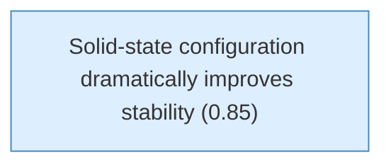

<a id="solid_state_dramatically_improved_stability"></a>

#### Solid-state configuration dramatically improves stability

📌 `solid_state_dramatically_improved_stability`   |   Belief: **0.85**

> The use of a solid hole conductor (spiro-MeOTAD) dramatically improved device stability compared to CH3NH3PbI3-sensitized liquid junction cells. The PCE remained stable during 500+ hours of testing without encapsulation.


## s3_results

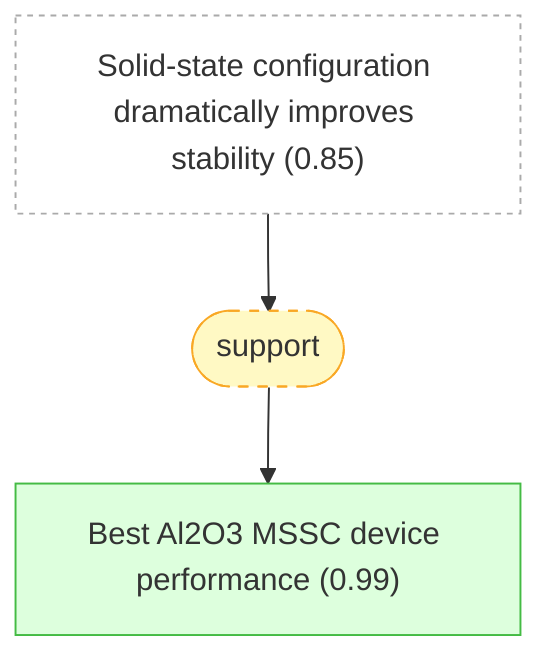

<a id="al2o3_best_device"></a>

#### Best Al2O3 MSSC device performance

📌 `al2o3_best_device`   |   Belief: **0.99**

> The most efficient Al2O3-based device exhibited short-circuit photocurrent (Jsc) = 17.8 mA cm^-2, open-circuit voltage (Voc) = 0.98 V, fill factor of 0.63, yielding overall power conversion efficiency (eta) = 10.9% under simulated AM1.5 full solar illumination [@Lee2012].

🔗 **support**([Solid-state configuration dramatically improves stability](#solid_state_dramatically_improved_stability))

<details><summary>Reasoning</summary>

The solid-state replacement of liquid electrolyte makes Lee 2012's meso-superstructured high-efficiency device more plausible as a general architecture, not an isolated result.

</details>


## motivation


<a id="sequential_deposition_introduced"></a>

#### Sequential deposition method introduced

📌 `sequential_deposition_introduced`   |   Belief: **0.99**

> A sequential deposition method is introduced for the formation of the perovskite pigment within the porous metal oxide film: PbI2 is first introduced from solution into a nanoporous titanium dioxide film and subsequently transformed into the perovskite by exposing it to a solution of CH3NH3I [@Burschka2013].

🔗 **support**([Scalable deposition can preserve device quality](#law_scalable_deposition_can_preserve_device_quality))

<details><summary>Reasoning</summary>

The law predicts sequential deposition as a scalable film-control route.

</details>


<a id="reproducibility_improvement"></a>

#### Sequential method improves reproducibility

📌 `reproducibility_improvement`   |   Belief: **0.90**

> The sequential deposition method greatly increases the reproducibility of photovoltaic performance compared to single-step deposition [@Burschka2013].


## s2_methods


<a id="full_surface_coverage"></a>

#### Full surface coverage achieved with solvent engineering

📌 `full_surface_coverage`   |   Belief: **0.94**

> The perovskite materials fully infiltrate the pores of the mp-TiO2 film and are deposited in a very uniform thick film with 100% surface coverage atop the mp-TiO2, compared with the conventional method [@Jeon2014].

🔗 **support**([Sequential deposition method introduced](#sequential_deposition_introduced), [Sequential method improves reproducibility](#reproducibility_improvement))

<details><summary>Reasoning</summary>

The 2013 sequential-deposition package establishes conversion and reproducibility control that supports the 2014 full-coverage bilayer film result.

</details>


## motivation (continued)

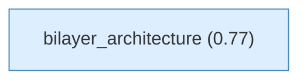

<a id="bilayer_architecture"></a>

#### bilayer_architecture

📌 `bilayer_architecture`   |   Belief: **0.77**

> A bilayer architecture comprising key features of both mesoscopic and planar structures was fabricated by a fully solution-based solvent-engineering process [@Jeon2014].


## s3_results (continued)

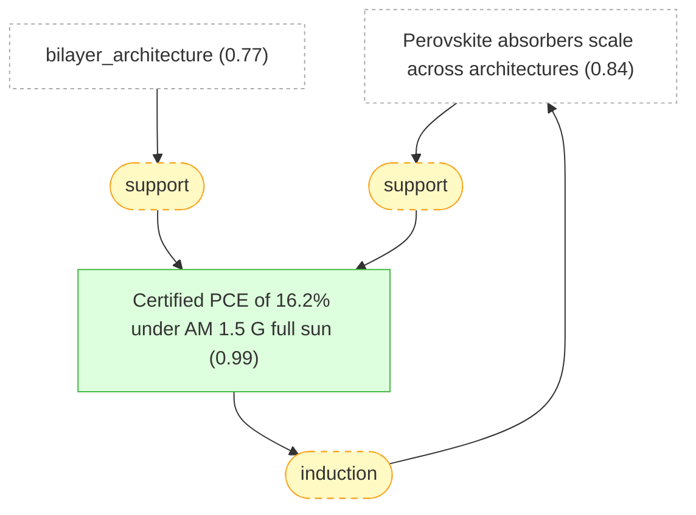

<a id="certified_efficiency_162"></a>

#### Certified PCE of 16.2% under AM 1.5 G full sun

📌 `certified_efficiency_162`   |   Belief: **0.99**

> A device fabricated by solvent engineering was certified by a standardized method in a photovoltaics calibration laboratory, confirming a PCE of 16.2% under AM 1.5 G full sun conditions [@Jeon2014].

🔗 **support**([Perovskite absorbers scale across architectures](#law_perovskite_absorbers_scale_across_architectures))

<details><summary>Reasoning</summary>

The law predicts high certified efficiency after bilayer interface control.

</details>


## s4_discussion (continued)


<a id="phase_stabilization_evidence"></a>

#### Evidence for perovskite phase stabilization

📌 `phase_stabilization_evidence`   |   Belief: **0.96**

> The perovskite phase stabilization caused by MAPbBr3 introduction was confirmed by: (1) XRD showing pure perovskite phase at room temperature for x=0.15, (2) DSC showing no endothermic peak (no phase transition) for x=0.15 powder, (3) black powder color at room temperature for x=0.15 (all other compositions remain yellow), and (4) smooth morphology with well-developed crystallites at x=0.15 vs rough surface at x=0 [@Jeon2015].

🔗 **support**([Stability needs phase and interface control](#law_stability_needs_phase_and_interface_control))

<details><summary>Reasoning</summary>

The law predicts mixed-cation phase stabilization.

</details>


## s3_results (continued)

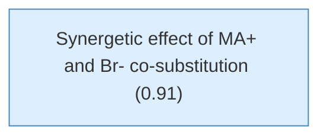

<a id="synergetic_effect"></a>

#### Synergetic effect of MA+ and Br- co-substitution

📌 `synergetic_effect`   |   Belief: **0.91**

> A simultaneous introduction of 15 mol% of both MA+ cations and Br- anions in FAPbI3 to obtain (FAPbI3)0.85(MAPbBr3)0.15 leads to a synergetic effect that stabilizes the perovskite phase at 100 degrees Celsius. This combination is sufficient to form a FAPbI3 perovskite phase even at 5 mol% addition, although single MA+ or Br- substitution can only partially form the perovskite phase [@Jeon2015].


## motivation (continued)

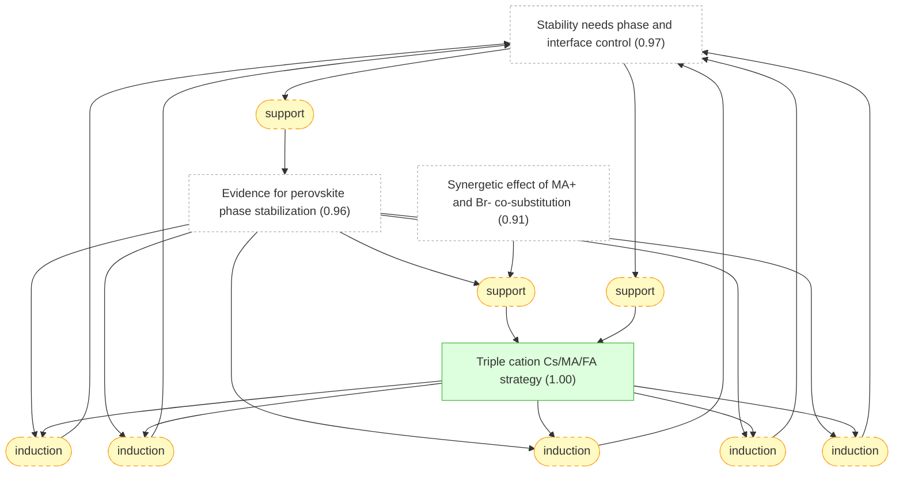

<a id="triple_cation_strategy"></a>

#### Triple cation Cs/MA/FA strategy

📌 `triple_cation_strategy`   |   Belief: **1.00**

> The triple Cs/MA/FA cation mixture uses Cs to improve MA/FA perovskite compounds further, where a small amount of Cs is sufficient to effectively suppress yellow phase impurities, permitting more pure, defect-free perovskite films [@Saliba2016].

🔗 **support**([Stability needs phase and interface control](#law_stability_needs_phase_and_interface_control))

<details><summary>Reasoning</summary>

The law predicts triple-cation stabilization as a bulk-composition route.

</details>


## s2_methods (continued)


<a id="best_stabilized_pce"></a>

#### Best device achieves 21.1% stabilized PCE

📌 `best_stabilized_pce`   |   Belief: **0.94**

> The highest stabilized PCE exceeds 21%, with maximum power point tracking reaching 21.1% at 960 mV, in good agreement with JV scans. Fill factors reach up to approximately 0.8, values rarely reached for highest performances [@Saliba2016].


<a id="two_d_three_d_composite_preparation"></a>

#### 2D/3D composite preparation method

📌 `two_d_three_d_composite_preparation`   |   Belief: **0.99**

> 2D/3D composites were engineered by mixing (AVAI:PbI2) and (CH3NH3I:PbI2) precursors at different molar ratios (0-3-5-10-20-50%), infiltrated into mesoporous oxide scaffold by single-step deposition followed by slow drying, allowing reorganization before solidification [@Grancini2017].

🔗 **support**([Best device achieves 21.1% stabilized PCE](#best_stabilized_pce), [Triple cation Cs/MA/FA strategy](#triple_cation_strategy))

<details><summary>Reasoning</summary>

The triple-cation result supports the feasibility of combining phase-stable bulk composition with 2D/3D interface engineering.

</details>


## s4_discussion (continued)


<a id="one_year_stability_record"></a>

#### Record stability enables commercialization pathway

📌 `one_year_stability_record`   |   Belief: **0.99**

> The >10,000h stability at controlled standard conditions (55°C, 1 sun, ambient atmosphere) represents the highest record value for perovskite photovoltaics, surpassing previous results with a significant step improvement. This enables timely commercialization pathway [@Grancini2017].

🔗 **support**([Stability needs phase and interface control](#law_stability_needs_phase_and_interface_control))

<details><summary>Reasoning</summary>

The law predicts one-year stability when 2D/3D interfaces protect the device.

</details>


## s3_results (continued)

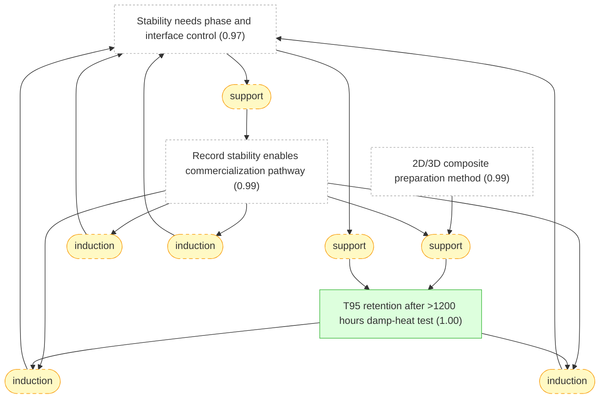

<a id="t95_after_1200_hours"></a>

#### T95 retention after >1200 hours damp-heat test

📌 `t95_after_1200_hours`   |   Belief: **1.00**

> The 2D-RT-based device retained more than 95% of initial PCE (T95) after more than 1200 hours for champion stability cells under damp-heat test conditions. After the damp-heat test, three devices showed an average PCE of 19.3 +/- 0.69% [@Azmi2022].

🔗 **support**([Stability needs phase and interface control](#law_stability_needs_phase_and_interface_control))

<details><summary>Reasoning</summary>

The law predicts high damp-heat retention when dimensional passivation blocks degradation.

</details>


## s4_discussion (continued)

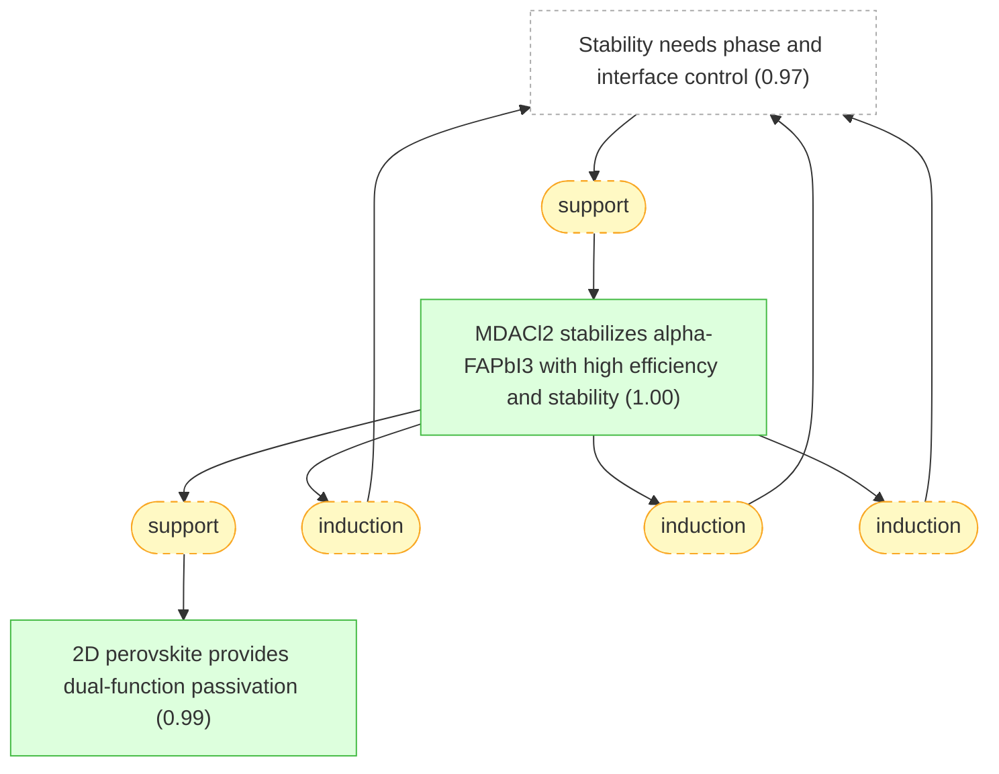

<a id="conclusion_alpha_stabilization"></a>

#### MDACl2 stabilizes alpha-FAPbI3 with high efficiency and stability

📌 `conclusion_alpha_stabilization`   |   Belief: **1.00**

> MDACl2 doping at 3.8 mol% effectively stabilizes the alpha-phase of FAPbI3 without MA, Cs, or Br, preserving the inherent narrow bandgap of pristine FAPbI3 (1.49 eV vs 1.53 eV for MAPbBr3 control). The stabilization mechanisms include H-bonding, tolerance factor optimization, entropic stabilization, and interstitial Cl- lattice strain relief. This enables the highest reported performance for mp-TiO2-based PSCs: certified PCE of 23.73% and record JSC of 26.70 mA/cm2, along with exceptional operational stability (90% PCE retention after 600 hours MPP tracking under full sunlight) [@Min2019].

🔗 **support**([Stability needs phase and interface control](#law_stability_needs_phase_and_interface_control))

<details><summary>Reasoning</summary>

The law predicts alpha-phase stabilization by local chemical stabilization.

</details>


<a id="dual_function_passivation"></a>

#### 2D perovskite provides dual-function passivation

📌 `dual_function_passivation`   |   Belief: **0.99**

> The 2D perovskite passivation serves dual functions: (1) as ion migration-blocking moisture/oxygen ingress barriers, and (2) as defect passivation layers, particularly at elevated operating temperatures. This simultaneous protection mechanism enables the excellent damp-heat stability observed in the 2D-RT devices [@Azmi2022].

🔗 **support**([MDACl2 stabilizes alpha-FAPbI3 with high efficiency and stability](#conclusion_alpha_stabilization))

<details><summary>Reasoning</summary>

MDA-based alpha-phase stabilization supports the broader idea that local chemical stabilization can be paired with interface protection.

</details>


## s3_results (continued)

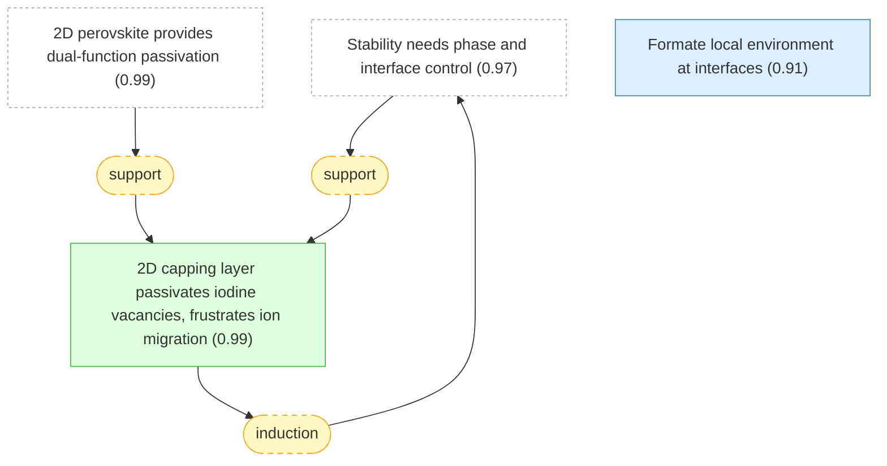

<a id="passivation_frustrates_ion_migration"></a>

#### 2D capping layer passivates iodine vacancies, frustrates ion migration

📌 `passivation_frustrates_ion_migration`   |   Belief: **0.99**

> Suppressed ion migration in capped devices likely stems from passivation of iodine vacancies at the surface of the perovskite active layer by the 2D capping layer.

🔗 **support**([Stability needs phase and interface control](#law_stability_needs_phase_and_interface_control))

<details><summary>Reasoning</summary>

The law predicts improved stability when capping suppresses ion migration.

</details>


<a id="formate_at_interfaces"></a>

#### Formate local environment at interfaces

📌 `formate_at_interfaces`   |   Belief: **0.91**

> The broadening of the HCOO- 13C signal in Fo-FAPbI3 (as opposed to the well-defined environment in crystalline FAHCOO) is consistent with formate interacting with undercoordinated Pb2+ to passivate iodide vacancies at surfaces or grain boundaries [@Jeong2021].


## s5_performance


<a id="non_radiative_recombination_reduction"></a>

#### Formate treatment reduces non-radiative recombination 5x

📌 `non_radiative_recombination_reduction`   |   Belief: **0.99**

> The fivefold increase in EQE_EL (from 2.2% to 10.1%) with formate treatment indicates a corresponding fivefold reduction in non-radiative recombination rate, directly validating the defect passivation mechanism identified by NMR and MD simulations [@Jeong2021].

🔗 **support**([Interface passivation reduces non-radiative loss](#law_interface_passivation_reduces_nonradiative_loss))

<details><summary>Reasoning</summary>

The law predicts the formate reduction of non-radiative recombination.

</details>


## motivation (continued)

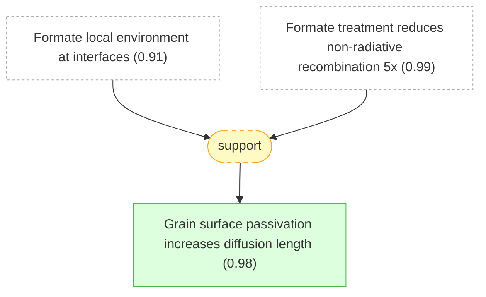

<a id="grain_surface_passivation_route"></a>

#### Grain surface passivation increases diffusion length

📌 `grain_surface_passivation_route`   |   Belief: **0.98**

> Grain surface passivation is a promising route to increase the carrier diffusion length of perovskite films, given that grain surfaces exhibit trap density one to several orders of magnitude higher than within the grain.

🔗 **support**([Formate local environment at interfaces](#formate_at_interfaces), [Formate treatment reduces non-radiative recombination 5x](#non_radiative_recombination_reduction))

<details><summary>Reasoning</summary>

Formate interface passivation supplies a chemical precedent for the wide-bandgap grain-surface passivation route.

</details>


## s4_characterization

```mermaid
graph TD
    law_interface_passivation_reduces_nonradiative_loss["Interface passivation reduces non-radiative loss (0.88)"]:::external
    grain_surface_passivation_route["Grain surface passivation increases diffusion length (0.98)"]:::external
    diffusion_length_increased_threefold["Diffusion length increased threefold with CF3-PA (1.00)"]:::derived
    strat_9(["support"]):::weak
    grain_surface_passivation_route --> strat_9
    strat_9 --> diffusion_length_increased_threefold
    strat_73(["support"]):::weak
    law_interface_passivation_reduces_nonradiative_loss --> strat_73
    strat_73 --> diffusion_length_increased_threefold
    strat_77(["induction"]):::weak
    diffusion_length_increased_threefold --> strat_77
    strat_77 --> law_interface_passivation_reduces_nonradiative_loss
    strat_78(["induction"]):::weak
    diffusion_length_increased_threefold --> strat_78
    strat_78 --> law_interface_passivation_reduces_nonradiative_loss
    strat_79(["induction"]):::weak
    diffusion_length_increased_threefold --> strat_79
    strat_79 --> law_interface_passivation_reduces_nonradiative_loss

    classDef setting fill:#f0f0f0,stroke:#999,color:#333
    classDef premise fill:#ddeeff,stroke:#4488bb,color:#333
    classDef derived fill:#ddffdd,stroke:#44bb44,color:#333
    classDef question fill:#fff3dd,stroke:#cc9944,color:#333
    classDef background fill:#f5f5f5,stroke:#bbb,stroke-dasharray: 5 5,color:#333
    classDef orphan fill:#fff,stroke:#ccc,stroke-dasharray: 5 5,color:#333
    classDef external fill:#fff,stroke:#aaa,stroke-dasharray: 3 3,color:#333
    classDef weak fill:#fff9c4,stroke:#f9a825,stroke-dasharray: 5 5,color:#333
    classDef contra fill:#ffebee,stroke:#c62828,color:#333
```

<a id="diffusion_length_increased_threefold"></a>

#### Diffusion length increased threefold with CF3-PA

📌 `diffusion_length_increased_threefold`   |   Belief: **1.00**

> The diffusion length (Ld) of CF3-PA passivated films was increased threefold compared to control films (5.4 micrometers versus 1.8 micrometers), due to longer carrier lifetimes despite similar mobilities.

🔗 **support**([Interface passivation reduces non-radiative loss](#law_interface_passivation_reduces_nonradiative_loss))

<details><summary>Reasoning</summary>

The law predicts longer diffusion length after recombination-active defects are suppressed.

</details>


## s3_results (continued)

```mermaid
graph TD
    law_band_alignment_controls_charge_selectivity["Band alignment controls charge selectivity (0.95)"]:::external
    cb_upshift_2d_3d["DFT predicts 0.14 eV CB upshift at interface (0.99)"]:::derived
    strat_93(["support"]):::weak
    law_band_alignment_controls_charge_selectivity --> strat_93
    strat_93 --> cb_upshift_2d_3d
    strat_97(["induction"]):::weak
    cb_upshift_2d_3d --> strat_97
    strat_97 --> law_band_alignment_controls_charge_selectivity
    strat_98(["induction"]):::weak
    cb_upshift_2d_3d --> strat_98
    strat_98 --> law_band_alignment_controls_charge_selectivity
    strat_99(["induction"]):::weak
    cb_upshift_2d_3d --> strat_99
    strat_99 --> law_band_alignment_controls_charge_selectivity

    classDef setting fill:#f0f0f0,stroke:#999,color:#333
    classDef premise fill:#ddeeff,stroke:#4488bb,color:#333
    classDef derived fill:#ddffdd,stroke:#44bb44,color:#333
    classDef question fill:#fff3dd,stroke:#cc9944,color:#333
    classDef background fill:#f5f5f5,stroke:#bbb,stroke-dasharray: 5 5,color:#333
    classDef orphan fill:#fff,stroke:#ccc,stroke-dasharray: 5 5,color:#333
    classDef external fill:#fff,stroke:#aaa,stroke-dasharray: 3 3,color:#333
    classDef weak fill:#fff9c4,stroke:#f9a825,stroke-dasharray: 5 5,color:#333
    classDef contra fill:#ffebee,stroke:#c62828,color:#333
```

<a id="cb_upshift_2d_3d"></a>

#### DFT predicts 0.14 eV CB upshift at interface

📌 `cb_upshift_2d_3d`   |   Belief: **0.99**

> DFT calculations show 0.14 eV conduction band (CB) upshift at 2D/3D interface compared to 3D bulk, inducing 0.09 eV larger interface gap than 3D bulk. This matches experimental PL blue shift of 0.13 eV when probing from oxide side. Only small ~0.02 eV shift of opposite sign found at MAPbI3/TiO2 interface [@Grancini2017].

🔗 **support**([Band alignment controls charge selectivity](#law_band_alignment_controls_charge_selectivity))

<details><summary>Reasoning</summary>

The law predicts band-edge shifts induced by 2D/3D grading.

</details>


## s2_methods (continued)

```mermaid
graph TD
    law_band_alignment_controls_charge_selectivity["Band alignment controls charge selectivity (0.95)"]:::external
    cb_upshift_2d_3d["DFT predicts 0.14 eV CB upshift at interface (0.99)"]:::external
    type_ii_energy_alignment["type_ii_energy_alignment (0.99)"]:::derived
    strat_10(["support"]):::weak
    cb_upshift_2d_3d --> strat_10
    strat_10 --> type_ii_energy_alignment
    strat_93(["support"]):::weak
    law_band_alignment_controls_charge_selectivity --> strat_93
    strat_93 --> cb_upshift_2d_3d
    strat_95(["support"]):::weak
    law_band_alignment_controls_charge_selectivity --> strat_95
    strat_95 --> type_ii_energy_alignment
    strat_97(["induction"]):::weak
    cb_upshift_2d_3d --> strat_97
    strat_97 --> law_band_alignment_controls_charge_selectivity
    strat_98(["induction"]):::weak
    cb_upshift_2d_3d --> strat_98
    strat_98 --> law_band_alignment_controls_charge_selectivity
    strat_99(["induction"]):::weak
    cb_upshift_2d_3d --> strat_99
    type_ii_energy_alignment --> strat_99
    strat_99 --> law_band_alignment_controls_charge_selectivity

    classDef setting fill:#f0f0f0,stroke:#999,color:#333
    classDef premise fill:#ddeeff,stroke:#4488bb,color:#333
    classDef derived fill:#ddffdd,stroke:#44bb44,color:#333
    classDef question fill:#fff3dd,stroke:#cc9944,color:#333
    classDef background fill:#f5f5f5,stroke:#bbb,stroke-dasharray: 5 5,color:#333
    classDef orphan fill:#fff,stroke:#ccc,stroke-dasharray: 5 5,color:#333
    classDef external fill:#fff,stroke:#aaa,stroke-dasharray: 3 3,color:#333
    classDef weak fill:#fff9c4,stroke:#f9a825,stroke-dasharray: 5 5,color:#333
    classDef contra fill:#ffebee,stroke:#c62828,color:#333
```

<a id="type_ii_energy_alignment"></a>

#### type_ii_energy_alignment

📌 `type_ii_energy_alignment`   |   Belief: **0.99**

> A type-II energy-level alignment forms between the dipolar-passivation-treated Pb-Sn perovskites and PEDOT:PSS, creating an electric field directed from the perovskite surface towards PEDOT:PSS, effectively driving carriers away from the defective interface layer (DIL) and facilitating holes drifting into PEDOT:PSS while repelling electrons from the HTL/Pb-Sn perovskite interface [@Lin2025].

🔗 **support**([Band alignment controls charge selectivity](#law_band_alignment_controls_charge_selectivity))

<details><summary>Reasoning</summary>

The law predicts dipole-induced type-II energy alignment at buried interfaces.

</details>


## motivation (continued)

```mermaid
graph TD
    law_band_alignment_controls_charge_selectivity["Band alignment controls charge selectivity (0.95)"]:::external
    type_two_band_alignment["Type II band alignment at PHJ (1.00)"]:::derived
    phj_solution["3D/3D bilayer PHJ solves the trade-off (1.00)"]:::premise
    bilateral_passivation_strategy["Bilayer interface passivation strategy (0.99)"]:::derived
    strat_11(["support"]):::weak
    type_two_band_alignment --> strat_11
    phj_solution --> strat_11
    strat_11 --> bilateral_passivation_strategy
    strat_94(["support"]):::weak
    law_band_alignment_controls_charge_selectivity --> strat_94
    strat_94 --> type_two_band_alignment
    strat_98(["induction"]):::weak
    type_two_band_alignment --> strat_98
    strat_98 --> law_band_alignment_controls_charge_selectivity
    strat_99(["induction"]):::weak
    type_two_band_alignment --> strat_99
    strat_99 --> law_band_alignment_controls_charge_selectivity

    classDef setting fill:#f0f0f0,stroke:#999,color:#333
    classDef premise fill:#ddeeff,stroke:#4488bb,color:#333
    classDef derived fill:#ddffdd,stroke:#44bb44,color:#333
    classDef question fill:#fff3dd,stroke:#cc9944,color:#333
    classDef background fill:#f5f5f5,stroke:#bbb,stroke-dasharray: 5 5,color:#333
    classDef orphan fill:#fff,stroke:#ccc,stroke-dasharray: 5 5,color:#333
    classDef external fill:#fff,stroke:#aaa,stroke-dasharray: 3 3,color:#333
    classDef weak fill:#fff9c4,stroke:#f9a825,stroke-dasharray: 5 5,color:#333
    classDef contra fill:#ffebee,stroke:#c62828,color:#333
```

<a id="type_two_band_alignment"></a>

#### Type II band alignment at PHJ

📌 `type_two_band_alignment`   |   Belief: **1.00**

> The 3D/3D bilayer PHJ exhibits type II band alignment between Pb-Sn and FL-WBG perovskites, which reduces hole concentration in the defective interface layer (DIL) and facilitates electron extraction into the C60 layer.

🔗 **support**([Band alignment controls charge selectivity](#law_band_alignment_controls_charge_selectivity))

<details><summary>Reasoning</summary>

The law predicts type-II alignment in 3D/3D bilayer heterojunctions.

</details>


<a id="phj_solution"></a>

#### 3D/3D bilayer PHJ solves the trade-off

📌 `phj_solution`   |   Belief: **1.00**

> A 3D/3D bilayer perovskite heterojunction (PHJ) with type II band structure at the Pb-Sn perovskite-ETL interface can suppress interfacial non-radiative recombination and facilitate charge extraction, while avoiding the transport losses associated with 2D interlayers.


<a id="bilateral_passivation_strategy"></a>

#### Bilayer interface passivation strategy

📌 `bilateral_passivation_strategy`   |   Belief: **0.99**

> A bilayer interface passivation strategy was developed that involves the incorporation of a thin lithium fluoride (LiF) layer followed by the deposition of a short-chain ethylenediammonium diiodide (EDAI) molecule. LiF acts as a contact displacer and induces field passivation, while EDAI chemically passivates unpassivated areas that are not contacted by the LiF layer, forming nanoscale localized contacts at the perovskite/C60 interface.

🔗 **support**([Type II band alignment at PHJ](#type_two_band_alignment), [3D/3D bilayer PHJ solves the trade-off](#phj_solution))

<details><summary>Reasoning</summary>

The 3D/3D bilayer heterojunction supplies a band-alignment precedent for the bilateral passivation strategy used in perovskite/silicon tandems.

</details>


## s5_tandem_results

```mermaid
graph TD
    law_tandems_raise_perovskite_efficiency_ceiling["Tandems raise the perovskite efficiency ceiling (0.95)"]:::external
    certified_pce_264_percent["Certified PCE of 26.4% by JET (0.99)"]:::derived
    strat_100(["support"]):::weak
    law_tandems_raise_perovskite_efficiency_ceiling --> strat_100
    strat_100 --> certified_pce_264_percent
    strat_105(["induction"]):::weak
    certified_pce_264_percent --> strat_105
    strat_105 --> law_tandems_raise_perovskite_efficiency_ceiling
    strat_106(["induction"]):::weak
    certified_pce_264_percent --> strat_106
    strat_106 --> law_tandems_raise_perovskite_efficiency_ceiling
    strat_107(["induction"]):::weak
    certified_pce_264_percent --> strat_107
    strat_107 --> law_tandems_raise_perovskite_efficiency_ceiling
    strat_108(["induction"]):::weak
    certified_pce_264_percent --> strat_108
    strat_108 --> law_tandems_raise_perovskite_efficiency_ceiling

    classDef setting fill:#f0f0f0,stroke:#999,color:#333
    classDef premise fill:#ddeeff,stroke:#4488bb,color:#333
    classDef derived fill:#ddffdd,stroke:#44bb44,color:#333
    classDef question fill:#fff3dd,stroke:#cc9944,color:#333
    classDef background fill:#f5f5f5,stroke:#bbb,stroke-dasharray: 5 5,color:#333
    classDef orphan fill:#fff,stroke:#ccc,stroke-dasharray: 5 5,color:#333
    classDef external fill:#fff,stroke:#aaa,stroke-dasharray: 3 3,color:#333
    classDef weak fill:#fff9c4,stroke:#f9a825,stroke-dasharray: 5 5,color:#333
    classDef contra fill:#ffebee,stroke:#c62828,color:#333
```

<a id="certified_pce_264_percent"></a>

#### Certified PCE of 26.4% by JET

📌 `certified_pce_264_percent`   |   Belief: **0.99**

> Independent certification by Japan Electrical Safety and Environment Technology Laboratories (JET) delivered certified stabilized PCEs of 26.4% and 26.1%, included in Solar Cell Efficiency Tables (version 58), exceeding other thin-film solar cells and comparable to best single-crystalline silicon solar cells.

🔗 **support**([Tandems raise the perovskite efficiency ceiling](#law_tandems_raise_perovskite_efficiency_ceiling))

<details><summary>Reasoning</summary>

The law predicts the certified all-perovskite tandem result.

</details>


## s3_results (continued)

```mermaid
graph TD
    law_tandems_raise_perovskite_efficiency_ceiling["Tandems raise the perovskite efficiency ceiling (0.95)"]:::external
    certified_pce_264_percent["Certified PCE of 26.4% by JET (0.99)"]:::external
    tandem_champion["Champion tandem device achieves 28.5% PCE (1.00)"]:::derived
    strat_12(["support"]):::weak
    certified_pce_264_percent --> strat_12
    strat_12 --> tandem_champion
    strat_100(["support"]):::weak
    law_tandems_raise_perovskite_efficiency_ceiling --> strat_100
    strat_100 --> certified_pce_264_percent
    strat_101(["support"]):::weak
    law_tandems_raise_perovskite_efficiency_ceiling --> strat_101
    strat_101 --> tandem_champion
    strat_105(["induction"]):::weak
    certified_pce_264_percent --> strat_105
    tandem_champion --> strat_105
    strat_105 --> law_tandems_raise_perovskite_efficiency_ceiling
    strat_106(["induction"]):::weak
    certified_pce_264_percent --> strat_106
    tandem_champion --> strat_106
    strat_106 --> law_tandems_raise_perovskite_efficiency_ceiling
    strat_107(["induction"]):::weak
    certified_pce_264_percent --> strat_107
    tandem_champion --> strat_107
    strat_107 --> law_tandems_raise_perovskite_efficiency_ceiling
    strat_108(["induction"]):::weak
    certified_pce_264_percent --> strat_108
    tandem_champion --> strat_108
    strat_108 --> law_tandems_raise_perovskite_efficiency_ceiling

    classDef setting fill:#f0f0f0,stroke:#999,color:#333
    classDef premise fill:#ddeeff,stroke:#4488bb,color:#333
    classDef derived fill:#ddffdd,stroke:#44bb44,color:#333
    classDef question fill:#fff3dd,stroke:#cc9944,color:#333
    classDef background fill:#f5f5f5,stroke:#bbb,stroke-dasharray: 5 5,color:#333
    classDef orphan fill:#fff,stroke:#ccc,stroke-dasharray: 5 5,color:#333
    classDef external fill:#fff,stroke:#aaa,stroke-dasharray: 3 3,color:#333
    classDef weak fill:#fff9c4,stroke:#f9a825,stroke-dasharray: 5 5,color:#333
    classDef contra fill:#ffebee,stroke:#c62828,color:#333
```

<a id="tandem_champion"></a>

#### Champion tandem device achieves 28.5% PCE

📌 `tandem_champion`   |   Belief: **1.00**

> The champion tandem device achieved PCE of 28.5% (reverse scan) with Voc of 2.112 V, Jsc of 16.5 mA cm^-2, and FF of 81.9%, with stabilized PCE of 28.4%.

🔗 **support**([Tandems raise the perovskite efficiency ceiling](#law_tandems_raise_perovskite_efficiency_ceiling))

<details><summary>Reasoning</summary>

The law predicts the 3D/3D tandem champion result.

</details>


## s4_discussion (continued)

```mermaid
graph TD
    type_two_band_alignment["Type II band alignment at PHJ (1.00)"]:::external
    first_to_exceed_sq_limit["First certified tandem exceeding Shockley-Queisser limit (0.95)"]:::derived
    strat_13(["support"]):::weak
    type_two_band_alignment --> strat_13
    strat_13 --> first_to_exceed_sq_limit

    classDef setting fill:#f0f0f0,stroke:#999,color:#333
    classDef premise fill:#ddeeff,stroke:#4488bb,color:#333
    classDef derived fill:#ddffdd,stroke:#44bb44,color:#333
    classDef question fill:#fff3dd,stroke:#cc9944,color:#333
    classDef background fill:#f5f5f5,stroke:#bbb,stroke-dasharray: 5 5,color:#333
    classDef orphan fill:#fff,stroke:#ccc,stroke-dasharray: 5 5,color:#333
    classDef external fill:#fff,stroke:#aaa,stroke-dasharray: 3 3,color:#333
    classDef weak fill:#fff9c4,stroke:#f9a825,stroke-dasharray: 5 5,color:#333
    classDef contra fill:#ffebee,stroke:#c62828,color:#333
```

<a id="first_to_exceed_sq_limit"></a>

#### First certified tandem exceeding Shockley-Queisser limit

📌 `first_to_exceed_sq_limit`   |   Belief: **0.95**

> The certified stabilized PCE of 33.89% represents the first reported certified efficiency of a two-junction tandem solar cell exceeding the single-junction Shockley-Queisser limit of 33.7%, marking a significant milestone in photovoltaic efficiency.

🔗 **support**([Type II band alignment at PHJ](#type_two_band_alignment))

<details><summary>Reasoning</summary>

The type-II 3D/3D alignment result supports the 2024 claim that bilayer interface design can help perovskite/silicon tandems exceed the single-junction limit.

</details>


## s3_results (continued)

```mermaid
graph TD
    law_tandems_raise_perovskite_efficiency_ceiling["Tandems raise the perovskite efficiency ceiling (0.95)"]:::external
    nrel_certified_pce["NREL certified 33.89% PCE (1.00)"]:::derived
    strat_102(["support"]):::weak
    law_tandems_raise_perovskite_efficiency_ceiling --> strat_102
    strat_102 --> nrel_certified_pce
    strat_106(["induction"]):::weak
    nrel_certified_pce --> strat_106
    strat_106 --> law_tandems_raise_perovskite_efficiency_ceiling
    strat_107(["induction"]):::weak
    nrel_certified_pce --> strat_107
    strat_107 --> law_tandems_raise_perovskite_efficiency_ceiling
    strat_108(["induction"]):::weak
    nrel_certified_pce --> strat_108
    strat_108 --> law_tandems_raise_perovskite_efficiency_ceiling

    classDef setting fill:#f0f0f0,stroke:#999,color:#333
    classDef premise fill:#ddeeff,stroke:#4488bb,color:#333
    classDef derived fill:#ddffdd,stroke:#44bb44,color:#333
    classDef question fill:#fff3dd,stroke:#cc9944,color:#333
    classDef background fill:#f5f5f5,stroke:#bbb,stroke-dasharray: 5 5,color:#333
    classDef orphan fill:#fff,stroke:#ccc,stroke-dasharray: 5 5,color:#333
    classDef external fill:#fff,stroke:#aaa,stroke-dasharray: 3 3,color:#333
    classDef weak fill:#fff9c4,stroke:#f9a825,stroke-dasharray: 5 5,color:#333
    classDef contra fill:#ffebee,stroke:#c62828,color:#333
```

<a id="nrel_certified_pce"></a>

#### NREL certified 33.89% PCE

📌 `nrel_certified_pce`   |   Belief: **1.00**

> NREL certified the device delivering stabilized PCE of 33.89% verified against in-house measurements, representing the first double-junction tandem surpassing single-junction Shockley-Queisser limit of 33.7%.

🔗 **support**([Tandems raise the perovskite efficiency ceiling](#law_tandems_raise_perovskite_efficiency_ceiling))

<details><summary>Reasoning</summary>

The law predicts the 2024 certified perovskite/silicon tandem record.

</details>


## s4_photovoltaic_performance

```mermaid
graph TD
    law_tandems_raise_perovskite_efficiency_ceiling["Tandems raise the perovskite efficiency ceiling (0.95)"]:::external
    nrel_certified_pce["NREL certified 33.89% PCE (1.00)"]:::external
    certified_pce_34_58["Certified PCE 34.58% by ESTI (1.00)"]:::derived
    strat_14(["support"]):::weak
    nrel_certified_pce --> strat_14
    strat_14 --> certified_pce_34_58
    strat_102(["support"]):::weak
    law_tandems_raise_perovskite_efficiency_ceiling --> strat_102
    strat_102 --> nrel_certified_pce
    strat_103(["support"]):::weak
    law_tandems_raise_perovskite_efficiency_ceiling --> strat_103
    strat_103 --> certified_pce_34_58
    strat_106(["induction"]):::weak
    nrel_certified_pce --> strat_106
    strat_106 --> law_tandems_raise_perovskite_efficiency_ceiling
    strat_107(["induction"]):::weak
    nrel_certified_pce --> strat_107
    certified_pce_34_58 --> strat_107
    strat_107 --> law_tandems_raise_perovskite_efficiency_ceiling
    strat_108(["induction"]):::weak
    nrel_certified_pce --> strat_108
    certified_pce_34_58 --> strat_108
    strat_108 --> law_tandems_raise_perovskite_efficiency_ceiling

    classDef setting fill:#f0f0f0,stroke:#999,color:#333
    classDef premise fill:#ddeeff,stroke:#4488bb,color:#333
    classDef derived fill:#ddffdd,stroke:#44bb44,color:#333
    classDef question fill:#fff3dd,stroke:#cc9944,color:#333
    classDef background fill:#f5f5f5,stroke:#bbb,stroke-dasharray: 5 5,color:#333
    classDef orphan fill:#fff,stroke:#ccc,stroke-dasharray: 5 5,color:#333
    classDef external fill:#fff,stroke:#aaa,stroke-dasharray: 3 3,color:#333
    classDef weak fill:#fff9c4,stroke:#f9a825,stroke-dasharray: 5 5,color:#333
    classDef contra fill:#ffebee,stroke:#c62828,color:#333
```

<a id="certified_pce_34_58"></a>

#### Certified PCE 34.58% by ESTI

📌 `certified_pce_34_58`   |   Belief: **1.00**

> One optimized HTL201-based TSC was sent to the European Solar Test Installation for certification, demonstrating a certified PCE of 34.58%.

🔗 **support**([Tandems raise the perovskite efficiency ceiling](#law_tandems_raise_perovskite_efficiency_ceiling))

<details><summary>Reasoning</summary>

The law predicts the 2025 HTL201 certified tandem record.

</details>


## s3_interface_interactions

```mermaid
graph TD
    htl201_strong_binding_perovskite["HTL201 has strongest binding to perovskite (0.84)"]:::premise
    htl201_passivates_pb_defects["HTL201 coordinates with Pb2+ to passivate defects (0.80)"]:::premise

    classDef setting fill:#f0f0f0,stroke:#999,color:#333
    classDef premise fill:#ddeeff,stroke:#4488bb,color:#333
    classDef derived fill:#ddffdd,stroke:#44bb44,color:#333
    classDef question fill:#fff3dd,stroke:#cc9944,color:#333
    classDef background fill:#f5f5f5,stroke:#bbb,stroke-dasharray: 5 5,color:#333
    classDef orphan fill:#fff,stroke:#ccc,stroke-dasharray: 5 5,color:#333
    classDef external fill:#fff,stroke:#aaa,stroke-dasharray: 3 3,color:#333
    classDef weak fill:#fff9c4,stroke:#f9a825,stroke-dasharray: 5 5,color:#333
    classDef contra fill:#ffebee,stroke:#c62828,color:#333
```

<a id="htl201_strong_binding_perovskite"></a>

#### HTL201 has strongest binding to perovskite

📌 `htl201_strong_binding_perovskite`   |   Belief: **0.84**

> HTL201 shows the highest binding energy with the perovskite film among the three SAMs, driven by an enhanced dipole moment (mu) induced by the asymmetric molecular structure design of HTL201 which promotes polar dipole interaction between the perovskite and the SAM.


<a id="htl201_passivates_pb_defects"></a>

#### HTL201 coordinates with Pb2+ to passivate defects

📌 `htl201_passivates_pb_defects`   |   Belief: **0.80**

> HTL201 shows a higher binding energy and a shorter distance (D[N-Pb]) between the N in the SAM and the Pb2+ defect in the perovskite film compared with Me-4PACz and MeO-4PACz. Therefore, the coordination interaction between HTL201 and the Pb2+ defect can passivate the defects at the SAM/perovskite surface.


## motivation (continued)

```mermaid
graph TD
    law_interface_passivation_reduces_nonradiative_loss["Interface passivation reduces non-radiative loss (0.88)"]:::external
    htl201_strong_binding_perovskite["HTL201 has strongest binding to perovskite (0.84)"]:::external
    htl201_passivates_pb_defects["HTL201 coordinates with Pb2+ to passivate defects (0.80)"]:::external
    dipolar_passivation_strategy["dipolar_passivation_strategy (0.85)"]:::derived
    diffusion_length_enhancement["diffusion_length_enhancement (0.90)"]:::premise
    strat_15(["support"]):::weak
    htl201_strong_binding_perovskite --> strat_15
    htl201_passivates_pb_defects --> strat_15
    strat_15 --> dipolar_passivation_strategy
    strat_75(["support"]):::weak
    law_interface_passivation_reduces_nonradiative_loss --> strat_75
    strat_75 --> dipolar_passivation_strategy
    strat_79(["induction"]):::weak
    dipolar_passivation_strategy --> strat_79
    strat_79 --> law_interface_passivation_reduces_nonradiative_loss

    classDef setting fill:#f0f0f0,stroke:#999,color:#333
    classDef premise fill:#ddeeff,stroke:#4488bb,color:#333
    classDef derived fill:#ddffdd,stroke:#44bb44,color:#333
    classDef question fill:#fff3dd,stroke:#cc9944,color:#333
    classDef background fill:#f5f5f5,stroke:#bbb,stroke-dasharray: 5 5,color:#333
    classDef orphan fill:#fff,stroke:#ccc,stroke-dasharray: 5 5,color:#333
    classDef external fill:#fff,stroke:#aaa,stroke-dasharray: 3 3,color:#333
    classDef weak fill:#fff9c4,stroke:#f9a825,stroke-dasharray: 5 5,color:#333
    classDef contra fill:#ffebee,stroke:#c62828,color:#333
```

<a id="dipolar_passivation_strategy"></a>

#### dipolar_passivation_strategy

📌 `dipolar_passivation_strategy`   |   Belief: **0.85**

> A dipolar-passivation strategy was developed using sulfanilic acid (SA) as the dipolar-passivation molecule, featuring an -NH3+ passivating group and a -SO3- dipole group, to minimize carrier recombination and improve hole transport at the HTL/Pb-Sn perovskite interface [@Lin2025].

🔗 **support**([Interface passivation reduces non-radiative loss](#law_interface_passivation_reduces_nonradiative_loss))

<details><summary>Reasoning</summary>

The law predicts buried-interface dipolar passivation as a recombination-control strategy.

</details>


<a id="diffusion_length_enhancement"></a>

#### diffusion_length_enhancement

📌 `diffusion_length_enhancement`   |   Belief: **0.90**

> Dipolar passivation extends the carrier diffusion length to 6.2 μm, compared with 4.8 μm for the control [@Lin2025].


## s4_discussion (continued)

```mermaid
graph TD
    law_tandems_raise_perovskite_efficiency_ceiling["Tandems raise the perovskite efficiency ceiling (0.95)"]:::external
    dipolar_passivation_strategy["dipolar_passivation_strategy (0.85)"]:::external
    diffusion_length_enhancement["diffusion_length_enhancement (0.90)"]:::external
    jet_certified_pce["jet_certified_pce (0.99)"]:::derived
    iecs_standard_met["IEC 61215:2016 damp-heat standard met (0.98)"]:::premise
    strat_16(["support"]):::weak
    dipolar_passivation_strategy --> strat_16
    diffusion_length_enhancement --> strat_16
    strat_16 --> jet_certified_pce
    strat_104(["support"]):::weak
    law_tandems_raise_perovskite_efficiency_ceiling --> strat_104
    strat_104 --> jet_certified_pce
    strat_108(["induction"]):::weak
    jet_certified_pce --> strat_108
    strat_108 --> law_tandems_raise_perovskite_efficiency_ceiling

    classDef setting fill:#f0f0f0,stroke:#999,color:#333
    classDef premise fill:#ddeeff,stroke:#4488bb,color:#333
    classDef derived fill:#ddffdd,stroke:#44bb44,color:#333
    classDef question fill:#fff3dd,stroke:#cc9944,color:#333
    classDef background fill:#f5f5f5,stroke:#bbb,stroke-dasharray: 5 5,color:#333
    classDef orphan fill:#fff,stroke:#ccc,stroke-dasharray: 5 5,color:#333
    classDef external fill:#fff,stroke:#aaa,stroke-dasharray: 3 3,color:#333
    classDef weak fill:#fff9c4,stroke:#f9a825,stroke-dasharray: 5 5,color:#333
    classDef contra fill:#ffebee,stroke:#c62828,color:#333
```

<a id="jet_certified_pce"></a>

#### jet_certified_pce

📌 `jet_certified_pce`   |   Belief: **0.99**

> Third-party certification by JET confirms a stabilized PCE of 30.1% for a tandem device with active area of 0.049 cm^2, included in the Solar Cell Efficiency Tables (version 64). A large-area device (1.07 cm^2) achieves a certified stabilized PCE of 29.6% [@Lin2025].

🔗 **support**([Tandems raise the perovskite efficiency ceiling](#law_tandems_raise_perovskite_efficiency_ceiling))

<details><summary>Reasoning</summary>

The law predicts the certified dipolar-passivated tandem result.

</details>


<a id="iecs_standard_met"></a>

#### IEC 61215:2016 damp-heat standard met

📌 `iecs_standard_met`   |   Belief: **0.98**

> The encapsulated 2D-RT PSCs successfully passed the IEC 61215:2016 damp-heat test, meeting one of the critical industrial stability standards required for commercial PV modules. The retained PCE of more than 19% after more than 1000 hours represents a very high retained performance value under this challenging test condition [@Azmi2022].


## s6_stability

```mermaid
graph TD
    iecs_standard_met["IEC 61215:2016 damp-heat standard met (0.98)"]:::external
    damp_heat_retention["84% retention after 1000h damp-heat at 85C/85% RH (0.99)"]:::derived
    initial_pce_retention_6000h["97% retention after 6000h light soaking at 60C (1.00)"]:::derived
    strat_17(["support"]):::weak
    iecs_standard_met --> strat_17
    strat_17 --> damp_heat_retention
    strat_18(["support"]):::weak
    damp_heat_retention --> strat_18
    strat_18 --> initial_pce_retention_6000h

    classDef setting fill:#f0f0f0,stroke:#999,color:#333
    classDef premise fill:#ddeeff,stroke:#4488bb,color:#333
    classDef derived fill:#ddffdd,stroke:#44bb44,color:#333
    classDef question fill:#fff3dd,stroke:#cc9944,color:#333
    classDef background fill:#f5f5f5,stroke:#bbb,stroke-dasharray: 5 5,color:#333
    classDef orphan fill:#fff,stroke:#ccc,stroke-dasharray: 5 5,color:#333
    classDef external fill:#fff,stroke:#aaa,stroke-dasharray: 3 3,color:#333
    classDef weak fill:#fff9c4,stroke:#f9a825,stroke-dasharray: 5 5,color:#333
    classDef contra fill:#ffebee,stroke:#c62828,color:#333
```

<a id="damp_heat_retention"></a>

#### 84% retention after 1000h damp-heat at 85C/85% RH

📌 `damp_heat_retention`   |   Belief: **0.99**

> Another bifacial minimodule maintained approximately 84% of its initial efficiency after damp-heat testing for over 1,000 hours at 85 degrees C and approximately 85% relative humidity, demonstrating good stability under damp-heat conditions [@Gu2023].

🔗 **support**([IEC 61215:2016 damp-heat standard met](#iecs_standard_met))

<details><summary>Reasoning</summary>

The 2022 damp-heat package supports the later bifacial module damp-heat stability result as a related environmental-stability target.

</details>


<a id="initial_pce_retention_6000h"></a>

#### 97% retention after 6000h light soaking at 60C

📌 `initial_pce_retention_6000h`   |   Belief: **1.00**

> The best bifacial minimodule retained 97% of its initial power conversion efficiency (T97) after light soaking for over 6,000 hours from the front side at open-circuit condition and temperature of 60 plus/minus 5 degrees C under simulated 1-sun illumination in air, representing the most stable reported perovskite minimodule [@Gu2023].

🔗 **support**([84% retention after 1000h damp-heat at 85C/85% RH](#damp_heat_retention))

<details><summary>Reasoning</summary>

Damp-heat retention supports the broader claim that bifacial modules can maintain performance during long operational tests.

</details>


## s2_pfsd

```mermaid
graph TD
    pfsd_technique_description["PFSD technique uses sub-stoichiometric organic cations (0.92)"]:::derived
    fabr_enables_uniform_n2["FABr enables uniform phase-pure n=2 2D formation (0.72)"]:::external
    strat_20(["support"]):::weak
    fabr_enables_uniform_n2 --> strat_20
    strat_20 --> pfsd_technique_description

    classDef setting fill:#f0f0f0,stroke:#999,color:#333
    classDef premise fill:#ddeeff,stroke:#4488bb,color:#333
    classDef derived fill:#ddffdd,stroke:#44bb44,color:#333
    classDef question fill:#fff3dd,stroke:#cc9944,color:#333
    classDef background fill:#f5f5f5,stroke:#bbb,stroke-dasharray: 5 5,color:#333
    classDef orphan fill:#fff,stroke:#ccc,stroke-dasharray: 5 5,color:#333
    classDef external fill:#fff,stroke:#aaa,stroke-dasharray: 3 3,color:#333
    classDef weak fill:#fff9c4,stroke:#f9a825,stroke-dasharray: 5 5,color:#333
    classDef contra fill:#ffebee,stroke:#c62828,color:#333
```

<a id="pfsd_technique_description"></a>

#### PFSD technique uses sub-stoichiometric organic cations

📌 `pfsd_technique_description`   |   Belief: **0.92**

> The printing-friendly sequential deposition (PFSD) technique adds organic cations at a loading of less than 50 mol% of PbI₂, far below the stoichiometric amount required to form perovskite crystals. This strategy retards crystallization and the precursor thin-film behaves like an amorphous material with much better film-forming properties than crystalline analogues [@Weerasinghe2024].

🔗 **support**([FABr enables uniform phase-pure n=2 2D formation](#fabr_enables_uniform_n2))

<details><summary>Reasoning</summary>

Homogeneous 2D passivation at large area supports the broader feasibility of scalable coating processes that must preserve interface quality.

</details>


## s3_automated

```mermaid
graph TD
    pfsd_technique_description["PFSD technique uses sub-stoichiometric organic cations (0.92)"]:::external
    best_cell_performance["Best cell achieves 15.5% PCE (0.90)"]:::derived
    strat_19(["support"]):::weak
    pfsd_technique_description --> strat_19
    strat_19 --> best_cell_performance

    classDef setting fill:#f0f0f0,stroke:#999,color:#333
    classDef premise fill:#ddeeff,stroke:#4488bb,color:#333
    classDef derived fill:#ddffdd,stroke:#44bb44,color:#333
    classDef question fill:#fff3dd,stroke:#cc9944,color:#333
    classDef background fill:#f5f5f5,stroke:#bbb,stroke-dasharray: 5 5,color:#333
    classDef orphan fill:#fff,stroke:#ccc,stroke-dasharray: 5 5,color:#333
    classDef external fill:#fff,stroke:#aaa,stroke-dasharray: 3 3,color:#333
    classDef weak fill:#fff9c4,stroke:#f9a825,stroke-dasharray: 5 5,color:#333
    classDef contra fill:#ffebee,stroke:#c62828,color:#333
```

<a id="best_cell_performance"></a>

#### Best cell achieves 15.5% PCE

📌 `best_cell_performance`   |   Belief: **0.90**

> The best-performing device achieved 15.5% PCE, 19.9 mA cm⁻² J_sc, 76.1% FF, and 1.02 V V_oc under standard illumination (AM 1.5 G). The IPCE spectrum shows good agreement with a calculated current density of 19.4 mA cm⁻² [@Weerasinghe2024].

🔗 **support**([PFSD technique uses sub-stoichiometric organic cations](#pfsd_technique_description))

<details><summary>Reasoning</summary>

The PFSD process claim supports the roll-to-roll best-cell performance by linking scalable coating to device quality.

</details>


## s3_results (continued)

```mermaid
graph TD
    fabr_enables_uniform_n2["FABr enables uniform phase-pure n=2 2D formation (0.72)"]:::premise

    classDef setting fill:#f0f0f0,stroke:#999,color:#333
    classDef premise fill:#ddeeff,stroke:#4488bb,color:#333
    classDef derived fill:#ddffdd,stroke:#44bb44,color:#333
    classDef question fill:#fff3dd,stroke:#cc9944,color:#333
    classDef background fill:#f5f5f5,stroke:#bbb,stroke-dasharray: 5 5,color:#333
    classDef orphan fill:#fff,stroke:#ccc,stroke-dasharray: 5 5,color:#333
    classDef external fill:#fff,stroke:#aaa,stroke-dasharray: 3 3,color:#333
    classDef weak fill:#fff9c4,stroke:#f9a825,stroke-dasharray: 5 5,color:#333
    classDef contra fill:#ffebee,stroke:#c62828,color:#333
```

<a id="fabr_enables_uniform_n2"></a>

#### FABr enables uniform phase-pure n=2 2D formation

📌 `fabr_enables_uniform_n2`   |   Belief: **0.72**

> Combined use of DAX and FABr leads to growth of uniform n=2 2D structures without phase separation on 3D perovskite. The lower formation enthalpy of triple-halide n=2 DA2FAPb2(I4-0.5xClx)Br3 perovskites compared to n=1 and n=3 enables preferential formation of phase-pure n=2 perovskite [@Li2024].


## s4_discussion (continued)

```mermaid
graph TD
    law_perovskite_absorbers_scale_across_architectures["Perovskite absorbers scale across architectures (0.84)"]:::external
    conclusion_perovskite_sensitization["Perovskite efficiently sensitizes TiO2 for visible-light conversion (0.90)"]:::derived
    panchromatic_absorption_leads_to_high_jsc["Panchromatic absorption enables high JSC (0.96)"]:::derived
    strat_64(["support"]):::weak
    law_perovskite_absorbers_scale_across_architectures --> strat_64
    strat_64 --> conclusion_perovskite_sensitization
    strat_65(["support"]):::weak
    law_perovskite_absorbers_scale_across_architectures --> strat_65
    strat_65 --> panchromatic_absorption_leads_to_high_jsc
    strat_68(["induction"]):::weak
    conclusion_perovskite_sensitization --> strat_68
    panchromatic_absorption_leads_to_high_jsc --> strat_68
    strat_68 --> law_perovskite_absorbers_scale_across_architectures
    strat_69(["induction"]):::weak
    conclusion_perovskite_sensitization --> strat_69
    panchromatic_absorption_leads_to_high_jsc --> strat_69
    strat_69 --> law_perovskite_absorbers_scale_across_architectures
    strat_70(["induction"]):::weak
    conclusion_perovskite_sensitization --> strat_70
    panchromatic_absorption_leads_to_high_jsc --> strat_70
    strat_70 --> law_perovskite_absorbers_scale_across_architectures

    classDef setting fill:#f0f0f0,stroke:#999,color:#333
    classDef premise fill:#ddeeff,stroke:#4488bb,color:#333
    classDef derived fill:#ddffdd,stroke:#44bb44,color:#333
    classDef question fill:#fff3dd,stroke:#cc9944,color:#333
    classDef background fill:#f5f5f5,stroke:#bbb,stroke-dasharray: 5 5,color:#333
    classDef orphan fill:#fff,stroke:#ccc,stroke-dasharray: 5 5,color:#333
    classDef external fill:#fff,stroke:#aaa,stroke-dasharray: 3 3,color:#333
    classDef weak fill:#fff9c4,stroke:#f9a825,stroke-dasharray: 5 5,color:#333
    classDef contra fill:#ffebee,stroke:#c62828,color:#333
```

<a id="conclusion_perovskite_sensitization"></a>

#### Perovskite efficiently sensitizes TiO2 for visible-light conversion

📌 `conclusion_perovskite_sensitization`   |   Belief: **0.90**

> The organolead halide perovskite compounds efficiently sensitize TiO2 for visible-light conversion in photovoltaic cells, representing a significant advance over nonorganic sensitizers and quantum dots that had not achieved comparable performance [@pvsk2009].

🔗 **support**([Perovskite absorbers scale across architectures](#law_perovskite_absorbers_scale_across_architectures))

<details><summary>Reasoning</summary>

The law predicts the initial 2009 perovskite sensitization result.

</details>


<a id="panchromatic_absorption_leads_to_high_jsc"></a>

#### Panchromatic absorption enables high JSC

📌 `panchromatic_absorption_leads_to_high_jsc`   |   Belief: **0.96**

> CH3NH3PbI3 deposited on TiO2 particles exhibits panchromatic absorption of visible light, leading to high photocurrent density in submicron-thick thin films (JSC = 17.6 mA/cm^2 in 0.6 micrometer-thick mesoporous TiO2 film).

🔗 **support**([Perovskite absorbers scale across architectures](#law_perovskite_absorbers_scale_across_architectures))

<details><summary>Reasoning</summary>

The law predicts panchromatic response in the 2012 solid-state device.

</details>


## s3_results (continued)

```mermaid
graph TD
    law_perovskite_absorbers_scale_across_architectures["Perovskite absorbers scale across architectures (0.84)"]:::external
    perovskite_semicondo["Perovskite as semiconductor (0.92)"]:::derived
    certified_efficiency["Certified PCE: 14.14% (0.52)"]:::premise
    strat_66(["support"]):::weak
    law_perovskite_absorbers_scale_across_architectures --> strat_66
    strat_66 --> perovskite_semicondo
    strat_69(["induction"]):::weak
    perovskite_semicondo --> strat_69
    strat_69 --> law_perovskite_absorbers_scale_across_architectures
    strat_70(["induction"]):::weak
    perovskite_semicondo --> strat_70
    strat_70 --> law_perovskite_absorbers_scale_across_architectures

    classDef setting fill:#f0f0f0,stroke:#999,color:#333
    classDef premise fill:#ddeeff,stroke:#4488bb,color:#333
    classDef derived fill:#ddffdd,stroke:#44bb44,color:#333
    classDef question fill:#fff3dd,stroke:#cc9944,color:#333
    classDef background fill:#f5f5f5,stroke:#bbb,stroke-dasharray: 5 5,color:#333
    classDef orphan fill:#fff,stroke:#ccc,stroke-dasharray: 5 5,color:#333
    classDef external fill:#fff,stroke:#aaa,stroke-dasharray: 3 3,color:#333
    classDef weak fill:#fff9c4,stroke:#f9a825,stroke-dasharray: 5 5,color:#333
    classDef contra fill:#ffebee,stroke:#c62828,color:#333
```

<a id="perovskite_semicondo"></a>

#### Perovskite as semiconductor

📌 `perovskite_semicondo`   |   Belief: **0.92**

> The construction of a planar-junction diode demonstrates the 'semiconducting' nature of the perovskite, which can function as both absorber and n-type component transporting electronic charge out of the device [@Lee2012].

🔗 **support**([Perovskite absorbers scale across architectures](#law_perovskite_absorbers_scale_across_architectures))

<details><summary>Reasoning</summary>

The law predicts semiconductor behavior in the meso-superstructured device.

</details>


<a id="certified_efficiency"></a>

#### Certified PCE: 14.14%

📌 `certified_efficiency`   |   Belief: **0.52**

> One of the best-performing devices was sent to an accredited photovoltaic calibration laboratory for certification, confirming a power conversion efficiency of 14.14% under standard AM1.5G reporting conditions [@Burschka2013].


## s2_dft_methods

```mermaid
graph TD
    law_interface_passivation_reduces_nonradiative_loss["Interface passivation reduces non-radiative loss (0.88)"]:::external
    deep_in_gap_states_eliminated["Deep in-gap states eliminated by CF3-PA (1.00)"]:::derived
    strat_72(["support"]):::weak
    law_interface_passivation_reduces_nonradiative_loss --> strat_72
    strat_72 --> deep_in_gap_states_eliminated
    strat_76(["induction"]):::weak
    deep_in_gap_states_eliminated --> strat_76
    strat_76 --> law_interface_passivation_reduces_nonradiative_loss
    strat_77(["induction"]):::weak
    deep_in_gap_states_eliminated --> strat_77
    strat_77 --> law_interface_passivation_reduces_nonradiative_loss
    strat_78(["induction"]):::weak
    deep_in_gap_states_eliminated --> strat_78
    strat_78 --> law_interface_passivation_reduces_nonradiative_loss
    strat_79(["induction"]):::weak
    deep_in_gap_states_eliminated --> strat_79
    strat_79 --> law_interface_passivation_reduces_nonradiative_loss

    classDef setting fill:#f0f0f0,stroke:#999,color:#333
    classDef premise fill:#ddeeff,stroke:#4488bb,color:#333
    classDef derived fill:#ddffdd,stroke:#44bb44,color:#333
    classDef question fill:#fff3dd,stroke:#cc9944,color:#333
    classDef background fill:#f5f5f5,stroke:#bbb,stroke-dasharray: 5 5,color:#333
    classDef orphan fill:#fff,stroke:#ccc,stroke-dasharray: 5 5,color:#333
    classDef external fill:#fff,stroke:#aaa,stroke-dasharray: 3 3,color:#333
    classDef weak fill:#fff9c4,stroke:#f9a825,stroke-dasharray: 5 5,color:#333
    classDef contra fill:#ffebee,stroke:#c62828,color:#333
```

<a id="deep_in_gap_states_eliminated"></a>

#### Deep in-gap states eliminated by CF3-PA

📌 `deep_in_gap_states_eliminated`   |   Belief: **1.00**

> The deep in-gap states from I_Sn and I_Pb antisite defects are eliminated upon CF3-PA passivation.

🔗 **support**([Interface passivation reduces non-radiative loss](#law_interface_passivation_reduces_nonradiative_loss))

<details><summary>Reasoning</summary>

The law predicts elimination of deep in-gap states by grain-surface passivation.

</details>


## s3_results (continued)

```mermaid
graph TD
    negligible_hysteresis_bilayer["Bilayer cell exhibits negligible hysteresis (0.86)"]:::premise

    classDef setting fill:#f0f0f0,stroke:#999,color:#333
    classDef premise fill:#ddeeff,stroke:#4488bb,color:#333
    classDef derived fill:#ddffdd,stroke:#44bb44,color:#333
    classDef question fill:#fff3dd,stroke:#cc9944,color:#333
    classDef background fill:#f5f5f5,stroke:#bbb,stroke-dasharray: 5 5,color:#333
    classDef orphan fill:#fff,stroke:#ccc,stroke-dasharray: 5 5,color:#333
    classDef external fill:#fff,stroke:#aaa,stroke-dasharray: 3 3,color:#333
    classDef weak fill:#fff9c4,stroke:#f9a825,stroke-dasharray: 5 5,color:#333
    classDef contra fill:#ffebee,stroke:#c62828,color:#333
```

<a id="negligible_hysteresis_bilayer"></a>

#### Bilayer cell exhibits negligible hysteresis

📌 `negligible_hysteresis_bilayer`   |   Belief: **0.86**

> The J-V curves of the forward and reverse scans of the bilayered cell are well coincident; efficiency and average efficiency from both scan directions are symmetrical and identical regardless of scanning direction [@Jeon2014].


## motivation (continued)

```mermaid
graph TD
    law_scalable_deposition_can_preserve_device_quality["Scalable deposition can preserve device quality (0.86)"]:::external
    first_fully_r2r_cells["First fully R2R-fabricated PeSCs with 15.5% PCE (0.86)"]:::derived
    first_fully_r2r_modules["First fully R2R-fabricated PeSC modules with 11% PCE (0.53)"]:::premise
    strat_111(["support"]):::weak
    law_scalable_deposition_can_preserve_device_quality --> strat_111
    strat_111 --> first_fully_r2r_cells
    strat_115(["induction"]):::weak
    first_fully_r2r_cells --> strat_115
    strat_115 --> law_scalable_deposition_can_preserve_device_quality
    strat_116(["induction"]):::weak
    first_fully_r2r_cells --> strat_116
    strat_116 --> law_scalable_deposition_can_preserve_device_quality
    strat_117(["induction"]):::weak
    first_fully_r2r_cells --> strat_117
    strat_117 --> law_scalable_deposition_can_preserve_device_quality

    classDef setting fill:#f0f0f0,stroke:#999,color:#333
    classDef premise fill:#ddeeff,stroke:#4488bb,color:#333
    classDef derived fill:#ddffdd,stroke:#44bb44,color:#333
    classDef question fill:#fff3dd,stroke:#cc9944,color:#333
    classDef background fill:#f5f5f5,stroke:#bbb,stroke-dasharray: 5 5,color:#333
    classDef orphan fill:#fff,stroke:#ccc,stroke-dasharray: 5 5,color:#333
    classDef external fill:#fff,stroke:#aaa,stroke-dasharray: 3 3,color:#333
    classDef weak fill:#fff9c4,stroke:#f9a825,stroke-dasharray: 5 5,color:#333
    classDef contra fill:#ffebee,stroke:#c62828,color:#333
```

<a id="first_fully_r2r_cells"></a>

#### First fully R2R-fabricated PeSCs with 15.5% PCE

📌 `first_fully_r2r_cells`   |   Belief: **0.86**

> This work reports the first fully R2R-printed individual PeSCs with a record-high 15.5% PCE, fabricated under ambient room conditions using perovskite-friendly carbon inks to replace vacuum-based electrodes [@Weerasinghe2024].

🔗 **support**([Scalable deposition can preserve device quality](#law_scalable_deposition_can_preserve_device_quality))

<details><summary>Reasoning</summary>

The law predicts fully roll-to-roll cells when scalable coating preserves film quality.

</details>


<a id="first_fully_r2r_modules"></a>

#### First fully R2R-fabricated PeSC modules with 11% PCE

📌 `first_fully_r2r_modules`   |   Belief: **0.53**

> This work demonstrates the first PeSC modules produced using only industry-relevant R2R fabrication techniques under ambient room conditions, exhibiting up to 11.0% PCE for ~50 cm² active area modules [@Weerasinghe2024].


## s5_performance (continued)

```mermaid
graph TD
    law_scalable_deposition_can_preserve_device_quality["Scalable deposition can preserve device quality (0.86)"]:::external
    nrel_certified_front_efficiency["NREL certified stabilized front efficiency 19.2% (1.00)"]:::derived
    strat_112(["support"]):::weak
    law_scalable_deposition_can_preserve_device_quality --> strat_112
    strat_112 --> nrel_certified_front_efficiency
    strat_116(["induction"]):::weak
    nrel_certified_front_efficiency --> strat_116
    strat_116 --> law_scalable_deposition_can_preserve_device_quality
    strat_117(["induction"]):::weak
    nrel_certified_front_efficiency --> strat_117
    strat_117 --> law_scalable_deposition_can_preserve_device_quality

    classDef setting fill:#f0f0f0,stroke:#999,color:#333
    classDef premise fill:#ddeeff,stroke:#4488bb,color:#333
    classDef derived fill:#ddffdd,stroke:#44bb44,color:#333
    classDef question fill:#fff3dd,stroke:#cc9944,color:#333
    classDef background fill:#f5f5f5,stroke:#bbb,stroke-dasharray: 5 5,color:#333
    classDef orphan fill:#fff,stroke:#ccc,stroke-dasharray: 5 5,color:#333
    classDef external fill:#fff,stroke:#aaa,stroke-dasharray: 3 3,color:#333
    classDef weak fill:#fff9c4,stroke:#f9a825,stroke-dasharray: 5 5,color:#333
    classDef contra fill:#ffebee,stroke:#c62828,color:#333
```

<a id="nrel_certified_front_efficiency"></a>

#### NREL certified stabilized front efficiency 19.2%

📌 `nrel_certified_front_efficiency`   |   Belief: **1.00**

> The certified front efficiency of the bifacial minimodule by the National Renewable Energy Laboratory (NREL) was 19.2% (stabilized), comparable to the best certified monofacial minimodules, for a minimodule with aperture area of approximately 22.0 cm^2 [@Gu2023].

🔗 **support**([Scalable deposition can preserve device quality](#law_scalable_deposition_can_preserve_device_quality))

<details><summary>Reasoning</summary>

The law predicts certified bifacial minimodule performance after module-scale integration.

</details>


## s6_conclusion

```mermaid
graph TD
    law_scalable_deposition_can_preserve_device_quality["Scalable deposition can preserve device quality (0.86)"]:::external
    large_module_summary["Large module efficiencies (18.90% and 17.59%) (0.90)"]:::derived
    strat_113(["support"]):::weak
    law_scalable_deposition_can_preserve_device_quality --> strat_113
    strat_113 --> large_module_summary
    strat_117(["induction"]):::weak
    large_module_summary --> strat_117
    strat_117 --> law_scalable_deposition_can_preserve_device_quality

    classDef setting fill:#f0f0f0,stroke:#999,color:#333
    classDef premise fill:#ddeeff,stroke:#4488bb,color:#333
    classDef derived fill:#ddffdd,stroke:#44bb44,color:#333
    classDef question fill:#fff3dd,stroke:#cc9944,color:#333
    classDef background fill:#f5f5f5,stroke:#bbb,stroke-dasharray: 5 5,color:#333
    classDef orphan fill:#fff,stroke:#ccc,stroke-dasharray: 5 5,color:#333
    classDef external fill:#fff,stroke:#aaa,stroke-dasharray: 3 3,color:#333
    classDef weak fill:#fff9c4,stroke:#f9a825,stroke-dasharray: 5 5,color:#333
    classDef contra fill:#ffebee,stroke:#c62828,color:#333
```

<a id="large_module_summary"></a>

#### Large module efficiencies (18.90% and 17.59%)

📌 `large_module_summary`   |   Belief: **0.90**

> 20 cm x 20 cm and 30 cm x 30 cm large-size PSMs demonstrate champion efficiencies of 18.90% (aperture area 310 cm2) and 17.59% (aperture area 802 cm2), respectively, confirming the scalability and effectiveness of the homogenized low-dimensional structure passivation strategy for commercial manufacturing [@Li2024].

🔗 **support**([Scalable deposition can preserve device quality](#law_scalable_deposition_can_preserve_device_quality))

<details><summary>Reasoning</summary>

The law predicts large-module performance when homogeneous 2D passivation is maintained.

</details>


## s3_results (continued)

```mermaid
graph TD
    triple_halide_eliminates_phase_sep["Triple-halide composition eliminates phase separation (0.66)"]:::premise

    classDef setting fill:#f0f0f0,stroke:#999,color:#333
    classDef premise fill:#ddeeff,stroke:#4488bb,color:#333
    classDef derived fill:#ddffdd,stroke:#44bb44,color:#333
    classDef question fill:#fff3dd,stroke:#cc9944,color:#333
    classDef background fill:#f5f5f5,stroke:#bbb,stroke-dasharray: 5 5,color:#333
    classDef orphan fill:#fff,stroke:#ccc,stroke-dasharray: 5 5,color:#333
    classDef external fill:#fff,stroke:#aaa,stroke-dasharray: 3 3,color:#333
    classDef weak fill:#fff9c4,stroke:#f9a825,stroke-dasharray: 5 5,color:#333
    classDef contra fill:#ffebee,stroke:#c62828,color:#333
```

<a id="triple_halide_eliminates_phase_sep"></a>

#### Triple-halide composition eliminates phase separation

📌 `triple_halide_eliminates_phase_sep`   |   Belief: **0.66**

> Triple-halide composition successfully eliminates problematic phase separation observed in double-halide alloys, enabling formation of stable single-phase 2D perovskite structures [@Li2024].


## s6_stability (continued)

```mermaid
graph TD
    long_term_operational_stability["Long-term operational stability (450 hours) (0.89)"]:::premise

    classDef setting fill:#f0f0f0,stroke:#999,color:#333
    classDef premise fill:#ddeeff,stroke:#4488bb,color:#333
    classDef derived fill:#ddffdd,stroke:#44bb44,color:#333
    classDef question fill:#fff3dd,stroke:#cc9944,color:#333
    classDef background fill:#f5f5f5,stroke:#bbb,stroke-dasharray: 5 5,color:#333
    classDef orphan fill:#fff,stroke:#ccc,stroke-dasharray: 5 5,color:#333
    classDef external fill:#fff,stroke:#aaa,stroke-dasharray: 3 3,color:#333
    classDef weak fill:#fff9c4,stroke:#f9a825,stroke-dasharray: 5 5,color:#333
    classDef contra fill:#ffebee,stroke:#c62828,color:#333
```

<a id="long_term_operational_stability"></a>

#### Long-term operational stability (450 hours)

📌 `long_term_operational_stability`   |   Belief: **0.89**

> Long-term operational stability test over 450 hours of MPP tracking shows that the PCE of the reference cell decreased by about 30%, while the target cell only lost around 15% of its initial efficiency. During this test the PSC temperature was around 35°C due to illumination without cooling [@Jeong2021].


## s4_discussion (continued)

```mermaid
graph TD
    tandem_operational_stability["tandem_operational_stability (0.74)"]:::premise

    classDef setting fill:#f0f0f0,stroke:#999,color:#333
    classDef premise fill:#ddeeff,stroke:#4488bb,color:#333
    classDef derived fill:#ddffdd,stroke:#44bb44,color:#333
    classDef question fill:#fff3dd,stroke:#cc9944,color:#333
    classDef background fill:#f5f5f5,stroke:#bbb,stroke-dasharray: 5 5,color:#333
    classDef orphan fill:#fff,stroke:#ccc,stroke-dasharray: 5 5,color:#333
    classDef external fill:#fff,stroke:#aaa,stroke-dasharray: 3 3,color:#333
    classDef weak fill:#fff9c4,stroke:#f9a825,stroke-dasharray: 5 5,color:#333
    classDef contra fill:#ffebee,stroke:#c62828,color:#333
```

<a id="tandem_operational_stability"></a>

#### tandem_operational_stability

📌 `tandem_operational_stability`   |   Belief: **0.74**

> Encapsulated dipolar-passivation-treated tandem devices retain 87% of initial PCE after 1,025 hours of continuous maximum power point operation under simulated 1-sun illumination in ambient air, outperforming unpassivated devices [@Lin2025].


## s3_results (continued)

```mermaid
graph TD
    activation_energy_capped_higher["Capped PSCs have nearly 2x higher activation energy for degradation (0.90)"]:::premise
    t80_extrapolated_35c["T80 at 35°C extrapolated to 51,000 ± 7000 hours (0.78)"]:::premise

    classDef setting fill:#f0f0f0,stroke:#999,color:#333
    classDef premise fill:#ddeeff,stroke:#4488bb,color:#333
    classDef derived fill:#ddffdd,stroke:#44bb44,color:#333
    classDef question fill:#fff3dd,stroke:#cc9944,color:#333
    classDef background fill:#f5f5f5,stroke:#bbb,stroke-dasharray: 5 5,color:#333
    classDef orphan fill:#fff,stroke:#ccc,stroke-dasharray: 5 5,color:#333
    classDef external fill:#fff,stroke:#aaa,stroke-dasharray: 3 3,color:#333
    classDef weak fill:#fff9c4,stroke:#f9a825,stroke-dasharray: 5 5,color:#333
    classDef contra fill:#ffebee,stroke:#c62828,color:#333
```

<a id="activation_energy_capped_higher"></a>

#### Capped PSCs have nearly 2x higher activation energy for degradation

📌 `activation_energy_capped_higher`   |   Belief: **0.90**

> The activation energies (Ea) that describe the degradation for capped PSCs are nearly twice those for uncapped PSCs, suggesting that the 2D Cs2PbI2Cl2 layer stabilizes devices against thermal degradation.


<a id="t80_extrapolated_35c"></a>

#### T80 at 35°C extrapolated to 51,000 ± 7000 hours

📌 `t80_extrapolated_35c`   |   Belief: **0.78**

> Based on the T80 at 110°C (>2100 hours) and AF at 110°C (24.2 ± 3.5), the extrapolated T80 at 35°C is 5.1 ± 0.7 × 10^4 hours (approximately 5 years of continuous operation).


## s7_stability

```mermaid
graph TD
    htl201_operational_25c_98_percent["HTL201 retains 98.0% PCE after 1020h at 25C (0.92)"]:::premise

    classDef setting fill:#f0f0f0,stroke:#999,color:#333
    classDef premise fill:#ddeeff,stroke:#4488bb,color:#333
    classDef derived fill:#ddffdd,stroke:#44bb44,color:#333
    classDef question fill:#fff3dd,stroke:#cc9944,color:#333
    classDef background fill:#f5f5f5,stroke:#bbb,stroke-dasharray: 5 5,color:#333
    classDef orphan fill:#fff,stroke:#ccc,stroke-dasharray: 5 5,color:#333
    classDef external fill:#fff,stroke:#aaa,stroke-dasharray: 3 3,color:#333
    classDef weak fill:#fff9c4,stroke:#f9a825,stroke-dasharray: 5 5,color:#333
    classDef contra fill:#ffebee,stroke:#c62828,color:#333
```

<a id="htl201_operational_25c_98_percent"></a>

#### HTL201 retains 98.0% PCE after 1020h at 25C

📌 `htl201_operational_25c_98_percent`   |   Belief: **0.92**

> After operating for 1,020 h, the devices based on HTL201 retained about 98.0% of their initial PCE at a controlled temperature of 25 degrees C under 1-sun continuous illumination.


## s5_tandem_results (continued)

```mermaid
graph TD
    operational_stability_600h["CF3-PA tandem retains 90% PCE after 600h operation (0.82)"]:::premise

    classDef setting fill:#f0f0f0,stroke:#999,color:#333
    classDef premise fill:#ddeeff,stroke:#4488bb,color:#333
    classDef derived fill:#ddffdd,stroke:#44bb44,color:#333
    classDef question fill:#fff3dd,stroke:#cc9944,color:#333
    classDef background fill:#f5f5f5,stroke:#bbb,stroke-dasharray: 5 5,color:#333
    classDef orphan fill:#fff,stroke:#ccc,stroke-dasharray: 5 5,color:#333
    classDef external fill:#fff,stroke:#aaa,stroke-dasharray: 3 3,color:#333
    classDef weak fill:#fff9c4,stroke:#f9a825,stroke-dasharray: 5 5,color:#333
    classDef contra fill:#ffebee,stroke:#c62828,color:#333
```

<a id="operational_stability_600h"></a>

#### CF3-PA tandem retains 90% PCE after 600h operation

📌 `operational_stability_600h`   |   Belief: **0.82**

> CF3-PA-passivated tandem devices maintained 90% of their initial PCE after 600 hours of maximum power point (MPP) operation under 1 Sun illumination (AM1.5G, 100 mW cm^-2) in ambient air (humidity 30-50%), exhibiting improved operating stability compared to unpassivated control devices.


## s6_conclusion (continued)

```mermaid
graph TD
    stability_summary["Excellent operational stability (T80 > 2000 h) (0.67)"]:::premise

    classDef setting fill:#f0f0f0,stroke:#999,color:#333
    classDef premise fill:#ddeeff,stroke:#4488bb,color:#333
    classDef derived fill:#ddffdd,stroke:#44bb44,color:#333
    classDef question fill:#fff3dd,stroke:#cc9944,color:#333
    classDef background fill:#f5f5f5,stroke:#bbb,stroke-dasharray: 5 5,color:#333
    classDef orphan fill:#fff,stroke:#ccc,stroke-dasharray: 5 5,color:#333
    classDef external fill:#fff,stroke:#aaa,stroke-dasharray: 3 3,color:#333
    classDef weak fill:#fff9c4,stroke:#f9a825,stroke-dasharray: 5 5,color:#333
    classDef contra fill:#ffebee,stroke:#c62828,color:#333
```

<a id="stability_summary"></a>

#### Excellent operational stability (T80 > 2000 h)

📌 `stability_summary`   |   Belief: **0.67**

> Solar mini-modules exhibit T80 lifetime exceeding 2000 h at MPPT under continuous light illumination, indicating excellent operational stability. The phase-pure n=2 2D layer provides both structural and operational stability to the 3D/2D heterojunction device [@Li2024].


## s5_performance (continued)

```mermaid
graph TD
    reduced_ideality_factor["Target has lower ideality factor (1.18 vs 1.52) (0.88)"]:::premise

    classDef setting fill:#f0f0f0,stroke:#999,color:#333
    classDef premise fill:#ddeeff,stroke:#4488bb,color:#333
    classDef derived fill:#ddffdd,stroke:#44bb44,color:#333
    classDef question fill:#fff3dd,stroke:#cc9944,color:#333
    classDef background fill:#f5f5f5,stroke:#bbb,stroke-dasharray: 5 5,color:#333
    classDef orphan fill:#fff,stroke:#ccc,stroke-dasharray: 5 5,color:#333
    classDef external fill:#fff,stroke:#aaa,stroke-dasharray: 3 3,color:#333
    classDef weak fill:#fff9c4,stroke:#f9a825,stroke-dasharray: 5 5,color:#333
    classDef contra fill:#ffebee,stroke:#c62828,color:#333
```

<a id="reduced_ideality_factor"></a>

#### Target has lower ideality factor (1.18 vs 1.52)

📌 `reduced_ideality_factor`   |   Belief: **0.88**

> The reduction in ideality factor from 1.52 (reference) to 1.18 (target) confirms reduced trap-assisted recombination with formate passivation, supporting the mechanism of iodide vacancy elimination identified in the characterization studies [@Jeong2021].


## s2_methods (continued)

```mermaid
graph TD
    capped_improved_ff_and_voc["Capped devices show improved FF and VOC (0.95)"]:::premise

    classDef setting fill:#f0f0f0,stroke:#999,color:#333
    classDef premise fill:#ddeeff,stroke:#4488bb,color:#333
    classDef derived fill:#ddffdd,stroke:#44bb44,color:#333
    classDef question fill:#fff3dd,stroke:#cc9944,color:#333
    classDef background fill:#f5f5f5,stroke:#bbb,stroke-dasharray: 5 5,color:#333
    classDef orphan fill:#fff,stroke:#ccc,stroke-dasharray: 5 5,color:#333
    classDef external fill:#fff,stroke:#aaa,stroke-dasharray: 3 3,color:#333
    classDef weak fill:#fff9c4,stroke:#f9a825,stroke-dasharray: 5 5,color:#333
    classDef contra fill:#ffebee,stroke:#c62828,color:#333
```

<a id="capped_improved_ff_and_voc"></a>

#### Capped devices show improved FF and VOC

📌 `capped_improved_ff_and_voc`   |   Belief: **0.95**

> Capped PSCs have improved fill factors (FFs) and open-circuit voltages (VOC) compared to uncapped devices, leading to higher PCE.


## s4_photovoltaic_performance (continued)

```mermaid
graph TD
    htl201_enhanced_voc_ff["HTL201 shows enhanced Voc and FF (0.73)"]:::premise

    classDef setting fill:#f0f0f0,stroke:#999,color:#333
    classDef premise fill:#ddeeff,stroke:#4488bb,color:#333
    classDef derived fill:#ddffdd,stroke:#44bb44,color:#333
    classDef question fill:#fff3dd,stroke:#cc9944,color:#333
    classDef background fill:#f5f5f5,stroke:#bbb,stroke-dasharray: 5 5,color:#333
    classDef orphan fill:#fff,stroke:#ccc,stroke-dasharray: 5 5,color:#333
    classDef external fill:#fff,stroke:#aaa,stroke-dasharray: 3 3,color:#333
    classDef weak fill:#fff9c4,stroke:#f9a825,stroke-dasharray: 5 5,color:#333
    classDef contra fill:#ffebee,stroke:#c62828,color:#333
```

<a id="htl201_enhanced_voc_ff"></a>

#### HTL201 shows enhanced Voc and FF

📌 `htl201_enhanced_voc_ff`   |   Belief: **0.73**

> The HTL201-bearing devices showed significantly enhanced Voc and FF compared with the other two SAMs.


## s5_tandem_results (continued)

```mermaid
graph TD
    large_area_tandem["Large-area tandem device performance (0.86)"]:::premise

    classDef setting fill:#f0f0f0,stroke:#999,color:#333
    classDef premise fill:#ddeeff,stroke:#4488bb,color:#333
    classDef derived fill:#ddffdd,stroke:#44bb44,color:#333
    classDef question fill:#fff3dd,stroke:#cc9944,color:#333
    classDef background fill:#f5f5f5,stroke:#bbb,stroke-dasharray: 5 5,color:#333
    classDef orphan fill:#fff,stroke:#ccc,stroke-dasharray: 5 5,color:#333
    classDef external fill:#fff,stroke:#aaa,stroke-dasharray: 3 3,color:#333
    classDef weak fill:#fff9c4,stroke:#f9a825,stroke-dasharray: 5 5,color:#333
    classDef contra fill:#ffebee,stroke:#c62828,color:#333
```

<a id="large_area_tandem"></a>

#### Large-area tandem device performance

📌 `large_area_tandem`   |   Belief: **0.86**

> A large-area tandem device (aperture area 1.05 cm^2) exhibited a PCE of 25.3% with Voc of 2.03 V, Jsc of 16 mA cm^-2, and FF of 78%, with the performance gap attributed to improved film uniformity from formamidine sulfinic acid (FSA) addition.


## conclusions

```mermaid
graph TD
    module_record["11% PCE for fully R2R-printed modules (0.62)"]:::premise

    classDef setting fill:#f0f0f0,stroke:#999,color:#333
    classDef premise fill:#ddeeff,stroke:#4488bb,color:#333
    classDef derived fill:#ddffdd,stroke:#44bb44,color:#333
    classDef question fill:#fff3dd,stroke:#cc9944,color:#333
    classDef background fill:#f5f5f5,stroke:#bbb,stroke-dasharray: 5 5,color:#333
    classDef orphan fill:#fff,stroke:#ccc,stroke-dasharray: 5 5,color:#333
    classDef external fill:#fff,stroke:#aaa,stroke-dasharray: 3 3,color:#333
    classDef weak fill:#fff9c4,stroke:#f9a825,stroke-dasharray: 5 5,color:#333
    classDef contra fill:#ffebee,stroke:#c62828,color:#333
```

<a id="module_record"></a>

#### 11% PCE for fully R2R-printed modules

📌 `module_record`   |   Belief: **0.62**

> The first demonstration of fully roll-to-roll printed perovskite solar modules with up to 11% PCE based on the active area of the module (~50 cm²) was achieved, with all developments performed with due consideration to upscaling [@Weerasinghe2024].


## s5_performance (continued)

```mermaid
graph TD
    minimodule_front_aperture_efficiency["Minimodule front 20.2%, rear 15.0%, area >20 cm2 (0.98)"]:::premise

    classDef setting fill:#f0f0f0,stroke:#999,color:#333
    classDef premise fill:#ddeeff,stroke:#4488bb,color:#333
    classDef derived fill:#ddffdd,stroke:#44bb44,color:#333
    classDef question fill:#fff3dd,stroke:#cc9944,color:#333
    classDef background fill:#f5f5f5,stroke:#bbb,stroke-dasharray: 5 5,color:#333
    classDef orphan fill:#fff,stroke:#ccc,stroke-dasharray: 5 5,color:#333
    classDef external fill:#fff,stroke:#aaa,stroke-dasharray: 3 3,color:#333
    classDef weak fill:#fff9c4,stroke:#f9a825,stroke-dasharray: 5 5,color:#333
    classDef contra fill:#ffebee,stroke:#c62828,color:#333
```

<a id="minimodule_front_aperture_efficiency"></a>

#### Minimodule front 20.2%, rear 15.0%, area >20 cm2

📌 `minimodule_front_aperture_efficiency`   |   Belief: **0.98**

> The champion MA_0.7FA_0.3PbI_3 bifacial minimodule with an aperture area over 20 cm^2 showed a front aperture efficiency of 20.2%, and the rear aperture efficiency was 15.0%, converting to power-generation densities of 23.2 and 24.7 mW/cm^2 at albedos of 0.2 and 0.3, respectively [@Gu2023].


## s4_discussion (continued)

```mermaid
graph TD
    large_device_efficiency["24.62% efficiency for 1.04 cm2 large device (0.61)"]:::premise

    classDef setting fill:#f0f0f0,stroke:#999,color:#333
    classDef premise fill:#ddeeff,stroke:#4488bb,color:#333
    classDef derived fill:#ddffdd,stroke:#44bb44,color:#333
    classDef question fill:#fff3dd,stroke:#cc9944,color:#333
    classDef background fill:#f5f5f5,stroke:#bbb,stroke-dasharray: 5 5,color:#333
    classDef orphan fill:#fff,stroke:#ccc,stroke-dasharray: 5 5,color:#333
    classDef external fill:#fff,stroke:#aaa,stroke-dasharray: 3 3,color:#333
    classDef weak fill:#fff9c4,stroke:#f9a825,stroke-dasharray: 5 5,color:#333
    classDef contra fill:#ffebee,stroke:#c62828,color:#333
```

<a id="large_device_efficiency"></a>

#### 24.62% efficiency for 1.04 cm2 large device

📌 `large_device_efficiency`   |   Belief: **0.61**

> Large-size PSCs with aperture area of 1.04 cm2 achieve champion PCE of 24.62% (certified 24.04%) with DABr/FABr post-treatment. This demonstrates good scalability from small to large device areas with minimal efficiency loss [@Li2024].


## s3_results (continued)

```mermaid
graph TD
    qss_pce_certification["NREL certified QSS PCE 25.1% (0.90)"]:::premise

    classDef setting fill:#f0f0f0,stroke:#999,color:#333
    classDef premise fill:#ddeeff,stroke:#4488bb,color:#333
    classDef derived fill:#ddffdd,stroke:#44bb44,color:#333
    classDef question fill:#fff3dd,stroke:#cc9944,color:#333
    classDef background fill:#f5f5f5,stroke:#bbb,stroke-dasharray: 5 5,color:#333
    classDef orphan fill:#fff,stroke:#ccc,stroke-dasharray: 5 5,color:#333
    classDef external fill:#fff,stroke:#aaa,stroke-dasharray: 3 3,color:#333
    classDef weak fill:#fff9c4,stroke:#f9a825,stroke-dasharray: 5 5,color:#333
    classDef contra fill:#ffebee,stroke:#c62828,color:#333
```

<a id="qss_pce_certification"></a>

#### NREL certified QSS PCE 25.1%

📌 `qss_pce_certification`   |   Belief: **0.90**

> NREL certification using the asymptotic maximum power scan protocol reported a quasi-steady-state (QSS) PCE of 25.1% for an illuminated area of 0.05 cm^2, along with a fast-scan PCE of 25.9%, surpassing other reported certified QSS PCEs that did not exceed 25% [@Liu2024].


## s4_discussion (continued)

```mermaid
graph TD
    moisture_oxygen_barrier["2D layer acts as moisture/oxygen barrier (0.86)"]:::premise

    classDef setting fill:#f0f0f0,stroke:#999,color:#333
    classDef premise fill:#ddeeff,stroke:#4488bb,color:#333
    classDef derived fill:#ddffdd,stroke:#44bb44,color:#333
    classDef question fill:#fff3dd,stroke:#cc9944,color:#333
    classDef background fill:#f5f5f5,stroke:#bbb,stroke-dasharray: 5 5,color:#333
    classDef orphan fill:#fff,stroke:#ccc,stroke-dasharray: 5 5,color:#333
    classDef external fill:#fff,stroke:#aaa,stroke-dasharray: 3 3,color:#333
    classDef weak fill:#fff9c4,stroke:#f9a825,stroke-dasharray: 5 5,color:#333
    classDef contra fill:#ffebee,stroke:#c62828,color:#333
```

<a id="moisture_oxygen_barrier"></a>

#### 2D layer acts as moisture/oxygen barrier

📌 `moisture_oxygen_barrier`   |   Belief: **0.86**

> The 2D perovskite capping layer provides effective protection against moisture and oxygen ingress, as demonstrated by contact angle measurements showing enhanced resilience of 3D perovskite films. This barrier function is particularly important for long-term stability under damp-heat conditions [@Azmi2022].


## s3_automated (continued)

```mermaid
graph TD
    carbon_electrode_replacement["Carbon ink replaces vacuum electrodes (0.73)"]:::premise

    classDef setting fill:#f0f0f0,stroke:#999,color:#333
    classDef premise fill:#ddeeff,stroke:#4488bb,color:#333
    classDef derived fill:#ddffdd,stroke:#44bb44,color:#333
    classDef question fill:#fff3dd,stroke:#cc9944,color:#333
    classDef background fill:#f5f5f5,stroke:#bbb,stroke-dasharray: 5 5,color:#333
    classDef orphan fill:#fff,stroke:#ccc,stroke-dasharray: 5 5,color:#333
    classDef external fill:#fff,stroke:#aaa,stroke-dasharray: 3 3,color:#333
    classDef weak fill:#fff9c4,stroke:#f9a825,stroke-dasharray: 5 5,color:#333
    classDef contra fill:#ffebee,stroke:#c62828,color:#333
```

<a id="carbon_electrode_replacement"></a>

#### Carbon ink replaces vacuum electrodes

📌 `carbon_electrode_replacement`   |   Belief: **0.73**

> The discovery of R2R-printable electrodes for PeSCs has long been a critical challenge in the realisation of fully R2R-fabricated vacuum-free cells. This work developed perovskite-friendly carbon inks to replace vacuum-processed Au electrodes [@Weerasinghe2024].


## s5_cost

```mermaid
graph TD
    production_cost_power["Module production cost per peak watt (0.59)"]:::premise

    classDef setting fill:#f0f0f0,stroke:#999,color:#333
    classDef premise fill:#ddeeff,stroke:#4488bb,color:#333
    classDef derived fill:#ddffdd,stroke:#44bb44,color:#333
    classDef question fill:#fff3dd,stroke:#cc9944,color:#333
    classDef background fill:#f5f5f5,stroke:#bbb,stroke-dasharray: 5 5,color:#333
    classDef orphan fill:#fff,stroke:#ccc,stroke-dasharray: 5 5,color:#333
    classDef external fill:#fff,stroke:#aaa,stroke-dasharray: 3 3,color:#333
    classDef weak fill:#fff9c4,stroke:#f9a825,stroke-dasharray: 5 5,color:#333
    classDef contra fill:#ffebee,stroke:#c62828,color:#333
```

<a id="production_cost_power"></a>

#### Module production cost per peak watt

📌 `production_cost_power`   |   Belief: **0.59**

> The projected production costs per peak watt (W_p) for the three sequences are: Seq. A (17.9% PCE), Seq. B (15.5% PCE), and Seq. C (10% PCE). Seq. B is likely to be lower than 1 USD/W_p, and Seq. C could be lower than 0.5 USD/W_p, representing significant reduction from previous estimates of around 1.5 USD/W_p [@Weerasinghe2024].


## s3_automated (continued)

```mermaid
graph TD
    high_throughput_capability["High-throughput R2R fabrication and testing (0.85)"]:::premise

    classDef setting fill:#f0f0f0,stroke:#999,color:#333
    classDef premise fill:#ddeeff,stroke:#4488bb,color:#333
    classDef derived fill:#ddffdd,stroke:#44bb44,color:#333
    classDef question fill:#fff3dd,stroke:#cc9944,color:#333
    classDef background fill:#f5f5f5,stroke:#bbb,stroke-dasharray: 5 5,color:#333
    classDef orphan fill:#fff,stroke:#ccc,stroke-dasharray: 5 5,color:#333
    classDef external fill:#fff,stroke:#aaa,stroke-dasharray: 3 3,color:#333
    classDef weak fill:#fff9c4,stroke:#f9a825,stroke-dasharray: 5 5,color:#333
    classDef contra fill:#ffebee,stroke:#c62828,color:#333
```

<a id="high_throughput_capability"></a>

#### High-throughput R2R fabrication and testing

📌 `high_throughput_capability`   |   Belief: **0.85**

> A programmable R2R SD coater was developed for unmanned operation, allowing fabrication of thousands of unique PeSCs daily. An automated R2R tester tests over ten thousand solar cells per day, with device parameters automatically calculated and saved online [@Weerasinghe2024].


## motivation (continued)

```mermaid
graph TD
    cost_prediction["R2R PeSC manufacturing cost prediction (0.70)"]:::premise

    classDef setting fill:#f0f0f0,stroke:#999,color:#333
    classDef premise fill:#ddeeff,stroke:#4488bb,color:#333
    classDef derived fill:#ddffdd,stroke:#44bb44,color:#333
    classDef question fill:#fff3dd,stroke:#cc9944,color:#333
    classDef background fill:#f5f5f5,stroke:#bbb,stroke-dasharray: 5 5,color:#333
    classDef orphan fill:#fff,stroke:#ccc,stroke-dasharray: 5 5,color:#333
    classDef external fill:#fff,stroke:#aaa,stroke-dasharray: 3 3,color:#333
    classDef weak fill:#fff9c4,stroke:#f9a825,stroke-dasharray: 5 5,color:#333
    classDef contra fill:#ffebee,stroke:#c62828,color:#333
```

<a id="cost_prediction"></a>

#### R2R PeSC manufacturing cost prediction

📌 `cost_prediction`   |   Belief: **0.70**

> Based on the devices produced in this work, a manufacturing cost of approximately 0.7 USD/W_p is predicted for a production rate of 1,000,000 m² per year in Australia, with potential for further significant cost reductions [@Weerasinghe2024].


## s3_results (continued)

```mermaid
graph TD
    durability_observation["Photocurrent decay observed under continuous irradiation (0.72)"]:::premise

    classDef setting fill:#f0f0f0,stroke:#999,color:#333
    classDef premise fill:#ddeeff,stroke:#4488bb,color:#333
    classDef derived fill:#ddffdd,stroke:#44bb44,color:#333
    classDef question fill:#fff3dd,stroke:#cc9944,color:#333
    classDef background fill:#f5f5f5,stroke:#bbb,stroke-dasharray: 5 5,color:#333
    classDef orphan fill:#fff,stroke:#ccc,stroke-dasharray: 5 5,color:#333
    classDef external fill:#fff,stroke:#aaa,stroke-dasharray: 3 3,color:#333
    classDef weak fill:#fff9c4,stroke:#f9a825,stroke-dasharray: 5 5,color:#333
    classDef contra fill:#ffebee,stroke:#c62828,color:#333
```

<a id="durability_observation"></a>

#### Photocurrent decay observed under continuous irradiation

📌 `durability_observation`   |   Belief: **0.72**

> Continuous irradiation caused photocurrent decay for an open cell exposed to air, indicating a durability issue that requires further study to improve cell lifetime [@pvsk2009].


## motivation (continued)

```mermaid
graph TD
    stability_improvement["Excellent long-term stability demonstrated (0.93)"]:::premise

    classDef setting fill:#f0f0f0,stroke:#999,color:#333
    classDef premise fill:#ddeeff,stroke:#4488bb,color:#333
    classDef derived fill:#ddffdd,stroke:#44bb44,color:#333
    classDef question fill:#fff3dd,stroke:#cc9944,color:#333
    classDef background fill:#f5f5f5,stroke:#bbb,stroke-dasharray: 5 5,color:#333
    classDef orphan fill:#fff,stroke:#ccc,stroke-dasharray: 5 5,color:#333
    classDef external fill:#fff,stroke:#aaa,stroke-dasharray: 3 3,color:#333
    classDef weak fill:#fff9c4,stroke:#f9a825,stroke-dasharray: 5 5,color:#333
    classDef contra fill:#ffebee,stroke:#c62828,color:#333
```

<a id="stability_improvement"></a>

#### Excellent long-term stability demonstrated

📌 `stability_improvement`   |   Belief: **0.93**

> The solid-state device demonstrated remarkably improved stability compared to liquid junction cells over 500 hours of testing. The initial PCE improved by about 14% after 200 hours and remained stable thereafter, with JSC showing only slight decrease and VOC remaining stable.


## s3_results (continued)

```mermaid
graph TD
    hysteresis_origin["Hysteresis originates from large diffusion capacitance (0.76)"]:::premise

    classDef setting fill:#f0f0f0,stroke:#999,color:#333
    classDef premise fill:#ddeeff,stroke:#4488bb,color:#333
    classDef derived fill:#ddffdd,stroke:#44bb44,color:#333
    classDef question fill:#fff3dd,stroke:#cc9944,color:#333
    classDef background fill:#f5f5f5,stroke:#bbb,stroke-dasharray: 5 5,color:#333
    classDef orphan fill:#fff,stroke:#ccc,stroke-dasharray: 5 5,color:#333
    classDef external fill:#fff,stroke:#aaa,stroke-dasharray: 3 3,color:#333
    classDef weak fill:#fff9c4,stroke:#f9a825,stroke-dasharray: 5 5,color:#333
    classDef contra fill:#ffebee,stroke:#c62828,color:#333
```

<a id="hysteresis_origin"></a>

#### Hysteresis originates from large diffusion capacitance

📌 `hysteresis_origin`   |   Belief: **0.76**

> The large diffusion capacitance in perovskite cells operating under reverse or forward biases causes charge redistribution delay, leading to underestimation in forward scan and overestimation in reverse scan; slow charge collection via the perovskite material itself must be improved by an optimally thick mp-TiO2 layer for efficient charge collection [@Jeon2014].


## s4_discussion (continued)

```mermaid
graph TD
    hysteresis_observation["Hysteresis observed in HTM-free devices (0.51)"]:::premise

    classDef setting fill:#f0f0f0,stroke:#999,color:#333
    classDef premise fill:#ddeeff,stroke:#4488bb,color:#333
    classDef derived fill:#ddffdd,stroke:#44bb44,color:#333
    classDef question fill:#fff3dd,stroke:#cc9944,color:#333
    classDef background fill:#f5f5f5,stroke:#bbb,stroke-dasharray: 5 5,color:#333
    classDef orphan fill:#fff,stroke:#ccc,stroke-dasharray: 5 5,color:#333
    classDef external fill:#fff,stroke:#aaa,stroke-dasharray: 3 3,color:#333
    classDef weak fill:#fff9c4,stroke:#f9a825,stroke-dasharray: 5 5,color:#333
    classDef contra fill:#ffebee,stroke:#c62828,color:#333
```

<a id="hysteresis_observation"></a>

#### Hysteresis observed in HTM-free devices

📌 `hysteresis_observation`   |   Belief: **0.51**

> The HTM-free devices show not negligible hysteresis, with differences in J-V characteristics between forward and back scan directions (Supplementary Table 4). This is subject to ongoing investigation [@Grancini2017].


## s3_results (continued)

```mermaid
graph TD
    planar_junction["Planar junction diode performance (0.50)"]:::premise

    classDef setting fill:#f0f0f0,stroke:#999,color:#333
    classDef premise fill:#ddeeff,stroke:#4488bb,color:#333
    classDef derived fill:#ddffdd,stroke:#44bb44,color:#333
    classDef question fill:#fff3dd,stroke:#cc9944,color:#333
    classDef background fill:#f5f5f5,stroke:#bbb,stroke-dasharray: 5 5,color:#333
    classDef orphan fill:#fff,stroke:#ccc,stroke-dasharray: 5 5,color:#333
    classDef external fill:#fff,stroke:#aaa,stroke-dasharray: 3 3,color:#333
    classDef weak fill:#fff9c4,stroke:#f9a825,stroke-dasharray: 5 5,color:#333
    classDef contra fill:#ffebee,stroke:#c62828,color:#333
```

<a id="planar_junction"></a>

#### Planar junction diode performance

📌 `planar_junction`   |   Belief: **0.50**

> A planar-junction diode with structure FTO/compact TiO2/CH3NH3PbI2Cl/spiro-OMeTAD/Ag (perovskite film ~150 nm thick) exhibited Jsc = 7.13 mA cm^-2, Voc = 0.64 V, fill factor of 0.4, and eta = 1.8% [@Lee2012].


## motivation (continued)

```mermaid
graph TD
    high_efficiency_planar_demonstrated["High-efficiency planar heterojunction demonstration (0.91)"]:::premise

    classDef setting fill:#f0f0f0,stroke:#999,color:#333
    classDef premise fill:#ddeeff,stroke:#4488bb,color:#333
    classDef derived fill:#ddffdd,stroke:#44bb44,color:#333
    classDef question fill:#fff3dd,stroke:#cc9944,color:#333
    classDef background fill:#f5f5f5,stroke:#bbb,stroke-dasharray: 5 5,color:#333
    classDef orphan fill:#fff,stroke:#ccc,stroke-dasharray: 5 5,color:#333
    classDef external fill:#fff,stroke:#aaa,stroke-dasharray: 3 3,color:#333
    classDef weak fill:#fff9c4,stroke:#f9a825,stroke-dasharray: 5 5,color:#333
    classDef contra fill:#ffebee,stroke:#c62828,color:#333
```

<a id="high_efficiency_planar_demonstrated"></a>

#### High-efficiency planar heterojunction demonstration

📌 `high_efficiency_planar_demonstrated`   |   Belief: **0.91**

> A simple planar heterojunction solar cell incorporating vapour-deposited perovskite as the absorbing layer can achieve solar-to-electrical power conversion efficiencies exceeding 15% under simulated full sunlight [@Liu2013].


## s3_results (continued)

```mermaid
graph TD
    uniformity_advantage["Vapour deposition uniformity advantage for performance (0.71)"]:::premise

    classDef setting fill:#f0f0f0,stroke:#999,color:#333
    classDef premise fill:#ddeeff,stroke:#4488bb,color:#333
    classDef derived fill:#ddffdd,stroke:#44bb44,color:#333
    classDef question fill:#fff3dd,stroke:#cc9944,color:#333
    classDef background fill:#f5f5f5,stroke:#bbb,stroke-dasharray: 5 5,color:#333
    classDef orphan fill:#fff,stroke:#ccc,stroke-dasharray: 5 5,color:#333
    classDef external fill:#fff,stroke:#aaa,stroke-dasharray: 3 3,color:#333
    classDef weak fill:#fff9c4,stroke:#f9a825,stroke-dasharray: 5 5,color:#333
    classDef contra fill:#ffebee,stroke:#c62828,color:#333
```

<a id="uniformity_advantage"></a>

#### Vapour deposition uniformity advantage for performance

📌 `uniformity_advantage`   |   Belief: **0.71**

> Dual-source vapour deposition results in superior uniformity of the coated perovskite films over a range of length scales, which subsequently results in substantially improved solar cell performance compared to solution processing [@Liu2013].


## motivation (continued)

```mermaid
graph TD
    diammonium_field_effect["Diammonium ligands provide field-effect passivation (0.76)"]:::premise
    methylthio_chemical_passivation["Methylthio molecules provide chemical passivation (0.76)"]:::premise
    passivation_tradeoff["Passivation-transport tradeoff (0.79)"]:::premise

    classDef setting fill:#f0f0f0,stroke:#999,color:#333
    classDef premise fill:#ddeeff,stroke:#4488bb,color:#333
    classDef derived fill:#ddffdd,stroke:#44bb44,color:#333
    classDef question fill:#fff3dd,stroke:#cc9944,color:#333
    classDef background fill:#f5f5f5,stroke:#bbb,stroke-dasharray: 5 5,color:#333
    classDef orphan fill:#fff,stroke:#ccc,stroke-dasharray: 5 5,color:#333
    classDef external fill:#fff,stroke:#aaa,stroke-dasharray: 3 3,color:#333
    classDef weak fill:#fff9c4,stroke:#f9a825,stroke-dasharray: 5 5,color:#333
    classDef contra fill:#ffebee,stroke:#c62828,color:#333
```

<a id="diammonium_field_effect"></a>

#### Diammonium ligands provide field-effect passivation

📌 `diammonium_field_effect`   |   Belief: **0.76**

> Diammonium ligands, in which one -NH3+ group anchors to the perovskite surface and the other extends away, induce a surface dipole and n-type doping that provides effective field-effect passivation by repelling minority carriers at the interface [@Liu2024].


<a id="methylthio_chemical_passivation"></a>

#### Methylthio molecules provide chemical passivation

📌 `methylthio_chemical_passivation`   |   Belief: **0.76**

> Sulfur-modified methylthio molecules (2MTEAI, 3MTPAI) passivate surface defects and suppress recombination through strong coordination and hydrogen bonding [@Liu2024].


<a id="passivation_tradeoff"></a>

#### Passivation-transport tradeoff

📌 `passivation_tradeoff`   |   Belief: **0.79**

> A fundamental challenge in implementing passivation layers in p-i-n devices is achieving the best balance between minimizing recombination loss and restricting contact resistance, thereby ensuring efficient electron transport and hole blocking simultaneously.


## s3_results (continued)

```mermaid
graph TD
    edai_ff_tradeoff["EDAI passivation-transport trade-off (0.47)"]:::premise
    bilayer_no_tradeoff["Bilayer overcomes trade-off (0.38)"]:::premise

    classDef setting fill:#f0f0f0,stroke:#999,color:#333
    classDef premise fill:#ddeeff,stroke:#4488bb,color:#333
    classDef derived fill:#ddffdd,stroke:#44bb44,color:#333
    classDef question fill:#fff3dd,stroke:#cc9944,color:#333
    classDef background fill:#f5f5f5,stroke:#bbb,stroke-dasharray: 5 5,color:#333
    classDef orphan fill:#fff,stroke:#ccc,stroke-dasharray: 5 5,color:#333
    classDef external fill:#fff,stroke:#aaa,stroke-dasharray: 3 3,color:#333
    classDef weak fill:#fff9c4,stroke:#f9a825,stroke-dasharray: 5 5,color:#333
    classDef contra fill:#ffebee,stroke:#c62828,color:#333
```

<a id="edai_ff_tradeoff"></a>

#### EDAI passivation-transport trade-off

📌 `edai_ff_tradeoff`   |   Belief: **0.47**

> EDAI capping layer improves Voc but reduces FF and increases data dispersion due to passivation-transport trade-off.


<a id="bilayer_no_tradeoff"></a>

#### Bilayer overcomes trade-off

📌 `bilayer_no_tradeoff`   |   Belief: **0.38**

> LiF/EDAI bilayer passivation improves both Voc and FF simultaneously, overcoming the passivation-transport trade-off seen with EDAI alone.


## motivation (continued)

```mermaid
graph TD
    law_interface_passivation_reduces_nonradiative_loss["Interface passivation reduces non-radiative loss (0.88)"]:::external
    law_scalable_deposition_can_preserve_device_quality["Scalable deposition can preserve device quality (0.86)"]:::external
    single_molecule_insufficient["Single molecule passivation insufficient (0.50)"]:::premise
    dual_passivation_concept["Bimolecular dual-passivation strategy concept (0.93)"]:::derived
    conventional_passivation_limitation["conventional_passivation_limitation (0.15)"]:::premise
    vapour_deposition_enables_uniform_films["Vapour deposition creates uniform films (0.97)"]:::derived
    surface_passivation_tradeoff["Trade-off between passivation and conductivity (0.95)"]:::premise
    strat_74(["support"]):::weak
    law_interface_passivation_reduces_nonradiative_loss --> strat_74
    strat_74 --> dual_passivation_concept
    strat_78(["induction"]):::weak
    dual_passivation_concept --> strat_78
    strat_78 --> law_interface_passivation_reduces_nonradiative_loss
    strat_79(["induction"]):::weak
    dual_passivation_concept --> strat_79
    strat_79 --> law_interface_passivation_reduces_nonradiative_loss
    strat_110(["support"]):::weak
    law_scalable_deposition_can_preserve_device_quality --> strat_110
    strat_110 --> vapour_deposition_enables_uniform_films
    strat_114(["induction"]):::weak
    vapour_deposition_enables_uniform_films --> strat_114
    strat_114 --> law_scalable_deposition_can_preserve_device_quality
    strat_115(["induction"]):::weak
    vapour_deposition_enables_uniform_films --> strat_115
    strat_115 --> law_scalable_deposition_can_preserve_device_quality
    strat_116(["induction"]):::weak
    vapour_deposition_enables_uniform_films --> strat_116
    strat_116 --> law_scalable_deposition_can_preserve_device_quality
    strat_117(["induction"]):::weak
    vapour_deposition_enables_uniform_films --> strat_117
    strat_117 --> law_scalable_deposition_can_preserve_device_quality

    classDef setting fill:#f0f0f0,stroke:#999,color:#333
    classDef premise fill:#ddeeff,stroke:#4488bb,color:#333
    classDef derived fill:#ddffdd,stroke:#44bb44,color:#333
    classDef question fill:#fff3dd,stroke:#cc9944,color:#333
    classDef background fill:#f5f5f5,stroke:#bbb,stroke-dasharray: 5 5,color:#333
    classDef orphan fill:#fff,stroke:#ccc,stroke-dasharray: 5 5,color:#333
    classDef external fill:#fff,stroke:#aaa,stroke-dasharray: 3 3,color:#333
    classDef weak fill:#fff9c4,stroke:#f9a825,stroke-dasharray: 5 5,color:#333
    classDef contra fill:#ffebee,stroke:#c62828,color:#333
```

<a id="single_molecule_insufficient"></a>

#### Single molecule passivation insufficient

📌 `single_molecule_insufficient`   |   Belief: **0.50**

> Reliance on a single species of molecule may fail to address simultaneously both surface and interface recombination processes [@Liu2024].


<a id="dual_passivation_concept"></a>

#### Bimolecular dual-passivation strategy concept

📌 `dual_passivation_concept`   |   Belief: **0.93**

> A combination of different molecules with distinct functionalities can address complex interface carrier recombination: one class repels hole carriers through field-effect passivation, while the second class interacts with defect sites to form chemical bonds through chemical passivation [@Liu2024].

🔗 **support**([Interface passivation reduces non-radiative loss](#law_interface_passivation_reduces_nonradiative_loss))

<details><summary>Reasoning</summary>

The law predicts the dual-passivation design in the DMDP package.

</details>


<a id="conventional_passivation_limitation"></a>

#### conventional_passivation_limitation

📌 `conventional_passivation_limitation`   |   Belief: **0.15**

> Conventional long-chain amine-based passivation strategies often induce carrier transport losses, limiting both fill factor and short-circuit current density (Jsc) in mixed Pb-Sn perovskite solar cells due to asymmetric conductivity and insulating barrier formation [@Lin2025].


<a id="vapour_deposition_enables_uniform_films"></a>

#### Vapour deposition creates uniform films

📌 `vapour_deposition_enables_uniform_films`   |   Belief: **0.97**

> Dual-source vapour deposition creates uniform flat films of the mixed halide perovskite CH3NH3PbI3-xClx with superior uniformity over multiple length scales compared to solution processing [@Liu2013].

🔗 **support**([Scalable deposition can preserve device quality](#law_scalable_deposition_can_preserve_device_quality))

<details><summary>Reasoning</summary>

The law predicts vapour deposition as a uniform-film route.

</details>


<a id="surface_passivation_tradeoff"></a>

#### Trade-off between passivation and conductivity

📌 `surface_passivation_tradeoff`   |   Belief: **0.95**

> There exists a fundamental trade-off between surface passivation and passivation-layer conductivity in perovskite heterojunctions.


## s3_results (continued)

```mermaid
graph TD
    enhanced_charge_extraction["enhanced_charge_extraction (0.72)"]:::premise

    classDef setting fill:#f0f0f0,stroke:#999,color:#333
    classDef premise fill:#ddeeff,stroke:#4488bb,color:#333
    classDef derived fill:#ddffdd,stroke:#44bb44,color:#333
    classDef question fill:#fff3dd,stroke:#cc9944,color:#333
    classDef background fill:#f5f5f5,stroke:#bbb,stroke-dasharray: 5 5,color:#333
    classDef orphan fill:#fff,stroke:#ccc,stroke-dasharray: 5 5,color:#333
    classDef external fill:#fff,stroke:#aaa,stroke-dasharray: 3 3,color:#333
    classDef weak fill:#fff9c4,stroke:#f9a825,stroke-dasharray: 5 5,color:#333
    classDef contra fill:#ffebee,stroke:#c62828,color:#333
```

<a id="enhanced_charge_extraction"></a>

#### enhanced_charge_extraction

📌 `enhanced_charge_extraction`   |   Belief: **0.72**

> The rapid initial decay component (τ1 = 43 ns) for dipolar-passivation-treated films reflects enhanced charge extraction at the interface, consistent with the type-II energy-level alignment that facilitates efficient hole injection into PEDOT:PSS while repelling electrons from the HTL/Pb-Sn perovskite interface [@Lin2025].


## motivation (continued)

```mermaid
graph TD
    buried_interface_recombination["buried_interface_recombination (0.86)"]:::premise

    classDef setting fill:#f0f0f0,stroke:#999,color:#333
    classDef premise fill:#ddeeff,stroke:#4488bb,color:#333
    classDef derived fill:#ddffdd,stroke:#44bb44,color:#333
    classDef question fill:#fff3dd,stroke:#cc9944,color:#333
    classDef background fill:#f5f5f5,stroke:#bbb,stroke-dasharray: 5 5,color:#333
    classDef orphan fill:#fff,stroke:#ccc,stroke-dasharray: 5 5,color:#333
    classDef external fill:#fff,stroke:#aaa,stroke-dasharray: 3 3,color:#333
    classDef weak fill:#fff9c4,stroke:#f9a825,stroke-dasharray: 5 5,color:#333
    classDef contra fill:#ffebee,stroke:#c62828,color:#333
```

<a id="buried_interface_recombination"></a>

#### buried_interface_recombination

📌 `buried_interface_recombination`   |   Belief: **0.86**

> Non-radiative recombination loss at the hole transport layer (HTL)/perovskite interface in the narrow-bandgap subcell constrains the power conversion efficiency (PCE) of all-perovskite tandem solar cells [@Lin2025].


## s4_discussion (continued)

```mermaid
graph TD
    hysteresis_benefit["Mixed system has reduced hysteresis (0.62)"]:::premise

    classDef setting fill:#f0f0f0,stroke:#999,color:#333
    classDef premise fill:#ddeeff,stroke:#4488bb,color:#333
    classDef derived fill:#ddffdd,stroke:#44bb44,color:#333
    classDef question fill:#fff3dd,stroke:#cc9944,color:#333
    classDef background fill:#f5f5f5,stroke:#bbb,stroke-dasharray: 5 5,color:#333
    classDef orphan fill:#fff,stroke:#ccc,stroke-dasharray: 5 5,color:#333
    classDef external fill:#fff,stroke:#aaa,stroke-dasharray: 3 3,color:#333
    classDef weak fill:#fff9c4,stroke:#f9a825,stroke-dasharray: 5 5,color:#333
    classDef contra fill:#ffebee,stroke:#c62828,color:#333
```

<a id="hysteresis_benefit"></a>

#### Mixed system has reduced hysteresis

📌 `hysteresis_benefit`   |   Belief: **0.62**

> FAPbI3/MAPbBr3 cells exhibit negligible hysteresis even at short scan times (40 ms), unlike MAPbI3 cells. This advantage is attributed to the better balance between electron and hole transport in the mixed-cation system: FAPbI3 has p-type character with long hole-diffusion length (813 nm), while MAPbI3 has n-type character with shorter electron-diffusion length. In the bilayer architecture with light entering through FTO/TiO2, this transport balance reduces hysteresis [@Jeon2015].


## s2_module_structure

```mermaid
graph TD
    bifacial_gain_percentage["15% bifacial power gain at albedo 0.2 (0.89)"]:::premise

    classDef setting fill:#f0f0f0,stroke:#999,color:#333
    classDef premise fill:#ddeeff,stroke:#4488bb,color:#333
    classDef derived fill:#ddffdd,stroke:#44bb44,color:#333
    classDef question fill:#fff3dd,stroke:#cc9944,color:#333
    classDef background fill:#f5f5f5,stroke:#bbb,stroke-dasharray: 5 5,color:#333
    classDef orphan fill:#fff,stroke:#ccc,stroke-dasharray: 5 5,color:#333
    classDef external fill:#fff,stroke:#aaa,stroke-dasharray: 3 3,color:#333
    classDef weak fill:#fff9c4,stroke:#f9a825,stroke-dasharray: 5 5,color:#333
    classDef contra fill:#ffebee,stroke:#c62828,color:#333
```

<a id="bifacial_gain_percentage"></a>

#### 15% bifacial power gain at albedo 0.2

📌 `bifacial_gain_percentage`   |   Belief: **0.89**

> The bifacial perovskite modules gain 15% more power output with an albedo of 0.2 compared with monofacial modules, thanks to the rear-side albedo light harvesting [@Gu2023].


## motivation (continued)

```mermaid
graph TD
    power_generation_density_measurement["PGD of 26.4 mW/cm2 at albedo 0.2 (0.96)"]:::premise

    classDef setting fill:#f0f0f0,stroke:#999,color:#333
    classDef premise fill:#ddeeff,stroke:#4488bb,color:#333
    classDef derived fill:#ddffdd,stroke:#44bb44,color:#333
    classDef question fill:#fff3dd,stroke:#cc9944,color:#333
    classDef background fill:#f5f5f5,stroke:#bbb,stroke-dasharray: 5 5,color:#333
    classDef orphan fill:#fff,stroke:#ccc,stroke-dasharray: 5 5,color:#333
    classDef external fill:#fff,stroke:#aaa,stroke-dasharray: 3 3,color:#333
    classDef weak fill:#fff9c4,stroke:#f9a825,stroke-dasharray: 5 5,color:#333
    classDef contra fill:#ffebee,stroke:#c62828,color:#333
```

<a id="power_generation_density_measurement"></a>

#### PGD of 26.4 mW/cm2 at albedo 0.2

📌 `power_generation_density_measurement`   |   Belief: **0.96**

> The small-area single-junction bifacial perovskite cells have a power-generation density of 26.4 mW/cm^2 under 1-sun illumination and an albedo of 0.2, exceeding any reported single-junction perovskite solar cells [@Gu2023].


## s4_discussion (continued)

```mermaid
graph TD
    law_band_alignment_controls_charge_selectivity["Band alignment controls charge selectivity (0.95)"]:::external
    charge_separation_well_aligned["Band alignment favorable for charge separation (0.97)"]:::derived
    strat_91(["support"]):::weak
    law_band_alignment_controls_charge_selectivity --> strat_91
    strat_91 --> charge_separation_well_aligned
    strat_96(["induction"]):::weak
    charge_separation_well_aligned --> strat_96
    strat_96 --> law_band_alignment_controls_charge_selectivity
    strat_97(["induction"]):::weak
    charge_separation_well_aligned --> strat_97
    strat_97 --> law_band_alignment_controls_charge_selectivity
    strat_98(["induction"]):::weak
    charge_separation_well_aligned --> strat_98
    strat_98 --> law_band_alignment_controls_charge_selectivity
    strat_99(["induction"]):::weak
    charge_separation_well_aligned --> strat_99
    strat_99 --> law_band_alignment_controls_charge_selectivity

    classDef setting fill:#f0f0f0,stroke:#999,color:#333
    classDef premise fill:#ddeeff,stroke:#4488bb,color:#333
    classDef derived fill:#ddffdd,stroke:#44bb44,color:#333
    classDef question fill:#fff3dd,stroke:#cc9944,color:#333
    classDef background fill:#f5f5f5,stroke:#bbb,stroke-dasharray: 5 5,color:#333
    classDef orphan fill:#fff,stroke:#ccc,stroke-dasharray: 5 5,color:#333
    classDef external fill:#fff,stroke:#aaa,stroke-dasharray: 3 3,color:#333
    classDef weak fill:#fff9c4,stroke:#f9a825,stroke-dasharray: 5 5,color:#333
    classDef contra fill:#ffebee,stroke:#c62828,color:#333
```

<a id="charge_separation_well_aligned"></a>

#### Band alignment favorable for charge separation

📌 `charge_separation_well_aligned`   |   Belief: **0.97**

> The band positions of TiO2, CH3NH3PbI3, and spiro-MeOTAD are well aligned for charge separation. The valence band energy (-5.43 eV) and conduction band energy (-3.93 eV) of CH3NH3PbI3, combined with the TiO2 conduction band position, enable efficient charge separation.

🔗 **support**([Band alignment controls charge selectivity](#law_band_alignment_controls_charge_selectivity))

<details><summary>Reasoning</summary>

The law predicts efficient charge separation in the 2012 solid-state device.

</details>


## s3_results (continued)

```mermaid
graph TD
    law_band_alignment_controls_charge_selectivity["Band alignment controls charge selectivity (0.95)"]:::external
    hole_transfer_effective["Hole transfer to spiro-OMeTAD (0.98)"]:::derived
    strat_92(["support"]):::weak
    law_band_alignment_controls_charge_selectivity --> strat_92
    strat_92 --> hole_transfer_effective
    strat_96(["induction"]):::weak
    hole_transfer_effective --> strat_96
    strat_96 --> law_band_alignment_controls_charge_selectivity
    strat_97(["induction"]):::weak
    hole_transfer_effective --> strat_97
    strat_97 --> law_band_alignment_controls_charge_selectivity
    strat_98(["induction"]):::weak
    hole_transfer_effective --> strat_98
    strat_98 --> law_band_alignment_controls_charge_selectivity
    strat_99(["induction"]):::weak
    hole_transfer_effective --> strat_99
    strat_99 --> law_band_alignment_controls_charge_selectivity

    classDef setting fill:#f0f0f0,stroke:#999,color:#333
    classDef premise fill:#ddeeff,stroke:#4488bb,color:#333
    classDef derived fill:#ddffdd,stroke:#44bb44,color:#333
    classDef question fill:#fff3dd,stroke:#cc9944,color:#333
    classDef background fill:#f5f5f5,stroke:#bbb,stroke-dasharray: 5 5,color:#333
    classDef orphan fill:#fff,stroke:#ccc,stroke-dasharray: 5 5,color:#333
    classDef external fill:#fff,stroke:#aaa,stroke-dasharray: 3 3,color:#333
    classDef weak fill:#fff9c4,stroke:#f9a825,stroke-dasharray: 5 5,color:#333
    classDef contra fill:#ffebee,stroke:#c62828,color:#333
```

<a id="hole_transfer_effective"></a>

#### Hole transfer to spiro-OMeTAD

📌 `hole_transfer_effective`   |   Belief: **0.98**

> After addition of spiro-OMeTAD, absorption features at 525, 750, and 1200 nm assigned to hole on triarylamine moieties dominated the spectra for both TiO2 and Al2O3 samples, indicating hole transfer is highly effective from photoexcited perovskite to spiro-OMeTAD [@Lee2012].

🔗 **support**([Band alignment controls charge selectivity](#law_band_alignment_controls_charge_selectivity))

<details><summary>Reasoning</summary>

The law predicts effective hole transfer in the meso-superstructured device.

</details>


## motivation (continued)

```mermaid
graph TD
    perovskite_tunable_bandgap["Perovskite bandgap tunability (0.90)"]:::premise
    tuneable_bandgap["Tuneable band gap 1.1 to 2.3 eV (0.51)"]:::premise

    classDef setting fill:#f0f0f0,stroke:#999,color:#333
    classDef premise fill:#ddeeff,stroke:#4488bb,color:#333
    classDef derived fill:#ddffdd,stroke:#44bb44,color:#333
    classDef question fill:#fff3dd,stroke:#cc9944,color:#333
    classDef background fill:#f5f5f5,stroke:#bbb,stroke-dasharray: 5 5,color:#333
    classDef orphan fill:#fff,stroke:#ccc,stroke-dasharray: 5 5,color:#333
    classDef external fill:#fff,stroke:#aaa,stroke-dasharray: 3 3,color:#333
    classDef weak fill:#fff9c4,stroke:#f9a825,stroke-dasharray: 5 5,color:#333
    classDef contra fill:#ffebee,stroke:#c62828,color:#333
```

<a id="perovskite_tunable_bandgap"></a>

#### Perovskite bandgap tunability

📌 `perovskite_tunable_bandgap`   |   Belief: **0.90**

> Metal-halide perovskites have bandgaps tunable from approximately 1.2 eV to 3.0 eV through compositional engineering, making them suitable for tandem solar cell applications.


<a id="tuneable_bandgap"></a>

#### Tuneable band gap 1.1 to 2.3 eV

📌 `tuneable_bandgap`   |   Belief: **0.51**

> Perovskite solar cells have a tuneable band gap from 1.1 to 2.3 eV by interchanging cations, metals, and halides [@Saliba2016].


## s4_discussion (continued)

```mermaid
graph TD
    tandem_top_cell_potential["Perovskite as top cell in tandem configuration (0.68)"]:::premise
    bandgap_tuning_tradeoff["Bandgap tuning creates performance tradeoff (0.65)"]:::premise

    classDef setting fill:#f0f0f0,stroke:#999,color:#333
    classDef premise fill:#ddeeff,stroke:#4488bb,color:#333
    classDef derived fill:#ddffdd,stroke:#44bb44,color:#333
    classDef question fill:#fff3dd,stroke:#cc9944,color:#333
    classDef background fill:#f5f5f5,stroke:#bbb,stroke-dasharray: 5 5,color:#333
    classDef orphan fill:#fff,stroke:#ccc,stroke-dasharray: 5 5,color:#333
    classDef external fill:#fff,stroke:#aaa,stroke-dasharray: 3 3,color:#333
    classDef weak fill:#fff9c4,stroke:#f9a825,stroke-dasharray: 5 5,color:#333
    classDef contra fill:#ffebee,stroke:#c62828,color:#333
```

<a id="tandem_top_cell_potential"></a>

#### Perovskite as top cell in tandem configuration

📌 `tandem_top_cell_potential`   |   Belief: **0.68**

> An interesting possibility for the vapour-deposited perovskite technology is to use it as a 'top cell' in a hybrid tandem junction with either crystalline silicon or copper indium gallium (di)selenide (CIGS), as the perovskite cells have achieved performance sufficient to increase absolute efficiency of high-efficiency crystalline silicon and CIGS solar cells [@Liu2013].


<a id="bandgap_tuning_tradeoff"></a>

#### Bandgap tuning creates performance tradeoff

📌 `bandgap_tuning_tradeoff`   |   Belief: **0.65**

> The composition (FAPbI3)1-x(MAPbBr3)x allows bandgap tuning across the range. As x increases: Voc increases due to bandgap widening (from 1.00 V at x=0.05 to 1.12 V at x=0.30), but Jsc decreases above x=0.15 due to blue-shifted absorption onset reducing light harvesting. The optimal balance is achieved at x=0.15, maximizing overall PCE to 17.3% (average) and 18.4% (best cell) [@Jeon2015].


## motivation (continued)

```mermaid
graph TD
    tandem_performance["tandem_performance (0.71)"]:::premise

    classDef setting fill:#f0f0f0,stroke:#999,color:#333
    classDef premise fill:#ddeeff,stroke:#4488bb,color:#333
    classDef derived fill:#ddffdd,stroke:#44bb44,color:#333
    classDef question fill:#fff3dd,stroke:#cc9944,color:#333
    classDef background fill:#f5f5f5,stroke:#bbb,stroke-dasharray: 5 5,color:#333
    classDef orphan fill:#fff,stroke:#ccc,stroke-dasharray: 5 5,color:#333
    classDef external fill:#fff,stroke:#aaa,stroke-dasharray: 3 3,color:#333
    classDef weak fill:#fff9c4,stroke:#f9a825,stroke-dasharray: 5 5,color:#333
    classDef contra fill:#ffebee,stroke:#c62828,color:#333
```

<a id="tandem_performance"></a>

#### tandem_performance

📌 `tandem_performance`   |   Belief: **0.71**

> All-perovskite tandem solar cells with dipolar passivation achieve a certified stabilized PCE of 30.1% (active area 0.049 cm^2) and 29.6% (active area 1.05 cm^2), both certified by JET [@Lin2025].


## s3_results (continued)

```mermaid
graph TD
    tandem_pce["Tandem device PCE 28.1% (0.51)"]:::premise

    classDef setting fill:#f0f0f0,stroke:#999,color:#333
    classDef premise fill:#ddeeff,stroke:#4488bb,color:#333
    classDef derived fill:#ddffdd,stroke:#44bb44,color:#333
    classDef question fill:#fff3dd,stroke:#cc9944,color:#333
    classDef background fill:#f5f5f5,stroke:#bbb,stroke-dasharray: 5 5,color:#333
    classDef orphan fill:#fff,stroke:#ccc,stroke-dasharray: 5 5,color:#333
    classDef external fill:#fff,stroke:#aaa,stroke-dasharray: 3 3,color:#333
    classDef weak fill:#fff9c4,stroke:#f9a825,stroke-dasharray: 5 5,color:#333
    classDef contra fill:#ffebee,stroke:#c62828,color:#333
```

<a id="tandem_pce"></a>

#### Tandem device PCE 28.1%

📌 `tandem_pce`   |   Belief: **0.51**

> The champion tandem device with illuminated area of 0.05 cm^2 exhibited a PCE of 28.1% with V_OC of 2.14 V, J_SC of 15.6 mA/cm^2, and FF of 84.0%, with a stabilized PCE of 27.1% under maximum power point tracking [@Liu2024].


## s4_discussion (continued)

```mermaid
graph TD
    type_ii_mechanism["Type II band alignment reduces recombination in DIL (1.00)"]:::premise

    classDef setting fill:#f0f0f0,stroke:#999,color:#333
    classDef premise fill:#ddeeff,stroke:#4488bb,color:#333
    classDef derived fill:#ddffdd,stroke:#44bb44,color:#333
    classDef question fill:#fff3dd,stroke:#cc9944,color:#333
    classDef background fill:#f5f5f5,stroke:#bbb,stroke-dasharray: 5 5,color:#333
    classDef orphan fill:#fff,stroke:#ccc,stroke-dasharray: 5 5,color:#333
    classDef external fill:#fff,stroke:#aaa,stroke-dasharray: 3 3,color:#333
    classDef weak fill:#fff9c4,stroke:#f9a825,stroke-dasharray: 5 5,color:#333
    classDef contra fill:#ffebee,stroke:#c62828,color:#333
```

<a id="type_ii_mechanism"></a>

#### Type II band alignment reduces recombination in DIL

📌 `type_ii_mechanism`   |   Belief: **1.00**

> The type II band alignment at the 3D/3D PHJ substantially reduces hole concentration in the defective interface layer (DIL, which has much higher trap density than bulk) and facilitates electron extraction into the C60 layer owing to favorable band bending, thereby suppressing non-radiative recombination at the DIL without affecting carrier transport.


## Inference Results

**BP converged:** True (134 iterations)

| Label | Type | Prior | Belief | Role |
|-------|------|-------|--------|------|
| [conventional_passivation_limitation](#conventional_passivation_limitation) | claim | — | 0.1476 | independent |
| [bilayer_no_tradeoff](#bilayer_no_tradeoff) | claim | — | 0.3752 | independent |
| [edai_ff_tradeoff](#edai_ff_tradeoff) | claim | — | 0.4719 | independent |
| [planar_junction](#planar_junction) | claim | — | 0.5009 | independent |
| [single_molecule_insufficient](#single_molecule_insufficient) | claim | — | 0.5022 | independent |
| [tuneable_bandgap](#tuneable_bandgap) | claim | — | 0.5051 | independent |
| [tandem_pce](#tandem_pce) | claim | — | 0.5061 | independent |
| [hysteresis_observation](#hysteresis_observation) | claim | — | 0.5133 | independent |
| [certified_efficiency](#certified_efficiency) | claim | — | 0.5248 | independent |
| [first_fully_r2r_modules](#first_fully_r2r_modules) | claim | — | 0.5264 | independent |
| [tension_passivation_transport_tradeoff_is_conditional](#tension_passivation_transport_tradeoff_is_conditional) | claim | — | 0.5326 | derived |
| [tension_conventional_vs_dipolar_buried_passivation](#tension_conventional_vs_dipolar_buried_passivation) | claim | — | 0.5713 | derived |
| [passivation_may_hurt_ff_if_it_blocks_extraction](#passivation_may_hurt_ff_if_it_blocks_extraction) | claim | — | 0.5841 | derived |
| [production_cost_power](#production_cost_power) | claim | — | 0.5868 | independent |
| [printable_contacts_reduce_capex_but_require_lifetime_validation](#printable_contacts_reduce_capex_but_require_lifetime_validation) | claim | — | 0.5936 | derived |
| [cost_projection_depends_on_yield_lifetime_and_throughput](#cost_projection_depends_on_yield_lifetime_and_throughput) | claim | — | 0.5974 | derived |
| [planar_vs_mesoporous_is_process_conditioned](#planar_vs_mesoporous_is_process_conditioned) | claim | — | 0.5974 | derived |
| [synthesis_mechanistic_tensions_are_conditionally_resolved](#synthesis_mechanistic_tensions_are_conditionally_resolved) | claim | — | 0.6013 | derived |
| [effective_passivation_requires_defect_reduction_without_transport_penalty](#effective_passivation_requires_defect_reduction_without_transport_penalty) | claim | — | 0.6026 | derived |
| [passivation_vs_transport_is_conditional](#passivation_vs_transport_is_conditional) | claim | — | 0.6096 | derived |
| [large_device_efficiency](#large_device_efficiency) | claim | — | 0.6104 | independent |
| [passivation_improves_tandem_voltage_retention](#passivation_improves_tandem_voltage_retention) | claim | — | 0.6175 | derived |
| [hysteresis_benefit](#hysteresis_benefit) | claim | — | 0.6178 | independent |
| [tandem_deployment_still_depends_on_scalable_stability](#tandem_deployment_still_depends_on_scalable_stability) | claim | — | 0.6206 | derived |
| [module_record](#module_record) | claim | — | 0.6238 | independent |
| [hysteresis_suppression_does_not_identify_single_microscopic_cause](#hysteresis_suppression_does_not_identify_single_microscopic_cause) | claim | — | 0.6252 | derived |
| [tension_planar_vs_meso_is_process_dependent](#tension_planar_vs_meso_is_process_dependent) | claim | — | 0.6292 | derived |
| [throughput_and_material_utilization](#throughput_and_material_utilization) | claim | — | 0.6312 | derived |
| [ion_migration_links_hysteresis_and_stability](#ion_migration_links_hysteresis_and_stability) | claim | — | 0.6374 | derived |
| [tension_hysteresis_has_multiple_sources](#tension_hysteresis_has_multiple_sources) | claim | — | 0.6442 | derived |
| [bandgap_tunability_enables_current_matching](#bandgap_tunability_enables_current_matching) | claim | — | 0.6446 | derived |
| [bandgap_tuning_tradeoff](#bandgap_tuning_tradeoff) | claim | — | 0.6540 | independent |
| [triple_halide_eliminates_phase_sep](#triple_halide_eliminates_phase_sep) | claim | — | 0.6591 | independent |
| [tandem_performance_requires_bandgap_matching_and_low_loss_contacts](#tandem_performance_requires_bandgap_matching_and_low_loss_contacts) | claim | — | 0.6600 | derived |
| [sustained_improvement_comes_from_reusable_design_axes](#sustained_improvement_comes_from_reusable_design_axes) | claim | — | 0.6641 | derived |
| [record_efficiency_vs_module_scaling_is_not_automatic](#record_efficiency_vs_module_scaling_is_not_automatic) | claim | — | 0.6654 | derived |
| [scalable_manufacturing_requires_uniformity_yield_and_encapsulation](#scalable_manufacturing_requires_uniformity_yield_and_encapsulation) | claim | — | 0.6663 | derived |
| [stability_summary](#stability_summary) | claim | — | 0.6690 | independent |
| [module_yield_and_reproducibility](#module_yield_and_reproducibility) | claim | — | 0.6708 | derived |
| [ion_migration_contributes_to_hysteresis](#ion_migration_contributes_to_hysteresis) | claim | — | 0.6775 | derived |
| [area_normalized_performance](#area_normalized_performance) | claim | — | 0.6821 | derived |
| [tandem_top_cell_potential](#tandem_top_cell_potential) | claim | — | 0.6844 | independent |
| [agreement_scalability_has_multiple_routes](#agreement_scalability_has_multiple_routes) | claim | — | 0.6852 | derived |
| [bandgap_contact_coupling_controls_voc_jsc_ff_tradeoff](#bandgap_contact_coupling_controls_voc_jsc_ff_tradeoff) | claim | — | 0.6869 | derived |
| [deployment_value_requires_efficiency_stability_and_area_scaling](#deployment_value_requires_efficiency_stability_and_area_scaling) | claim | — | 0.6890 | derived |
| [passivation_benefit_is_conditioned_on_preserved_charge_extraction](#passivation_benefit_is_conditioned_on_preserved_charge_extraction) | claim | — | 0.6890 | derived |
| [synthesis_scalable_manufacturing_is_demonstrated](#synthesis_scalable_manufacturing_is_demonstrated) | claim | — | 0.6941 | derived |
| [synthesis_low_cost_path_depends_on_printable_contacts](#synthesis_low_cost_path_depends_on_printable_contacts) | claim | — | 0.7015 | derived |
| [stability_under_single_stressor_does_not_guarantee_field_stability](#stability_under_single_stressor_does_not_guarantee_field_stability) | claim | — | 0.7021 | derived |
| [dimensional_interface_engineering_suppresses_hysteresis_in_practice](#dimensional_interface_engineering_suppresses_hysteresis_in_practice) | claim | — | 0.7035 | derived |
| [cost_prediction](#cost_prediction) | claim | — | 0.7042 | independent |
| [tension_passivation_mechanisms_are_complementary](#tension_passivation_mechanisms_are_complementary) | claim | — | 0.7046 | derived |
| [tandem_performance](#tandem_performance) | claim | — | 0.7057 | independent |
| [uniformity_advantage](#uniformity_advantage) | claim | — | 0.7073 | independent |
| [tandem_record_efficiency_depends_on_interface_contact_engineering](#tandem_record_efficiency_depends_on_interface_contact_engineering) | claim | — | 0.7143 | derived |
| [encapsulation_and_lifetime_requirements](#encapsulation_and_lifetime_requirements) | claim | — | 0.7157 | derived |
| [synthesis_tandems_are_primary_high_efficiency_path](#synthesis_tandems_are_primary_high_efficiency_path) | claim | — | 0.7161 | derived |
| [enhanced_charge_extraction](#enhanced_charge_extraction) | claim | — | 0.7164 | independent |
| [passivation_can_introduce_transport_barriers](#passivation_can_introduce_transport_barriers) | claim | — | 0.7175 | derived |
| [fabr_enables_uniform_n2](#fabr_enables_uniform_n2) | claim | — | 0.7176 | independent |
| [durability_observation](#durability_observation) | claim | — | 0.7206 | independent |
| [synthesis_stability_requires_integrated_control](#synthesis_stability_requires_integrated_control) | claim | — | 0.7240 | derived |
| [agreement_solid_state_architectures_raise_efficiency](#agreement_solid_state_architectures_raise_efficiency) | claim | — | 0.7252 | derived |
| [solution_vs_vapor_deposition_is_scale_quality_tradeoff](#solution_vs_vapor_deposition_is_scale_quality_tradeoff) | claim | — | 0.7265 | derived |
| [certification_status_normalized](#certification_status_normalized) | claim | — | 0.7279 | derived |
| [carbon_electrode_replacement](#carbon_electrode_replacement) | claim | — | 0.7285 | independent |
| [encapsulated_module_stability_axis](#encapsulated_module_stability_axis) | claim | — | 0.7301 | derived |
| [htl201_enhanced_voc_ff](#htl201_enhanced_voc_ff) | claim | — | 0.7306 | independent |
| [interface_control_improves_charge_selectivity](#interface_control_improves_charge_selectivity) | claim | — | 0.7380 | derived |
| [passivation_reduces_recombination_and_improves_voltage](#passivation_reduces_recombination_and_improves_voltage) | claim | — | 0.7388 | derived |
| [tandem_operational_stability](#tandem_operational_stability) | claim | — | 0.7445 | independent |
| [dimensional_interfaces_combine_defect_passivation_and_barrier_protection](#dimensional_interfaces_combine_defect_passivation_and_barrier_protection) | claim | — | 0.7467 | derived |
| [ion_migration_axis](#ion_migration_axis) | claim | — | 0.7477 | derived |
| [synthesis_passivation_is_general_design_rule](#synthesis_passivation_is_general_design_rule) | claim | — | 0.7533 | derived |
| [low_loss_recombination_or_contact_layers_are_required](#low_loss_recombination_or_contact_layers_are_required) | claim | — | 0.7537 | derived |
| [interface_recombination_amplifies_hysteresis](#interface_recombination_amplifies_hysteresis) | claim | — | 0.7537 | derived |
| [diammonium_field_effect](#diammonium_field_effect) | claim | — | 0.7551 | independent |
| [methylthio_chemical_passivation](#methylthio_chemical_passivation) | claim | — | 0.7551 | independent |
| [synthesis_industrialization_requires_three_way_alignment](#synthesis_industrialization_requires_three_way_alignment) | claim | — | 0.7591 | derived |
| [hysteresis_origin](#hysteresis_origin) | claim | — | 0.7636 | independent |
| [tension_solution_vs_vapour_control](#tension_solution_vs_vapour_control) | claim | — | 0.7720 | derived |
| [bilayer_architecture](#bilayer_architecture) | claim | — | 0.7725 | independent |
| [synthesis_hysteresis_is_practically_suppressed](#synthesis_hysteresis_is_practically_suppressed) | claim | — | 0.7736 | derived |
| [operational_stability_axis](#operational_stability_axis) | claim | — | 0.7748 | derived |
| [phase_stability_axis](#phase_stability_axis) | claim | — | 0.7800 | derived |
| [interface_control_reduces_recombination](#interface_control_reduces_recombination) | claim | — | 0.7818 | derived |
| [t80_extrapolated_35c](#t80_extrapolated_35c) | claim | — | 0.7826 | independent |
| [interface_stability_axis](#interface_stability_axis) | claim | — | 0.7833 | derived |
| [synthesis_perovskites_have_sustained_improvement_pathways](#synthesis_perovskites_have_sustained_improvement_pathways) | claim | — | 0.7875 | derived |
| [passivation_reduces_nonradiative_loss](#passivation_reduces_nonradiative_loss) | claim | — | 0.7915 | derived |
| [passivation_tradeoff](#passivation_tradeoff) | claim | — | 0.7928 | independent |
| [tension_liquid_vs_solid_stability](#tension_liquid_vs_solid_stability) | claim | — | 0.8004 | derived |
| [htl201_passivates_pb_defects](#htl201_passivates_pb_defects) | claim | — | 0.8023 | independent |
| [synthesis_perovskites_are_validated_pv_platform](#synthesis_perovskites_are_validated_pv_platform) | claim | — | 0.8102 | derived |
| [humidity_thermal_stress_axis](#humidity_thermal_stress_axis) | claim | — | 0.8103 | derived |
| [agreement_hysteresis_can_be_suppressed_by_architecture](#agreement_hysteresis_can_be_suppressed_by_architecture) | claim | — | 0.8151 | derived |
| [operational_stability_600h](#operational_stability_600h) | claim | — | 0.8177 | independent |
| [synthesis_bifacial_modules_add_system_value](#synthesis_bifacial_modules_add_system_value) | claim | — | 0.8216 | derived |
| [bifacial_gain_depends_on_albedo_and_installation_context](#bifacial_gain_depends_on_albedo_and_installation_context) | claim | — | 0.8323 | derived |
| [stabilized_output_vs_scan_pce](#stabilized_output_vs_scan_pce) | claim | — | 0.8343 | derived |
| [law_perovskite_absorbers_scale_across_architectures](#law_perovskite_absorbers_scale_across_architectures) | claim | — | 0.8397 | derived |
| [htl201_strong_binding_perovskite](#htl201_strong_binding_perovskite) | claim | — | 0.8420 | independent |
| [synthesis_efficiency_progression_is_interface_driven](#synthesis_efficiency_progression_is_interface_driven) | claim | — | 0.8451 | derived |
| [dipolar_passivation_strategy](#dipolar_passivation_strategy) | claim | — | 0.8469 | derived |
| [solid_state_dramatically_improved_stability](#solid_state_dramatically_improved_stability) | claim | — | 0.8515 | independent |
| [high_throughput_capability](#high_throughput_capability) | claim | — | 0.8537 | independent |
| [moisture_oxygen_barrier](#moisture_oxygen_barrier) | claim | — | 0.8551 | independent |
| [synthesis_bandgap_and_contact_engineering_define_tradeoff_space](#synthesis_bandgap_and_contact_engineering_define_tradeoff_space) | claim | — | 0.8582 | derived |
| [large_area_tandem](#large_area_tandem) | claim | — | 0.8590 | independent |
| [buried_interface_recombination](#buried_interface_recombination) | claim | — | 0.8590 | independent |
| [negligible_hysteresis_bilayer](#negligible_hysteresis_bilayer) | claim | — | 0.8611 | independent |
| [law_scalable_deposition_can_preserve_device_quality](#law_scalable_deposition_can_preserve_device_quality) | claim | — | 0.8631 | derived |
| [first_fully_r2r_cells](#first_fully_r2r_cells) | claim | — | 0.8632 | derived |
| [agreement_perovskite_absorber_validated](#agreement_perovskite_absorber_validated) | claim | — | 0.8775 | derived |
| [agreement_passivation_reduces_recombination](#agreement_passivation_reduces_recombination) | claim | — | 0.8815 | derived |
| [reduced_ideality_factor](#reduced_ideality_factor) | claim | — | 0.8820 | independent |
| [law_interface_passivation_reduces_nonradiative_loss](#law_interface_passivation_reduces_nonradiative_loss) | claim | — | 0.8838 | derived |
| [bifacial_gain_percentage](#bifacial_gain_percentage) | claim | — | 0.8858 | independent |
| [long_term_operational_stability](#long_term_operational_stability) | claim | — | 0.8899 | independent |
| [reproducibility_improvement](#reproducibility_improvement) | claim | — | 0.8951 | independent |
| [large_module_summary](#large_module_summary) | claim | — | 0.8972 | derived |
| [conclusion_perovskite_sensitization](#conclusion_perovskite_sensitization) | claim | — | 0.8983 | derived |
| [diffusion_length_enhancement](#diffusion_length_enhancement) | claim | — | 0.9008 | independent |
| [perovskite_tunable_bandgap](#perovskite_tunable_bandgap) | claim | — | 0.9010 | independent |
| [qss_pce_certification](#qss_pce_certification) | claim | — | 0.9014 | independent |
| [activation_energy_capped_higher](#activation_energy_capped_higher) | claim | — | 0.9032 | independent |
| [best_cell_performance](#best_cell_performance) | claim | — | 0.9038 | derived |
| [tension_stability_routes_are_condition_specific](#tension_stability_routes_are_condition_specific) | claim | — | 0.9038 | derived |
| [agreement_phase_and_composition_control_matter](#agreement_phase_and_composition_control_matter) | claim | — | 0.9049 | derived |
| [formate_at_interfaces](#formate_at_interfaces) | claim | — | 0.9053 | independent |
| [high_efficiency_planar_demonstrated](#high_efficiency_planar_demonstrated) | claim | — | 0.9085 | independent |
| [synergetic_effect](#synergetic_effect) | claim | — | 0.9100 | independent |
| [perovskite_semicondo](#perovskite_semicondo) | claim | — | 0.9173 | derived |
| [htl201_operational_25c_98_percent](#htl201_operational_25c_98_percent) | claim | — | 0.9209 | independent |
| [pfsd_technique_description](#pfsd_technique_description) | claim | — | 0.9220 | derived |
| [agreement_dimensional_interfaces_improve_stability](#agreement_dimensional_interfaces_improve_stability) | claim | — | 0.9284 | derived |
| [dual_passivation_concept](#dual_passivation_concept) | claim | — | 0.9291 | derived |
| [stability_improvement](#stability_improvement) | claim | — | 0.9344 | independent |
| [full_surface_coverage](#full_surface_coverage) | claim | — | 0.9434 | derived |
| [best_stabilized_pce](#best_stabilized_pce) | claim | — | 0.9437 | independent |
| [law_band_alignment_controls_charge_selectivity](#law_band_alignment_controls_charge_selectivity) | claim | — | 0.9464 | derived |
| [first_to_exceed_sq_limit](#first_to_exceed_sq_limit) | claim | — | 0.9479 | derived |
| [surface_passivation_tradeoff](#surface_passivation_tradeoff) | claim | — | 0.9490 | independent |
| [capped_improved_ff_and_voc](#capped_improved_ff_and_voc) | claim | — | 0.9523 | independent |
| [law_tandems_raise_perovskite_efficiency_ceiling](#law_tandems_raise_perovskite_efficiency_ceiling) | claim | — | 0.9532 | derived |
| [panchromatic_absorption_leads_to_high_jsc](#panchromatic_absorption_leads_to_high_jsc) | claim | — | 0.9566 | derived |
| [agreement_tandems_raise_efficiency_ceiling](#agreement_tandems_raise_efficiency_ceiling) | claim | — | 0.9635 | derived |
| [power_generation_density_measurement](#power_generation_density_measurement) | claim | — | 0.9635 | independent |
| [phase_stabilization_evidence](#phase_stabilization_evidence) | claim | — | 0.9640 | derived |
| [law_stability_needs_phase_and_interface_control](#law_stability_needs_phase_and_interface_control) | claim | — | 0.9651 | derived |
| [vapour_deposition_enables_uniform_films](#vapour_deposition_enables_uniform_films) | claim | — | 0.9657 | derived |
| [charge_separation_well_aligned](#charge_separation_well_aligned) | claim | — | 0.9750 | derived |
| [iecs_standard_met](#iecs_standard_met) | claim | — | 0.9775 | independent |
| [minimodule_front_aperture_efficiency](#minimodule_front_aperture_efficiency) | claim | — | 0.9792 | independent |
| [hole_transfer_effective](#hole_transfer_effective) | claim | — | 0.9809 | derived |
| [grain_surface_passivation_route](#grain_surface_passivation_route) | claim | — | 0.9820 | derived |
| [al2o3_best_device](#al2o3_best_device) | claim | — | 0.9860 | derived |
| [one_year_stability_record](#one_year_stability_record) | claim | — | 0.9861 | derived |
| [non_radiative_recombination_reduction](#non_radiative_recombination_reduction) | claim | — | 0.9862 | derived |
| [jet_certified_pce](#jet_certified_pce) | claim | — | 0.9864 | derived |
| [sequential_deposition_introduced](#sequential_deposition_introduced) | claim | — | 0.9864 | derived |
| [bilateral_passivation_strategy](#bilateral_passivation_strategy) | claim | — | 0.9866 | derived |
| [cb_upshift_2d_3d](#cb_upshift_2d_3d) | claim | — | 0.9888 | derived |
| [two_d_three_d_composite_preparation](#two_d_three_d_composite_preparation) | claim | — | 0.9890 | derived |
| [type_ii_energy_alignment](#type_ii_energy_alignment) | claim | — | 0.9906 | derived |
| [dual_function_passivation](#dual_function_passivation) | claim | — | 0.9916 | derived |
| [damp_heat_retention](#damp_heat_retention) | claim | — | 0.9929 | derived |
| [certified_pce_264_percent](#certified_pce_264_percent) | claim | — | 0.9937 | derived |
| [certified_efficiency_162](#certified_efficiency_162) | claim | — | 0.9938 | derived |
| [passivation_frustrates_ion_migration](#passivation_frustrates_ion_migration) | claim | — | 0.9940 | derived |
| [deep_in_gap_states_eliminated](#deep_in_gap_states_eliminated) | claim | — | 0.9952 | derived |
| [nrel_certified_pce](#nrel_certified_pce) | claim | — | 0.9958 | derived |
| [initial_pce_retention_6000h](#initial_pce_retention_6000h) | claim | — | 0.9961 | derived |
| [triple_cation_strategy](#triple_cation_strategy) | claim | — | 0.9978 | derived |
| [diffusion_length_increased_threefold](#diffusion_length_increased_threefold) | claim | — | 0.9989 | derived |
| [tandem_champion](#tandem_champion) | claim | — | 0.9991 | derived |
| [nrel_certified_front_efficiency](#nrel_certified_front_efficiency) | claim | — | 0.9994 | derived |
| [t95_after_1200_hours](#t95_after_1200_hours) | claim | — | 0.9995 | derived |
| [certified_pce_34_58](#certified_pce_34_58) | claim | — | 0.9996 | derived |
| [type_two_band_alignment](#type_two_band_alignment) | claim | — | 0.9997 | derived |
| [phj_solution](#phj_solution) | claim | — | 0.9999 | independent |
| [conclusion_alpha_stabilization](#conclusion_alpha_stabilization) | claim | — | 1.0000 | derived |
| [type_ii_mechanism](#type_ii_mechanism) | claim | — | 1.0000 | independent |
