# pvsk-gaia

Cross-paper Gaia synthesis of 22 perovskite solar-cell formalizations.

## Introduction

#### Perovskites are a validated photovoltaic platform ★

📌 `synthesis_perovskites_are_validated_pv_platform`   |   Belief: **0.93**

> The 22-package evidence base supports perovskite photovoltaics as a validated photovoltaic platform: the absorber works across architectures, and the later performance gains come from controlling interfaces, composition, and contacts.

🔗 **support**([Solid-state architectures raise efficiency](#agreement_solid_state_architectures_raise_efficiency))

<details><summary>Reasoning</summary>

Solid-state architecture progress independently supports platform validity.

</details>


#### Efficiency progression is interface and architecture driven ★

📌 `synthesis_efficiency_progression_is_interface_driven`   |   Belief: **0.96**

> The long-run efficiency progression is best explained by interface, architecture, composition, and contact engineering rather than by a change in the basic absorber concept.

🔗 **support**([Certified PCE 34.58% by ESTI](#certified_pce_34_58))

<details><summary>Reasoning</summary>

The HTL201 record supplies a later contact-engineering check on the synthesis.

</details>


#### Passivation is a general design rule ★

📌 `synthesis_passivation_is_general_design_rule`   |   Belief: **0.91**

> Passivation is a general PVSK design rule: chemically bound passivators, field-effect molecules, dimensional barriers, and dipolar interfaces all work when they reduce recombination without blocking extraction.

🔗 **support**([Passivation mechanisms are complementary](#tension_passivation_mechanisms_are_complementary), [Passivation-transport trade-off is conditional](#tension_passivation_transport_tradeoff_is_conditional))

<details><summary>Reasoning</summary>

Mechanistic complementarity and conditional transport penalties define the rule's scope.

</details>


#### Stability requires integrated control ★

📌 `synthesis_stability_requires_integrated_control`   |   Belief: **0.97**

> Durable PVSK devices require integrated control of phase stability, dimensional interface protection, ion migration, and device-stack chemistry; no single stability mechanism explains all successful packages.

🔗 **support**([Stability routes are condition-specific](#tension_stability_routes_are_condition_specific))

<details><summary>Reasoning</summary>

Condition-specific stability routes show why no single mechanism is sufficient.

</details>


#### Hysteresis is practically suppressible ★

📌 `synthesis_hysteresis_is_practically_suppressed`   |   Belief: **0.91**

> Current-density hysteresis is not a single solved microscopic mechanism, but it has become practically suppressible through architecture, dimensional interface design, and buried-interface passivation.

🔗 **support**([Hysteresis has multiple context-dependent sources](#tension_hysteresis_has_multiple_sources))

<details><summary>Reasoning</summary>

A multi-source mechanism explains why practical suppression need not solve one universal microscopic cause.

</details>


#### Bandgap and contact engineering define the trade-off space ★

📌 `synthesis_bandgap_and_contact_engineering_define_tradeoff_space`   |   Belief: **0.93**

> PVSK optimization is governed by a bandgap-contact trade-off space: iodide, bromide, mixed cations, and selective contacts tune current, voltage, and extraction rather than optimizing all metrics independently.

🔗 **support**([Band alignment controls charge selectivity](#law_band_alignment_controls_charge_selectivity))

<details><summary>Reasoning</summary>

The band-alignment law supplies the contact-selectivity side of the trade-off space.

</details>


#### Tandems are the primary high-efficiency path ★

📌 `synthesis_tandems_are_primary_high_efficiency_path`   |   Belief: **0.94**

> Tandem architectures are the primary high-efficiency path for PVSK: their advantage depends on bandgap tunability, interfacial selectivity, and low-loss contacts rather than on tandem stacking alone.

🔗 **support**([Conventional and dipolar buried passivation differ by target mechanism](#tension_conventional_vs_dipolar_buried_passivation))

<details><summary>Reasoning</summary>

Buried-interface passivation tension explains why tandem records depend on contact design.

</details>


#### Mechanistic tensions are conditionally resolved ★

📌 `synthesis_mechanistic_tensions_are_conditionally_resolved`   |   Belief: **0.85**

> The major apparent conflicts across PVSK papers are conditionally resolved: they usually reflect different architectures, stress tests, interfaces, or optimization targets rather than mutually exclusive physical laws.

🔗 **support**([Hysteresis has multiple context-dependent sources](#tension_hysteresis_has_multiple_sources), [Passivation mechanisms are complementary](#tension_passivation_mechanisms_are_complementary), [Passivation-transport trade-off is conditional](#tension_passivation_transport_tradeoff_is_conditional))

<details><summary>Reasoning</summary>

Interface-related mechanism tensions are resolved by scope conditions rather than exclusive mechanisms.

</details>


#### Scalable manufacturing is demonstrated across routes ★

📌 `synthesis_scalable_manufacturing_is_demonstrated`   |   Belief: **0.81**

> PVSK scale-up is demonstrated at the synthesis level: roll-to-roll cells and modules, bifacial minimodules, and homogeneous 2D large modules show that device quality can survive multiple manufacturing routes.

🔗 **support**([First fully R2R-fabricated PeSCs with 15.5% PCE](#first_fully_r2r_cells), [First fully R2R-fabricated PeSC modules with 11% PCE](#first_fully_r2r_modules), [Large module efficiencies (18.90% and 17.59%)](#large_module_summary))

<details><summary>Reasoning</summary>

Roll-to-roll cells/modules and homogeneous 2D large modules provide concrete examples.

</details>


#### Low-cost path depends on printable contacts ★

📌 `synthesis_low_cost_path_depends_on_printable_contacts`   |   Belief: **0.79**

> The low-cost PVSK path depends on printable high-throughput processing and low-cost contacts, especially carbon-based electrodes that reduce dependence on noble-metal evaporation.

🔗 **support**([R2R PeSC manufacturing cost prediction](#cost_prediction), [Module production cost per peak watt](#production_cost_power), [High-throughput R2R fabrication and testing](#high_throughput_capability))

<details><summary>Reasoning</summary>

Cost modeling and throughput support the economic plausibility, with model uncertainty retained.

</details>


#### Bifacial modules add system-level value ★

📌 `synthesis_bifacial_modules_add_system_value`   |   Belief: **0.95**

> Bifacial perovskite modules add system-level value because rear-side collection and reflected-light power density can improve deployment economics beyond front-side cell efficiency alone.

🔗 **support**([NREL certified stabilized front efficiency 19.2%](#nrel_certified_front_efficiency), [97% retention after 6000h light soaking at 60C](#initial_pce_retention_6000h))

<details><summary>Reasoning</summary>

Certification and long operation support practical module relevance.

</details>


#### Industrialization requires efficiency-stability-scale alignment ★

📌 `synthesis_industrialization_requires_three_way_alignment`   |   Belief: **0.80**

> PVSK industrialization requires simultaneous alignment of record efficiency, stress-tested stability, and scalable manufacturing; progress in only one of these axes is insufficient for deployment.

🔗 **support**([Tandems raise the perovskite efficiency ceiling](#law_tandems_raise_perovskite_efficiency_ceiling), [Certified PCE 34.58% by ESTI](#certified_pce_34_58), [Stability needs phase and interface control](#law_stability_needs_phase_and_interface_control), [IEC 61215:2016 damp-heat standard met](#iecs_standard_met), [Scalable deposition can preserve device quality](#law_scalable_deposition_can_preserve_device_quality), [First fully R2R-fabricated PeSCs with 15.5% PCE](#first_fully_r2r_cells))

<details><summary>Reasoning</summary>

Industrialization requires all three axes together: certified high-efficiency tandems, stress-tested stability, and scalable roll-to-roll-compatible manufacturing.

</details>


## S1: Cross-paper agreement claims.

<a id="agreement_perovskite_absorber_validated"></a>

#### Perovskite absorbers are validated across early architectures

📌 `agreement_perovskite_absorber_validated`   |   Belief: **0.91**

> Independent packages agree that organometal halide perovskites are effective photovoltaic absorbers rather than merely experimental dye replacements.

🔗 **support**([Perovskite efficiently sensitizes TiO2 for visible-light conversion](#conclusion_perovskite_sensitization), [Panchromatic absorption enables high JSC](#panchromatic_absorption_leads_to_high_jsc), [Perovskite as semiconductor](#perovskite_semicondo), [Certified PCE of 16.2% under AM 1.5 G full sun](#certified_efficiency_162))

<details><summary>Reasoning</summary>

The 2009 sensitizer result, 2012 solid-state panchromatic response, 2012 meso-superstructured semiconductor behavior, and 2014 certified bilayer efficiency all point to the same absorber-level conclusion.

</details>


<a id="agreement_solid_state_architectures_raise_efficiency"></a>

#### Solid-state architectures raise efficiency

📌 `agreement_solid_state_architectures_raise_efficiency`   |   Belief: **0.76**

> The early efficiency jump is consistently associated with solid-state and architecturally controlled devices, not with liquid-electrolyte sensitization.

🔗 **support**([Solid-state configuration dramatically improves stability](#solid_state_dramatically_improved_stability), [Best Al2O3 MSSC device performance](#al2o3_best_device), [Certified PCE: 14.14%](#certified_efficiency), [Certified PCE of 16.2% under AM 1.5 G full sun](#certified_efficiency_162))

<details><summary>Reasoning</summary>

Kim 2012, Lee 2012, Burschka 2013, and Jeon 2014 all connect solid-state device design or controlled architecture with much higher performance.

</details>


<a id="agreement_phase_and_composition_control_matter"></a>

#### Composition and phase control are repeated enablers

📌 `agreement_phase_and_composition_control_matter`   |   Belief: **0.93**

> Composition and phase control are repeated enabling themes for high-efficiency and stable perovskite devices.

🔗 **support**([Evidence for perovskite phase stabilization](#phase_stabilization_evidence), [Triple cation Cs/MA/FA strategy](#triple_cation_strategy), [Best device achieves 21.1% stabilized PCE](#best_stabilized_pce), [MDACl2 stabilizes alpha-FAPbI3 with high efficiency and stability](#conclusion_alpha_stabilization))

<details><summary>Reasoning</summary>

Mixed-cation stabilization, triple-cation stabilization, and MDA-based alpha-FAPbI3 stabilization independently support a composition-control design principle.

</details>


<a id="agreement_passivation_reduces_recombination"></a>

#### Passivation reduces recombination across interfaces

📌 `agreement_passivation_reduces_recombination`   |   Belief: **0.94**

> Surface, grain-boundary, and buried-interface passivation repeatedly reduce non-radiative recombination or its device-level signatures.

🔗 **support**([Formate treatment reduces non-radiative recombination 5x](#non_radiative_recombination_reduction), [Deep in-gap states eliminated by CF3-PA](#deep_in_gap_states_eliminated), [2D perovskite provides dual-function passivation](#dual_function_passivation), [dipolar_passivation_strategy](#dipolar_passivation_strategy))

<details><summary>Reasoning</summary>

Formate, CF3-PA, tailored-dimensionality 2D/3D, and dipolar strategies all target recombination-active defects at interfaces or grain surfaces.

</details>


<a id="agreement_dimensional_interfaces_improve_stability"></a>

#### Dimensional interfaces improve stability

📌 `agreement_dimensional_interfaces_improve_stability`   |   Belief: **0.95**

> Dimensional interface engineering, including 2D/3D interfaces and capping layers, repeatedly improves moisture, thermal, or operational stability.

🔗 **support**([Record stability enables commercialization pathway](#one_year_stability_record), [2D/3D composite preparation method](#two_d_three_d_composite_preparation), [T95 retention after >1200 hours damp-heat test](#t95_after_1200_hours), [2D capping layer passivates iodine vacancies, frustrates ion migration](#passivation_frustrates_ion_migration))

<details><summary>Reasoning</summary>

The 2017 2D/3D result, 2022 damp-heat-stable 2D/3D devices, and all-inorganic 2D capping all connect dimensional interface control with stability gains.

</details>


<a id="agreement_hysteresis_can_be_suppressed_by_architecture"></a>

#### Architecture can suppress hysteresis

📌 `agreement_hysteresis_can_be_suppressed_by_architecture`   |   Belief: **0.86**

> Device architecture and interface design can suppress current-density hysteresis to a practical level.

🔗 **support**([Bilayer cell exhibits negligible hysteresis](#negligible_hysteresis_bilayer), [2D/3D composite preparation method](#two_d_three_d_composite_preparation), [dipolar_passivation_strategy](#dipolar_passivation_strategy))

<details><summary>Reasoning</summary>

Bilayer engineering, 2D/3D interface engineering, and buried-interface dipolar passivation all address interface-controlled loss pathways linked to hysteresis.

</details>


<a id="agreement_tandems_raise_efficiency_ceiling"></a>

#### Tandems raise the efficiency ceiling

📌 `agreement_tandems_raise_efficiency_ceiling`   |   Belief: **0.97**

> Perovskite-based tandem architectures repeatedly raise the efficiency ceiling beyond single-junction perovskite cells.

🔗 **support**([Certified PCE of 26.4% by JET](#certified_pce_264_percent), [Type II band alignment at PHJ](#type_two_band_alignment), [NREL certified 33.89% PCE](#nrel_certified_pce), [Certified PCE 34.58% by ESTI](#certified_pce_34_58), [jet_certified_pce](#jet_certified_pce))

<details><summary>Reasoning</summary>

All-perovskite tandem, 3D/3D bilayer, perovskite/silicon, HTL201, and dipolar passivation packages independently support tandem-level efficiency growth.

</details>


<a id="agreement_scalability_has_multiple_routes"></a>

#### Scalability has multiple manufacturing routes

📌 `agreement_scalability_has_multiple_routes`   |   Belief: **0.72**

> Scalable perovskite manufacturing is supported by multiple routes rather than a single deposition platform.

🔗 **support**([First fully R2R-fabricated PeSCs with 15.5% PCE](#first_fully_r2r_cells), [First fully R2R-fabricated PeSC modules with 11% PCE](#first_fully_r2r_modules), [NREL certified stabilized front efficiency 19.2%](#nrel_certified_front_efficiency), [Large module efficiencies (18.90% and 17.59%)](#large_module_summary))

<details><summary>Reasoning</summary>

Roll-to-roll cells and modules, bifacial minimodules, and homogeneous 2D large modules show that scale-up can be pursued through distinct process families.

</details>


## S3: Mechanistic tensions and their synthesis-level resolutions.

```mermaid
graph TD
    tension_liquid_vs_solid_stability["Liquid and solid-state stability claims are architecture-dependent (0.82)"]:::derived
    tension_hysteresis_has_multiple_sources["Hysteresis has multiple context-dependent sources (0.73)"]:::derived
    tension_planar_vs_meso_is_process_dependent["Planar versus mesoporous preference is process-dependent (0.63)"]:::derived
    tension_solution_vs_vapour_control["Solution and vapour deposition optimize different controls (0.77)"]:::derived
    tension_passivation_mechanisms_are_complementary["Passivation mechanisms are complementary (0.77)"]:::derived
    tension_passivation_transport_tradeoff_is_conditional["Passivation-transport trade-off is conditional (0.61)"]:::derived
    tension_stability_routes_are_condition_specific["Stability routes are condition-specific (0.94)"]:::derived
    tension_conventional_vs_dipolar_buried_passivation["Conventional and dipolar buried passivation differ by target mechanism (0.60)"]:::derived
    sequential_deposition_introduced["Sequential deposition method introduced (0.99)"]:::external
    phase_stabilization_evidence["Evidence for perovskite phase stabilization (0.98)"]:::external
    triple_cation_strategy["Triple cation Cs/MA/FA strategy (1.00)"]:::external
    two_d_three_d_composite_preparation["2D/3D composite preparation method (0.99)"]:::external
    conclusion_alpha_stabilization["MDACl2 stabilizes alpha-FAPbI3 with high efficiency and stability (1.00)"]:::external
    dual_function_passivation["2D perovskite provides dual-function passivation (0.99)"]:::external
    passivation_frustrates_ion_migration["2D capping layer passivates iodine vacancies, frustrates ion migration (1.00)"]:::external
    formate_at_interfaces["Formate local environment at interfaces (0.91)"]:::external
    non_radiative_recombination_reduction["Formate treatment reduces non-radiative recombination 5x (0.99)"]:::external
    dipolar_passivation_strategy["dipolar_passivation_strategy (0.94)"]:::external
    negligible_hysteresis_bilayer["Bilayer cell exhibits negligible hysteresis (0.87)"]:::external
    durability_observation["Photocurrent decay observed under continuous irradiation (0.73)"]:::external
    stability_improvement["Excellent long-term stability demonstrated (0.94)"]:::external
    hysteresis_origin["Hysteresis originates from large diffusion capacitance (0.77)"]:::external
    hysteresis_observation["Hysteresis observed in HTM-free devices (0.53)"]:::external
    planar_junction["Planar junction diode performance (0.50)"]:::external
    high_efficiency_planar_demonstrated["High-efficiency planar heterojunction demonstration (0.91)"]:::external
    uniformity_advantage["Vapour deposition uniformity advantage for performance (0.71)"]:::external
    diammonium_field_effect["Diammonium ligands provide field-effect passivation (0.77)"]:::external
    methylthio_chemical_passivation["Methylthio molecules provide chemical passivation (0.77)"]:::external
    passivation_tradeoff["Passivation-transport tradeoff (0.79)"]:::external
    edai_ff_tradeoff["EDAI passivation-transport trade-off (0.47)"]:::external
    bilayer_no_tradeoff["Bilayer overcomes trade-off (0.37)"]:::external
    single_molecule_insufficient["Single molecule passivation insufficient (0.50)"]:::external
    dual_passivation_concept["Bimolecular dual-passivation strategy concept (0.95)"]:::external
    conventional_passivation_limitation["conventional_passivation_limitation (0.07)"]:::external
    strat_3(["support"]):::weak
    phase_stabilization_evidence --> strat_3
    strat_3 --> triple_cation_strategy
    strat_4(["support"]):::weak
    triple_cation_strategy --> strat_4
    strat_4 --> two_d_three_d_composite_preparation
    strat_6(["support"]):::weak
    conclusion_alpha_stabilization --> strat_6
    strat_6 --> dual_function_passivation
    strat_7(["support"]):::weak
    dual_function_passivation --> strat_7
    strat_7 --> passivation_frustrates_ion_migration
    strat_29(["support"]):::weak
    durability_observation --> strat_29
    stability_improvement --> strat_29
    strat_29 --> tension_liquid_vs_solid_stability
    strat_30(["support"]):::weak
    hysteresis_origin --> strat_30
    negligible_hysteresis_bilayer --> strat_30
    hysteresis_observation --> strat_30
    two_d_three_d_composite_preparation --> strat_30
    strat_30 --> tension_hysteresis_has_multiple_sources
    strat_31(["support"]):::weak
    planar_junction --> strat_31
    high_efficiency_planar_demonstrated --> strat_31
    uniformity_advantage --> strat_31
    strat_31 --> tension_planar_vs_meso_is_process_dependent
    strat_32(["support"]):::weak
    sequential_deposition_introduced --> strat_32
    uniformity_advantage --> strat_32
    strat_32 --> tension_solution_vs_vapour_control
    strat_33(["support"]):::weak
    formate_at_interfaces --> strat_33
    non_radiative_recombination_reduction --> strat_33
    diammonium_field_effect --> strat_33
    methylthio_chemical_passivation --> strat_33
    dual_function_passivation --> strat_33
    dipolar_passivation_strategy --> strat_33
    strat_33 --> tension_passivation_mechanisms_are_complementary
    strat_34(["support"]):::weak
    passivation_tradeoff --> strat_34
    edai_ff_tradeoff --> strat_34
    bilayer_no_tradeoff --> strat_34
    single_molecule_insufficient --> strat_34
    dual_passivation_concept --> strat_34
    strat_34 --> tension_passivation_transport_tradeoff_is_conditional
    strat_35(["support"]):::weak
    phase_stabilization_evidence --> strat_35
    triple_cation_strategy --> strat_35
    conclusion_alpha_stabilization --> strat_35
    dual_function_passivation --> strat_35
    passivation_frustrates_ion_migration --> strat_35
    strat_35 --> tension_stability_routes_are_condition_specific
    strat_36(["support"]):::weak
    conventional_passivation_limitation --> strat_36
    dipolar_passivation_strategy --> strat_36
    strat_36 --> tension_conventional_vs_dipolar_buried_passivation

    classDef setting fill:#f0f0f0,stroke:#999,color:#333
    classDef premise fill:#ddeeff,stroke:#4488bb,color:#333
    classDef derived fill:#ddffdd,stroke:#44bb44,color:#333
    classDef question fill:#fff3dd,stroke:#cc9944,color:#333
    classDef background fill:#f5f5f5,stroke:#bbb,stroke-dasharray: 5 5,color:#333
    classDef orphan fill:#fff,stroke:#ccc,stroke-dasharray: 5 5,color:#333
    classDef external fill:#fff,stroke:#aaa,stroke-dasharray: 3 3,color:#333
    classDef weak fill:#fff9c4,stroke:#f9a825,stroke-dasharray: 5 5,color:#333
    classDef contra fill:#ffebee,stroke:#c62828,color:#333
```

<a id="tension_liquid_vs_solid_stability"></a>

#### Liquid and solid-state stability claims are architecture-dependent

📌 `tension_liquid_vs_solid_stability`   |   Belief: **0.82**

> Early liquid-electrolyte instability and later solid-state stability are a device-architecture tension rather than a contradiction about the absorber.

🔗 **support**([Photocurrent decay observed under continuous irradiation](#durability_observation), [Excellent long-term stability demonstrated](#stability_improvement))

<details><summary>Reasoning</summary>

The 2009 decay observation and the 2012 stability improvement can both be true because the electrolyte and solid-state device stacks impose different chemical environments.

</details>


<a id="tension_hysteresis_has_multiple_sources"></a>

#### Hysteresis has multiple context-dependent sources

📌 `tension_hysteresis_has_multiple_sources`   |   Belief: **0.73**

> Hysteresis evidence is best read as a multi-source mechanism involving ion migration, delayed polarization, and interface recombination rather than a single universal cause.

🔗 **support**([Hysteresis originates from large diffusion capacitance](#hysteresis_origin), [Bilayer cell exhibits negligible hysteresis](#negligible_hysteresis_bilayer), [Hysteresis observed in HTM-free devices](#hysteresis_observation), [2D/3D composite preparation method](#two_d_three_d_composite_preparation))

<details><summary>Reasoning</summary>

Jeon 2014 and Grancini 2017 emphasize different control levers, but both link hysteresis suppression to architecture and interface conditions.

</details>


<a id="tension_planar_vs_meso_is_process_dependent"></a>

#### Planar versus mesoporous preference is process-dependent

📌 `tension_planar_vs_meso_is_process_dependent`   |   Belief: **0.63**

> Planar and mesoporous architectures are not globally ranked; their relative performance depends on deposition route, film coverage, and transport design.

🔗 **support**([Planar junction diode performance](#planar_junction), [High-efficiency planar heterojunction demonstration](#high_efficiency_planar_demonstrated), [Vapour deposition uniformity advantage for performance](#uniformity_advantage))

<details><summary>Reasoning</summary>

Lee 2012's meso-superstructured result and Liu 2013's planar vapour result can coexist because vapour deposition changes the film-uniformity constraint.

</details>


<a id="tension_solution_vs_vapour_control"></a>

#### Solution and vapour deposition optimize different controls

📌 `tension_solution_vs_vapour_control`   |   Belief: **0.77**

> Sequential solution processing and vapour deposition emphasize different film quality controls: conversion chemistry versus uniform physical deposition.

🔗 **support**([Sequential deposition method introduced](#sequential_deposition_introduced), [Vapour deposition uniformity advantage for performance](#uniformity_advantage))

<details><summary>Reasoning</summary>

Sequential deposition and vapour deposition both improve film quality, but through distinct control variables.

</details>


<a id="tension_passivation_mechanisms_are_complementary"></a>

#### Passivation mechanisms are complementary

📌 `tension_passivation_mechanisms_are_complementary`   |   Belief: **0.77**

> Chemical bonding, field-effect passivation, dimensional barriers, and dipolar alignment are complementary interface mechanisms rather than mutually exclusive explanations.

🔗 **support**([Formate local environment at interfaces](#formate_at_interfaces), [Formate treatment reduces non-radiative recombination 5x](#non_radiative_recombination_reduction), [Diammonium ligands provide field-effect passivation](#diammonium_field_effect), [Methylthio molecules provide chemical passivation](#methylthio_chemical_passivation), [2D perovskite provides dual-function passivation](#dual_function_passivation), [dipolar_passivation_strategy](#dipolar_passivation_strategy))

<details><summary>Reasoning</summary>

Formate, DMDP, tailored-dimensionality, and dipolar packages act on different interface degrees of freedom, so their mechanisms can reinforce rather than exclude each other.

</details>


<a id="tension_passivation_transport_tradeoff_is_conditional"></a>

#### Passivation-transport trade-off is conditional

📌 `tension_passivation_transport_tradeoff_is_conditional`   |   Belief: **0.61**

> The passivation-versus-transport trade-off is conditional: some passivators raise voltage while hurting fill factor, whereas bilayer or dual-function strategies can reduce recombination without the same transport penalty.

🔗 **support**([Passivation-transport tradeoff](#passivation_tradeoff), [EDAI passivation-transport trade-off](#edai_ff_tradeoff), [Bilayer overcomes trade-off](#bilayer_no_tradeoff), [Single molecule passivation insufficient](#single_molecule_insufficient), [Bimolecular dual-passivation strategy concept](#dual_passivation_concept))

<details><summary>Reasoning</summary>

The EDAI-only trade-off and the later no-trade-off or dual-passivation results are compatible when passivator geometry and transport contact are treated as conditions.

</details>


<a id="tension_stability_routes_are_condition_specific"></a>

#### Stability routes are condition-specific

📌 `tension_stability_routes_are_condition_specific`   |   Belief: **0.94**

> Stability strategies are condition-specific: mixed cations, 2D/3D barriers, all-inorganic capping, and MDA stabilization target different degradation drivers.

🔗 **support**([Evidence for perovskite phase stabilization](#phase_stabilization_evidence), [Triple cation Cs/MA/FA strategy](#triple_cation_strategy), [MDACl2 stabilizes alpha-FAPbI3 with high efficiency and stability](#conclusion_alpha_stabilization), [2D perovskite provides dual-function passivation](#dual_function_passivation), [2D capping layer passivates iodine vacancies, frustrates ion migration](#passivation_frustrates_ion_migration))

<details><summary>Reasoning</summary>

The stability packages do not identify one exhaustive route; they target phase instability, moisture/oxygen ingress, and ion migration under different test conditions.

</details>


<a id="tension_conventional_vs_dipolar_buried_passivation"></a>

#### Conventional and dipolar buried passivation differ by target mechanism

📌 `tension_conventional_vs_dipolar_buried_passivation`   |   Belief: **0.60**

> Conventional buried-interface passivation is insufficient for some tandem conditions, while dipolar passivation addresses electrostatic alignment and charge extraction more directly.

🔗 **support**([conventional_passivation_limitation](#conventional_passivation_limitation), [dipolar_passivation_strategy](#dipolar_passivation_strategy))

<details><summary>Reasoning</summary>

The dipolar package frames the conflict as a limitation of conventional passivation under buried-interface tandem constraints, not a universal contradiction between all passivation approaches.

</details>


## S4: Induction laws across independent paper packages.

```mermaid
graph TD
    law_perovskite_absorbers_scale_across_architectures["Perovskite absorbers scale across architectures (0.91)"]:::derived
    law_interface_passivation_reduces_nonradiative_loss["Interface passivation reduces non-radiative loss (0.95)"]:::derived
    law_stability_needs_phase_and_interface_control["Stability needs phase and interface control (0.98)"]:::derived
    law_band_alignment_controls_charge_selectivity["Band alignment controls charge selectivity (0.97)"]:::derived
    law_tandems_raise_perovskite_efficiency_ceiling["Tandems raise the perovskite efficiency ceiling (0.97)"]:::derived
    law_scalable_deposition_can_preserve_device_quality["Scalable deposition can preserve device quality (0.90)"]:::derived
    sequential_deposition_introduced["Sequential deposition method introduced (0.99)"]:::external
    certified_efficiency_162["Certified PCE of 16.2% under AM 1.5 G full sun (1.00)"]:::external
    phase_stabilization_evidence["Evidence for perovskite phase stabilization (0.98)"]:::external
    triple_cation_strategy["Triple cation Cs/MA/FA strategy (1.00)"]:::external
    one_year_stability_record["Record stability enables commercialization pathway (0.99)"]:::external
    t95_after_1200_hours["T95 retention after >1200 hours damp-heat test (1.00)"]:::external
    conclusion_alpha_stabilization["MDACl2 stabilizes alpha-FAPbI3 with high efficiency and stability (1.00)"]:::external
    passivation_frustrates_ion_migration["2D capping layer passivates iodine vacancies, frustrates ion migration (1.00)"]:::external
    non_radiative_recombination_reduction["Formate treatment reduces non-radiative recombination 5x (0.99)"]:::external
    diffusion_length_increased_threefold["Diffusion length increased threefold with CF3-PA (1.00)"]:::external
    cb_upshift_2d_3d["DFT predicts 0.14 eV CB upshift at interface (0.99)"]:::external
    type_ii_energy_alignment["type_ii_energy_alignment (0.99)"]:::external
    type_two_band_alignment["Type II band alignment at PHJ (1.00)"]:::external
    certified_pce_264_percent["Certified PCE of 26.4% by JET (0.99)"]:::external
    tandem_champion["Champion tandem device achieves 28.5% PCE (1.00)"]:::external
    nrel_certified_pce["NREL certified 33.89% PCE (1.00)"]:::external
    certified_pce_34_58["Certified PCE 34.58% by ESTI (1.00)"]:::external
    dipolar_passivation_strategy["dipolar_passivation_strategy (0.94)"]:::external
    jet_certified_pce["jet_certified_pce (0.99)"]:::external
    conclusion_perovskite_sensitization["Perovskite efficiently sensitizes TiO2 for visible-light conversion (0.92)"]:::external
    panchromatic_absorption_leads_to_high_jsc["Panchromatic absorption enables high JSC (0.97)"]:::external
    perovskite_semicondo["Perovskite as semiconductor (0.94)"]:::external
    deep_in_gap_states_eliminated["Deep in-gap states eliminated by CF3-PA (1.00)"]:::external
    first_fully_r2r_cells["First fully R2R-fabricated PeSCs with 15.5% PCE (0.89)"]:::external
    nrel_certified_front_efficiency["NREL certified stabilized front efficiency 19.2% (1.00)"]:::external
    large_module_summary["Large module efficiencies (18.90% and 17.59%) (0.92)"]:::external
    dual_passivation_concept["Bimolecular dual-passivation strategy concept (0.95)"]:::external
    charge_separation_well_aligned["Band alignment favorable for charge separation (0.98)"]:::external
    hole_transfer_effective["Hole transfer to spiro-OMeTAD (0.98)"]:::external
    vapour_deposition_enables_uniform_films["Vapour deposition creates uniform films (0.97)"]:::external
    strat_3(["support"]):::weak
    phase_stabilization_evidence --> strat_3
    strat_3 --> triple_cation_strategy
    strat_5(["support"]):::weak
    one_year_stability_record --> strat_5
    strat_5 --> t95_after_1200_hours
    strat_10(["support"]):::weak
    cb_upshift_2d_3d --> strat_10
    strat_10 --> type_ii_energy_alignment
    strat_12(["support"]):::weak
    certified_pce_264_percent --> strat_12
    strat_12 --> tandem_champion
    strat_14(["support"]):::weak
    nrel_certified_pce --> strat_14
    strat_14 --> certified_pce_34_58
    strat_16(["support"]):::weak
    dipolar_passivation_strategy --> strat_16
    strat_16 --> jet_certified_pce
    strat_37(["support"]):::weak
    law_perovskite_absorbers_scale_across_architectures --> strat_37
    strat_37 --> conclusion_perovskite_sensitization
    strat_38(["support"]):::weak
    law_perovskite_absorbers_scale_across_architectures --> strat_38
    strat_38 --> panchromatic_absorption_leads_to_high_jsc
    strat_39(["support"]):::weak
    law_perovskite_absorbers_scale_across_architectures --> strat_39
    strat_39 --> perovskite_semicondo
    strat_40(["support"]):::weak
    law_perovskite_absorbers_scale_across_architectures --> strat_40
    strat_40 --> certified_efficiency_162
    strat_41(["induction"]):::weak
    conclusion_perovskite_sensitization --> strat_41
    panchromatic_absorption_leads_to_high_jsc --> strat_41
    strat_41 --> law_perovskite_absorbers_scale_across_architectures
    strat_42(["induction"]):::weak
    conclusion_perovskite_sensitization --> strat_42
    panchromatic_absorption_leads_to_high_jsc --> strat_42
    perovskite_semicondo --> strat_42
    strat_42 --> law_perovskite_absorbers_scale_across_architectures
    strat_43(["induction"]):::weak
    conclusion_perovskite_sensitization --> strat_43
    panchromatic_absorption_leads_to_high_jsc --> strat_43
    perovskite_semicondo --> strat_43
    certified_efficiency_162 --> strat_43
    strat_43 --> law_perovskite_absorbers_scale_across_architectures
    strat_44(["support"]):::weak
    law_interface_passivation_reduces_nonradiative_loss --> strat_44
    strat_44 --> non_radiative_recombination_reduction
    strat_45(["support"]):::weak
    law_interface_passivation_reduces_nonradiative_loss --> strat_45
    strat_45 --> deep_in_gap_states_eliminated
    strat_46(["support"]):::weak
    law_interface_passivation_reduces_nonradiative_loss --> strat_46
    strat_46 --> diffusion_length_increased_threefold
    strat_47(["support"]):::weak
    law_interface_passivation_reduces_nonradiative_loss --> strat_47
    strat_47 --> dual_passivation_concept
    strat_48(["support"]):::weak
    law_interface_passivation_reduces_nonradiative_loss --> strat_48
    strat_48 --> dipolar_passivation_strategy
    strat_49(["induction"]):::weak
    non_radiative_recombination_reduction --> strat_49
    deep_in_gap_states_eliminated --> strat_49
    strat_49 --> law_interface_passivation_reduces_nonradiative_loss
    strat_50(["induction"]):::weak
    non_radiative_recombination_reduction --> strat_50
    deep_in_gap_states_eliminated --> strat_50
    diffusion_length_increased_threefold --> strat_50
    strat_50 --> law_interface_passivation_reduces_nonradiative_loss
    strat_51(["induction"]):::weak
    non_radiative_recombination_reduction --> strat_51
    deep_in_gap_states_eliminated --> strat_51
    diffusion_length_increased_threefold --> strat_51
    dual_passivation_concept --> strat_51
    strat_51 --> law_interface_passivation_reduces_nonradiative_loss
    strat_52(["induction"]):::weak
    non_radiative_recombination_reduction --> strat_52
    deep_in_gap_states_eliminated --> strat_52
    diffusion_length_increased_threefold --> strat_52
    dual_passivation_concept --> strat_52
    dipolar_passivation_strategy --> strat_52
    strat_52 --> law_interface_passivation_reduces_nonradiative_loss
    strat_53(["support"]):::weak
    law_stability_needs_phase_and_interface_control --> strat_53
    strat_53 --> phase_stabilization_evidence
    strat_54(["support"]):::weak
    law_stability_needs_phase_and_interface_control --> strat_54
    strat_54 --> triple_cation_strategy
    strat_55(["support"]):::weak
    law_stability_needs_phase_and_interface_control --> strat_55
    strat_55 --> one_year_stability_record
    strat_56(["support"]):::weak
    law_stability_needs_phase_and_interface_control --> strat_56
    strat_56 --> conclusion_alpha_stabilization
    strat_57(["support"]):::weak
    law_stability_needs_phase_and_interface_control --> strat_57
    strat_57 --> t95_after_1200_hours
    strat_58(["support"]):::weak
    law_stability_needs_phase_and_interface_control --> strat_58
    strat_58 --> passivation_frustrates_ion_migration
    strat_59(["induction"]):::weak
    phase_stabilization_evidence --> strat_59
    triple_cation_strategy --> strat_59
    strat_59 --> law_stability_needs_phase_and_interface_control
    strat_60(["induction"]):::weak
    phase_stabilization_evidence --> strat_60
    triple_cation_strategy --> strat_60
    one_year_stability_record --> strat_60
    strat_60 --> law_stability_needs_phase_and_interface_control
    strat_61(["induction"]):::weak
    phase_stabilization_evidence --> strat_61
    triple_cation_strategy --> strat_61
    one_year_stability_record --> strat_61
    conclusion_alpha_stabilization --> strat_61
    strat_61 --> law_stability_needs_phase_and_interface_control
    strat_62(["induction"]):::weak
    phase_stabilization_evidence --> strat_62
    triple_cation_strategy --> strat_62
    one_year_stability_record --> strat_62
    conclusion_alpha_stabilization --> strat_62
    t95_after_1200_hours --> strat_62
    strat_62 --> law_stability_needs_phase_and_interface_control
    strat_63(["induction"]):::weak
    phase_stabilization_evidence --> strat_63
    triple_cation_strategy --> strat_63
    one_year_stability_record --> strat_63
    conclusion_alpha_stabilization --> strat_63
    t95_after_1200_hours --> strat_63
    passivation_frustrates_ion_migration --> strat_63
    strat_63 --> law_stability_needs_phase_and_interface_control
    strat_64(["support"]):::weak
    law_band_alignment_controls_charge_selectivity --> strat_64
    strat_64 --> charge_separation_well_aligned
    strat_65(["support"]):::weak
    law_band_alignment_controls_charge_selectivity --> strat_65
    strat_65 --> hole_transfer_effective
    strat_66(["support"]):::weak
    law_band_alignment_controls_charge_selectivity --> strat_66
    strat_66 --> cb_upshift_2d_3d
    strat_67(["support"]):::weak
    law_band_alignment_controls_charge_selectivity --> strat_67
    strat_67 --> type_two_band_alignment
    strat_68(["support"]):::weak
    law_band_alignment_controls_charge_selectivity --> strat_68
    strat_68 --> type_ii_energy_alignment
    strat_69(["induction"]):::weak
    charge_separation_well_aligned --> strat_69
    hole_transfer_effective --> strat_69
    strat_69 --> law_band_alignment_controls_charge_selectivity
    strat_70(["induction"]):::weak
    charge_separation_well_aligned --> strat_70
    hole_transfer_effective --> strat_70
    cb_upshift_2d_3d --> strat_70
    strat_70 --> law_band_alignment_controls_charge_selectivity
    strat_71(["induction"]):::weak
    charge_separation_well_aligned --> strat_71
    hole_transfer_effective --> strat_71
    cb_upshift_2d_3d --> strat_71
    type_two_band_alignment --> strat_71
    strat_71 --> law_band_alignment_controls_charge_selectivity
    strat_72(["induction"]):::weak
    charge_separation_well_aligned --> strat_72
    hole_transfer_effective --> strat_72
    cb_upshift_2d_3d --> strat_72
    type_two_band_alignment --> strat_72
    type_ii_energy_alignment --> strat_72
    strat_72 --> law_band_alignment_controls_charge_selectivity
    strat_73(["support"]):::weak
    law_tandems_raise_perovskite_efficiency_ceiling --> strat_73
    strat_73 --> certified_pce_264_percent
    strat_74(["support"]):::weak
    law_tandems_raise_perovskite_efficiency_ceiling --> strat_74
    strat_74 --> tandem_champion
    strat_75(["support"]):::weak
    law_tandems_raise_perovskite_efficiency_ceiling --> strat_75
    strat_75 --> nrel_certified_pce
    strat_76(["support"]):::weak
    law_tandems_raise_perovskite_efficiency_ceiling --> strat_76
    strat_76 --> certified_pce_34_58
    strat_77(["support"]):::weak
    law_tandems_raise_perovskite_efficiency_ceiling --> strat_77
    strat_77 --> jet_certified_pce
    strat_78(["induction"]):::weak
    certified_pce_264_percent --> strat_78
    tandem_champion --> strat_78
    strat_78 --> law_tandems_raise_perovskite_efficiency_ceiling
    strat_79(["induction"]):::weak
    certified_pce_264_percent --> strat_79
    tandem_champion --> strat_79
    nrel_certified_pce --> strat_79
    strat_79 --> law_tandems_raise_perovskite_efficiency_ceiling
    strat_80(["induction"]):::weak
    certified_pce_264_percent --> strat_80
    tandem_champion --> strat_80
    nrel_certified_pce --> strat_80
    certified_pce_34_58 --> strat_80
    strat_80 --> law_tandems_raise_perovskite_efficiency_ceiling
    strat_81(["induction"]):::weak
    certified_pce_264_percent --> strat_81
    tandem_champion --> strat_81
    nrel_certified_pce --> strat_81
    certified_pce_34_58 --> strat_81
    jet_certified_pce --> strat_81
    strat_81 --> law_tandems_raise_perovskite_efficiency_ceiling
    strat_82(["support"]):::weak
    law_scalable_deposition_can_preserve_device_quality --> strat_82
    strat_82 --> sequential_deposition_introduced
    strat_83(["support"]):::weak
    law_scalable_deposition_can_preserve_device_quality --> strat_83
    strat_83 --> vapour_deposition_enables_uniform_films
    strat_84(["support"]):::weak
    law_scalable_deposition_can_preserve_device_quality --> strat_84
    strat_84 --> first_fully_r2r_cells
    strat_85(["support"]):::weak
    law_scalable_deposition_can_preserve_device_quality --> strat_85
    strat_85 --> nrel_certified_front_efficiency
    strat_86(["support"]):::weak
    law_scalable_deposition_can_preserve_device_quality --> strat_86
    strat_86 --> large_module_summary
    strat_87(["induction"]):::weak
    sequential_deposition_introduced --> strat_87
    vapour_deposition_enables_uniform_films --> strat_87
    strat_87 --> law_scalable_deposition_can_preserve_device_quality
    strat_88(["induction"]):::weak
    sequential_deposition_introduced --> strat_88
    vapour_deposition_enables_uniform_films --> strat_88
    first_fully_r2r_cells --> strat_88
    strat_88 --> law_scalable_deposition_can_preserve_device_quality
    strat_89(["induction"]):::weak
    sequential_deposition_introduced --> strat_89
    vapour_deposition_enables_uniform_films --> strat_89
    first_fully_r2r_cells --> strat_89
    nrel_certified_front_efficiency --> strat_89
    strat_89 --> law_scalable_deposition_can_preserve_device_quality
    strat_90(["induction"]):::weak
    sequential_deposition_introduced --> strat_90
    vapour_deposition_enables_uniform_films --> strat_90
    first_fully_r2r_cells --> strat_90
    nrel_certified_front_efficiency --> strat_90
    large_module_summary --> strat_90
    strat_90 --> law_scalable_deposition_can_preserve_device_quality

    classDef setting fill:#f0f0f0,stroke:#999,color:#333
    classDef premise fill:#ddeeff,stroke:#4488bb,color:#333
    classDef derived fill:#ddffdd,stroke:#44bb44,color:#333
    classDef question fill:#fff3dd,stroke:#cc9944,color:#333
    classDef background fill:#f5f5f5,stroke:#bbb,stroke-dasharray: 5 5,color:#333
    classDef orphan fill:#fff,stroke:#ccc,stroke-dasharray: 5 5,color:#333
    classDef external fill:#fff,stroke:#aaa,stroke-dasharray: 3 3,color:#333
    classDef weak fill:#fff9c4,stroke:#f9a825,stroke-dasharray: 5 5,color:#333
    classDef contra fill:#ffebee,stroke:#c62828,color:#333
```

<a id="law_perovskite_absorbers_scale_across_architectures"></a>

#### Perovskite absorbers scale across architectures

📌 `law_perovskite_absorbers_scale_across_architectures`   |   Prior: 0.62   |   Belief: **0.91**

> Perovskite absorbers preserve photovoltaic effectiveness across liquid, solid-state, mesoporous, planar, and tandem architectures when interfaces are properly controlled.

🔗 **induction**([Perovskite efficiently sensitizes TiO2 for visible-light conversion](#conclusion_perovskite_sensitization), [Panchromatic absorption enables high JSC](#panchromatic_absorption_leads_to_high_jsc), [Perovskite as semiconductor](#perovskite_semicondo), [Certified PCE of 16.2% under AM 1.5 G full sun](#certified_efficiency_162))

<details><summary>Reasoning</summary>

The 2014 bilayer result adds a later certified device architecture.

</details>


<a id="law_interface_passivation_reduces_nonradiative_loss"></a>

#### Interface passivation reduces non-radiative loss

📌 `law_interface_passivation_reduces_nonradiative_loss`   |   Prior: 0.64   |   Belief: **0.95**

> Interface passivation reduces non-radiative loss across grain surfaces, buried interfaces, and dimensional heterointerfaces.

🔗 **induction**([Formate treatment reduces non-radiative recombination 5x](#non_radiative_recombination_reduction), [Deep in-gap states eliminated by CF3-PA](#deep_in_gap_states_eliminated), [Diffusion length increased threefold with CF3-PA](#diffusion_length_increased_threefold), [Bimolecular dual-passivation strategy concept](#dual_passivation_concept), [dipolar_passivation_strategy](#dipolar_passivation_strategy))

<details><summary>Reasoning</summary>

Dipolar buried-interface passivation adds an independent tandem-interface test.

</details>


<a id="law_stability_needs_phase_and_interface_control"></a>

#### Stability needs phase and interface control

📌 `law_stability_needs_phase_and_interface_control`   |   Prior: 0.58   |   Belief: **0.98**

> Durable perovskite devices require coupled phase stabilization and interface protection against moisture, oxygen, heat, and ion migration.

🔗 **induction**([Evidence for perovskite phase stabilization](#phase_stabilization_evidence), [Triple cation Cs/MA/FA strategy](#triple_cation_strategy), [Record stability enables commercialization pathway](#one_year_stability_record), [MDACl2 stabilizes alpha-FAPbI3 with high efficiency and stability](#conclusion_alpha_stabilization), [T95 retention after >1200 hours damp-heat test](#t95_after_1200_hours), [2D capping layer passivates iodine vacancies, frustrates ion migration](#passivation_frustrates_ion_migration))

<details><summary>Reasoning</summary>

Ion-migration suppression adds an independent thermal-degradation mechanism.

</details>


<a id="law_band_alignment_controls_charge_selectivity"></a>

#### Band alignment controls charge selectivity

📌 `law_band_alignment_controls_charge_selectivity`   |   Prior: 0.63   |   Belief: **0.97**

> Band alignment and interfacial electrostatics control charge selectivity, voltage loss, and tandem current extraction.

🔗 **induction**([Band alignment favorable for charge separation](#charge_separation_well_aligned), [Hole transfer to spiro-OMeTAD](#hole_transfer_effective), [DFT predicts 0.14 eV CB upshift at interface](#cb_upshift_2d_3d), [Type II band alignment at PHJ](#type_two_band_alignment), [type_ii_energy_alignment](#type_ii_energy_alignment))

<details><summary>Reasoning</summary>

The dipolar package adds an independent buried-interface alignment test.

</details>


<a id="law_tandems_raise_perovskite_efficiency_ceiling"></a>

#### Tandems raise the perovskite efficiency ceiling

📌 `law_tandems_raise_perovskite_efficiency_ceiling`   |   Prior: 0.61   |   Belief: **0.97**

> Perovskite tandem architectures raise the practical efficiency ceiling by combining bandgap tunability with interface-selective charge extraction.

🔗 **induction**([Certified PCE of 26.4% by JET](#certified_pce_264_percent), [Champion tandem device achieves 28.5% PCE](#tandem_champion), [NREL certified 33.89% PCE](#nrel_certified_pce), [Certified PCE 34.58% by ESTI](#certified_pce_34_58), [jet_certified_pce](#jet_certified_pce))

<details><summary>Reasoning</summary>

Dipolar passivation adds an independent buried-interface tandem advance.

</details>


<a id="law_scalable_deposition_can_preserve_device_quality"></a>

#### Scalable deposition can preserve device quality

📌 `law_scalable_deposition_can_preserve_device_quality`   |   Prior: 0.55   |   Belief: **0.90**

> Scalable deposition and module fabrication can preserve perovskite device quality when film formation and interface passivation are co-optimized.

🔗 **induction**([Sequential deposition method introduced](#sequential_deposition_introduced), [Vapour deposition creates uniform films](#vapour_deposition_enables_uniform_films), [First fully R2R-fabricated PeSCs with 15.5% PCE](#first_fully_r2r_cells), [NREL certified stabilized front efficiency 19.2%](#nrel_certified_front_efficiency), [Large module efficiencies (18.90% and 17.59%)](#large_module_summary))

<details><summary>Reasoning</summary>

Homogeneous 2D large modules add an independent large-area passivation route.

</details>


## S5: Final scientific synthesis conclusions.

```mermaid
graph TD
    agreement_perovskite_absorber_validated["Perovskite absorbers are validated across early architectures (0.91)"]:::external
    agreement_solid_state_architectures_raise_efficiency["Solid-state architectures raise efficiency (0.76)"]:::external
    agreement_phase_and_composition_control_matter["Composition and phase control are repeated enablers (0.93)"]:::external
    agreement_passivation_reduces_recombination["Passivation reduces recombination across interfaces (0.94)"]:::external
    agreement_dimensional_interfaces_improve_stability["Dimensional interfaces improve stability (0.95)"]:::external
    agreement_hysteresis_can_be_suppressed_by_architecture["Architecture can suppress hysteresis (0.86)"]:::external
    agreement_tandems_raise_efficiency_ceiling["Tandems raise the efficiency ceiling (0.97)"]:::external
    tension_liquid_vs_solid_stability["Liquid and solid-state stability claims are architecture-dependent (0.82)"]:::external
    tension_hysteresis_has_multiple_sources["Hysteresis has multiple context-dependent sources (0.73)"]:::external
    tension_passivation_mechanisms_are_complementary["Passivation mechanisms are complementary (0.77)"]:::external
    tension_passivation_transport_tradeoff_is_conditional["Passivation-transport trade-off is conditional (0.61)"]:::external
    tension_stability_routes_are_condition_specific["Stability routes are condition-specific (0.94)"]:::external
    tension_conventional_vs_dipolar_buried_passivation["Conventional and dipolar buried passivation differ by target mechanism (0.60)"]:::external
    law_perovskite_absorbers_scale_across_architectures["Perovskite absorbers scale across architectures (0.91)"]:::external
    law_interface_passivation_reduces_nonradiative_loss["Interface passivation reduces non-radiative loss (0.95)"]:::external
    law_stability_needs_phase_and_interface_control["Stability needs phase and interface control (0.98)"]:::external
    law_band_alignment_controls_charge_selectivity["Band alignment controls charge selectivity (0.97)"]:::external
    law_tandems_raise_perovskite_efficiency_ceiling["Tandems raise the perovskite efficiency ceiling (0.97)"]:::external
    synthesis_perovskites_are_validated_pv_platform["Perovskites are a validated photovoltaic platform (0.93)"]:::derived
    synthesis_efficiency_progression_is_interface_driven["Efficiency progression is interface and architecture driven (0.96)"]:::derived
    synthesis_passivation_is_general_design_rule["Passivation is a general design rule (0.91)"]:::derived
    synthesis_stability_requires_integrated_control["Stability requires integrated control (0.97)"]:::derived
    synthesis_hysteresis_is_practically_suppressed["Hysteresis is practically suppressible (0.91)"]:::derived
    synthesis_bandgap_and_contact_engineering_define_tradeoff_space["Bandgap and contact engineering define the trade-off space (0.93)"]:::derived
    synthesis_tandems_are_primary_high_efficiency_path["Tandems are the primary high-efficiency path (0.94)"]:::derived
    synthesis_mechanistic_tensions_are_conditionally_resolved["Mechanistic tensions are conditionally resolved (0.85)"]:::derived
    certified_pce_34_58["Certified PCE 34.58% by ESTI (1.00)"]:::external
    bromide_cell_high_voltage["CH3NH3PbBr3 cell Voc 0.96 V (0.90)"]:::external
    iodide_ipce_spectrum["CH3NH3PbI3 IPCE 45% with extended spectral range to 800 nm (0.91)"]:::external
    bandgap_tuning_tradeoff["Bandgap tuning creates performance tradeoff (0.72)"]:::external
    strat_27(["support"]):::weak
    certified_pce_34_58 --> strat_27
    strat_27 --> agreement_tandems_raise_efficiency_ceiling
    strat_76(["support"]):::weak
    law_tandems_raise_perovskite_efficiency_ceiling --> strat_76
    strat_76 --> certified_pce_34_58
    strat_80(["induction"]):::weak
    certified_pce_34_58 --> strat_80
    strat_80 --> law_tandems_raise_perovskite_efficiency_ceiling
    strat_81(["induction"]):::weak
    certified_pce_34_58 --> strat_81
    strat_81 --> law_tandems_raise_perovskite_efficiency_ceiling
    strat_91(["support"]):::weak
    agreement_perovskite_absorber_validated --> strat_91
    law_perovskite_absorbers_scale_across_architectures --> strat_91
    strat_91 --> synthesis_perovskites_are_validated_pv_platform
    strat_92(["support"]):::weak
    agreement_solid_state_architectures_raise_efficiency --> strat_92
    strat_92 --> synthesis_perovskites_are_validated_pv_platform
    strat_93(["support"]):::weak
    agreement_phase_and_composition_control_matter --> strat_93
    agreement_passivation_reduces_recombination --> strat_93
    strat_93 --> synthesis_efficiency_progression_is_interface_driven
    strat_94(["support"]):::weak
    certified_pce_34_58 --> strat_94
    strat_94 --> synthesis_efficiency_progression_is_interface_driven
    strat_95(["support"]):::weak
    agreement_passivation_reduces_recombination --> strat_95
    law_interface_passivation_reduces_nonradiative_loss --> strat_95
    strat_95 --> synthesis_passivation_is_general_design_rule
    strat_96(["support"]):::weak
    tension_passivation_mechanisms_are_complementary --> strat_96
    tension_passivation_transport_tradeoff_is_conditional --> strat_96
    strat_96 --> synthesis_passivation_is_general_design_rule
    strat_97(["support"]):::weak
    law_stability_needs_phase_and_interface_control --> strat_97
    agreement_dimensional_interfaces_improve_stability --> strat_97
    strat_97 --> synthesis_stability_requires_integrated_control
    strat_98(["support"]):::weak
    tension_stability_routes_are_condition_specific --> strat_98
    strat_98 --> synthesis_stability_requires_integrated_control
    strat_99(["support"]):::weak
    agreement_hysteresis_can_be_suppressed_by_architecture --> strat_99
    strat_99 --> synthesis_hysteresis_is_practically_suppressed
    strat_100(["support"]):::weak
    tension_hysteresis_has_multiple_sources --> strat_100
    strat_100 --> synthesis_hysteresis_is_practically_suppressed
    strat_101(["support"]):::weak
    bromide_cell_high_voltage --> strat_101
    iodide_ipce_spectrum --> strat_101
    bandgap_tuning_tradeoff --> strat_101
    strat_101 --> synthesis_bandgap_and_contact_engineering_define_tradeoff_space
    strat_102(["support"]):::weak
    law_band_alignment_controls_charge_selectivity --> strat_102
    strat_102 --> synthesis_bandgap_and_contact_engineering_define_tradeoff_space
    strat_103(["support"]):::weak
    agreement_tandems_raise_efficiency_ceiling --> strat_103
    law_tandems_raise_perovskite_efficiency_ceiling --> strat_103
    strat_103 --> synthesis_tandems_are_primary_high_efficiency_path
    strat_104(["support"]):::weak
    tension_conventional_vs_dipolar_buried_passivation --> strat_104
    strat_104 --> synthesis_tandems_are_primary_high_efficiency_path
    strat_105(["support"]):::weak
    tension_liquid_vs_solid_stability --> strat_105
    tension_stability_routes_are_condition_specific --> strat_105
    strat_105 --> synthesis_mechanistic_tensions_are_conditionally_resolved
    strat_106(["support"]):::weak
    tension_hysteresis_has_multiple_sources --> strat_106
    tension_passivation_mechanisms_are_complementary --> strat_106
    tension_passivation_transport_tradeoff_is_conditional --> strat_106
    strat_106 --> synthesis_mechanistic_tensions_are_conditionally_resolved

    classDef setting fill:#f0f0f0,stroke:#999,color:#333
    classDef premise fill:#ddeeff,stroke:#4488bb,color:#333
    classDef derived fill:#ddffdd,stroke:#44bb44,color:#333
    classDef question fill:#fff3dd,stroke:#cc9944,color:#333
    classDef background fill:#f5f5f5,stroke:#bbb,stroke-dasharray: 5 5,color:#333
    classDef orphan fill:#fff,stroke:#ccc,stroke-dasharray: 5 5,color:#333
    classDef external fill:#fff,stroke:#aaa,stroke-dasharray: 3 3,color:#333
    classDef weak fill:#fff9c4,stroke:#f9a825,stroke-dasharray: 5 5,color:#333
    classDef contra fill:#ffebee,stroke:#c62828,color:#333
```

<a id="synthesis_perovskites_are_validated_pv_platform"></a>

#### Perovskites are a validated photovoltaic platform ★

📌 `synthesis_perovskites_are_validated_pv_platform`   |   Belief: **0.93**

> The 22-package evidence base supports perovskite photovoltaics as a validated photovoltaic platform: the absorber works across architectures, and the later performance gains come from controlling interfaces, composition, and contacts.

🔗 **support**([Solid-state architectures raise efficiency](#agreement_solid_state_architectures_raise_efficiency))

<details><summary>Reasoning</summary>

Solid-state architecture progress independently supports platform validity.

</details>


<a id="synthesis_efficiency_progression_is_interface_driven"></a>

#### Efficiency progression is interface and architecture driven ★

📌 `synthesis_efficiency_progression_is_interface_driven`   |   Belief: **0.96**

> The long-run efficiency progression is best explained by interface, architecture, composition, and contact engineering rather than by a change in the basic absorber concept.

🔗 **support**([Certified PCE 34.58% by ESTI](#certified_pce_34_58))

<details><summary>Reasoning</summary>

The HTL201 record supplies a later contact-engineering check on the synthesis.

</details>


<a id="synthesis_passivation_is_general_design_rule"></a>

#### Passivation is a general design rule ★

📌 `synthesis_passivation_is_general_design_rule`   |   Belief: **0.91**

> Passivation is a general PVSK design rule: chemically bound passivators, field-effect molecules, dimensional barriers, and dipolar interfaces all work when they reduce recombination without blocking extraction.

🔗 **support**([Passivation mechanisms are complementary](#tension_passivation_mechanisms_are_complementary), [Passivation-transport trade-off is conditional](#tension_passivation_transport_tradeoff_is_conditional))

<details><summary>Reasoning</summary>

Mechanistic complementarity and conditional transport penalties define the rule's scope.

</details>


<a id="synthesis_stability_requires_integrated_control"></a>

#### Stability requires integrated control ★

📌 `synthesis_stability_requires_integrated_control`   |   Belief: **0.97**

> Durable PVSK devices require integrated control of phase stability, dimensional interface protection, ion migration, and device-stack chemistry; no single stability mechanism explains all successful packages.

🔗 **support**([Stability routes are condition-specific](#tension_stability_routes_are_condition_specific))

<details><summary>Reasoning</summary>

Condition-specific stability routes show why no single mechanism is sufficient.

</details>


<a id="synthesis_hysteresis_is_practically_suppressed"></a>

#### Hysteresis is practically suppressible ★

📌 `synthesis_hysteresis_is_practically_suppressed`   |   Belief: **0.91**

> Current-density hysteresis is not a single solved microscopic mechanism, but it has become practically suppressible through architecture, dimensional interface design, and buried-interface passivation.

🔗 **support**([Hysteresis has multiple context-dependent sources](#tension_hysteresis_has_multiple_sources))

<details><summary>Reasoning</summary>

A multi-source mechanism explains why practical suppression need not solve one universal microscopic cause.

</details>


<a id="synthesis_bandgap_and_contact_engineering_define_tradeoff_space"></a>

#### Bandgap and contact engineering define the trade-off space ★

📌 `synthesis_bandgap_and_contact_engineering_define_tradeoff_space`   |   Belief: **0.93**

> PVSK optimization is governed by a bandgap-contact trade-off space: iodide, bromide, mixed cations, and selective contacts tune current, voltage, and extraction rather than optimizing all metrics independently.

🔗 **support**([Band alignment controls charge selectivity](#law_band_alignment_controls_charge_selectivity))

<details><summary>Reasoning</summary>

The band-alignment law supplies the contact-selectivity side of the trade-off space.

</details>


<a id="synthesis_tandems_are_primary_high_efficiency_path"></a>

#### Tandems are the primary high-efficiency path ★

📌 `synthesis_tandems_are_primary_high_efficiency_path`   |   Belief: **0.94**

> Tandem architectures are the primary high-efficiency path for PVSK: their advantage depends on bandgap tunability, interfacial selectivity, and low-loss contacts rather than on tandem stacking alone.

🔗 **support**([Conventional and dipolar buried passivation differ by target mechanism](#tension_conventional_vs_dipolar_buried_passivation))

<details><summary>Reasoning</summary>

Buried-interface passivation tension explains why tandem records depend on contact design.

</details>


<a id="synthesis_mechanistic_tensions_are_conditionally_resolved"></a>

#### Mechanistic tensions are conditionally resolved ★

📌 `synthesis_mechanistic_tensions_are_conditionally_resolved`   |   Belief: **0.85**

> The major apparent conflicts across PVSK papers are conditionally resolved: they usually reflect different architectures, stress tests, interfaces, or optimization targets rather than mutually exclusive physical laws.

🔗 **support**([Hysteresis has multiple context-dependent sources](#tension_hysteresis_has_multiple_sources), [Passivation mechanisms are complementary](#tension_passivation_mechanisms_are_complementary), [Passivation-transport trade-off is conditional](#tension_passivation_transport_tradeoff_is_conditional))

<details><summary>Reasoning</summary>

Interface-related mechanism tensions are resolved by scope conditions rather than exclusive mechanisms.

</details>


## S6: Manufacturing, cost, and deployment synthesis.

```mermaid
graph TD
    agreement_scalability_has_multiple_routes["Scalability has multiple manufacturing routes (0.72)"]:::external
    law_stability_needs_phase_and_interface_control["Stability needs phase and interface control (0.98)"]:::external
    law_tandems_raise_perovskite_efficiency_ceiling["Tandems raise the perovskite efficiency ceiling (0.97)"]:::external
    law_scalable_deposition_can_preserve_device_quality["Scalable deposition can preserve device quality (0.90)"]:::external
    synthesis_scalable_manufacturing_is_demonstrated["Scalable manufacturing is demonstrated across routes (0.81)"]:::derived
    synthesis_low_cost_path_depends_on_printable_contacts["Low-cost path depends on printable contacts (0.79)"]:::derived
    synthesis_bifacial_modules_add_system_value["Bifacial modules add system-level value (0.95)"]:::derived
    synthesis_industrialization_requires_three_way_alignment["Industrialization requires efficiency-stability-scale alignment (0.80)"]:::derived
    certified_pce_34_58["Certified PCE 34.58% by ESTI (1.00)"]:::external
    iecs_standard_met["IEC 61215:2016 damp-heat standard met (0.98)"]:::external
    initial_pce_retention_6000h["97% retention after 6000h light soaking at 60C (1.00)"]:::external
    best_cell_performance["Best cell achieves 15.5% PCE (0.91)"]:::external
    first_fully_r2r_cells["First fully R2R-fabricated PeSCs with 15.5% PCE (0.89)"]:::external
    first_fully_r2r_modules["First fully R2R-fabricated PeSC modules with 11% PCE (0.58)"]:::external
    nrel_certified_front_efficiency["NREL certified stabilized front efficiency 19.2% (1.00)"]:::external
    large_module_summary["Large module efficiencies (18.90% and 17.59%) (0.92)"]:::external
    carbon_electrode_replacement["Carbon ink replaces vacuum electrodes (0.75)"]:::external
    cost_prediction["R2R PeSC manufacturing cost prediction (0.72)"]:::external
    production_cost_power["Module production cost per peak watt (0.61)"]:::external
    high_throughput_capability["High-throughput R2R fabrication and testing (0.86)"]:::external
    bifacial_gain_percentage["15% bifacial power gain at albedo 0.2 (0.91)"]:::external
    power_generation_density_measurement["PGD of 26.4 mW/cm2 at albedo 0.2 (0.97)"]:::external
    strat_28(["support"]):::weak
    first_fully_r2r_cells --> strat_28
    first_fully_r2r_modules --> strat_28
    nrel_certified_front_efficiency --> strat_28
    large_module_summary --> strat_28
    strat_28 --> agreement_scalability_has_multiple_routes
    strat_76(["support"]):::weak
    law_tandems_raise_perovskite_efficiency_ceiling --> strat_76
    strat_76 --> certified_pce_34_58
    strat_80(["induction"]):::weak
    certified_pce_34_58 --> strat_80
    strat_80 --> law_tandems_raise_perovskite_efficiency_ceiling
    strat_81(["induction"]):::weak
    certified_pce_34_58 --> strat_81
    strat_81 --> law_tandems_raise_perovskite_efficiency_ceiling
    strat_84(["support"]):::weak
    law_scalable_deposition_can_preserve_device_quality --> strat_84
    strat_84 --> first_fully_r2r_cells
    strat_85(["support"]):::weak
    law_scalable_deposition_can_preserve_device_quality --> strat_85
    strat_85 --> nrel_certified_front_efficiency
    strat_86(["support"]):::weak
    law_scalable_deposition_can_preserve_device_quality --> strat_86
    strat_86 --> large_module_summary
    strat_88(["induction"]):::weak
    first_fully_r2r_cells --> strat_88
    strat_88 --> law_scalable_deposition_can_preserve_device_quality
    strat_89(["induction"]):::weak
    first_fully_r2r_cells --> strat_89
    nrel_certified_front_efficiency --> strat_89
    strat_89 --> law_scalable_deposition_can_preserve_device_quality
    strat_90(["induction"]):::weak
    first_fully_r2r_cells --> strat_90
    nrel_certified_front_efficiency --> strat_90
    large_module_summary --> strat_90
    strat_90 --> law_scalable_deposition_can_preserve_device_quality
    strat_107(["support"]):::weak
    law_scalable_deposition_can_preserve_device_quality --> strat_107
    agreement_scalability_has_multiple_routes --> strat_107
    strat_107 --> synthesis_scalable_manufacturing_is_demonstrated
    strat_108(["support"]):::weak
    first_fully_r2r_cells --> strat_108
    first_fully_r2r_modules --> strat_108
    large_module_summary --> strat_108
    strat_108 --> synthesis_scalable_manufacturing_is_demonstrated
    strat_109(["support"]):::weak
    carbon_electrode_replacement --> strat_109
    best_cell_performance --> strat_109
    strat_109 --> synthesis_low_cost_path_depends_on_printable_contacts
    strat_110(["support"]):::weak
    cost_prediction --> strat_110
    production_cost_power --> strat_110
    high_throughput_capability --> strat_110
    strat_110 --> synthesis_low_cost_path_depends_on_printable_contacts
    strat_111(["support"]):::weak
    bifacial_gain_percentage --> strat_111
    power_generation_density_measurement --> strat_111
    strat_111 --> synthesis_bifacial_modules_add_system_value
    strat_112(["support"]):::weak
    nrel_certified_front_efficiency --> strat_112
    initial_pce_retention_6000h --> strat_112
    strat_112 --> synthesis_bifacial_modules_add_system_value
    strat_113(["support"]):::weak
    law_tandems_raise_perovskite_efficiency_ceiling --> strat_113
    certified_pce_34_58 --> strat_113
    law_stability_needs_phase_and_interface_control --> strat_113
    iecs_standard_met --> strat_113
    law_scalable_deposition_can_preserve_device_quality --> strat_113
    first_fully_r2r_cells --> strat_113
    strat_113 --> synthesis_industrialization_requires_three_way_alignment

    classDef setting fill:#f0f0f0,stroke:#999,color:#333
    classDef premise fill:#ddeeff,stroke:#4488bb,color:#333
    classDef derived fill:#ddffdd,stroke:#44bb44,color:#333
    classDef question fill:#fff3dd,stroke:#cc9944,color:#333
    classDef background fill:#f5f5f5,stroke:#bbb,stroke-dasharray: 5 5,color:#333
    classDef orphan fill:#fff,stroke:#ccc,stroke-dasharray: 5 5,color:#333
    classDef external fill:#fff,stroke:#aaa,stroke-dasharray: 3 3,color:#333
    classDef weak fill:#fff9c4,stroke:#f9a825,stroke-dasharray: 5 5,color:#333
    classDef contra fill:#ffebee,stroke:#c62828,color:#333
```

<a id="synthesis_scalable_manufacturing_is_demonstrated"></a>

#### Scalable manufacturing is demonstrated across routes ★

📌 `synthesis_scalable_manufacturing_is_demonstrated`   |   Belief: **0.81**

> PVSK scale-up is demonstrated at the synthesis level: roll-to-roll cells and modules, bifacial minimodules, and homogeneous 2D large modules show that device quality can survive multiple manufacturing routes.

🔗 **support**([First fully R2R-fabricated PeSCs with 15.5% PCE](#first_fully_r2r_cells), [First fully R2R-fabricated PeSC modules with 11% PCE](#first_fully_r2r_modules), [Large module efficiencies (18.90% and 17.59%)](#large_module_summary))

<details><summary>Reasoning</summary>

Roll-to-roll cells/modules and homogeneous 2D large modules provide concrete examples.

</details>


<a id="synthesis_low_cost_path_depends_on_printable_contacts"></a>

#### Low-cost path depends on printable contacts ★

📌 `synthesis_low_cost_path_depends_on_printable_contacts`   |   Belief: **0.79**

> The low-cost PVSK path depends on printable high-throughput processing and low-cost contacts, especially carbon-based electrodes that reduce dependence on noble-metal evaporation.

🔗 **support**([R2R PeSC manufacturing cost prediction](#cost_prediction), [Module production cost per peak watt](#production_cost_power), [High-throughput R2R fabrication and testing](#high_throughput_capability))

<details><summary>Reasoning</summary>

Cost modeling and throughput support the economic plausibility, with model uncertainty retained.

</details>


<a id="synthesis_bifacial_modules_add_system_value"></a>

#### Bifacial modules add system-level value ★

📌 `synthesis_bifacial_modules_add_system_value`   |   Belief: **0.95**

> Bifacial perovskite modules add system-level value because rear-side collection and reflected-light power density can improve deployment economics beyond front-side cell efficiency alone.

🔗 **support**([NREL certified stabilized front efficiency 19.2%](#nrel_certified_front_efficiency), [97% retention after 6000h light soaking at 60C](#initial_pce_retention_6000h))

<details><summary>Reasoning</summary>

Certification and long operation support practical module relevance.

</details>


<a id="synthesis_industrialization_requires_three_way_alignment"></a>

#### Industrialization requires efficiency-stability-scale alignment ★

📌 `synthesis_industrialization_requires_three_way_alignment`   |   Belief: **0.80**

> PVSK industrialization requires simultaneous alignment of record efficiency, stress-tested stability, and scalable manufacturing; progress in only one of these axes is insufficient for deployment.

🔗 **support**([Tandems raise the perovskite efficiency ceiling](#law_tandems_raise_perovskite_efficiency_ceiling), [Certified PCE 34.58% by ESTI](#certified_pce_34_58), [Stability needs phase and interface control](#law_stability_needs_phase_and_interface_control), [IEC 61215:2016 damp-heat standard met](#iecs_standard_met), [Scalable deposition can preserve device quality](#law_scalable_deposition_can_preserve_device_quality), [First fully R2R-fabricated PeSCs with 15.5% PCE](#first_fully_r2r_cells))

<details><summary>Reasoning</summary>

Industrialization requires all three axes together: certified high-efficiency tandems, stress-tested stability, and scalable roll-to-roll-compatible manufacturing.

</details>


## s4_discussion

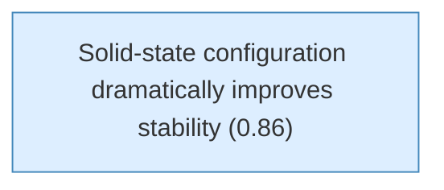

<a id="solid_state_dramatically_improved_stability"></a>

#### Solid-state configuration dramatically improves stability

📌 `solid_state_dramatically_improved_stability`   |   Belief: **0.86**

> The use of a solid hole conductor (spiro-MeOTAD) dramatically improved device stability compared to CH3NH3PbI3-sensitized liquid junction cells. The PCE remained stable during 500+ hours of testing without encapsulation.


## s3_results


<a id="al2o3_best_device"></a>

#### Best Al2O3 MSSC device performance

📌 `al2o3_best_device`   |   Belief: **0.99**

> The most efficient Al2O3-based device exhibited short-circuit photocurrent (Jsc) = 17.8 mA cm^-2, open-circuit voltage (Voc) = 0.98 V, fill factor of 0.63, yielding overall power conversion efficiency (eta) = 10.9% under simulated AM1.5 full solar illumination [@Lee2012].

🔗 **support**([Solid-state configuration dramatically improves stability](#solid_state_dramatically_improved_stability))

<details><summary>Reasoning</summary>

The solid-state replacement of liquid electrolyte makes Lee 2012's meso-superstructured high-efficiency device more plausible as a general architecture, not an isolated result.

</details>


## motivation

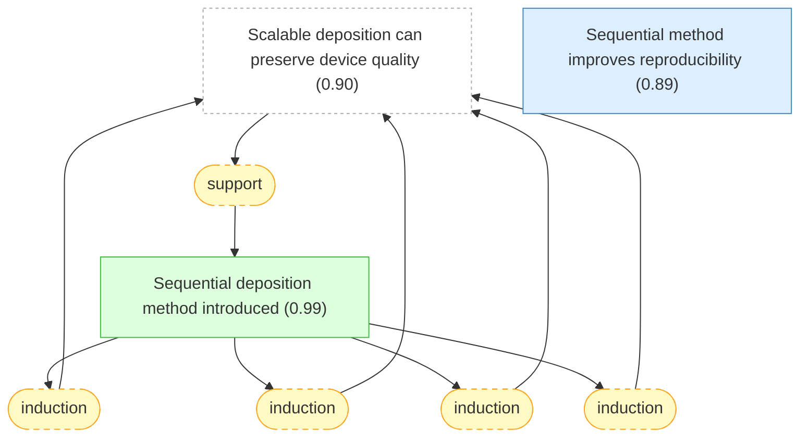

<a id="sequential_deposition_introduced"></a>

#### Sequential deposition method introduced

📌 `sequential_deposition_introduced`   |   Belief: **0.99**

> A sequential deposition method is introduced for the formation of the perovskite pigment within the porous metal oxide film: PbI2 is first introduced from solution into a nanoporous titanium dioxide film and subsequently transformed into the perovskite by exposing it to a solution of CH3NH3I [@Burschka2013].

🔗 **support**([Scalable deposition can preserve device quality](#law_scalable_deposition_can_preserve_device_quality))

<details><summary>Reasoning</summary>

The law predicts sequential deposition as a scalable film-control route.

</details>


<a id="reproducibility_improvement"></a>

#### Sequential method improves reproducibility

📌 `reproducibility_improvement`   |   Belief: **0.89**

> The sequential deposition method greatly increases the reproducibility of photovoltaic performance compared to single-step deposition [@Burschka2013].


## s2_methods

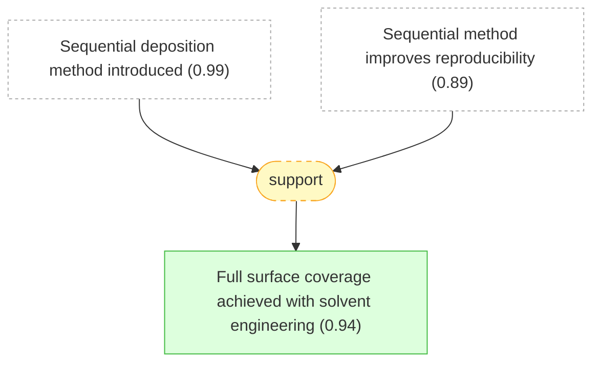

<a id="full_surface_coverage"></a>

#### Full surface coverage achieved with solvent engineering

📌 `full_surface_coverage`   |   Belief: **0.94**

> The perovskite materials fully infiltrate the pores of the mp-TiO2 film and are deposited in a very uniform thick film with 100% surface coverage atop the mp-TiO2, compared with the conventional method [@Jeon2014].

🔗 **support**([Sequential deposition method introduced](#sequential_deposition_introduced), [Sequential method improves reproducibility](#reproducibility_improvement))

<details><summary>Reasoning</summary>

The 2013 sequential-deposition package establishes conversion and reproducibility control that supports the 2014 full-coverage bilayer film result.

</details>


## motivation (continued)

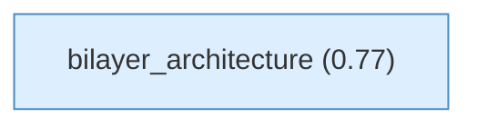

<a id="bilayer_architecture"></a>

#### bilayer_architecture

📌 `bilayer_architecture`   |   Belief: **0.77**

> A bilayer architecture comprising key features of both mesoscopic and planar structures was fabricated by a fully solution-based solvent-engineering process [@Jeon2014].


## s3_results (continued)


<a id="certified_efficiency_162"></a>

#### Certified PCE of 16.2% under AM 1.5 G full sun

📌 `certified_efficiency_162`   |   Belief: **1.00**

> A device fabricated by solvent engineering was certified by a standardized method in a photovoltaics calibration laboratory, confirming a PCE of 16.2% under AM 1.5 G full sun conditions [@Jeon2014].

🔗 **support**([Perovskite absorbers scale across architectures](#law_perovskite_absorbers_scale_across_architectures))

<details><summary>Reasoning</summary>

The law predicts high certified efficiency after bilayer interface control.

</details>


## s4_discussion (continued)

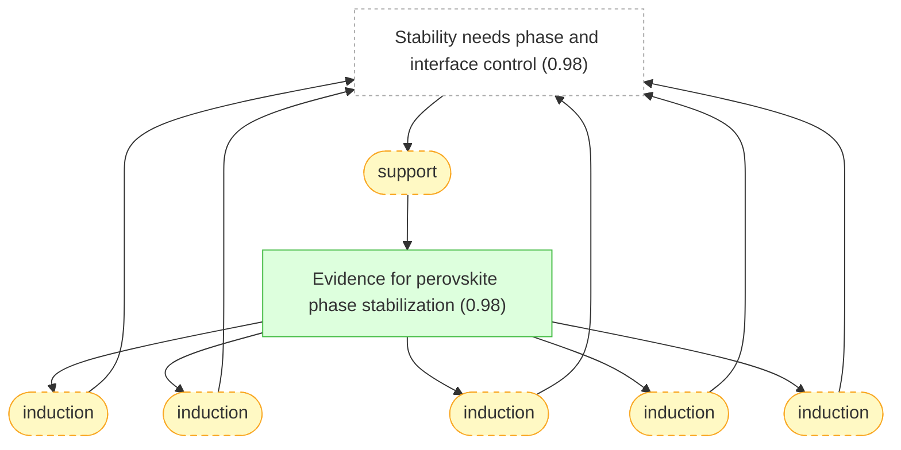

<a id="phase_stabilization_evidence"></a>

#### Evidence for perovskite phase stabilization

📌 `phase_stabilization_evidence`   |   Belief: **0.98**

> The perovskite phase stabilization caused by MAPbBr3 introduction was confirmed by: (1) XRD showing pure perovskite phase at room temperature for x=0.15, (2) DSC showing no endothermic peak (no phase transition) for x=0.15 powder, (3) black powder color at room temperature for x=0.15 (all other compositions remain yellow), and (4) smooth morphology with well-developed crystallites at x=0.15 vs rough surface at x=0 [@Jeon2015].

🔗 **support**([Stability needs phase and interface control](#law_stability_needs_phase_and_interface_control))

<details><summary>Reasoning</summary>

The law predicts mixed-cation phase stabilization.

</details>


## s3_results (continued)

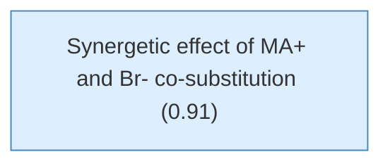

<a id="synergetic_effect"></a>

#### Synergetic effect of MA+ and Br- co-substitution

📌 `synergetic_effect`   |   Belief: **0.91**

> A simultaneous introduction of 15 mol% of both MA+ cations and Br- anions in FAPbI3 to obtain (FAPbI3)0.85(MAPbBr3)0.15 leads to a synergetic effect that stabilizes the perovskite phase at 100 degrees Celsius. This combination is sufficient to form a FAPbI3 perovskite phase even at 5 mol% addition, although single MA+ or Br- substitution can only partially form the perovskite phase [@Jeon2015].


## motivation (continued)


<a id="triple_cation_strategy"></a>

#### Triple cation Cs/MA/FA strategy

📌 `triple_cation_strategy`   |   Belief: **1.00**

> The triple Cs/MA/FA cation mixture uses Cs to improve MA/FA perovskite compounds further, where a small amount of Cs is sufficient to effectively suppress yellow phase impurities, permitting more pure, defect-free perovskite films [@Saliba2016].

🔗 **support**([Stability needs phase and interface control](#law_stability_needs_phase_and_interface_control))

<details><summary>Reasoning</summary>

The law predicts triple-cation stabilization as a bulk-composition route.

</details>


## s2_methods (continued)

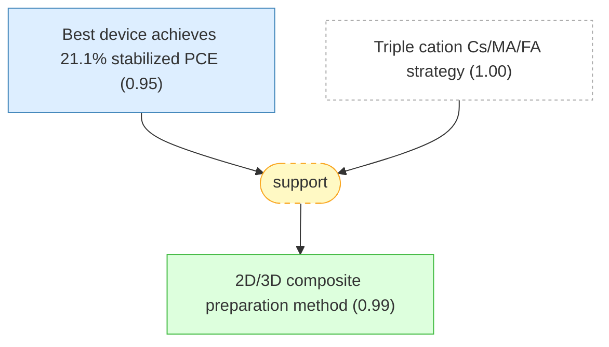

<a id="best_stabilized_pce"></a>

#### Best device achieves 21.1% stabilized PCE

📌 `best_stabilized_pce`   |   Belief: **0.95**

> The highest stabilized PCE exceeds 21%, with maximum power point tracking reaching 21.1% at 960 mV, in good agreement with JV scans. Fill factors reach up to approximately 0.8, values rarely reached for highest performances [@Saliba2016].


<a id="two_d_three_d_composite_preparation"></a>

#### 2D/3D composite preparation method

📌 `two_d_three_d_composite_preparation`   |   Belief: **0.99**

> 2D/3D composites were engineered by mixing (AVAI:PbI2) and (CH3NH3I:PbI2) precursors at different molar ratios (0-3-5-10-20-50%), infiltrated into mesoporous oxide scaffold by single-step deposition followed by slow drying, allowing reorganization before solidification [@Grancini2017].

🔗 **support**([Best device achieves 21.1% stabilized PCE](#best_stabilized_pce), [Triple cation Cs/MA/FA strategy](#triple_cation_strategy))

<details><summary>Reasoning</summary>

The triple-cation result supports the feasibility of combining phase-stable bulk composition with 2D/3D interface engineering.

</details>


## s4_discussion (continued)

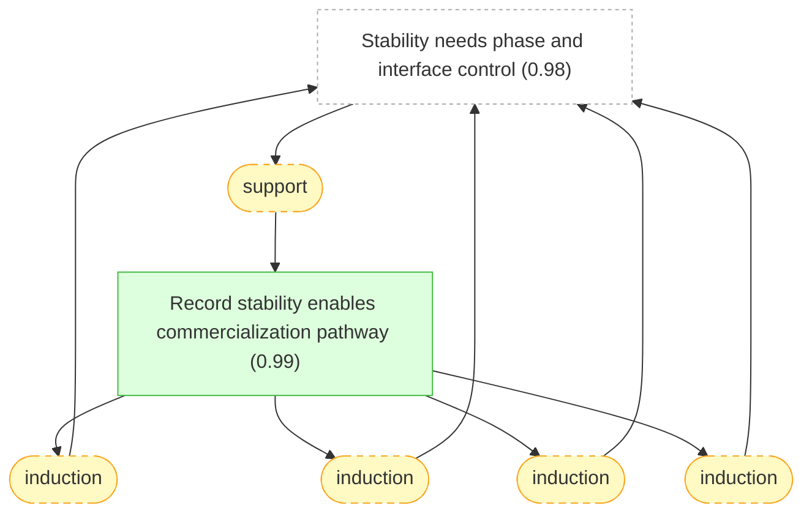

<a id="one_year_stability_record"></a>

#### Record stability enables commercialization pathway

📌 `one_year_stability_record`   |   Belief: **0.99**

> The >10,000h stability at controlled standard conditions (55°C, 1 sun, ambient atmosphere) represents the highest record value for perovskite photovoltaics, surpassing previous results with a significant step improvement. This enables timely commercialization pathway [@Grancini2017].

🔗 **support**([Stability needs phase and interface control](#law_stability_needs_phase_and_interface_control))

<details><summary>Reasoning</summary>

The law predicts one-year stability when 2D/3D interfaces protect the device.

</details>


## s3_results (continued)


<a id="t95_after_1200_hours"></a>

#### T95 retention after >1200 hours damp-heat test

📌 `t95_after_1200_hours`   |   Belief: **1.00**

> The 2D-RT-based device retained more than 95% of initial PCE (T95) after more than 1200 hours for champion stability cells under damp-heat test conditions. After the damp-heat test, three devices showed an average PCE of 19.3 +/- 0.69% [@Azmi2022].

🔗 **support**([Stability needs phase and interface control](#law_stability_needs_phase_and_interface_control))

<details><summary>Reasoning</summary>

The law predicts high damp-heat retention when dimensional passivation blocks degradation.

</details>


## s4_discussion (continued)


<a id="conclusion_alpha_stabilization"></a>

#### MDACl2 stabilizes alpha-FAPbI3 with high efficiency and stability

📌 `conclusion_alpha_stabilization`   |   Belief: **1.00**

> MDACl2 doping at 3.8 mol% effectively stabilizes the alpha-phase of FAPbI3 without MA, Cs, or Br, preserving the inherent narrow bandgap of pristine FAPbI3 (1.49 eV vs 1.53 eV for MAPbBr3 control). The stabilization mechanisms include H-bonding, tolerance factor optimization, entropic stabilization, and interstitial Cl- lattice strain relief. This enables the highest reported performance for mp-TiO2-based PSCs: certified PCE of 23.73% and record JSC of 26.70 mA/cm2, along with exceptional operational stability (90% PCE retention after 600 hours MPP tracking under full sunlight) [@Min2019].

🔗 **support**([Stability needs phase and interface control](#law_stability_needs_phase_and_interface_control))

<details><summary>Reasoning</summary>

The law predicts alpha-phase stabilization by local chemical stabilization.

</details>


<a id="dual_function_passivation"></a>

#### 2D perovskite provides dual-function passivation

📌 `dual_function_passivation`   |   Belief: **0.99**

> The 2D perovskite passivation serves dual functions: (1) as ion migration-blocking moisture/oxygen ingress barriers, and (2) as defect passivation layers, particularly at elevated operating temperatures. This simultaneous protection mechanism enables the excellent damp-heat stability observed in the 2D-RT devices [@Azmi2022].

🔗 **support**([MDACl2 stabilizes alpha-FAPbI3 with high efficiency and stability](#conclusion_alpha_stabilization))

<details><summary>Reasoning</summary>

MDA-based alpha-phase stabilization supports the broader idea that local chemical stabilization can be paired with interface protection.

</details>


## s3_results (continued)

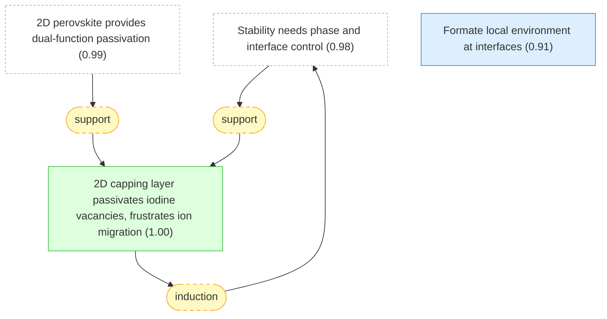

<a id="passivation_frustrates_ion_migration"></a>

#### 2D capping layer passivates iodine vacancies, frustrates ion migration

📌 `passivation_frustrates_ion_migration`   |   Belief: **1.00**

> Suppressed ion migration in capped devices likely stems from passivation of iodine vacancies at the surface of the perovskite active layer by the 2D capping layer.

🔗 **support**([Stability needs phase and interface control](#law_stability_needs_phase_and_interface_control))

<details><summary>Reasoning</summary>

The law predicts improved stability when capping suppresses ion migration.

</details>


<a id="formate_at_interfaces"></a>

#### Formate local environment at interfaces

📌 `formate_at_interfaces`   |   Belief: **0.91**

> The broadening of the HCOO- 13C signal in Fo-FAPbI3 (as opposed to the well-defined environment in crystalline FAHCOO) is consistent with formate interacting with undercoordinated Pb2+ to passivate iodide vacancies at surfaces or grain boundaries [@Jeong2021].


## s5_performance

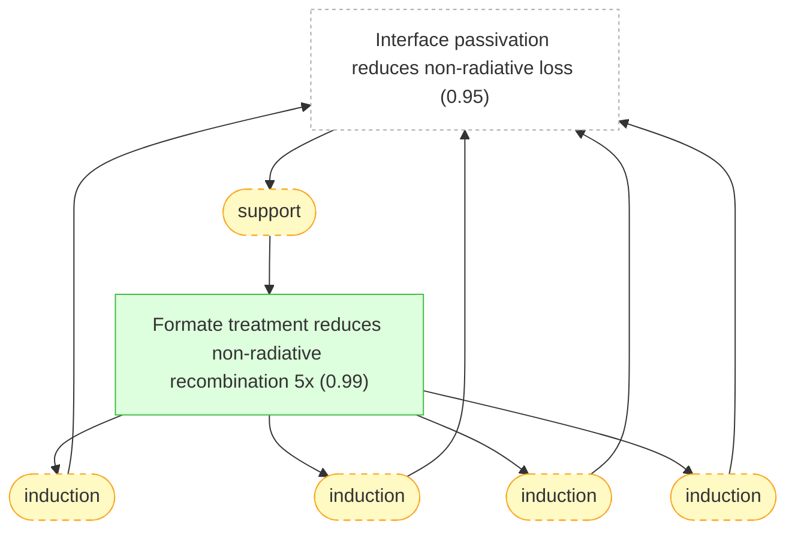

<a id="non_radiative_recombination_reduction"></a>

#### Formate treatment reduces non-radiative recombination 5x

📌 `non_radiative_recombination_reduction`   |   Belief: **0.99**

> The fivefold increase in EQE_EL (from 2.2% to 10.1%) with formate treatment indicates a corresponding fivefold reduction in non-radiative recombination rate, directly validating the defect passivation mechanism identified by NMR and MD simulations [@Jeong2021].

🔗 **support**([Interface passivation reduces non-radiative loss](#law_interface_passivation_reduces_nonradiative_loss))

<details><summary>Reasoning</summary>

The law predicts the formate reduction of non-radiative recombination.

</details>


## motivation (continued)


<a id="grain_surface_passivation_route"></a>

#### Grain surface passivation increases diffusion length

📌 `grain_surface_passivation_route`   |   Belief: **0.98**

> Grain surface passivation is a promising route to increase the carrier diffusion length of perovskite films, given that grain surfaces exhibit trap density one to several orders of magnitude higher than within the grain.

🔗 **support**([Formate local environment at interfaces](#formate_at_interfaces), [Formate treatment reduces non-radiative recombination 5x](#non_radiative_recombination_reduction))

<details><summary>Reasoning</summary>

Formate interface passivation supplies a chemical precedent for the wide-bandgap grain-surface passivation route.

</details>


## s4_characterization

```mermaid
graph TD
    law_interface_passivation_reduces_nonradiative_loss["Interface passivation reduces non-radiative loss (0.95)"]:::external
    grain_surface_passivation_route["Grain surface passivation increases diffusion length (0.98)"]:::external
    diffusion_length_increased_threefold["Diffusion length increased threefold with CF3-PA (1.00)"]:::derived
    strat_9(["support"]):::weak
    grain_surface_passivation_route --> strat_9
    strat_9 --> diffusion_length_increased_threefold
    strat_46(["support"]):::weak
    law_interface_passivation_reduces_nonradiative_loss --> strat_46
    strat_46 --> diffusion_length_increased_threefold
    strat_50(["induction"]):::weak
    diffusion_length_increased_threefold --> strat_50
    strat_50 --> law_interface_passivation_reduces_nonradiative_loss
    strat_51(["induction"]):::weak
    diffusion_length_increased_threefold --> strat_51
    strat_51 --> law_interface_passivation_reduces_nonradiative_loss
    strat_52(["induction"]):::weak
    diffusion_length_increased_threefold --> strat_52
    strat_52 --> law_interface_passivation_reduces_nonradiative_loss

    classDef setting fill:#f0f0f0,stroke:#999,color:#333
    classDef premise fill:#ddeeff,stroke:#4488bb,color:#333
    classDef derived fill:#ddffdd,stroke:#44bb44,color:#333
    classDef question fill:#fff3dd,stroke:#cc9944,color:#333
    classDef background fill:#f5f5f5,stroke:#bbb,stroke-dasharray: 5 5,color:#333
    classDef orphan fill:#fff,stroke:#ccc,stroke-dasharray: 5 5,color:#333
    classDef external fill:#fff,stroke:#aaa,stroke-dasharray: 3 3,color:#333
    classDef weak fill:#fff9c4,stroke:#f9a825,stroke-dasharray: 5 5,color:#333
    classDef contra fill:#ffebee,stroke:#c62828,color:#333
```

<a id="diffusion_length_increased_threefold"></a>

#### Diffusion length increased threefold with CF3-PA

📌 `diffusion_length_increased_threefold`   |   Belief: **1.00**

> The diffusion length (Ld) of CF3-PA passivated films was increased threefold compared to control films (5.4 micrometers versus 1.8 micrometers), due to longer carrier lifetimes despite similar mobilities.

🔗 **support**([Interface passivation reduces non-radiative loss](#law_interface_passivation_reduces_nonradiative_loss))

<details><summary>Reasoning</summary>

The law predicts longer diffusion length after recombination-active defects are suppressed.

</details>


## s3_results (continued)

```mermaid
graph TD
    law_band_alignment_controls_charge_selectivity["Band alignment controls charge selectivity (0.97)"]:::external
    cb_upshift_2d_3d["DFT predicts 0.14 eV CB upshift at interface (0.99)"]:::derived
    strat_66(["support"]):::weak
    law_band_alignment_controls_charge_selectivity --> strat_66
    strat_66 --> cb_upshift_2d_3d
    strat_70(["induction"]):::weak
    cb_upshift_2d_3d --> strat_70
    strat_70 --> law_band_alignment_controls_charge_selectivity
    strat_71(["induction"]):::weak
    cb_upshift_2d_3d --> strat_71
    strat_71 --> law_band_alignment_controls_charge_selectivity
    strat_72(["induction"]):::weak
    cb_upshift_2d_3d --> strat_72
    strat_72 --> law_band_alignment_controls_charge_selectivity

    classDef setting fill:#f0f0f0,stroke:#999,color:#333
    classDef premise fill:#ddeeff,stroke:#4488bb,color:#333
    classDef derived fill:#ddffdd,stroke:#44bb44,color:#333
    classDef question fill:#fff3dd,stroke:#cc9944,color:#333
    classDef background fill:#f5f5f5,stroke:#bbb,stroke-dasharray: 5 5,color:#333
    classDef orphan fill:#fff,stroke:#ccc,stroke-dasharray: 5 5,color:#333
    classDef external fill:#fff,stroke:#aaa,stroke-dasharray: 3 3,color:#333
    classDef weak fill:#fff9c4,stroke:#f9a825,stroke-dasharray: 5 5,color:#333
    classDef contra fill:#ffebee,stroke:#c62828,color:#333
```

<a id="cb_upshift_2d_3d"></a>

#### DFT predicts 0.14 eV CB upshift at interface

📌 `cb_upshift_2d_3d`   |   Belief: **0.99**

> DFT calculations show 0.14 eV conduction band (CB) upshift at 2D/3D interface compared to 3D bulk, inducing 0.09 eV larger interface gap than 3D bulk. This matches experimental PL blue shift of 0.13 eV when probing from oxide side. Only small ~0.02 eV shift of opposite sign found at MAPbI3/TiO2 interface [@Grancini2017].

🔗 **support**([Band alignment controls charge selectivity](#law_band_alignment_controls_charge_selectivity))

<details><summary>Reasoning</summary>

The law predicts band-edge shifts induced by 2D/3D grading.

</details>


## s2_methods (continued)

```mermaid
graph TD
    law_band_alignment_controls_charge_selectivity["Band alignment controls charge selectivity (0.97)"]:::external
    cb_upshift_2d_3d["DFT predicts 0.14 eV CB upshift at interface (0.99)"]:::external
    type_ii_energy_alignment["type_ii_energy_alignment (0.99)"]:::derived
    strat_10(["support"]):::weak
    cb_upshift_2d_3d --> strat_10
    strat_10 --> type_ii_energy_alignment
    strat_66(["support"]):::weak
    law_band_alignment_controls_charge_selectivity --> strat_66
    strat_66 --> cb_upshift_2d_3d
    strat_68(["support"]):::weak
    law_band_alignment_controls_charge_selectivity --> strat_68
    strat_68 --> type_ii_energy_alignment
    strat_70(["induction"]):::weak
    cb_upshift_2d_3d --> strat_70
    strat_70 --> law_band_alignment_controls_charge_selectivity
    strat_71(["induction"]):::weak
    cb_upshift_2d_3d --> strat_71
    strat_71 --> law_band_alignment_controls_charge_selectivity
    strat_72(["induction"]):::weak
    cb_upshift_2d_3d --> strat_72
    type_ii_energy_alignment --> strat_72
    strat_72 --> law_band_alignment_controls_charge_selectivity

    classDef setting fill:#f0f0f0,stroke:#999,color:#333
    classDef premise fill:#ddeeff,stroke:#4488bb,color:#333
    classDef derived fill:#ddffdd,stroke:#44bb44,color:#333
    classDef question fill:#fff3dd,stroke:#cc9944,color:#333
    classDef background fill:#f5f5f5,stroke:#bbb,stroke-dasharray: 5 5,color:#333
    classDef orphan fill:#fff,stroke:#ccc,stroke-dasharray: 5 5,color:#333
    classDef external fill:#fff,stroke:#aaa,stroke-dasharray: 3 3,color:#333
    classDef weak fill:#fff9c4,stroke:#f9a825,stroke-dasharray: 5 5,color:#333
    classDef contra fill:#ffebee,stroke:#c62828,color:#333
```

<a id="type_ii_energy_alignment"></a>

#### type_ii_energy_alignment

📌 `type_ii_energy_alignment`   |   Belief: **0.99**

> A type-II energy-level alignment forms between the dipolar-passivation-treated Pb-Sn perovskites and PEDOT:PSS, creating an electric field directed from the perovskite surface towards PEDOT:PSS, effectively driving carriers away from the defective interface layer (DIL) and facilitating holes drifting into PEDOT:PSS while repelling electrons from the HTL/Pb-Sn perovskite interface [@Lin2025].

🔗 **support**([Band alignment controls charge selectivity](#law_band_alignment_controls_charge_selectivity))

<details><summary>Reasoning</summary>

The law predicts dipole-induced type-II energy alignment at buried interfaces.

</details>


## motivation (continued)

```mermaid
graph TD
    law_band_alignment_controls_charge_selectivity["Band alignment controls charge selectivity (0.97)"]:::external
    type_two_band_alignment["Type II band alignment at PHJ (1.00)"]:::derived
    phj_solution["3D/3D bilayer PHJ solves the trade-off (1.00)"]:::premise
    bilateral_passivation_strategy["Bilayer interface passivation strategy (0.99)"]:::derived
    strat_11(["support"]):::weak
    type_two_band_alignment --> strat_11
    phj_solution --> strat_11
    strat_11 --> bilateral_passivation_strategy
    strat_67(["support"]):::weak
    law_band_alignment_controls_charge_selectivity --> strat_67
    strat_67 --> type_two_band_alignment
    strat_71(["induction"]):::weak
    type_two_band_alignment --> strat_71
    strat_71 --> law_band_alignment_controls_charge_selectivity
    strat_72(["induction"]):::weak
    type_two_band_alignment --> strat_72
    strat_72 --> law_band_alignment_controls_charge_selectivity

    classDef setting fill:#f0f0f0,stroke:#999,color:#333
    classDef premise fill:#ddeeff,stroke:#4488bb,color:#333
    classDef derived fill:#ddffdd,stroke:#44bb44,color:#333
    classDef question fill:#fff3dd,stroke:#cc9944,color:#333
    classDef background fill:#f5f5f5,stroke:#bbb,stroke-dasharray: 5 5,color:#333
    classDef orphan fill:#fff,stroke:#ccc,stroke-dasharray: 5 5,color:#333
    classDef external fill:#fff,stroke:#aaa,stroke-dasharray: 3 3,color:#333
    classDef weak fill:#fff9c4,stroke:#f9a825,stroke-dasharray: 5 5,color:#333
    classDef contra fill:#ffebee,stroke:#c62828,color:#333
```

<a id="type_two_band_alignment"></a>

#### Type II band alignment at PHJ

📌 `type_two_band_alignment`   |   Belief: **1.00**

> The 3D/3D bilayer PHJ exhibits type II band alignment between Pb-Sn and FL-WBG perovskites, which reduces hole concentration in the defective interface layer (DIL) and facilitates electron extraction into the C60 layer.

🔗 **support**([Band alignment controls charge selectivity](#law_band_alignment_controls_charge_selectivity))

<details><summary>Reasoning</summary>

The law predicts type-II alignment in 3D/3D bilayer heterojunctions.

</details>


<a id="phj_solution"></a>

#### 3D/3D bilayer PHJ solves the trade-off

📌 `phj_solution`   |   Belief: **1.00**

> A 3D/3D bilayer perovskite heterojunction (PHJ) with type II band structure at the Pb-Sn perovskite-ETL interface can suppress interfacial non-radiative recombination and facilitate charge extraction, while avoiding the transport losses associated with 2D interlayers.


<a id="bilateral_passivation_strategy"></a>

#### Bilayer interface passivation strategy

📌 `bilateral_passivation_strategy`   |   Belief: **0.99**

> A bilayer interface passivation strategy was developed that involves the incorporation of a thin lithium fluoride (LiF) layer followed by the deposition of a short-chain ethylenediammonium diiodide (EDAI) molecule. LiF acts as a contact displacer and induces field passivation, while EDAI chemically passivates unpassivated areas that are not contacted by the LiF layer, forming nanoscale localized contacts at the perovskite/C60 interface.

🔗 **support**([Type II band alignment at PHJ](#type_two_band_alignment), [3D/3D bilayer PHJ solves the trade-off](#phj_solution))

<details><summary>Reasoning</summary>

The 3D/3D bilayer heterojunction supplies a band-alignment precedent for the bilateral passivation strategy used in perovskite/silicon tandems.

</details>


## s5_tandem_results

```mermaid
graph TD
    law_tandems_raise_perovskite_efficiency_ceiling["Tandems raise the perovskite efficiency ceiling (0.97)"]:::external
    certified_pce_264_percent["Certified PCE of 26.4% by JET (0.99)"]:::derived
    strat_73(["support"]):::weak
    law_tandems_raise_perovskite_efficiency_ceiling --> strat_73
    strat_73 --> certified_pce_264_percent
    strat_78(["induction"]):::weak
    certified_pce_264_percent --> strat_78
    strat_78 --> law_tandems_raise_perovskite_efficiency_ceiling
    strat_79(["induction"]):::weak
    certified_pce_264_percent --> strat_79
    strat_79 --> law_tandems_raise_perovskite_efficiency_ceiling
    strat_80(["induction"]):::weak
    certified_pce_264_percent --> strat_80
    strat_80 --> law_tandems_raise_perovskite_efficiency_ceiling
    strat_81(["induction"]):::weak
    certified_pce_264_percent --> strat_81
    strat_81 --> law_tandems_raise_perovskite_efficiency_ceiling

    classDef setting fill:#f0f0f0,stroke:#999,color:#333
    classDef premise fill:#ddeeff,stroke:#4488bb,color:#333
    classDef derived fill:#ddffdd,stroke:#44bb44,color:#333
    classDef question fill:#fff3dd,stroke:#cc9944,color:#333
    classDef background fill:#f5f5f5,stroke:#bbb,stroke-dasharray: 5 5,color:#333
    classDef orphan fill:#fff,stroke:#ccc,stroke-dasharray: 5 5,color:#333
    classDef external fill:#fff,stroke:#aaa,stroke-dasharray: 3 3,color:#333
    classDef weak fill:#fff9c4,stroke:#f9a825,stroke-dasharray: 5 5,color:#333
    classDef contra fill:#ffebee,stroke:#c62828,color:#333
```

<a id="certified_pce_264_percent"></a>

#### Certified PCE of 26.4% by JET

📌 `certified_pce_264_percent`   |   Belief: **0.99**

> Independent certification by Japan Electrical Safety and Environment Technology Laboratories (JET) delivered certified stabilized PCEs of 26.4% and 26.1%, included in Solar Cell Efficiency Tables (version 58), exceeding other thin-film solar cells and comparable to best single-crystalline silicon solar cells.

🔗 **support**([Tandems raise the perovskite efficiency ceiling](#law_tandems_raise_perovskite_efficiency_ceiling))

<details><summary>Reasoning</summary>

The law predicts the certified all-perovskite tandem result.

</details>


## s3_results (continued)

```mermaid
graph TD
    law_tandems_raise_perovskite_efficiency_ceiling["Tandems raise the perovskite efficiency ceiling (0.97)"]:::external
    certified_pce_264_percent["Certified PCE of 26.4% by JET (0.99)"]:::external
    tandem_champion["Champion tandem device achieves 28.5% PCE (1.00)"]:::derived
    strat_12(["support"]):::weak
    certified_pce_264_percent --> strat_12
    strat_12 --> tandem_champion
    strat_73(["support"]):::weak
    law_tandems_raise_perovskite_efficiency_ceiling --> strat_73
    strat_73 --> certified_pce_264_percent
    strat_74(["support"]):::weak
    law_tandems_raise_perovskite_efficiency_ceiling --> strat_74
    strat_74 --> tandem_champion
    strat_78(["induction"]):::weak
    certified_pce_264_percent --> strat_78
    tandem_champion --> strat_78
    strat_78 --> law_tandems_raise_perovskite_efficiency_ceiling
    strat_79(["induction"]):::weak
    certified_pce_264_percent --> strat_79
    tandem_champion --> strat_79
    strat_79 --> law_tandems_raise_perovskite_efficiency_ceiling
    strat_80(["induction"]):::weak
    certified_pce_264_percent --> strat_80
    tandem_champion --> strat_80
    strat_80 --> law_tandems_raise_perovskite_efficiency_ceiling
    strat_81(["induction"]):::weak
    certified_pce_264_percent --> strat_81
    tandem_champion --> strat_81
    strat_81 --> law_tandems_raise_perovskite_efficiency_ceiling

    classDef setting fill:#f0f0f0,stroke:#999,color:#333
    classDef premise fill:#ddeeff,stroke:#4488bb,color:#333
    classDef derived fill:#ddffdd,stroke:#44bb44,color:#333
    classDef question fill:#fff3dd,stroke:#cc9944,color:#333
    classDef background fill:#f5f5f5,stroke:#bbb,stroke-dasharray: 5 5,color:#333
    classDef orphan fill:#fff,stroke:#ccc,stroke-dasharray: 5 5,color:#333
    classDef external fill:#fff,stroke:#aaa,stroke-dasharray: 3 3,color:#333
    classDef weak fill:#fff9c4,stroke:#f9a825,stroke-dasharray: 5 5,color:#333
    classDef contra fill:#ffebee,stroke:#c62828,color:#333
```

<a id="tandem_champion"></a>

#### Champion tandem device achieves 28.5% PCE

📌 `tandem_champion`   |   Belief: **1.00**

> The champion tandem device achieved PCE of 28.5% (reverse scan) with Voc of 2.112 V, Jsc of 16.5 mA cm^-2, and FF of 81.9%, with stabilized PCE of 28.4%.

🔗 **support**([Tandems raise the perovskite efficiency ceiling](#law_tandems_raise_perovskite_efficiency_ceiling))

<details><summary>Reasoning</summary>

The law predicts the 3D/3D tandem champion result.

</details>


## s4_discussion (continued)

```mermaid
graph TD
    type_two_band_alignment["Type II band alignment at PHJ (1.00)"]:::external
    first_to_exceed_sq_limit["First certified tandem exceeding Shockley-Queisser limit (0.95)"]:::derived
    strat_13(["support"]):::weak
    type_two_band_alignment --> strat_13
    strat_13 --> first_to_exceed_sq_limit

    classDef setting fill:#f0f0f0,stroke:#999,color:#333
    classDef premise fill:#ddeeff,stroke:#4488bb,color:#333
    classDef derived fill:#ddffdd,stroke:#44bb44,color:#333
    classDef question fill:#fff3dd,stroke:#cc9944,color:#333
    classDef background fill:#f5f5f5,stroke:#bbb,stroke-dasharray: 5 5,color:#333
    classDef orphan fill:#fff,stroke:#ccc,stroke-dasharray: 5 5,color:#333
    classDef external fill:#fff,stroke:#aaa,stroke-dasharray: 3 3,color:#333
    classDef weak fill:#fff9c4,stroke:#f9a825,stroke-dasharray: 5 5,color:#333
    classDef contra fill:#ffebee,stroke:#c62828,color:#333
```

<a id="first_to_exceed_sq_limit"></a>

#### First certified tandem exceeding Shockley-Queisser limit

📌 `first_to_exceed_sq_limit`   |   Belief: **0.95**

> The certified stabilized PCE of 33.89% represents the first reported certified efficiency of a two-junction tandem solar cell exceeding the single-junction Shockley-Queisser limit of 33.7%, marking a significant milestone in photovoltaic efficiency.

🔗 **support**([Type II band alignment at PHJ](#type_two_band_alignment))

<details><summary>Reasoning</summary>

The type-II 3D/3D alignment result supports the 2024 claim that bilayer interface design can help perovskite/silicon tandems exceed the single-junction limit.

</details>


## s3_results (continued)

```mermaid
graph TD
    law_tandems_raise_perovskite_efficiency_ceiling["Tandems raise the perovskite efficiency ceiling (0.97)"]:::external
    nrel_certified_pce["NREL certified 33.89% PCE (1.00)"]:::derived
    strat_75(["support"]):::weak
    law_tandems_raise_perovskite_efficiency_ceiling --> strat_75
    strat_75 --> nrel_certified_pce
    strat_79(["induction"]):::weak
    nrel_certified_pce --> strat_79
    strat_79 --> law_tandems_raise_perovskite_efficiency_ceiling
    strat_80(["induction"]):::weak
    nrel_certified_pce --> strat_80
    strat_80 --> law_tandems_raise_perovskite_efficiency_ceiling
    strat_81(["induction"]):::weak
    nrel_certified_pce --> strat_81
    strat_81 --> law_tandems_raise_perovskite_efficiency_ceiling

    classDef setting fill:#f0f0f0,stroke:#999,color:#333
    classDef premise fill:#ddeeff,stroke:#4488bb,color:#333
    classDef derived fill:#ddffdd,stroke:#44bb44,color:#333
    classDef question fill:#fff3dd,stroke:#cc9944,color:#333
    classDef background fill:#f5f5f5,stroke:#bbb,stroke-dasharray: 5 5,color:#333
    classDef orphan fill:#fff,stroke:#ccc,stroke-dasharray: 5 5,color:#333
    classDef external fill:#fff,stroke:#aaa,stroke-dasharray: 3 3,color:#333
    classDef weak fill:#fff9c4,stroke:#f9a825,stroke-dasharray: 5 5,color:#333
    classDef contra fill:#ffebee,stroke:#c62828,color:#333
```

<a id="nrel_certified_pce"></a>

#### NREL certified 33.89% PCE

📌 `nrel_certified_pce`   |   Belief: **1.00**

> NREL certified the device delivering stabilized PCE of 33.89% verified against in-house measurements, representing the first double-junction tandem surpassing single-junction Shockley-Queisser limit of 33.7%.

🔗 **support**([Tandems raise the perovskite efficiency ceiling](#law_tandems_raise_perovskite_efficiency_ceiling))

<details><summary>Reasoning</summary>

The law predicts the 2024 certified perovskite/silicon tandem record.

</details>


## s4_photovoltaic_performance

```mermaid
graph TD
    law_tandems_raise_perovskite_efficiency_ceiling["Tandems raise the perovskite efficiency ceiling (0.97)"]:::external
    nrel_certified_pce["NREL certified 33.89% PCE (1.00)"]:::external
    certified_pce_34_58["Certified PCE 34.58% by ESTI (1.00)"]:::derived
    strat_14(["support"]):::weak
    nrel_certified_pce --> strat_14
    strat_14 --> certified_pce_34_58
    strat_75(["support"]):::weak
    law_tandems_raise_perovskite_efficiency_ceiling --> strat_75
    strat_75 --> nrel_certified_pce
    strat_76(["support"]):::weak
    law_tandems_raise_perovskite_efficiency_ceiling --> strat_76
    strat_76 --> certified_pce_34_58
    strat_79(["induction"]):::weak
    nrel_certified_pce --> strat_79
    strat_79 --> law_tandems_raise_perovskite_efficiency_ceiling
    strat_80(["induction"]):::weak
    nrel_certified_pce --> strat_80
    certified_pce_34_58 --> strat_80
    strat_80 --> law_tandems_raise_perovskite_efficiency_ceiling
    strat_81(["induction"]):::weak
    nrel_certified_pce --> strat_81
    certified_pce_34_58 --> strat_81
    strat_81 --> law_tandems_raise_perovskite_efficiency_ceiling

    classDef setting fill:#f0f0f0,stroke:#999,color:#333
    classDef premise fill:#ddeeff,stroke:#4488bb,color:#333
    classDef derived fill:#ddffdd,stroke:#44bb44,color:#333
    classDef question fill:#fff3dd,stroke:#cc9944,color:#333
    classDef background fill:#f5f5f5,stroke:#bbb,stroke-dasharray: 5 5,color:#333
    classDef orphan fill:#fff,stroke:#ccc,stroke-dasharray: 5 5,color:#333
    classDef external fill:#fff,stroke:#aaa,stroke-dasharray: 3 3,color:#333
    classDef weak fill:#fff9c4,stroke:#f9a825,stroke-dasharray: 5 5,color:#333
    classDef contra fill:#ffebee,stroke:#c62828,color:#333
```

<a id="certified_pce_34_58"></a>

#### Certified PCE 34.58% by ESTI

📌 `certified_pce_34_58`   |   Belief: **1.00**

> One optimized HTL201-based TSC was sent to the European Solar Test Installation for certification, demonstrating a certified PCE of 34.58%.

🔗 **support**([Tandems raise the perovskite efficiency ceiling](#law_tandems_raise_perovskite_efficiency_ceiling))

<details><summary>Reasoning</summary>

The law predicts the 2025 HTL201 certified tandem record.

</details>


## s3_interface_interactions

```mermaid
graph TD
    htl201_strong_binding_perovskite["HTL201 has strongest binding to perovskite (0.86)"]:::premise
    htl201_passivates_pb_defects["HTL201 coordinates with Pb2+ to passivate defects (0.83)"]:::premise

    classDef setting fill:#f0f0f0,stroke:#999,color:#333
    classDef premise fill:#ddeeff,stroke:#4488bb,color:#333
    classDef derived fill:#ddffdd,stroke:#44bb44,color:#333
    classDef question fill:#fff3dd,stroke:#cc9944,color:#333
    classDef background fill:#f5f5f5,stroke:#bbb,stroke-dasharray: 5 5,color:#333
    classDef orphan fill:#fff,stroke:#ccc,stroke-dasharray: 5 5,color:#333
    classDef external fill:#fff,stroke:#aaa,stroke-dasharray: 3 3,color:#333
    classDef weak fill:#fff9c4,stroke:#f9a825,stroke-dasharray: 5 5,color:#333
    classDef contra fill:#ffebee,stroke:#c62828,color:#333
```

<a id="htl201_strong_binding_perovskite"></a>

#### HTL201 has strongest binding to perovskite

📌 `htl201_strong_binding_perovskite`   |   Belief: **0.86**

> HTL201 shows the highest binding energy with the perovskite film among the three SAMs, driven by an enhanced dipole moment (mu) induced by the asymmetric molecular structure design of HTL201 which promotes polar dipole interaction between the perovskite and the SAM.


<a id="htl201_passivates_pb_defects"></a>

#### HTL201 coordinates with Pb2+ to passivate defects

📌 `htl201_passivates_pb_defects`   |   Belief: **0.83**

> HTL201 shows a higher binding energy and a shorter distance (D[N-Pb]) between the N in the SAM and the Pb2+ defect in the perovskite film compared with Me-4PACz and MeO-4PACz. Therefore, the coordination interaction between HTL201 and the Pb2+ defect can passivate the defects at the SAM/perovskite surface.


## motivation (continued)

```mermaid
graph TD
    law_interface_passivation_reduces_nonradiative_loss["Interface passivation reduces non-radiative loss (0.95)"]:::external
    htl201_strong_binding_perovskite["HTL201 has strongest binding to perovskite (0.86)"]:::external
    htl201_passivates_pb_defects["HTL201 coordinates with Pb2+ to passivate defects (0.83)"]:::external
    dipolar_passivation_strategy["dipolar_passivation_strategy (0.94)"]:::derived
    diffusion_length_enhancement["diffusion_length_enhancement (0.91)"]:::premise
    strat_15(["support"]):::weak
    htl201_strong_binding_perovskite --> strat_15
    htl201_passivates_pb_defects --> strat_15
    strat_15 --> dipolar_passivation_strategy
    strat_48(["support"]):::weak
    law_interface_passivation_reduces_nonradiative_loss --> strat_48
    strat_48 --> dipolar_passivation_strategy
    strat_52(["induction"]):::weak
    dipolar_passivation_strategy --> strat_52
    strat_52 --> law_interface_passivation_reduces_nonradiative_loss

    classDef setting fill:#f0f0f0,stroke:#999,color:#333
    classDef premise fill:#ddeeff,stroke:#4488bb,color:#333
    classDef derived fill:#ddffdd,stroke:#44bb44,color:#333
    classDef question fill:#fff3dd,stroke:#cc9944,color:#333
    classDef background fill:#f5f5f5,stroke:#bbb,stroke-dasharray: 5 5,color:#333
    classDef orphan fill:#fff,stroke:#ccc,stroke-dasharray: 5 5,color:#333
    classDef external fill:#fff,stroke:#aaa,stroke-dasharray: 3 3,color:#333
    classDef weak fill:#fff9c4,stroke:#f9a825,stroke-dasharray: 5 5,color:#333
    classDef contra fill:#ffebee,stroke:#c62828,color:#333
```

<a id="dipolar_passivation_strategy"></a>

#### dipolar_passivation_strategy

📌 `dipolar_passivation_strategy`   |   Belief: **0.94**

> A dipolar-passivation strategy was developed using sulfanilic acid (SA) as the dipolar-passivation molecule, featuring an -NH3+ passivating group and a -SO3- dipole group, to minimize carrier recombination and improve hole transport at the HTL/Pb-Sn perovskite interface [@Lin2025].

🔗 **support**([Interface passivation reduces non-radiative loss](#law_interface_passivation_reduces_nonradiative_loss))

<details><summary>Reasoning</summary>

The law predicts buried-interface dipolar passivation as a recombination-control strategy.

</details>


<a id="diffusion_length_enhancement"></a>

#### diffusion_length_enhancement

📌 `diffusion_length_enhancement`   |   Belief: **0.91**

> Dipolar passivation extends the carrier diffusion length to 6.2 μm, compared with 4.8 μm for the control [@Lin2025].


## s4_discussion (continued)

```mermaid
graph TD
    law_tandems_raise_perovskite_efficiency_ceiling["Tandems raise the perovskite efficiency ceiling (0.97)"]:::external
    dipolar_passivation_strategy["dipolar_passivation_strategy (0.94)"]:::external
    diffusion_length_enhancement["diffusion_length_enhancement (0.91)"]:::external
    jet_certified_pce["jet_certified_pce (0.99)"]:::derived
    iecs_standard_met["IEC 61215:2016 damp-heat standard met (0.98)"]:::premise
    strat_16(["support"]):::weak
    dipolar_passivation_strategy --> strat_16
    diffusion_length_enhancement --> strat_16
    strat_16 --> jet_certified_pce
    strat_77(["support"]):::weak
    law_tandems_raise_perovskite_efficiency_ceiling --> strat_77
    strat_77 --> jet_certified_pce
    strat_81(["induction"]):::weak
    jet_certified_pce --> strat_81
    strat_81 --> law_tandems_raise_perovskite_efficiency_ceiling

    classDef setting fill:#f0f0f0,stroke:#999,color:#333
    classDef premise fill:#ddeeff,stroke:#4488bb,color:#333
    classDef derived fill:#ddffdd,stroke:#44bb44,color:#333
    classDef question fill:#fff3dd,stroke:#cc9944,color:#333
    classDef background fill:#f5f5f5,stroke:#bbb,stroke-dasharray: 5 5,color:#333
    classDef orphan fill:#fff,stroke:#ccc,stroke-dasharray: 5 5,color:#333
    classDef external fill:#fff,stroke:#aaa,stroke-dasharray: 3 3,color:#333
    classDef weak fill:#fff9c4,stroke:#f9a825,stroke-dasharray: 5 5,color:#333
    classDef contra fill:#ffebee,stroke:#c62828,color:#333
```

<a id="jet_certified_pce"></a>

#### jet_certified_pce

📌 `jet_certified_pce`   |   Belief: **0.99**

> Third-party certification by JET confirms a stabilized PCE of 30.1% for a tandem device with active area of 0.049 cm^2, included in the Solar Cell Efficiency Tables (version 64). A large-area device (1.07 cm^2) achieves a certified stabilized PCE of 29.6% [@Lin2025].

🔗 **support**([Tandems raise the perovskite efficiency ceiling](#law_tandems_raise_perovskite_efficiency_ceiling))

<details><summary>Reasoning</summary>

The law predicts the certified dipolar-passivated tandem result.

</details>


<a id="iecs_standard_met"></a>

#### IEC 61215:2016 damp-heat standard met

📌 `iecs_standard_met`   |   Belief: **0.98**

> The encapsulated 2D-RT PSCs successfully passed the IEC 61215:2016 damp-heat test, meeting one of the critical industrial stability standards required for commercial PV modules. The retained PCE of more than 19% after more than 1000 hours represents a very high retained performance value under this challenging test condition [@Azmi2022].


## s6_stability

```mermaid
graph TD
    iecs_standard_met["IEC 61215:2016 damp-heat standard met (0.98)"]:::external
    damp_heat_retention["84% retention after 1000h damp-heat at 85C/85% RH (0.99)"]:::derived
    initial_pce_retention_6000h["97% retention after 6000h light soaking at 60C (1.00)"]:::derived
    strat_17(["support"]):::weak
    iecs_standard_met --> strat_17
    strat_17 --> damp_heat_retention
    strat_18(["support"]):::weak
    damp_heat_retention --> strat_18
    strat_18 --> initial_pce_retention_6000h

    classDef setting fill:#f0f0f0,stroke:#999,color:#333
    classDef premise fill:#ddeeff,stroke:#4488bb,color:#333
    classDef derived fill:#ddffdd,stroke:#44bb44,color:#333
    classDef question fill:#fff3dd,stroke:#cc9944,color:#333
    classDef background fill:#f5f5f5,stroke:#bbb,stroke-dasharray: 5 5,color:#333
    classDef orphan fill:#fff,stroke:#ccc,stroke-dasharray: 5 5,color:#333
    classDef external fill:#fff,stroke:#aaa,stroke-dasharray: 3 3,color:#333
    classDef weak fill:#fff9c4,stroke:#f9a825,stroke-dasharray: 5 5,color:#333
    classDef contra fill:#ffebee,stroke:#c62828,color:#333
```

<a id="damp_heat_retention"></a>

#### 84% retention after 1000h damp-heat at 85C/85% RH

📌 `damp_heat_retention`   |   Belief: **0.99**

> Another bifacial minimodule maintained approximately 84% of its initial efficiency after damp-heat testing for over 1,000 hours at 85 degrees C and approximately 85% relative humidity, demonstrating good stability under damp-heat conditions [@Gu2023].

🔗 **support**([IEC 61215:2016 damp-heat standard met](#iecs_standard_met))

<details><summary>Reasoning</summary>

The 2022 damp-heat package supports the later bifacial module damp-heat stability result as a related environmental-stability target.

</details>


<a id="initial_pce_retention_6000h"></a>

#### 97% retention after 6000h light soaking at 60C

📌 `initial_pce_retention_6000h`   |   Belief: **1.00**

> The best bifacial minimodule retained 97% of its initial power conversion efficiency (T97) after light soaking for over 6,000 hours from the front side at open-circuit condition and temperature of 60 plus/minus 5 degrees C under simulated 1-sun illumination in air, representing the most stable reported perovskite minimodule [@Gu2023].

🔗 **support**([84% retention after 1000h damp-heat at 85C/85% RH](#damp_heat_retention))

<details><summary>Reasoning</summary>

Damp-heat retention supports the broader claim that bifacial modules can maintain performance during long operational tests.

</details>


## s2_pfsd

```mermaid
graph TD
    pfsd_technique_description["PFSD technique uses sub-stoichiometric organic cations (0.92)"]:::derived
    fabr_enables_uniform_n2["FABr enables uniform phase-pure n=2 2D formation (0.72)"]:::external
    strat_20(["support"]):::weak
    fabr_enables_uniform_n2 --> strat_20
    strat_20 --> pfsd_technique_description

    classDef setting fill:#f0f0f0,stroke:#999,color:#333
    classDef premise fill:#ddeeff,stroke:#4488bb,color:#333
    classDef derived fill:#ddffdd,stroke:#44bb44,color:#333
    classDef question fill:#fff3dd,stroke:#cc9944,color:#333
    classDef background fill:#f5f5f5,stroke:#bbb,stroke-dasharray: 5 5,color:#333
    classDef orphan fill:#fff,stroke:#ccc,stroke-dasharray: 5 5,color:#333
    classDef external fill:#fff,stroke:#aaa,stroke-dasharray: 3 3,color:#333
    classDef weak fill:#fff9c4,stroke:#f9a825,stroke-dasharray: 5 5,color:#333
    classDef contra fill:#ffebee,stroke:#c62828,color:#333
```

<a id="pfsd_technique_description"></a>

#### PFSD technique uses sub-stoichiometric organic cations

📌 `pfsd_technique_description`   |   Belief: **0.92**

> The printing-friendly sequential deposition (PFSD) technique adds organic cations at a loading of less than 50 mol% of PbI₂, far below the stoichiometric amount required to form perovskite crystals. This strategy retards crystallization and the precursor thin-film behaves like an amorphous material with much better film-forming properties than crystalline analogues [@Weerasinghe2024].

🔗 **support**([FABr enables uniform phase-pure n=2 2D formation](#fabr_enables_uniform_n2))

<details><summary>Reasoning</summary>

Homogeneous 2D passivation at large area supports the broader feasibility of scalable coating processes that must preserve interface quality.

</details>


## s3_automated

```mermaid
graph TD
    pfsd_technique_description["PFSD technique uses sub-stoichiometric organic cations (0.92)"]:::external
    best_cell_performance["Best cell achieves 15.5% PCE (0.91)"]:::derived
    strat_19(["support"]):::weak
    pfsd_technique_description --> strat_19
    strat_19 --> best_cell_performance

    classDef setting fill:#f0f0f0,stroke:#999,color:#333
    classDef premise fill:#ddeeff,stroke:#4488bb,color:#333
    classDef derived fill:#ddffdd,stroke:#44bb44,color:#333
    classDef question fill:#fff3dd,stroke:#cc9944,color:#333
    classDef background fill:#f5f5f5,stroke:#bbb,stroke-dasharray: 5 5,color:#333
    classDef orphan fill:#fff,stroke:#ccc,stroke-dasharray: 5 5,color:#333
    classDef external fill:#fff,stroke:#aaa,stroke-dasharray: 3 3,color:#333
    classDef weak fill:#fff9c4,stroke:#f9a825,stroke-dasharray: 5 5,color:#333
    classDef contra fill:#ffebee,stroke:#c62828,color:#333
```

<a id="best_cell_performance"></a>

#### Best cell achieves 15.5% PCE

📌 `best_cell_performance`   |   Belief: **0.91**

> The best-performing device achieved 15.5% PCE, 19.9 mA cm⁻² J_sc, 76.1% FF, and 1.02 V V_oc under standard illumination (AM 1.5 G). The IPCE spectrum shows good agreement with a calculated current density of 19.4 mA cm⁻² [@Weerasinghe2024].

🔗 **support**([PFSD technique uses sub-stoichiometric organic cations](#pfsd_technique_description))

<details><summary>Reasoning</summary>

The PFSD process claim supports the roll-to-roll best-cell performance by linking scalable coating to device quality.

</details>


## s3_results (continued)

```mermaid
graph TD
    fabr_enables_uniform_n2["FABr enables uniform phase-pure n=2 2D formation (0.72)"]:::premise

    classDef setting fill:#f0f0f0,stroke:#999,color:#333
    classDef premise fill:#ddeeff,stroke:#4488bb,color:#333
    classDef derived fill:#ddffdd,stroke:#44bb44,color:#333
    classDef question fill:#fff3dd,stroke:#cc9944,color:#333
    classDef background fill:#f5f5f5,stroke:#bbb,stroke-dasharray: 5 5,color:#333
    classDef orphan fill:#fff,stroke:#ccc,stroke-dasharray: 5 5,color:#333
    classDef external fill:#fff,stroke:#aaa,stroke-dasharray: 3 3,color:#333
    classDef weak fill:#fff9c4,stroke:#f9a825,stroke-dasharray: 5 5,color:#333
    classDef contra fill:#ffebee,stroke:#c62828,color:#333
```

<a id="fabr_enables_uniform_n2"></a>

#### FABr enables uniform phase-pure n=2 2D formation

📌 `fabr_enables_uniform_n2`   |   Belief: **0.72**

> Combined use of DAX and FABr leads to growth of uniform n=2 2D structures without phase separation on 3D perovskite. The lower formation enthalpy of triple-halide n=2 DA2FAPb2(I4-0.5xClx)Br3 perovskites compared to n=1 and n=3 enables preferential formation of phase-pure n=2 perovskite [@Li2024].


## s4_discussion (continued)

```mermaid
graph TD
    law_perovskite_absorbers_scale_across_architectures["Perovskite absorbers scale across architectures (0.91)"]:::external
    conclusion_perovskite_sensitization["Perovskite efficiently sensitizes TiO2 for visible-light conversion (0.92)"]:::derived
    panchromatic_absorption_leads_to_high_jsc["Panchromatic absorption enables high JSC (0.97)"]:::derived
    strat_37(["support"]):::weak
    law_perovskite_absorbers_scale_across_architectures --> strat_37
    strat_37 --> conclusion_perovskite_sensitization
    strat_38(["support"]):::weak
    law_perovskite_absorbers_scale_across_architectures --> strat_38
    strat_38 --> panchromatic_absorption_leads_to_high_jsc
    strat_41(["induction"]):::weak
    conclusion_perovskite_sensitization --> strat_41
    panchromatic_absorption_leads_to_high_jsc --> strat_41
    strat_41 --> law_perovskite_absorbers_scale_across_architectures
    strat_42(["induction"]):::weak
    conclusion_perovskite_sensitization --> strat_42
    panchromatic_absorption_leads_to_high_jsc --> strat_42
    strat_42 --> law_perovskite_absorbers_scale_across_architectures
    strat_43(["induction"]):::weak
    conclusion_perovskite_sensitization --> strat_43
    panchromatic_absorption_leads_to_high_jsc --> strat_43
    strat_43 --> law_perovskite_absorbers_scale_across_architectures

    classDef setting fill:#f0f0f0,stroke:#999,color:#333
    classDef premise fill:#ddeeff,stroke:#4488bb,color:#333
    classDef derived fill:#ddffdd,stroke:#44bb44,color:#333
    classDef question fill:#fff3dd,stroke:#cc9944,color:#333
    classDef background fill:#f5f5f5,stroke:#bbb,stroke-dasharray: 5 5,color:#333
    classDef orphan fill:#fff,stroke:#ccc,stroke-dasharray: 5 5,color:#333
    classDef external fill:#fff,stroke:#aaa,stroke-dasharray: 3 3,color:#333
    classDef weak fill:#fff9c4,stroke:#f9a825,stroke-dasharray: 5 5,color:#333
    classDef contra fill:#ffebee,stroke:#c62828,color:#333
```

<a id="conclusion_perovskite_sensitization"></a>

#### Perovskite efficiently sensitizes TiO2 for visible-light conversion

📌 `conclusion_perovskite_sensitization`   |   Belief: **0.92**

> The organolead halide perovskite compounds efficiently sensitize TiO2 for visible-light conversion in photovoltaic cells, representing a significant advance over nonorganic sensitizers and quantum dots that had not achieved comparable performance [@pvsk2009].

🔗 **support**([Perovskite absorbers scale across architectures](#law_perovskite_absorbers_scale_across_architectures))

<details><summary>Reasoning</summary>

The law predicts the initial 2009 perovskite sensitization result.

</details>


<a id="panchromatic_absorption_leads_to_high_jsc"></a>

#### Panchromatic absorption enables high JSC

📌 `panchromatic_absorption_leads_to_high_jsc`   |   Belief: **0.97**

> CH3NH3PbI3 deposited on TiO2 particles exhibits panchromatic absorption of visible light, leading to high photocurrent density in submicron-thick thin films (JSC = 17.6 mA/cm^2 in 0.6 micrometer-thick mesoporous TiO2 film).

🔗 **support**([Perovskite absorbers scale across architectures](#law_perovskite_absorbers_scale_across_architectures))

<details><summary>Reasoning</summary>

The law predicts panchromatic response in the 2012 solid-state device.

</details>


## s3_results (continued)

```mermaid
graph TD
    law_perovskite_absorbers_scale_across_architectures["Perovskite absorbers scale across architectures (0.91)"]:::external
    perovskite_semicondo["Perovskite as semiconductor (0.94)"]:::derived
    certified_efficiency["Certified PCE: 14.14% (0.53)"]:::premise
    strat_39(["support"]):::weak
    law_perovskite_absorbers_scale_across_architectures --> strat_39
    strat_39 --> perovskite_semicondo
    strat_42(["induction"]):::weak
    perovskite_semicondo --> strat_42
    strat_42 --> law_perovskite_absorbers_scale_across_architectures
    strat_43(["induction"]):::weak
    perovskite_semicondo --> strat_43
    strat_43 --> law_perovskite_absorbers_scale_across_architectures

    classDef setting fill:#f0f0f0,stroke:#999,color:#333
    classDef premise fill:#ddeeff,stroke:#4488bb,color:#333
    classDef derived fill:#ddffdd,stroke:#44bb44,color:#333
    classDef question fill:#fff3dd,stroke:#cc9944,color:#333
    classDef background fill:#f5f5f5,stroke:#bbb,stroke-dasharray: 5 5,color:#333
    classDef orphan fill:#fff,stroke:#ccc,stroke-dasharray: 5 5,color:#333
    classDef external fill:#fff,stroke:#aaa,stroke-dasharray: 3 3,color:#333
    classDef weak fill:#fff9c4,stroke:#f9a825,stroke-dasharray: 5 5,color:#333
    classDef contra fill:#ffebee,stroke:#c62828,color:#333
```

<a id="perovskite_semicondo"></a>

#### Perovskite as semiconductor

📌 `perovskite_semicondo`   |   Belief: **0.94**

> The construction of a planar-junction diode demonstrates the 'semiconducting' nature of the perovskite, which can function as both absorber and n-type component transporting electronic charge out of the device [@Lee2012].

🔗 **support**([Perovskite absorbers scale across architectures](#law_perovskite_absorbers_scale_across_architectures))

<details><summary>Reasoning</summary>

The law predicts semiconductor behavior in the meso-superstructured device.

</details>


<a id="certified_efficiency"></a>

#### Certified PCE: 14.14%

📌 `certified_efficiency`   |   Belief: **0.53**

> One of the best-performing devices was sent to an accredited photovoltaic calibration laboratory for certification, confirming a power conversion efficiency of 14.14% under standard AM1.5G reporting conditions [@Burschka2013].


## s2_dft_methods

```mermaid
graph TD
    law_interface_passivation_reduces_nonradiative_loss["Interface passivation reduces non-radiative loss (0.95)"]:::external
    deep_in_gap_states_eliminated["Deep in-gap states eliminated by CF3-PA (1.00)"]:::derived
    strat_45(["support"]):::weak
    law_interface_passivation_reduces_nonradiative_loss --> strat_45
    strat_45 --> deep_in_gap_states_eliminated
    strat_49(["induction"]):::weak
    deep_in_gap_states_eliminated --> strat_49
    strat_49 --> law_interface_passivation_reduces_nonradiative_loss
    strat_50(["induction"]):::weak
    deep_in_gap_states_eliminated --> strat_50
    strat_50 --> law_interface_passivation_reduces_nonradiative_loss
    strat_51(["induction"]):::weak
    deep_in_gap_states_eliminated --> strat_51
    strat_51 --> law_interface_passivation_reduces_nonradiative_loss
    strat_52(["induction"]):::weak
    deep_in_gap_states_eliminated --> strat_52
    strat_52 --> law_interface_passivation_reduces_nonradiative_loss

    classDef setting fill:#f0f0f0,stroke:#999,color:#333
    classDef premise fill:#ddeeff,stroke:#4488bb,color:#333
    classDef derived fill:#ddffdd,stroke:#44bb44,color:#333
    classDef question fill:#fff3dd,stroke:#cc9944,color:#333
    classDef background fill:#f5f5f5,stroke:#bbb,stroke-dasharray: 5 5,color:#333
    classDef orphan fill:#fff,stroke:#ccc,stroke-dasharray: 5 5,color:#333
    classDef external fill:#fff,stroke:#aaa,stroke-dasharray: 3 3,color:#333
    classDef weak fill:#fff9c4,stroke:#f9a825,stroke-dasharray: 5 5,color:#333
    classDef contra fill:#ffebee,stroke:#c62828,color:#333
```

<a id="deep_in_gap_states_eliminated"></a>

#### Deep in-gap states eliminated by CF3-PA

📌 `deep_in_gap_states_eliminated`   |   Belief: **1.00**

> The deep in-gap states from I_Sn and I_Pb antisite defects are eliminated upon CF3-PA passivation.

🔗 **support**([Interface passivation reduces non-radiative loss](#law_interface_passivation_reduces_nonradiative_loss))

<details><summary>Reasoning</summary>

The law predicts elimination of deep in-gap states by grain-surface passivation.

</details>


## s3_results (continued)

```mermaid
graph TD
    negligible_hysteresis_bilayer["Bilayer cell exhibits negligible hysteresis (0.87)"]:::premise

    classDef setting fill:#f0f0f0,stroke:#999,color:#333
    classDef premise fill:#ddeeff,stroke:#4488bb,color:#333
    classDef derived fill:#ddffdd,stroke:#44bb44,color:#333
    classDef question fill:#fff3dd,stroke:#cc9944,color:#333
    classDef background fill:#f5f5f5,stroke:#bbb,stroke-dasharray: 5 5,color:#333
    classDef orphan fill:#fff,stroke:#ccc,stroke-dasharray: 5 5,color:#333
    classDef external fill:#fff,stroke:#aaa,stroke-dasharray: 3 3,color:#333
    classDef weak fill:#fff9c4,stroke:#f9a825,stroke-dasharray: 5 5,color:#333
    classDef contra fill:#ffebee,stroke:#c62828,color:#333
```

<a id="negligible_hysteresis_bilayer"></a>

#### Bilayer cell exhibits negligible hysteresis

📌 `negligible_hysteresis_bilayer`   |   Belief: **0.87**

> The J-V curves of the forward and reverse scans of the bilayered cell are well coincident; efficiency and average efficiency from both scan directions are symmetrical and identical regardless of scanning direction [@Jeon2014].


## motivation (continued)

```mermaid
graph TD
    law_scalable_deposition_can_preserve_device_quality["Scalable deposition can preserve device quality (0.90)"]:::external
    first_fully_r2r_cells["First fully R2R-fabricated PeSCs with 15.5% PCE (0.89)"]:::derived
    first_fully_r2r_modules["First fully R2R-fabricated PeSC modules with 11% PCE (0.58)"]:::premise
    strat_84(["support"]):::weak
    law_scalable_deposition_can_preserve_device_quality --> strat_84
    strat_84 --> first_fully_r2r_cells
    strat_88(["induction"]):::weak
    first_fully_r2r_cells --> strat_88
    strat_88 --> law_scalable_deposition_can_preserve_device_quality
    strat_89(["induction"]):::weak
    first_fully_r2r_cells --> strat_89
    strat_89 --> law_scalable_deposition_can_preserve_device_quality
    strat_90(["induction"]):::weak
    first_fully_r2r_cells --> strat_90
    strat_90 --> law_scalable_deposition_can_preserve_device_quality

    classDef setting fill:#f0f0f0,stroke:#999,color:#333
    classDef premise fill:#ddeeff,stroke:#4488bb,color:#333
    classDef derived fill:#ddffdd,stroke:#44bb44,color:#333
    classDef question fill:#fff3dd,stroke:#cc9944,color:#333
    classDef background fill:#f5f5f5,stroke:#bbb,stroke-dasharray: 5 5,color:#333
    classDef orphan fill:#fff,stroke:#ccc,stroke-dasharray: 5 5,color:#333
    classDef external fill:#fff,stroke:#aaa,stroke-dasharray: 3 3,color:#333
    classDef weak fill:#fff9c4,stroke:#f9a825,stroke-dasharray: 5 5,color:#333
    classDef contra fill:#ffebee,stroke:#c62828,color:#333
```

<a id="first_fully_r2r_cells"></a>

#### First fully R2R-fabricated PeSCs with 15.5% PCE

📌 `first_fully_r2r_cells`   |   Belief: **0.89**

> This work reports the first fully R2R-printed individual PeSCs with a record-high 15.5% PCE, fabricated under ambient room conditions using perovskite-friendly carbon inks to replace vacuum-based electrodes [@Weerasinghe2024].

🔗 **support**([Scalable deposition can preserve device quality](#law_scalable_deposition_can_preserve_device_quality))

<details><summary>Reasoning</summary>

The law predicts fully roll-to-roll cells when scalable coating preserves film quality.

</details>


<a id="first_fully_r2r_modules"></a>

#### First fully R2R-fabricated PeSC modules with 11% PCE

📌 `first_fully_r2r_modules`   |   Belief: **0.58**

> This work demonstrates the first PeSC modules produced using only industry-relevant R2R fabrication techniques under ambient room conditions, exhibiting up to 11.0% PCE for ~50 cm² active area modules [@Weerasinghe2024].


## s5_performance (continued)

```mermaid
graph TD
    law_scalable_deposition_can_preserve_device_quality["Scalable deposition can preserve device quality (0.90)"]:::external
    nrel_certified_front_efficiency["NREL certified stabilized front efficiency 19.2% (1.00)"]:::derived
    strat_85(["support"]):::weak
    law_scalable_deposition_can_preserve_device_quality --> strat_85
    strat_85 --> nrel_certified_front_efficiency
    strat_89(["induction"]):::weak
    nrel_certified_front_efficiency --> strat_89
    strat_89 --> law_scalable_deposition_can_preserve_device_quality
    strat_90(["induction"]):::weak
    nrel_certified_front_efficiency --> strat_90
    strat_90 --> law_scalable_deposition_can_preserve_device_quality

    classDef setting fill:#f0f0f0,stroke:#999,color:#333
    classDef premise fill:#ddeeff,stroke:#4488bb,color:#333
    classDef derived fill:#ddffdd,stroke:#44bb44,color:#333
    classDef question fill:#fff3dd,stroke:#cc9944,color:#333
    classDef background fill:#f5f5f5,stroke:#bbb,stroke-dasharray: 5 5,color:#333
    classDef orphan fill:#fff,stroke:#ccc,stroke-dasharray: 5 5,color:#333
    classDef external fill:#fff,stroke:#aaa,stroke-dasharray: 3 3,color:#333
    classDef weak fill:#fff9c4,stroke:#f9a825,stroke-dasharray: 5 5,color:#333
    classDef contra fill:#ffebee,stroke:#c62828,color:#333
```

<a id="nrel_certified_front_efficiency"></a>

#### NREL certified stabilized front efficiency 19.2%

📌 `nrel_certified_front_efficiency`   |   Belief: **1.00**

> The certified front efficiency of the bifacial minimodule by the National Renewable Energy Laboratory (NREL) was 19.2% (stabilized), comparable to the best certified monofacial minimodules, for a minimodule with aperture area of approximately 22.0 cm^2 [@Gu2023].

🔗 **support**([Scalable deposition can preserve device quality](#law_scalable_deposition_can_preserve_device_quality))

<details><summary>Reasoning</summary>

The law predicts certified bifacial minimodule performance after module-scale integration.

</details>


## s6_conclusion

```mermaid
graph TD
    law_scalable_deposition_can_preserve_device_quality["Scalable deposition can preserve device quality (0.90)"]:::external
    large_module_summary["Large module efficiencies (18.90% and 17.59%) (0.92)"]:::derived
    strat_86(["support"]):::weak
    law_scalable_deposition_can_preserve_device_quality --> strat_86
    strat_86 --> large_module_summary
    strat_90(["induction"]):::weak
    large_module_summary --> strat_90
    strat_90 --> law_scalable_deposition_can_preserve_device_quality

    classDef setting fill:#f0f0f0,stroke:#999,color:#333
    classDef premise fill:#ddeeff,stroke:#4488bb,color:#333
    classDef derived fill:#ddffdd,stroke:#44bb44,color:#333
    classDef question fill:#fff3dd,stroke:#cc9944,color:#333
    classDef background fill:#f5f5f5,stroke:#bbb,stroke-dasharray: 5 5,color:#333
    classDef orphan fill:#fff,stroke:#ccc,stroke-dasharray: 5 5,color:#333
    classDef external fill:#fff,stroke:#aaa,stroke-dasharray: 3 3,color:#333
    classDef weak fill:#fff9c4,stroke:#f9a825,stroke-dasharray: 5 5,color:#333
    classDef contra fill:#ffebee,stroke:#c62828,color:#333
```

<a id="large_module_summary"></a>

#### Large module efficiencies (18.90% and 17.59%)

📌 `large_module_summary`   |   Belief: **0.92**

> 20 cm x 20 cm and 30 cm x 30 cm large-size PSMs demonstrate champion efficiencies of 18.90% (aperture area 310 cm2) and 17.59% (aperture area 802 cm2), respectively, confirming the scalability and effectiveness of the homogenized low-dimensional structure passivation strategy for commercial manufacturing [@Li2024].

🔗 **support**([Scalable deposition can preserve device quality](#law_scalable_deposition_can_preserve_device_quality))

<details><summary>Reasoning</summary>

The law predicts large-module performance when homogeneous 2D passivation is maintained.

</details>


## s3_results (continued)

```mermaid
graph TD
    durability_observation["Photocurrent decay observed under continuous irradiation (0.73)"]:::premise

    classDef setting fill:#f0f0f0,stroke:#999,color:#333
    classDef premise fill:#ddeeff,stroke:#4488bb,color:#333
    classDef derived fill:#ddffdd,stroke:#44bb44,color:#333
    classDef question fill:#fff3dd,stroke:#cc9944,color:#333
    classDef background fill:#f5f5f5,stroke:#bbb,stroke-dasharray: 5 5,color:#333
    classDef orphan fill:#fff,stroke:#ccc,stroke-dasharray: 5 5,color:#333
    classDef external fill:#fff,stroke:#aaa,stroke-dasharray: 3 3,color:#333
    classDef weak fill:#fff9c4,stroke:#f9a825,stroke-dasharray: 5 5,color:#333
    classDef contra fill:#ffebee,stroke:#c62828,color:#333
```

<a id="durability_observation"></a>

#### Photocurrent decay observed under continuous irradiation

📌 `durability_observation`   |   Belief: **0.73**

> Continuous irradiation caused photocurrent decay for an open cell exposed to air, indicating a durability issue that requires further study to improve cell lifetime [@pvsk2009].


## motivation (continued)

```mermaid
graph TD
    stability_improvement["Excellent long-term stability demonstrated (0.94)"]:::premise

    classDef setting fill:#f0f0f0,stroke:#999,color:#333
    classDef premise fill:#ddeeff,stroke:#4488bb,color:#333
    classDef derived fill:#ddffdd,stroke:#44bb44,color:#333
    classDef question fill:#fff3dd,stroke:#cc9944,color:#333
    classDef background fill:#f5f5f5,stroke:#bbb,stroke-dasharray: 5 5,color:#333
    classDef orphan fill:#fff,stroke:#ccc,stroke-dasharray: 5 5,color:#333
    classDef external fill:#fff,stroke:#aaa,stroke-dasharray: 3 3,color:#333
    classDef weak fill:#fff9c4,stroke:#f9a825,stroke-dasharray: 5 5,color:#333
    classDef contra fill:#ffebee,stroke:#c62828,color:#333
```

<a id="stability_improvement"></a>

#### Excellent long-term stability demonstrated

📌 `stability_improvement`   |   Belief: **0.94**

> The solid-state device demonstrated remarkably improved stability compared to liquid junction cells over 500 hours of testing. The initial PCE improved by about 14% after 200 hours and remained stable thereafter, with JSC showing only slight decrease and VOC remaining stable.


## s3_results (continued)

```mermaid
graph TD
    hysteresis_origin["Hysteresis originates from large diffusion capacitance (0.77)"]:::premise

    classDef setting fill:#f0f0f0,stroke:#999,color:#333
    classDef premise fill:#ddeeff,stroke:#4488bb,color:#333
    classDef derived fill:#ddffdd,stroke:#44bb44,color:#333
    classDef question fill:#fff3dd,stroke:#cc9944,color:#333
    classDef background fill:#f5f5f5,stroke:#bbb,stroke-dasharray: 5 5,color:#333
    classDef orphan fill:#fff,stroke:#ccc,stroke-dasharray: 5 5,color:#333
    classDef external fill:#fff,stroke:#aaa,stroke-dasharray: 3 3,color:#333
    classDef weak fill:#fff9c4,stroke:#f9a825,stroke-dasharray: 5 5,color:#333
    classDef contra fill:#ffebee,stroke:#c62828,color:#333
```

<a id="hysteresis_origin"></a>

#### Hysteresis originates from large diffusion capacitance

📌 `hysteresis_origin`   |   Belief: **0.77**

> The large diffusion capacitance in perovskite cells operating under reverse or forward biases causes charge redistribution delay, leading to underestimation in forward scan and overestimation in reverse scan; slow charge collection via the perovskite material itself must be improved by an optimally thick mp-TiO2 layer for efficient charge collection [@Jeon2014].


## s4_discussion (continued)

```mermaid
graph TD
    hysteresis_observation["Hysteresis observed in HTM-free devices (0.53)"]:::premise

    classDef setting fill:#f0f0f0,stroke:#999,color:#333
    classDef premise fill:#ddeeff,stroke:#4488bb,color:#333
    classDef derived fill:#ddffdd,stroke:#44bb44,color:#333
    classDef question fill:#fff3dd,stroke:#cc9944,color:#333
    classDef background fill:#f5f5f5,stroke:#bbb,stroke-dasharray: 5 5,color:#333
    classDef orphan fill:#fff,stroke:#ccc,stroke-dasharray: 5 5,color:#333
    classDef external fill:#fff,stroke:#aaa,stroke-dasharray: 3 3,color:#333
    classDef weak fill:#fff9c4,stroke:#f9a825,stroke-dasharray: 5 5,color:#333
    classDef contra fill:#ffebee,stroke:#c62828,color:#333
```

<a id="hysteresis_observation"></a>

#### Hysteresis observed in HTM-free devices

📌 `hysteresis_observation`   |   Belief: **0.53**

> The HTM-free devices show not negligible hysteresis, with differences in J-V characteristics between forward and back scan directions (Supplementary Table 4). This is subject to ongoing investigation [@Grancini2017].


## s3_results (continued)

```mermaid
graph TD
    planar_junction["Planar junction diode performance (0.50)"]:::premise

    classDef setting fill:#f0f0f0,stroke:#999,color:#333
    classDef premise fill:#ddeeff,stroke:#4488bb,color:#333
    classDef derived fill:#ddffdd,stroke:#44bb44,color:#333
    classDef question fill:#fff3dd,stroke:#cc9944,color:#333
    classDef background fill:#f5f5f5,stroke:#bbb,stroke-dasharray: 5 5,color:#333
    classDef orphan fill:#fff,stroke:#ccc,stroke-dasharray: 5 5,color:#333
    classDef external fill:#fff,stroke:#aaa,stroke-dasharray: 3 3,color:#333
    classDef weak fill:#fff9c4,stroke:#f9a825,stroke-dasharray: 5 5,color:#333
    classDef contra fill:#ffebee,stroke:#c62828,color:#333
```

<a id="planar_junction"></a>

#### Planar junction diode performance

📌 `planar_junction`   |   Belief: **0.50**

> A planar-junction diode with structure FTO/compact TiO2/CH3NH3PbI2Cl/spiro-OMeTAD/Ag (perovskite film ~150 nm thick) exhibited Jsc = 7.13 mA cm^-2, Voc = 0.64 V, fill factor of 0.4, and eta = 1.8% [@Lee2012].


## motivation (continued)

```mermaid
graph TD
    high_efficiency_planar_demonstrated["High-efficiency planar heterojunction demonstration (0.91)"]:::premise

    classDef setting fill:#f0f0f0,stroke:#999,color:#333
    classDef premise fill:#ddeeff,stroke:#4488bb,color:#333
    classDef derived fill:#ddffdd,stroke:#44bb44,color:#333
    classDef question fill:#fff3dd,stroke:#cc9944,color:#333
    classDef background fill:#f5f5f5,stroke:#bbb,stroke-dasharray: 5 5,color:#333
    classDef orphan fill:#fff,stroke:#ccc,stroke-dasharray: 5 5,color:#333
    classDef external fill:#fff,stroke:#aaa,stroke-dasharray: 3 3,color:#333
    classDef weak fill:#fff9c4,stroke:#f9a825,stroke-dasharray: 5 5,color:#333
    classDef contra fill:#ffebee,stroke:#c62828,color:#333
```

<a id="high_efficiency_planar_demonstrated"></a>

#### High-efficiency planar heterojunction demonstration

📌 `high_efficiency_planar_demonstrated`   |   Belief: **0.91**

> A simple planar heterojunction solar cell incorporating vapour-deposited perovskite as the absorbing layer can achieve solar-to-electrical power conversion efficiencies exceeding 15% under simulated full sunlight [@Liu2013].


## s3_results (continued)

```mermaid
graph TD
    uniformity_advantage["Vapour deposition uniformity advantage for performance (0.71)"]:::premise

    classDef setting fill:#f0f0f0,stroke:#999,color:#333
    classDef premise fill:#ddeeff,stroke:#4488bb,color:#333
    classDef derived fill:#ddffdd,stroke:#44bb44,color:#333
    classDef question fill:#fff3dd,stroke:#cc9944,color:#333
    classDef background fill:#f5f5f5,stroke:#bbb,stroke-dasharray: 5 5,color:#333
    classDef orphan fill:#fff,stroke:#ccc,stroke-dasharray: 5 5,color:#333
    classDef external fill:#fff,stroke:#aaa,stroke-dasharray: 3 3,color:#333
    classDef weak fill:#fff9c4,stroke:#f9a825,stroke-dasharray: 5 5,color:#333
    classDef contra fill:#ffebee,stroke:#c62828,color:#333
```

<a id="uniformity_advantage"></a>

#### Vapour deposition uniformity advantage for performance

📌 `uniformity_advantage`   |   Belief: **0.71**

> Dual-source vapour deposition results in superior uniformity of the coated perovskite films over a range of length scales, which subsequently results in substantially improved solar cell performance compared to solution processing [@Liu2013].


## motivation (continued)

```mermaid
graph TD
    diammonium_field_effect["Diammonium ligands provide field-effect passivation (0.77)"]:::premise
    methylthio_chemical_passivation["Methylthio molecules provide chemical passivation (0.77)"]:::premise
    passivation_tradeoff["Passivation-transport tradeoff (0.79)"]:::premise

    classDef setting fill:#f0f0f0,stroke:#999,color:#333
    classDef premise fill:#ddeeff,stroke:#4488bb,color:#333
    classDef derived fill:#ddffdd,stroke:#44bb44,color:#333
    classDef question fill:#fff3dd,stroke:#cc9944,color:#333
    classDef background fill:#f5f5f5,stroke:#bbb,stroke-dasharray: 5 5,color:#333
    classDef orphan fill:#fff,stroke:#ccc,stroke-dasharray: 5 5,color:#333
    classDef external fill:#fff,stroke:#aaa,stroke-dasharray: 3 3,color:#333
    classDef weak fill:#fff9c4,stroke:#f9a825,stroke-dasharray: 5 5,color:#333
    classDef contra fill:#ffebee,stroke:#c62828,color:#333
```

<a id="diammonium_field_effect"></a>

#### Diammonium ligands provide field-effect passivation

📌 `diammonium_field_effect`   |   Belief: **0.77**

> Diammonium ligands, in which one -NH3+ group anchors to the perovskite surface and the other extends away, induce a surface dipole and n-type doping that provides effective field-effect passivation by repelling minority carriers at the interface [@Liu2024].


<a id="methylthio_chemical_passivation"></a>

#### Methylthio molecules provide chemical passivation

📌 `methylthio_chemical_passivation`   |   Belief: **0.77**

> Sulfur-modified methylthio molecules (2MTEAI, 3MTPAI) passivate surface defects and suppress recombination through strong coordination and hydrogen bonding [@Liu2024].


<a id="passivation_tradeoff"></a>

#### Passivation-transport tradeoff

📌 `passivation_tradeoff`   |   Belief: **0.79**

> A fundamental challenge in implementing passivation layers in p-i-n devices is achieving the best balance between minimizing recombination loss and restricting contact resistance, thereby ensuring efficient electron transport and hole blocking simultaneously.


## s3_results (continued)

```mermaid
graph TD
    edai_ff_tradeoff["EDAI passivation-transport trade-off (0.47)"]:::premise
    bilayer_no_tradeoff["Bilayer overcomes trade-off (0.37)"]:::premise

    classDef setting fill:#f0f0f0,stroke:#999,color:#333
    classDef premise fill:#ddeeff,stroke:#4488bb,color:#333
    classDef derived fill:#ddffdd,stroke:#44bb44,color:#333
    classDef question fill:#fff3dd,stroke:#cc9944,color:#333
    classDef background fill:#f5f5f5,stroke:#bbb,stroke-dasharray: 5 5,color:#333
    classDef orphan fill:#fff,stroke:#ccc,stroke-dasharray: 5 5,color:#333
    classDef external fill:#fff,stroke:#aaa,stroke-dasharray: 3 3,color:#333
    classDef weak fill:#fff9c4,stroke:#f9a825,stroke-dasharray: 5 5,color:#333
    classDef contra fill:#ffebee,stroke:#c62828,color:#333
```

<a id="edai_ff_tradeoff"></a>

#### EDAI passivation-transport trade-off

📌 `edai_ff_tradeoff`   |   Belief: **0.47**

> EDAI capping layer improves Voc but reduces FF and increases data dispersion due to passivation-transport trade-off.


<a id="bilayer_no_tradeoff"></a>

#### Bilayer overcomes trade-off

📌 `bilayer_no_tradeoff`   |   Belief: **0.37**

> LiF/EDAI bilayer passivation improves both Voc and FF simultaneously, overcoming the passivation-transport trade-off seen with EDAI alone.


## motivation (continued)

```mermaid
graph TD
    law_interface_passivation_reduces_nonradiative_loss["Interface passivation reduces non-radiative loss (0.95)"]:::external
    single_molecule_insufficient["Single molecule passivation insufficient (0.50)"]:::premise
    dual_passivation_concept["Bimolecular dual-passivation strategy concept (0.95)"]:::derived
    conventional_passivation_limitation["conventional_passivation_limitation (0.07)"]:::premise
    strat_47(["support"]):::weak
    law_interface_passivation_reduces_nonradiative_loss --> strat_47
    strat_47 --> dual_passivation_concept
    strat_51(["induction"]):::weak
    dual_passivation_concept --> strat_51
    strat_51 --> law_interface_passivation_reduces_nonradiative_loss
    strat_52(["induction"]):::weak
    dual_passivation_concept --> strat_52
    strat_52 --> law_interface_passivation_reduces_nonradiative_loss

    classDef setting fill:#f0f0f0,stroke:#999,color:#333
    classDef premise fill:#ddeeff,stroke:#4488bb,color:#333
    classDef derived fill:#ddffdd,stroke:#44bb44,color:#333
    classDef question fill:#fff3dd,stroke:#cc9944,color:#333
    classDef background fill:#f5f5f5,stroke:#bbb,stroke-dasharray: 5 5,color:#333
    classDef orphan fill:#fff,stroke:#ccc,stroke-dasharray: 5 5,color:#333
    classDef external fill:#fff,stroke:#aaa,stroke-dasharray: 3 3,color:#333
    classDef weak fill:#fff9c4,stroke:#f9a825,stroke-dasharray: 5 5,color:#333
    classDef contra fill:#ffebee,stroke:#c62828,color:#333
```

<a id="single_molecule_insufficient"></a>

#### Single molecule passivation insufficient

📌 `single_molecule_insufficient`   |   Belief: **0.50**

> Reliance on a single species of molecule may fail to address simultaneously both surface and interface recombination processes [@Liu2024].


<a id="dual_passivation_concept"></a>

#### Bimolecular dual-passivation strategy concept

📌 `dual_passivation_concept`   |   Belief: **0.95**

> A combination of different molecules with distinct functionalities can address complex interface carrier recombination: one class repels hole carriers through field-effect passivation, while the second class interacts with defect sites to form chemical bonds through chemical passivation [@Liu2024].

🔗 **support**([Interface passivation reduces non-radiative loss](#law_interface_passivation_reduces_nonradiative_loss))

<details><summary>Reasoning</summary>

The law predicts the dual-passivation design in the DMDP package.

</details>


<a id="conventional_passivation_limitation"></a>

#### conventional_passivation_limitation

📌 `conventional_passivation_limitation`   |   Belief: **0.07**

> Conventional long-chain amine-based passivation strategies often induce carrier transport losses, limiting both fill factor and short-circuit current density (Jsc) in mixed Pb-Sn perovskite solar cells due to asymmetric conductivity and insulating barrier formation [@Lin2025].


## s4_discussion (continued)

```mermaid
graph TD
    law_band_alignment_controls_charge_selectivity["Band alignment controls charge selectivity (0.97)"]:::external
    charge_separation_well_aligned["Band alignment favorable for charge separation (0.98)"]:::derived
    strat_64(["support"]):::weak
    law_band_alignment_controls_charge_selectivity --> strat_64
    strat_64 --> charge_separation_well_aligned
    strat_69(["induction"]):::weak
    charge_separation_well_aligned --> strat_69
    strat_69 --> law_band_alignment_controls_charge_selectivity
    strat_70(["induction"]):::weak
    charge_separation_well_aligned --> strat_70
    strat_70 --> law_band_alignment_controls_charge_selectivity
    strat_71(["induction"]):::weak
    charge_separation_well_aligned --> strat_71
    strat_71 --> law_band_alignment_controls_charge_selectivity
    strat_72(["induction"]):::weak
    charge_separation_well_aligned --> strat_72
    strat_72 --> law_band_alignment_controls_charge_selectivity

    classDef setting fill:#f0f0f0,stroke:#999,color:#333
    classDef premise fill:#ddeeff,stroke:#4488bb,color:#333
    classDef derived fill:#ddffdd,stroke:#44bb44,color:#333
    classDef question fill:#fff3dd,stroke:#cc9944,color:#333
    classDef background fill:#f5f5f5,stroke:#bbb,stroke-dasharray: 5 5,color:#333
    classDef orphan fill:#fff,stroke:#ccc,stroke-dasharray: 5 5,color:#333
    classDef external fill:#fff,stroke:#aaa,stroke-dasharray: 3 3,color:#333
    classDef weak fill:#fff9c4,stroke:#f9a825,stroke-dasharray: 5 5,color:#333
    classDef contra fill:#ffebee,stroke:#c62828,color:#333
```

<a id="charge_separation_well_aligned"></a>

#### Band alignment favorable for charge separation

📌 `charge_separation_well_aligned`   |   Belief: **0.98**

> The band positions of TiO2, CH3NH3PbI3, and spiro-MeOTAD are well aligned for charge separation. The valence band energy (-5.43 eV) and conduction band energy (-3.93 eV) of CH3NH3PbI3, combined with the TiO2 conduction band position, enable efficient charge separation.

🔗 **support**([Band alignment controls charge selectivity](#law_band_alignment_controls_charge_selectivity))

<details><summary>Reasoning</summary>

The law predicts efficient charge separation in the 2012 solid-state device.

</details>


## s3_results (continued)

```mermaid
graph TD
    law_band_alignment_controls_charge_selectivity["Band alignment controls charge selectivity (0.97)"]:::external
    hole_transfer_effective["Hole transfer to spiro-OMeTAD (0.98)"]:::derived
    strat_65(["support"]):::weak
    law_band_alignment_controls_charge_selectivity --> strat_65
    strat_65 --> hole_transfer_effective
    strat_69(["induction"]):::weak
    hole_transfer_effective --> strat_69
    strat_69 --> law_band_alignment_controls_charge_selectivity
    strat_70(["induction"]):::weak
    hole_transfer_effective --> strat_70
    strat_70 --> law_band_alignment_controls_charge_selectivity
    strat_71(["induction"]):::weak
    hole_transfer_effective --> strat_71
    strat_71 --> law_band_alignment_controls_charge_selectivity
    strat_72(["induction"]):::weak
    hole_transfer_effective --> strat_72
    strat_72 --> law_band_alignment_controls_charge_selectivity

    classDef setting fill:#f0f0f0,stroke:#999,color:#333
    classDef premise fill:#ddeeff,stroke:#4488bb,color:#333
    classDef derived fill:#ddffdd,stroke:#44bb44,color:#333
    classDef question fill:#fff3dd,stroke:#cc9944,color:#333
    classDef background fill:#f5f5f5,stroke:#bbb,stroke-dasharray: 5 5,color:#333
    classDef orphan fill:#fff,stroke:#ccc,stroke-dasharray: 5 5,color:#333
    classDef external fill:#fff,stroke:#aaa,stroke-dasharray: 3 3,color:#333
    classDef weak fill:#fff9c4,stroke:#f9a825,stroke-dasharray: 5 5,color:#333
    classDef contra fill:#ffebee,stroke:#c62828,color:#333
```

<a id="hole_transfer_effective"></a>

#### Hole transfer to spiro-OMeTAD

📌 `hole_transfer_effective`   |   Belief: **0.98**

> After addition of spiro-OMeTAD, absorption features at 525, 750, and 1200 nm assigned to hole on triarylamine moieties dominated the spectra for both TiO2 and Al2O3 samples, indicating hole transfer is highly effective from photoexcited perovskite to spiro-OMeTAD [@Lee2012].

🔗 **support**([Band alignment controls charge selectivity](#law_band_alignment_controls_charge_selectivity))

<details><summary>Reasoning</summary>

The law predicts effective hole transfer in the meso-superstructured device.

</details>


## motivation (continued)

```mermaid
graph TD
    law_scalable_deposition_can_preserve_device_quality["Scalable deposition can preserve device quality (0.90)"]:::external
    vapour_deposition_enables_uniform_films["Vapour deposition creates uniform films (0.97)"]:::derived
    bromide_cell_high_voltage["CH3NH3PbBr3 cell Voc 0.96 V (0.90)"]:::premise
    strat_83(["support"]):::weak
    law_scalable_deposition_can_preserve_device_quality --> strat_83
    strat_83 --> vapour_deposition_enables_uniform_films
    strat_87(["induction"]):::weak
    vapour_deposition_enables_uniform_films --> strat_87
    strat_87 --> law_scalable_deposition_can_preserve_device_quality
    strat_88(["induction"]):::weak
    vapour_deposition_enables_uniform_films --> strat_88
    strat_88 --> law_scalable_deposition_can_preserve_device_quality
    strat_89(["induction"]):::weak
    vapour_deposition_enables_uniform_films --> strat_89
    strat_89 --> law_scalable_deposition_can_preserve_device_quality
    strat_90(["induction"]):::weak
    vapour_deposition_enables_uniform_films --> strat_90
    strat_90 --> law_scalable_deposition_can_preserve_device_quality

    classDef setting fill:#f0f0f0,stroke:#999,color:#333
    classDef premise fill:#ddeeff,stroke:#4488bb,color:#333
    classDef derived fill:#ddffdd,stroke:#44bb44,color:#333
    classDef question fill:#fff3dd,stroke:#cc9944,color:#333
    classDef background fill:#f5f5f5,stroke:#bbb,stroke-dasharray: 5 5,color:#333
    classDef orphan fill:#fff,stroke:#ccc,stroke-dasharray: 5 5,color:#333
    classDef external fill:#fff,stroke:#aaa,stroke-dasharray: 3 3,color:#333
    classDef weak fill:#fff9c4,stroke:#f9a825,stroke-dasharray: 5 5,color:#333
    classDef contra fill:#ffebee,stroke:#c62828,color:#333
```

<a id="vapour_deposition_enables_uniform_films"></a>

#### Vapour deposition creates uniform films

📌 `vapour_deposition_enables_uniform_films`   |   Belief: **0.97**

> Dual-source vapour deposition creates uniform flat films of the mixed halide perovskite CH3NH3PbI3-xClx with superior uniformity over multiple length scales compared to solution processing [@Liu2013].

🔗 **support**([Scalable deposition can preserve device quality](#law_scalable_deposition_can_preserve_device_quality))

<details><summary>Reasoning</summary>

The law predicts vapour deposition as a uniform-film route.

</details>


<a id="bromide_cell_high_voltage"></a>

#### CH3NH3PbBr3 cell Voc 0.96 V

📌 `bromide_cell_high_voltage`   |   Belief: **0.90**

> A CH3NH3PbBr3-based photovoltaic cell achieved a high open-circuit voltage (Voc) of 0.96 V under 100 mW/cm2 AM 1.5 simulated sunlight irradiation [@pvsk2009].


## s3_results (continued)

```mermaid
graph TD
    iodide_ipce_spectrum["CH3NH3PbI3 IPCE 45% with extended spectral range to 800 nm (0.91)"]:::premise

    classDef setting fill:#f0f0f0,stroke:#999,color:#333
    classDef premise fill:#ddeeff,stroke:#4488bb,color:#333
    classDef derived fill:#ddffdd,stroke:#44bb44,color:#333
    classDef question fill:#fff3dd,stroke:#cc9944,color:#333
    classDef background fill:#f5f5f5,stroke:#bbb,stroke-dasharray: 5 5,color:#333
    classDef orphan fill:#fff,stroke:#ccc,stroke-dasharray: 5 5,color:#333
    classDef external fill:#fff,stroke:#aaa,stroke-dasharray: 3 3,color:#333
    classDef weak fill:#fff9c4,stroke:#f9a825,stroke-dasharray: 5 5,color:#333
    classDef contra fill:#ffebee,stroke:#c62828,color:#333
```

<a id="iodide_ipce_spectrum"></a>

#### CH3NH3PbI3 IPCE 45% with extended spectral range to 800 nm

📌 `iodide_ipce_spectrum`   |   Belief: **0.91**

> The CH3NH3PbI3/TiO2 cell showed a low IPCE of 45% but an extended spectral responsivity to lambda = 800 nm, reflecting the black color of the electrode. This bathochromic shift by halogen substitution is analogous to that for silver halide ionic crystals [@pvsk2009].


## s4_discussion (continued)

```mermaid
graph TD
    bandgap_tuning_tradeoff["Bandgap tuning creates performance tradeoff (0.72)"]:::premise

    classDef setting fill:#f0f0f0,stroke:#999,color:#333
    classDef premise fill:#ddeeff,stroke:#4488bb,color:#333
    classDef derived fill:#ddffdd,stroke:#44bb44,color:#333
    classDef question fill:#fff3dd,stroke:#cc9944,color:#333
    classDef background fill:#f5f5f5,stroke:#bbb,stroke-dasharray: 5 5,color:#333
    classDef orphan fill:#fff,stroke:#ccc,stroke-dasharray: 5 5,color:#333
    classDef external fill:#fff,stroke:#aaa,stroke-dasharray: 3 3,color:#333
    classDef weak fill:#fff9c4,stroke:#f9a825,stroke-dasharray: 5 5,color:#333
    classDef contra fill:#ffebee,stroke:#c62828,color:#333
```

<a id="bandgap_tuning_tradeoff"></a>

#### Bandgap tuning creates performance tradeoff

📌 `bandgap_tuning_tradeoff`   |   Belief: **0.72**

> The composition (FAPbI3)1-x(MAPbBr3)x allows bandgap tuning across the range. As x increases: Voc increases due to bandgap widening (from 1.00 V at x=0.05 to 1.12 V at x=0.30), but Jsc decreases above x=0.15 due to blue-shifted absorption onset reducing light harvesting. The optimal balance is achieved at x=0.15, maximizing overall PCE to 17.3% (average) and 18.4% (best cell) [@Jeon2015].


## s3_automated (continued)

```mermaid
graph TD
    carbon_electrode_replacement["Carbon ink replaces vacuum electrodes (0.75)"]:::premise

    classDef setting fill:#f0f0f0,stroke:#999,color:#333
    classDef premise fill:#ddeeff,stroke:#4488bb,color:#333
    classDef derived fill:#ddffdd,stroke:#44bb44,color:#333
    classDef question fill:#fff3dd,stroke:#cc9944,color:#333
    classDef background fill:#f5f5f5,stroke:#bbb,stroke-dasharray: 5 5,color:#333
    classDef orphan fill:#fff,stroke:#ccc,stroke-dasharray: 5 5,color:#333
    classDef external fill:#fff,stroke:#aaa,stroke-dasharray: 3 3,color:#333
    classDef weak fill:#fff9c4,stroke:#f9a825,stroke-dasharray: 5 5,color:#333
    classDef contra fill:#ffebee,stroke:#c62828,color:#333
```

<a id="carbon_electrode_replacement"></a>

#### Carbon ink replaces vacuum electrodes

📌 `carbon_electrode_replacement`   |   Belief: **0.75**

> The discovery of R2R-printable electrodes for PeSCs has long been a critical challenge in the realisation of fully R2R-fabricated vacuum-free cells. This work developed perovskite-friendly carbon inks to replace vacuum-processed Au electrodes [@Weerasinghe2024].


## motivation (continued)

```mermaid
graph TD
    cost_prediction["R2R PeSC manufacturing cost prediction (0.72)"]:::premise

    classDef setting fill:#f0f0f0,stroke:#999,color:#333
    classDef premise fill:#ddeeff,stroke:#4488bb,color:#333
    classDef derived fill:#ddffdd,stroke:#44bb44,color:#333
    classDef question fill:#fff3dd,stroke:#cc9944,color:#333
    classDef background fill:#f5f5f5,stroke:#bbb,stroke-dasharray: 5 5,color:#333
    classDef orphan fill:#fff,stroke:#ccc,stroke-dasharray: 5 5,color:#333
    classDef external fill:#fff,stroke:#aaa,stroke-dasharray: 3 3,color:#333
    classDef weak fill:#fff9c4,stroke:#f9a825,stroke-dasharray: 5 5,color:#333
    classDef contra fill:#ffebee,stroke:#c62828,color:#333
```

<a id="cost_prediction"></a>

#### R2R PeSC manufacturing cost prediction

📌 `cost_prediction`   |   Belief: **0.72**

> Based on the devices produced in this work, a manufacturing cost of approximately 0.7 USD/W_p is predicted for a production rate of 1,000,000 m² per year in Australia, with potential for further significant cost reductions [@Weerasinghe2024].


## s5_cost

```mermaid
graph TD
    production_cost_power["Module production cost per peak watt (0.61)"]:::premise

    classDef setting fill:#f0f0f0,stroke:#999,color:#333
    classDef premise fill:#ddeeff,stroke:#4488bb,color:#333
    classDef derived fill:#ddffdd,stroke:#44bb44,color:#333
    classDef question fill:#fff3dd,stroke:#cc9944,color:#333
    classDef background fill:#f5f5f5,stroke:#bbb,stroke-dasharray: 5 5,color:#333
    classDef orphan fill:#fff,stroke:#ccc,stroke-dasharray: 5 5,color:#333
    classDef external fill:#fff,stroke:#aaa,stroke-dasharray: 3 3,color:#333
    classDef weak fill:#fff9c4,stroke:#f9a825,stroke-dasharray: 5 5,color:#333
    classDef contra fill:#ffebee,stroke:#c62828,color:#333
```

<a id="production_cost_power"></a>

#### Module production cost per peak watt

📌 `production_cost_power`   |   Belief: **0.61**

> The projected production costs per peak watt (W_p) for the three sequences are: Seq. A (17.9% PCE), Seq. B (15.5% PCE), and Seq. C (10% PCE). Seq. B is likely to be lower than 1 USD/W_p, and Seq. C could be lower than 0.5 USD/W_p, representing significant reduction from previous estimates of around 1.5 USD/W_p [@Weerasinghe2024].


## s3_automated (continued)

```mermaid
graph TD
    high_throughput_capability["High-throughput R2R fabrication and testing (0.86)"]:::premise

    classDef setting fill:#f0f0f0,stroke:#999,color:#333
    classDef premise fill:#ddeeff,stroke:#4488bb,color:#333
    classDef derived fill:#ddffdd,stroke:#44bb44,color:#333
    classDef question fill:#fff3dd,stroke:#cc9944,color:#333
    classDef background fill:#f5f5f5,stroke:#bbb,stroke-dasharray: 5 5,color:#333
    classDef orphan fill:#fff,stroke:#ccc,stroke-dasharray: 5 5,color:#333
    classDef external fill:#fff,stroke:#aaa,stroke-dasharray: 3 3,color:#333
    classDef weak fill:#fff9c4,stroke:#f9a825,stroke-dasharray: 5 5,color:#333
    classDef contra fill:#ffebee,stroke:#c62828,color:#333
```

<a id="high_throughput_capability"></a>

#### High-throughput R2R fabrication and testing

📌 `high_throughput_capability`   |   Belief: **0.86**

> A programmable R2R SD coater was developed for unmanned operation, allowing fabrication of thousands of unique PeSCs daily. An automated R2R tester tests over ten thousand solar cells per day, with device parameters automatically calculated and saved online [@Weerasinghe2024].


## s2_module_structure

```mermaid
graph TD
    bifacial_gain_percentage["15% bifacial power gain at albedo 0.2 (0.91)"]:::premise

    classDef setting fill:#f0f0f0,stroke:#999,color:#333
    classDef premise fill:#ddeeff,stroke:#4488bb,color:#333
    classDef derived fill:#ddffdd,stroke:#44bb44,color:#333
    classDef question fill:#fff3dd,stroke:#cc9944,color:#333
    classDef background fill:#f5f5f5,stroke:#bbb,stroke-dasharray: 5 5,color:#333
    classDef orphan fill:#fff,stroke:#ccc,stroke-dasharray: 5 5,color:#333
    classDef external fill:#fff,stroke:#aaa,stroke-dasharray: 3 3,color:#333
    classDef weak fill:#fff9c4,stroke:#f9a825,stroke-dasharray: 5 5,color:#333
    classDef contra fill:#ffebee,stroke:#c62828,color:#333
```

<a id="bifacial_gain_percentage"></a>

#### 15% bifacial power gain at albedo 0.2

📌 `bifacial_gain_percentage`   |   Belief: **0.91**

> The bifacial perovskite modules gain 15% more power output with an albedo of 0.2 compared with monofacial modules, thanks to the rear-side albedo light harvesting [@Gu2023].


## motivation (continued)

```mermaid
graph TD
    power_generation_density_measurement["PGD of 26.4 mW/cm2 at albedo 0.2 (0.97)"]:::premise

    classDef setting fill:#f0f0f0,stroke:#999,color:#333
    classDef premise fill:#ddeeff,stroke:#4488bb,color:#333
    classDef derived fill:#ddffdd,stroke:#44bb44,color:#333
    classDef question fill:#fff3dd,stroke:#cc9944,color:#333
    classDef background fill:#f5f5f5,stroke:#bbb,stroke-dasharray: 5 5,color:#333
    classDef orphan fill:#fff,stroke:#ccc,stroke-dasharray: 5 5,color:#333
    classDef external fill:#fff,stroke:#aaa,stroke-dasharray: 3 3,color:#333
    classDef weak fill:#fff9c4,stroke:#f9a825,stroke-dasharray: 5 5,color:#333
    classDef contra fill:#ffebee,stroke:#c62828,color:#333
```

<a id="power_generation_density_measurement"></a>

#### PGD of 26.4 mW/cm2 at albedo 0.2

📌 `power_generation_density_measurement`   |   Belief: **0.97**

> The small-area single-junction bifacial perovskite cells have a power-generation density of 26.4 mW/cm^2 under 1-sun illumination and an albedo of 0.2, exceeding any reported single-junction perovskite solar cells [@Gu2023].


## Inference Results

**BP converged:** True (2 iterations)

| Label | Type | Prior | Belief | Role |
|-------|------|-------|--------|------|
| [conventional_passivation_limitation](#conventional_passivation_limitation) | claim | — | 0.0654 | independent |
| [bilayer_no_tradeoff](#bilayer_no_tradeoff) | claim | — | 0.3699 | independent |
| [edai_ff_tradeoff](#edai_ff_tradeoff) | claim | — | 0.4749 | independent |
| [planar_junction](#planar_junction) | claim | — | 0.5000 | independent |
| [single_molecule_insufficient](#single_molecule_insufficient) | claim | — | 0.5001 | independent |
| [hysteresis_observation](#hysteresis_observation) | claim | — | 0.5303 | independent |
| [certified_efficiency](#certified_efficiency) | claim | — | 0.5326 | independent |
| [first_fully_r2r_modules](#first_fully_r2r_modules) | claim | — | 0.5802 | independent |
| [tension_conventional_vs_dipolar_buried_passivation](#tension_conventional_vs_dipolar_buried_passivation) | claim | — | 0.5987 | derived |
| [production_cost_power](#production_cost_power) | claim | — | 0.6147 | independent |
| [tension_passivation_transport_tradeoff_is_conditional](#tension_passivation_transport_tradeoff_is_conditional) | claim | — | 0.6148 | derived |
| [tension_planar_vs_meso_is_process_dependent](#tension_planar_vs_meso_is_process_dependent) | claim | — | 0.6287 | derived |
| [uniformity_advantage](#uniformity_advantage) | claim | — | 0.7065 | independent |
| [fabr_enables_uniform_n2](#fabr_enables_uniform_n2) | claim | — | 0.7165 | independent |
| [bandgap_tuning_tradeoff](#bandgap_tuning_tradeoff) | claim | — | 0.7178 | independent |
| [agreement_scalability_has_multiple_routes](#agreement_scalability_has_multiple_routes) | claim | — | 0.7237 | derived |
| [cost_prediction](#cost_prediction) | claim | — | 0.7241 | independent |
| [durability_observation](#durability_observation) | claim | — | 0.7307 | independent |
| [tension_hysteresis_has_multiple_sources](#tension_hysteresis_has_multiple_sources) | claim | — | 0.7343 | derived |
| [carbon_electrode_replacement](#carbon_electrode_replacement) | claim | — | 0.7467 | independent |
| [agreement_solid_state_architectures_raise_efficiency](#agreement_solid_state_architectures_raise_efficiency) | claim | — | 0.7633 | derived |
| [hysteresis_origin](#hysteresis_origin) | claim | — | 0.7651 | independent |
| [diammonium_field_effect](#diammonium_field_effect) | claim | — | 0.7667 | independent |
| [methylthio_chemical_passivation](#methylthio_chemical_passivation) | claim | — | 0.7667 | independent |
| [tension_passivation_mechanisms_are_complementary](#tension_passivation_mechanisms_are_complementary) | claim | — | 0.7680 | derived |
| [tension_solution_vs_vapour_control](#tension_solution_vs_vapour_control) | claim | — | 0.7714 | derived |
| [bilayer_architecture](#bilayer_architecture) | claim | — | 0.7734 | independent |
| [passivation_tradeoff](#passivation_tradeoff) | claim | — | 0.7919 | independent |
| [synthesis_low_cost_path_depends_on_printable_contacts](#synthesis_low_cost_path_depends_on_printable_contacts) | claim | — | 0.7937 | derived |
| [synthesis_industrialization_requires_three_way_alignment](#synthesis_industrialization_requires_three_way_alignment) | claim | — | 0.8036 | derived |
| [synthesis_scalable_manufacturing_is_demonstrated](#synthesis_scalable_manufacturing_is_demonstrated) | claim | — | 0.8131 | derived |
| [tension_liquid_vs_solid_stability](#tension_liquid_vs_solid_stability) | claim | — | 0.8200 | derived |
| [htl201_passivates_pb_defects](#htl201_passivates_pb_defects) | claim | — | 0.8283 | independent |
| [synthesis_mechanistic_tensions_are_conditionally_resolved](#synthesis_mechanistic_tensions_are_conditionally_resolved) | claim | — | 0.8470 | derived |
| [solid_state_dramatically_improved_stability](#solid_state_dramatically_improved_stability) | claim | — | 0.8575 | independent |
| [htl201_strong_binding_perovskite](#htl201_strong_binding_perovskite) | claim | — | 0.8626 | independent |
| [high_throughput_capability](#high_throughput_capability) | claim | — | 0.8632 | independent |
| [agreement_hysteresis_can_be_suppressed_by_architecture](#agreement_hysteresis_can_be_suppressed_by_architecture) | claim | — | 0.8646 | derived |
| [negligible_hysteresis_bilayer](#negligible_hysteresis_bilayer) | claim | — | 0.8687 | independent |
| [first_fully_r2r_cells](#first_fully_r2r_cells) | claim | — | 0.8886 | derived |
| [reproducibility_improvement](#reproducibility_improvement) | claim | — | 0.8919 | independent |
| [law_scalable_deposition_can_preserve_device_quality](#law_scalable_deposition_can_preserve_device_quality) | claim | 0.55 | 0.8961 | derived |
| [bromide_cell_high_voltage](#bromide_cell_high_voltage) | claim | — | 0.8973 | independent |
| [diffusion_length_enhancement](#diffusion_length_enhancement) | claim | — | 0.9064 | independent |
| [law_perovskite_absorbers_scale_across_architectures](#law_perovskite_absorbers_scale_across_architectures) | claim | 0.62 | 0.9074 | derived |
| [high_efficiency_planar_demonstrated](#high_efficiency_planar_demonstrated) | claim | — | 0.9082 | independent |
| [iodide_ipce_spectrum](#iodide_ipce_spectrum) | claim | — | 0.9088 | independent |
| [formate_at_interfaces](#formate_at_interfaces) | claim | — | 0.9097 | independent |
| [synergetic_effect](#synergetic_effect) | claim | — | 0.9111 | independent |
| [synthesis_passivation_is_general_design_rule](#synthesis_passivation_is_general_design_rule) | claim | — | 0.9119 | derived |
| [synthesis_hysteresis_is_practically_suppressed](#synthesis_hysteresis_is_practically_suppressed) | claim | — | 0.9120 | derived |
| [agreement_perovskite_absorber_validated](#agreement_perovskite_absorber_validated) | claim | — | 0.9128 | derived |
| [best_cell_performance](#best_cell_performance) | claim | — | 0.9133 | derived |
| [bifacial_gain_percentage](#bifacial_gain_percentage) | claim | — | 0.9141 | independent |
| [large_module_summary](#large_module_summary) | claim | — | 0.9171 | derived |
| [pfsd_technique_description](#pfsd_technique_description) | claim | — | 0.9240 | derived |
| [conclusion_perovskite_sensitization](#conclusion_perovskite_sensitization) | claim | — | 0.9240 | derived |
| [synthesis_bandgap_and_contact_engineering_define_tradeoff_space](#synthesis_bandgap_and_contact_engineering_define_tradeoff_space) | claim | — | 0.9252 | derived |
| [synthesis_perovskites_are_validated_pv_platform](#synthesis_perovskites_are_validated_pv_platform) | claim | — | 0.9306 | derived |
| [agreement_phase_and_composition_control_matter](#agreement_phase_and_composition_control_matter) | claim | — | 0.9344 | derived |
| [dipolar_passivation_strategy](#dipolar_passivation_strategy) | claim | — | 0.9369 | derived |
| [perovskite_semicondo](#perovskite_semicondo) | claim | — | 0.9375 | derived |
| [stability_improvement](#stability_improvement) | claim | — | 0.9376 | independent |
| [synthesis_tandems_are_primary_high_efficiency_path](#synthesis_tandems_are_primary_high_efficiency_path) | claim | — | 0.9379 | derived |
| [full_surface_coverage](#full_surface_coverage) | claim | — | 0.9423 | derived |
| [tension_stability_routes_are_condition_specific](#tension_stability_routes_are_condition_specific) | claim | — | 0.9428 | derived |
| [agreement_passivation_reduces_recombination](#agreement_passivation_reduces_recombination) | claim | — | 0.9433 | derived |
| [first_to_exceed_sq_limit](#first_to_exceed_sq_limit) | claim | — | 0.9457 | derived |
| [dual_passivation_concept](#dual_passivation_concept) | claim | — | 0.9464 | derived |
| [law_interface_passivation_reduces_nonradiative_loss](#law_interface_passivation_reduces_nonradiative_loss) | claim | 0.64 | 0.9503 | derived |
| [best_stabilized_pce](#best_stabilized_pce) | claim | — | 0.9503 | independent |
| [agreement_dimensional_interfaces_improve_stability](#agreement_dimensional_interfaces_improve_stability) | claim | — | 0.9506 | derived |
| [synthesis_bifacial_modules_add_system_value](#synthesis_bifacial_modules_add_system_value) | claim | — | 0.9545 | derived |
| [synthesis_efficiency_progression_is_interface_driven](#synthesis_efficiency_progression_is_interface_driven) | claim | — | 0.9606 | derived |
| [law_band_alignment_controls_charge_selectivity](#law_band_alignment_controls_charge_selectivity) | claim | 0.63 | 0.9667 | derived |
| [panchromatic_absorption_leads_to_high_jsc](#panchromatic_absorption_leads_to_high_jsc) | claim | — | 0.9681 | derived |
| [vapour_deposition_enables_uniform_films](#vapour_deposition_enables_uniform_films) | claim | — | 0.9696 | derived |
| [agreement_tandems_raise_efficiency_ceiling](#agreement_tandems_raise_efficiency_ceiling) | claim | — | 0.9710 | derived |
| [synthesis_stability_requires_integrated_control](#synthesis_stability_requires_integrated_control) | claim | — | 0.9715 | derived |
| [power_generation_density_measurement](#power_generation_density_measurement) | claim | — | 0.9727 | independent |
| [law_tandems_raise_perovskite_efficiency_ceiling](#law_tandems_raise_perovskite_efficiency_ceiling) | claim | 0.61 | 0.9739 | derived |
| [phase_stabilization_evidence](#phase_stabilization_evidence) | claim | — | 0.9753 | derived |
| [iecs_standard_met](#iecs_standard_met) | claim | — | 0.9755 | independent |
| [charge_separation_well_aligned](#charge_separation_well_aligned) | claim | — | 0.9781 | derived |
| [grain_surface_passivation_route](#grain_surface_passivation_route) | claim | — | 0.9819 | derived |
| [law_stability_needs_phase_and_interface_control](#law_stability_needs_phase_and_interface_control) | claim | 0.58 | 0.9822 | derived |
| [hole_transfer_effective](#hole_transfer_effective) | claim | — | 0.9830 | derived |
| [al2o3_best_device](#al2o3_best_device) | claim | — | 0.9862 | derived |
| [bilateral_passivation_strategy](#bilateral_passivation_strategy) | claim | — | 0.9866 | derived |
| [sequential_deposition_introduced](#sequential_deposition_introduced) | claim | — | 0.9874 | derived |
| [cb_upshift_2d_3d](#cb_upshift_2d_3d) | claim | — | 0.9892 | derived |
| [one_year_stability_record](#one_year_stability_record) | claim | — | 0.9902 | derived |
| [two_d_three_d_composite_preparation](#two_d_three_d_composite_preparation) | claim | — | 0.9905 | derived |
| [type_ii_energy_alignment](#type_ii_energy_alignment) | claim | — | 0.9912 | derived |
| [non_radiative_recombination_reduction](#non_radiative_recombination_reduction) | claim | — | 0.9915 | derived |
| [jet_certified_pce](#jet_certified_pce) | claim | — | 0.9915 | derived |
| [damp_heat_retention](#damp_heat_retention) | claim | — | 0.9928 | derived |
| [dual_function_passivation](#dual_function_passivation) | claim | — | 0.9939 | derived |
| [certified_pce_264_percent](#certified_pce_264_percent) | claim | — | 0.9948 | derived |
| [certified_efficiency_162](#certified_efficiency_162) | claim | — | 0.9955 | derived |
| [passivation_frustrates_ion_migration](#passivation_frustrates_ion_migration) | claim | — | 0.9957 | derived |
| [initial_pce_retention_6000h](#initial_pce_retention_6000h) | claim | — | 0.9963 | derived |
| [nrel_certified_pce](#nrel_certified_pce) | claim | — | 0.9965 | derived |
| [deep_in_gap_states_eliminated](#deep_in_gap_states_eliminated) | claim | — | 0.9970 | derived |
| [triple_cation_strategy](#triple_cation_strategy) | claim | — | 0.9983 | derived |
| [tandem_champion](#tandem_champion) | claim | — | 0.9992 | derived |
| [diffusion_length_increased_threefold](#diffusion_length_increased_threefold) | claim | — | 0.9992 | derived |
| [nrel_certified_front_efficiency](#nrel_certified_front_efficiency) | claim | — | 0.9993 | derived |
| [t95_after_1200_hours](#t95_after_1200_hours) | claim | — | 0.9995 | derived |
| [phj_solution](#phj_solution) | claim | — | 0.9997 | independent |
| [certified_pce_34_58](#certified_pce_34_58) | claim | — | 0.9997 | derived |
| [type_two_band_alignment](#type_two_band_alignment) | claim | — | 0.9998 | derived |
| [conclusion_alpha_stabilization](#conclusion_alpha_stabilization) | claim | — | 1.0000 | derived |
